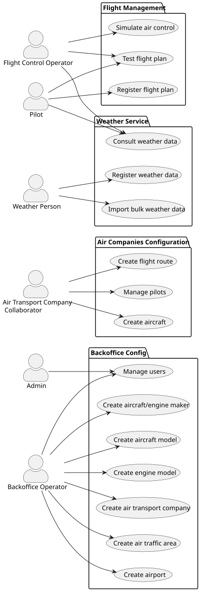

# Use Case Diagram

This document presents the system-wide use case view derived from section 3.1 of the project specification.

## Actors

The AISafe system identifies six primary actors:

| Actor | Role in the system |
|---|---|
| **Admin** | Manages backoffice user accounts (register, disable, enable, list). Is the only actor allowed to grant/revoke roles. |
| **Backoffice Operator** | Seeds and maintains the reference data of the platform: airports, air control areas, aircraft makers, aircraft models, aircraft engine models, air transport companies and their collaborators. |
| **Air Transport Company Collaborator (ATCC)** | Acts on behalf of a registered air transport company. Manages the company's fleet (add, decommission, list with filters), flight routes and pilot roster. |
| **Pilot** | Files and tests flight plans. Pilots are themselves system users and are tied to a single company. |
| **Flight Control Operator (FCO)** | Runs flight simulations over an air control area, tests flight plans, and consumes simulation reports. Managed directly by the Admin under the same rules as regular users. |
| **Weather Person** | Registers, imports (bulk) and consults weather data for a specific air control area. |

## Use Case Diagram

The use cases are grouped in four packages: Flight Management, Weather Service, Air Companies Configuration and Backoffice Config.

> Source: [puml/UCD.puml](puml/UCD.puml)

## Mapping to user stories

| Package | Use case | User stories |
|---|---|---|
| Backoffice Config | Manage users | US031, US032, US033 |
| Backoffice Config | Create airport | US052 |
| Backoffice Config | Create air traffic area | US050 |
| Backoffice Config | Create aircraft model | US055, US057, US058 |
| Backoffice Config | Create aircraft/engine maker | (within model creation) |
| Backoffice Config | Create engine model | US056 |
| Backoffice Config | Create air transport company | US060, US061, US062, US063, US064 |
| Air Companies Configuration | Create aircraft | US070, US071, US072 (+ a/b/c/d) |
| Air Companies Configuration | Create flight route | US073, US074 |
| Air Companies Configuration | Manage pilots | US075, US076, US077 |
| Flight Management | Register flight plan | US080, US081 |
| Flight Management | Test flight plan | US085 |
| Flight Management | Simulate air control | US100, US101, US102, US103 |
| Weather Service | Register weather data | US041 |
| Weather Service | Import bulk weather data | US042 |
| Weather Service | Consult weather data | US043 |

## Cross-cutting concerns

Authentication and authorization (US030) apply to every use case: only authenticated users may interact with the system and each use case is gated by one or more roles. Remote access for the Weather Person (US44), ATCC (US78) and Pilot (US86) is enforced over TCP-only client applications — direct database access is explicitly disallowed.
