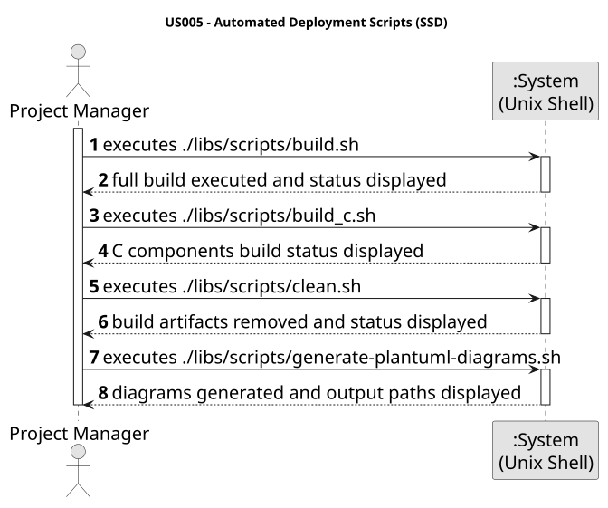

# US005 - Automated Deployment Scripts

## 1. Context
This task was assigned in Sprint 1 to establish the initial Unix-compatible automation baseline for the project. Since there is no functional application runtime or database in this sprint, the focus is on essential infrastructure scripts for build, cleanup, and documentation generation. Application run scripts (`run-*.sh`, `start-h2.sh`) were added to `aisafe.base/` in later sprints.

## 2. Requirements
**US005:** As Project Manager, I want the team to add to the project the necessary scripts, so that build/executions/deployments can be executed effortlessly in a Unix compatible machine. Include scripts for all the major tasks and execution of applications.

For Sprint 1, the scripts in scope are:
- `build.sh`
- `build_c.sh`
- `clean.sh`
- `generate-plantuml-diagrams.sh`

Acceptance criteria considered for this sprint:
- Scripts are Bash-compatible and executable in Unix-compatible environments.
- Scripts use relative paths so they can run from different working directories.
- Scope is limited to Sprint 1 infrastructure tasks; concrete runtime and database scripts are intentionally out of scope.

System Sequence Diagram (SSD):

## 3. Analysis
The user story asks for effortless build/execution/deployment activities, but Sprint 1 only has project setup work. Therefore, the analysis constrains implementation to the smallest useful script set that supports recurring team workflows now, while leaving application-specific execution scripts for later sprints.

Key constraints:
1. Scripts must run with `bash` in Unix-compatible systems.
2. Script logic must be based on relative paths.
3. `generate-plantuml-diagrams.sh` requires Java 11+ for PlantUML `1.2026.2`.

## 4. Design
The script design follows a single-responsibility approach so each script can evolve independently in later sprints:
- `build.sh` orchestrates the full build workflow.
- `build_c.sh` isolates C-specific build actions.
- `clean.sh` removes generated artifacts.
- `generate-plantuml-diagrams.sh` converts `.puml` artifacts into SVG diagrams.

All scripts are located in `aisafe.base/libs/scripts` and are designed to be invoked from any directory.

## 5. Implementation
Implemented Sprint 1 scripts:
- `aisafe.base/libs/scripts/build.sh`
- `aisafe.base/libs/scripts/build_c.sh`
- `aisafe.base/libs/scripts/clean.sh`
- `aisafe.base/libs/scripts/generate-plantuml-diagrams.sh`

Validation performed at documentation level:
- Script scope matches Sprint 1 constraints.
- Responsibilities are clearly separated.
- Runtime/database scripts are deferred until relevant features exist.

