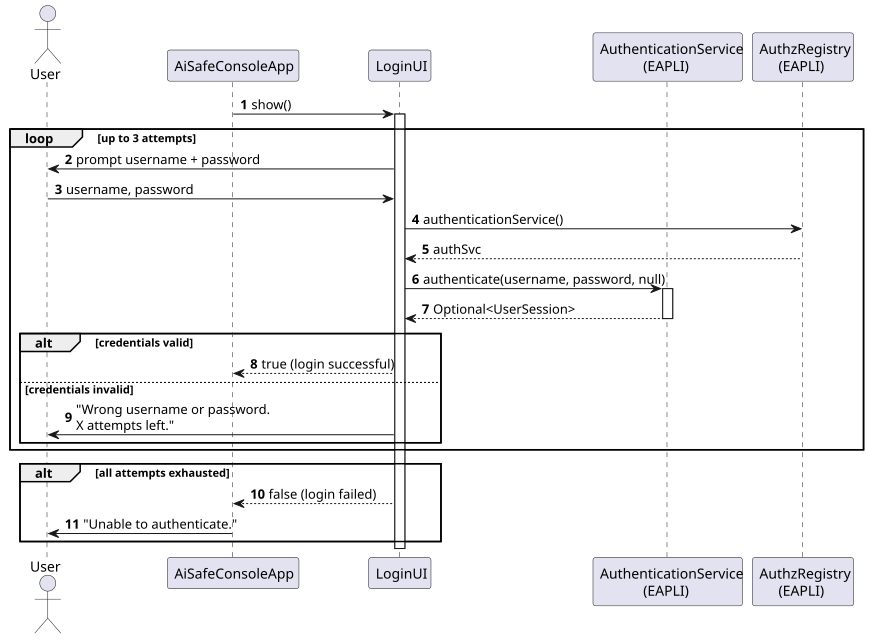
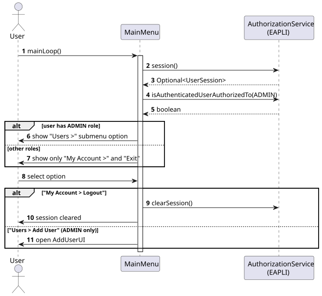
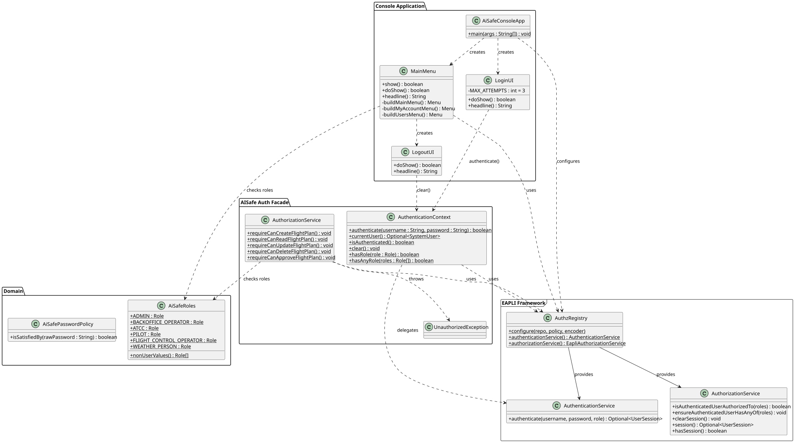

# US030 — Authentication and Authorization

## 1. Context

This US was implemented in Sprint 2 and establishes the authentication and authorization infrastructure for the AISafe system. It is a prerequisite for all other US that require user identity or role-based access control (US031, US032, US033, and all operational US).

The implementation leverages the EAPLI Framework's `AuthzRegistry`, which provides authentication and authorization services, and integrates with a console application that enforces role-based access at the menu level.

---

## 2. Requirements

**US030** As a User, I want to authenticate in the system so that I can access only the features that correspond to my role.

**Acceptance Criteria:**

- **AC030.1** The system must require the user to authenticate with a username and password before accessing any feature.
- **AC030.2** Authentication must fail after 3 consecutive invalid attempts, and access must be denied.
- **AC030.3** The system must define roles that control what each authenticated user can do: ADMIN, BACKOFFICE_OPERATOR, ATCC, PILOT, FLIGHT_CONTROL_OPERATOR, WEATHER_PERSON.
- **AC030.4** Menu options must be shown or hidden based on the authenticated user's role.
- **AC030.5** The user must be able to logout, clearing the active session.
- **AC030.6** Attempting to invoke a protected operation without the required role must result in an error.

**Dependencies/References:**

- None. This US is the foundation for all others.

---

## 3. Analysis

The system defines **6 roles**, each with a different permission scope:

| Role | Description |
|------|-------------|
| `ADMIN` | Full access — manages users and all system operations |
| `BACKOFFICE_OPERATOR` | Manages meteorological data, air control areas, airports, aircraft |
| `ATCC` | Air Traffic Control Centre — approves flight plans |
| `PILOT` | Submits and views flight plans |
| `FLIGHT_CONTROL_OPERATOR` | Monitors and approves simulations |
| `WEATHER_PERSON` | Submits weather data remotely |

**Permission matrix for flight plan operations** (implemented in `aisafe.auth.AuthorizationService`):

| Role | Create | Read | Update | Delete | Approve |
|------|--------|------|--------|--------|---------|
| ADMIN | ✓ | ✓ | ✓ | ✓ | ✓ |
| BACKOFFICE_OPERATOR | ✓ | ✓ | ✓ | — | — |
| ATCC | — | ✓ | — | — | ✓ |
| PILOT | — | ✓ | — | — | — |
| FLIGHT_CONTROL_OPERATOR | — | ✓ | — | — | ✓ |
| WEATHER_PERSON | — | ✓ | — | — | — |

Authentication is handled by the EAPLI Framework (`AuthzRegistry`), which manages the active session throughout the application lifecycle. Password validation is delegated to `AiSafePasswordPolicy`.

---

## 4. Design

### 4.1. Realization

The console application entry point (`AiSafeConsoleApp`) configures the EAPLI `AuthzRegistry` with the system's user repository, password policy, and password encoder. It then shows `LoginUI`, which prompts for credentials and delegates to EAPLI's `AuthenticationService`. On success, the session is set automatically by the framework, and the `MainMenu` is entered.

`MainMenu` queries `AuthorizationService` at render time to determine which options to display. The "Users >" submenu is only added when the authenticated user has the ADMIN role.

The following diagrams illustrate the login flow and the role-based menu flow:

**Login flow:**



**Menu authorization flow:**



**Class diagram:**



### 4.2. Acceptance Tests

Authentication and authorization are infrastructure concerns and are primarily validated by manual integration testing. The `AddUserController` unit-level verification of the authorization check is covered indirectly by the US031 test suite: the controller calls `authz.ensureAuthenticatedUserHasAnyOf(AiSafeRoles.ADMIN)`, which throws `UnauthorizedException` when the session lacks the required role (AC030.6).

**Manual test — AC030.2 (max attempts):**

1. Run `AiSafeConsoleApp`.
2. Enter wrong credentials 3 times.
3. Expected: `Unable to authenticate. Please contact your administrator.` and application exits.

**Manual test — AC030.4 (role-based menu):**

1. Login as `admin` (role: ADMIN).
2. Expected: Main menu shows `1 — My Account >` and `2 — Users >`.
3. Logout, then login as a non-admin user.
4. Expected: Main menu shows only `1 — My Account >`.

**Manual test — AC030.5 (logout):**

1. Login as `admin`.
2. Select `1 — My Account > 1 — Logout`.
3. Expected: Session is cleared and the following menu is shown:
   ```
   1 - Login again
   0 - Exit
   ```
   Choosing `1` restarts the login flow; choosing `0` exits the application.

---

## 5. Implementation

The authentication and authorization implementation spans two areas:

**Console application layer** (`aisafe.app.console`):

| Class | Responsibility |
|-------|---------------|
| `AiSafeConsoleApp` | Entry point — configures `AuthzRegistry`, starts login flow |
| `LoginUI` | Prompts for credentials, max 3 attempts, delegates to EAPLI |
| `MainMenu` | Role-based menu: only shows "Users >" for ADMIN |
| `LogoutUI` | Calls `authz.clearSession()` to terminate the session |

**Flight plan authorization layer** (`aisafe.auth`):

| Class | Responsibility |
|-------|---------------|
| `AiSafeRoles` | Canonical definition of the 6 system roles |
| `AuthenticationContext` | Thread-local storage for the authenticated `SystemUser` (used by flight plan services) |
| `AuthorizationService` | Permission checks for flight plan operations (create, read, update, delete, approve) |
| `UnauthorizedException` | Thrown when the current user lacks the required role |

At startup, `AuthzRegistry.configure()` is called with:
- `PersistenceContext.repositories().systemUsers()` — the user store
- `new AiSafePasswordPolicy()` — minimum 6 chars, ≥ 1 digit, ≥ 1 uppercase
- `new PlainTextEncoder()` — password encoding strategy

The bootstrap creates a default admin user (`admin` / `Password1`) via `InMemoryRepositoryFactory`.

---

## 6. Integration/Demonstration

**Prerequisites:** Java 21, Maven 3.9+, run from `aisafe.base/`.

```bash
# Compile the project
mvn clean compile

# Run the console application
mvn exec:java -Dexec.mainClass="aisafe.app.console.AiSafeConsoleApp"
```

**Bootstrap credentials:**

| Field | Value |
|-------|-------|
| Username | `admin` |
| Password | `Password1` |
| Role | `ADMIN` |

**Expected session flow:**

```
=====================================
      AISafe Backoffice Console      
=====================================

== Login ==
Username: admin
Password: Password1

== AISafe [ @admin ] ==
1 - My Account >
--------------
2 - Users >
--------------
0 - Exit
```

Selecting `1 — My Account > 1 — Logout` clears the session and presents two options: `1 - Login again` (restarts the login flow) or `0 - Exit` (terminates the application).

---

## 7. Observations

- The `AuthzRegistry` is a singleton provided by the EAPLI Framework; it must be configured exactly once at application startup before any authentication or authorization call is made.
- `AiSafeRoles` is the canonical class for role constants. The `aisafe.auth.FlightPlanRoles` class re-exports the same constants and is kept only for backward compatibility with existing flight plan code; `AiSafeRoles` should be used for all new code.
- The `aisafe.auth.AuthenticationContext` (thread-local) is a separate mechanism used by the flight plan authorization service. It is not populated by the console login flow (which uses EAPLI's session). Integration between the two will be addressed when US080 (flight plan submission) is implemented.
- The password encoder uses `PlainTextEncoder` for development. In a production deployment this must be replaced with a hashing encoder (e.g. BCrypt).
