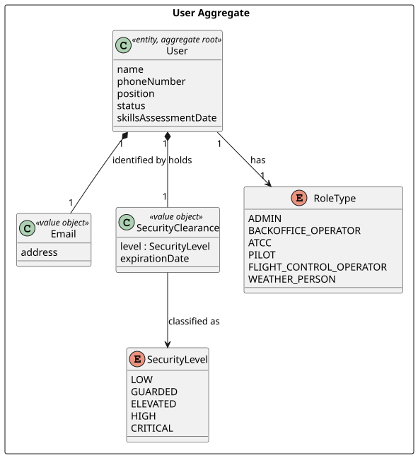
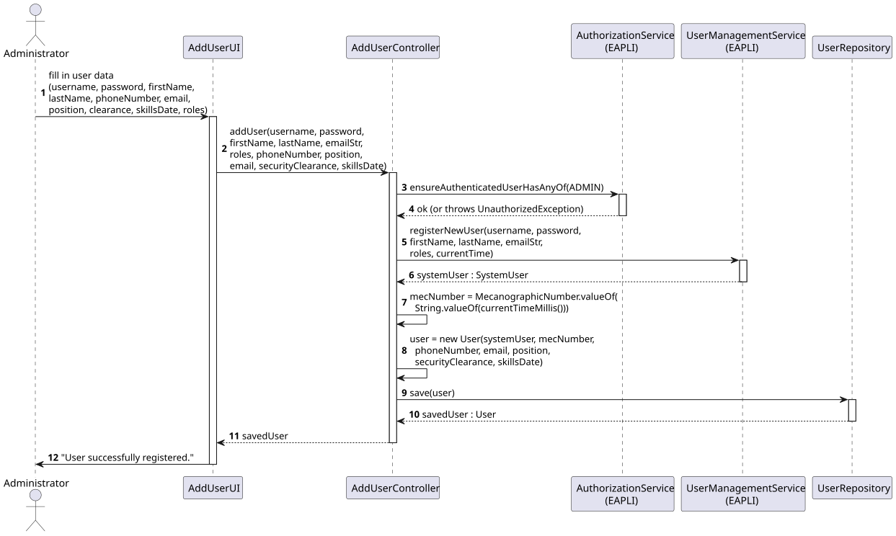
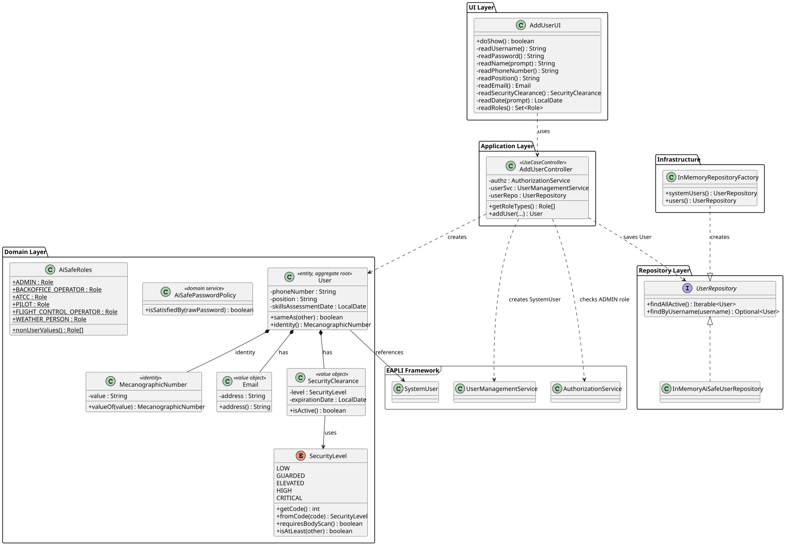

# US031 — Register Backoffice User

## 1. Context

This US was implemented in Sprint 2 and allows the Administrator to register new backoffice users in the AISafe system. It depends on US030 (Authentication and Authorization), which must be in place so that only an authenticated Admin can invoke this feature.

The implementation follows a DDD layered architecture: a UI layer collects input, an application controller orchestrates the use case, the domain enforces invariants, and the repository persists the aggregate.

---

## 2. Requirements

**US031** As Administrator, I want to be able to register users of the backoffice.

**Acceptance Criteria:**

- **AC031.1** The system must allow the Administrator to register a new backoffice user with username, password, first name, last name, phone number, email, position, security clearance and skills assessment date.
- **AC031.2** The email must be valid (correct format).
- **AC031.3** The password must have at least 6 characters, one digit and one capital letter.
- **AC031.4** The user must have one role assigned.
- **AC031.5** The username must be unique in the system.
- **AC031.6** This must also be achievable by a bootstrap process.

**Dependencies/References:**

- US030 — Authentication and Authorization must be implemented first.

---

## 3. Analysis

Registering a backoffice user is an administrative operation that creates two coordinated artifacts: an EAPLI `SystemUser` (responsible for authentication, password policy, and role assignment) and an AISafe `User` aggregate (responsible for the domain-specific attributes that the backoffice cares about — mecanographic number, contact info, security clearance, and skills assessment).

The role separation keeps the framework concerns (authentication, password hashing, role registry) isolated in EAPLI while the AISafe domain owns the data that is meaningful only to this application. Both artifacts are persisted in the same transaction so a partially registered user is never observable.

The classes involved in this US are:

| Class | Type | Responsibility |
|-------|------|----------------|
| `User` | Entity / Aggregate Root | Holds AISafe-specific user data (phone, email, position, clearance, skills date) |
| `MecanographicNumber` | Identity (Value Object) | Unique identifier of a `User`, distinct from the `SystemUser` username |
| `Email` | Value Object | Validates the address and stores it in lowercase |
| `SecurityClearance` | Value Object | Combines a `SecurityLevel` with an expiration date that must be today or in the future |
| `SecurityLevel` | Enumeration | Five clearance levels: LOW, GUARDED, ELEVATED, HIGH, CRITICAL |
| `AiSafeRoles` | Utility | Defines the assignable system roles (ADMIN, BACKOFFICE_OPERATOR, ATCC, PILOT, FCO, WEATHER_PERSON) |
| `AiSafePasswordPolicy` | Domain Service | Enforces password rules required by AC031.3 |

The following diagram shows the domain model excerpt for this US:



---

## 4. Design

### 4.1. Realization

The use case follows the standard layered flow: the UI (`AddUserUI`) collects all input fields with inline validation, then delegates to `AddUserController`. The controller first verifies that the authenticated user has the ADMIN role, then creates the `SystemUser` via EAPLI's `UserManagementService`, constructs the AISafe `User` aggregate, and persists it via `UserRepository`.

The following sequence diagram illustrates this flow:



The following class diagram shows the classes involved:



### 4.2. Acceptance Tests

All tests are automated with JUnit 5 and located in `src/test/java/aisafe/usermanagement/domain/`.

---

**AC031.2 — Email validation**

**Test:** `ensureEmailRejectsInvalidFormat` — verifies that an email without `@` is rejected.

```java
@Test
void ensureEmailRejectsInvalidFormat() {
    assertThrows(IllegalArgumentException.class, () -> new Email("not-an-email"));
}
```

**Test:** `ensureEmailRejectsMissingDomain` — verifies that `user@` (no domain) is rejected.

```java
@Test
void ensureEmailRejectsMissingDomain() {
    assertThrows(IllegalArgumentException.class, () -> new Email("user@"));
}
```

**Test:** `ensureEmailIsNormalisedToLowerCase` — verifies that the address is normalised to lowercase.

```java
@Test
void ensureEmailIsNormalisedToLowerCase() {
    final Email email = new Email("User@AiSafe.COM");
    assertEquals("user@aisafe.com", email.address());
}
```

---

**AC031.3 — Password policy**

**Test:** `ensurePasswordWithoutDigitIsRejected`

```java
@Test
void ensurePasswordWithoutDigitIsRejected() {
    assertFalse(policy.isSatisfiedBy("Password"));
}
```

**Test:** `ensurePasswordWithoutCapitalLetterIsRejected`

```java
@Test
void ensurePasswordWithoutCapitalLetterIsRejected() {
    assertFalse(policy.isSatisfiedBy("password1"));
}
```

**Test:** `ensurePasswordShorterThanSixCharsIsRejected`

```java
@Test
void ensurePasswordShorterThanSixCharsIsRejected() {
    assertFalse(policy.isSatisfiedBy("Pa1"));
}
```

**Test:** `ensureValidPasswordIsAccepted`

```java
@Test
void ensureValidPasswordIsAccepted() {
    assertTrue(policy.isSatisfiedBy("Password1"));
}
```

---

**User aggregate identity (AC031.5 support)**

**Test:** `ensureUsersWithSameMecanographicNumberAreEqual`

```java
@Test
void ensureUsersWithSameMecanographicNumberAreEqual() {
    final User a = baseBuilder().withMecanographicNumber("DUMMY")
            .withSystemUser(dummySystemUser("user1", AiSafeRoles.ADMIN)).build();
    final User b = baseBuilder().withMecanographicNumber("DUMMY")
            .withSystemUser(dummySystemUser("user2", AiSafeRoles.ADMIN)).build();
    assertEquals(a, b);
}
```

**Test:** `ensureUserConstructorRejectsNullSystemUser` — guards against incomplete construction.

```java
@Test
void ensureUserConstructorRejectsNullSystemUser() {
    assertThrows(IllegalArgumentException.class, () ->
            new User(null, MecanographicNumber.valueOf("123"),
                    "910000000", new Email("a@b.com"), "Pilot",
                    DUMMY_CLEARANCE, LocalDate.now()));
}
```

---

**SecurityClearance and SecurityLevel**

**Test:** `ensureSecurityClearanceIsActiveOnExpirationDay` — today is accepted (clearance is active on the expiration day itself).

```java
@Test
void ensureSecurityClearanceIsActiveOnExpirationDay() {
    final SecurityClearance clearance =
            new SecurityClearance(SecurityLevel.LOW, LocalDate.now());
    assertTrue(clearance.isActive());
}
```

**Test:** `ensureElevatedAndAboveRequireBodyScan` — verifies business rule encoded in `SecurityLevel`.

```java
@Test
void ensureElevatedAndAboveRequireBodyScan() {
    assertTrue(SecurityLevel.ELEVATED.requiresBodyScan());
    assertTrue(SecurityLevel.HIGH.requiresBodyScan());
    assertTrue(SecurityLevel.CRITICAL.requiresBodyScan());
}
```

**Test:** `ensureIsAtLeastRespectsOrder` — verifies the level ordering used for access-control decisions.

```java
@Test
void ensureIsAtLeastRespectsOrder() {
    assertTrue(SecurityLevel.HIGH.isAtLeast(SecurityLevel.LOW));
    assertTrue(SecurityLevel.HIGH.isAtLeast(SecurityLevel.HIGH));
    assertFalse(SecurityLevel.LOW.isAtLeast(SecurityLevel.HIGH));
}
```

---

## 5. Implementation

The implementation is distributed across the following packages in `aisafe.base`:

| Package | Class | Role |
|---------|-------|------|
| `aisafe.usermanagement.domain` | `User` | Aggregate root, table `T_AISAFE_USER` |
| `aisafe.usermanagement.domain` | `MecanographicNumber` | Aggregate identity |
| `aisafe.usermanagement.domain` | `Email` | Email value object |
| `aisafe.usermanagement.domain` | `SecurityClearance` | Clearance value object (holds `SecurityLevel` + expiration date) |
| `aisafe.usermanagement.domain` | `SecurityLevel` | Enum: LOW, GUARDED, ELEVATED, HIGH, CRITICAL (with ordinal, body-scan rule, ordering) |
| `aisafe.usermanagement.domain` | `AiSafePasswordPolicy` | Password rule enforcement |
| `aisafe.usermanagement.domain` | `AiSafeRoles` | Role constants |
| `aisafe.usermanagement.domain` | `UserBuilder` | Fluent builder (DomainFactory) |
| `aisafe.usermanagement.repositories` | `UserRepository` | Repository interface |
| `aisafe.usermanagement.application` | `AddUserController` | Use case orchestrator |
| `aisafe.infrastructure.persistence.inmemory` | `InMemoryAiSafeUserRepository` | In-memory persistence |
| `aisafe.infrastructure.persistence.inmemory` | `InMemoryRepositoryFactory` | Factory + bootstrap |
| `aisafe.infrastructure.persistence.jpa` | `JpaUserRepository` | JPA repository implementation for `User` aggregate |
| `aisafe.infrastructure.persistence.jpa` | `JpaRepositoryFactory` | JPA factory — creates JPA repositories using H2 database |
| `aisafe.app.console.presentation.authz` | `AddUserUI` | Console UI with per-field validation |

The `AddUserController.addUser()` receives both `emailStr : String` (for the EAPLI `SystemUser`) and `email : Email` (for the AISafe `User`) because the two layers require different types of the same data.

The `MecanographicNumber` is generated using `UUID.randomUUID()` at the controller level, which guarantees uniqueness across concurrent registrations without relying on a database sequence.

The test suite comprises **38 unit tests** (30 in `UserTest`, 8 in `AiSafePasswordPolicyTest`), all passing.

---

## 6. Integration/Demonstration

**Prerequisites:** Run from the `aisafe.base` directory with Maven 3.9+ and Java 21.

```bash
# Compile and run all tests
mvn clean test


# Run with In-Memory persistence (data is lost when the application exits)
./run-inmemory.sh

# Run with JPA persistence (requires H2 server running in a separate terminal)
./start-h2.sh  # Terminal 1 — keep running
./run-jpa.sh   # Terminal 2
```

**Persistence modes:**

| Mode | Script | Data |
|------|--------|------|
| In-Memory | `./run-inmemory.sh` | Lost on exit |
| JPA (H2) | `./run-jpa.sh` | Persists between sessions |

**Bootstrap credentials (created automatically on startup):**

| Field | Value |
|-------|-------|
| Username | `admin` |
| Password | `Password1` |
| Role | `ADMIN` |

**To register a new user:**

1. Login with the admin credentials.
2. Select **2 — Users >** from the main menu.
3. Select **1 — Add User**.
4. Fill in all fields as prompted.
5. Select a role from the numbered list (one role per user).
6. The system confirms: `User successfully registered.`

---

## 7. Observations

- The `User` table is named `T_AISAFE_USER` to avoid conflict with the reserved SQL keyword `USER`.
- The `Email` value object stores the address normalised to lowercase and validates format via regex `^[\w.-]+@[\w.-]+\.[a-zA-Z]{2,}$`.
- The `SecurityClearance` expiration date must be today or in the future (today is accepted — the clearance is active on its expiration day).
- The password policy is implemented in `AiSafePasswordPolicy` (min 6 chars, ≥ 1 digit, ≥ 1 uppercase letter) and registered with EAPLI's `AuthzRegistry` at application startup.
- Username uniqueness (AC031.5) is enforced by EAPLI's `UserManagementService`, which throws `IntegrityViolationException` on duplicate usernames. This is caught in `AddUserUI` and shown to the user as a friendly message.
