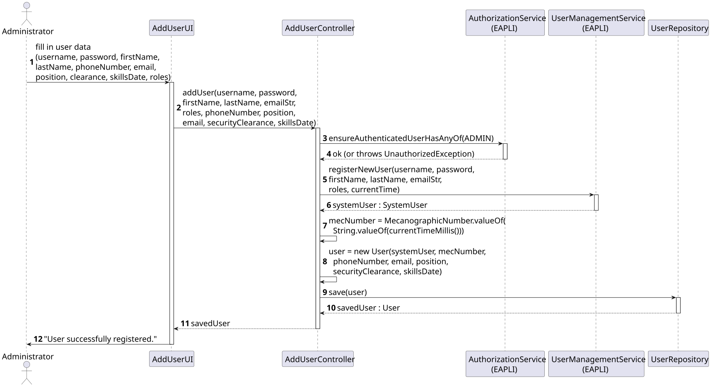

# US 31

## 1. Context

*This US allows the Administrator to register new backoffice users in the AISafe system.*

### 1.1 List of issues

Analysis: Define the domain model for User aggregate.

Design: Design the sequence diagram and class diagram.

Implement:

Test: Unit tests for User, Email and SecurityClearance.


## 2. Requirements

**US031** As Administrator, I want to be able to register users of the backoffice.

**Acceptance Criteria:**

- US031.1 The system must allow the Administrator to register a new backoffice user with username, password, first name, last name, phone number, email, position, security clearance and skills assessment date.
- US031.2 The email must be valid (correct format).
- US031.3 The password must have at least 6 characters, one digit and one capital letter.
- US031.4 The user must have at least one role assigned.
- US031.5 The username must be unique in the system.
- US031.6 This must also be achievable by a bootstrap process.

**Dependencies/References:**

- US030 - Authentication and Authorization must be implemented first.

## 3. Analysis

The User aggregate was designed following DDD principles. The main entities and value objects identified are:

- `User` — aggregate root
- `Email` — value object with format validation
- `SecurityClearance` — value object with level and expiration date
- `RoleType` — enum with the available roles in the system

The `User` references a `SystemUser` from the EAPLI framework, which handles authentication. The AISafe-specific data (phone number, position, security clearance, skills assessment date) is stored in the `User` aggregate.

The following diagram shows the relevant excerpt of the domain model:


## 4. Design

### 4.1. Realization

The following sequence diagram shows the flow of the Register User use case:




The following class diagram shows the classes involved:


### 4.2. Acceptance Tests

Include here the main tests used to validate the functionality. Focus on how they relate to the acceptance criteria. May be automated or manual tests.

**Test 1:** *Verifies that it is not possible to ...*

**Refers to Acceptance Criteria:** US666.1


```
@Test(expected = IllegalArgumentException.class)
public void ensureXxxxYyyy() {
	...
}
````

## 5. Implementation

*In this section the team should present, if necessary, some evidencies that the implementation is according to the design. It should also describe and explain other important artifacts necessary to fully understand the implementation like, for instance, configuration files.*

*It is also a best practice to include a listing (with a brief summary) of the major commits regarding this requirement.*

## 6. Integration/Demonstration

To run the application:

```bash
# Run bootstrap first (creates tables and admin user)
./run-bootstrap.sh

# Run backoffice
./run-backoffice.sh

# Login with:
# Username: admin
# Password: Password1
```

Then navigate to **Users > Add User** to register a new user.

## 7. Observations
* The `User` table is named `T_USER` to avoid conflict with the reserved SQL keyword `USER`.
* The `Email` value object validates format using a regex pattern.
* The `SecurityClearance` expiration date must be in the future.
* The password policy requires at least 6 characters, one digit and one capital letter (enforced by `ExemploPasswordPolicy`).
  