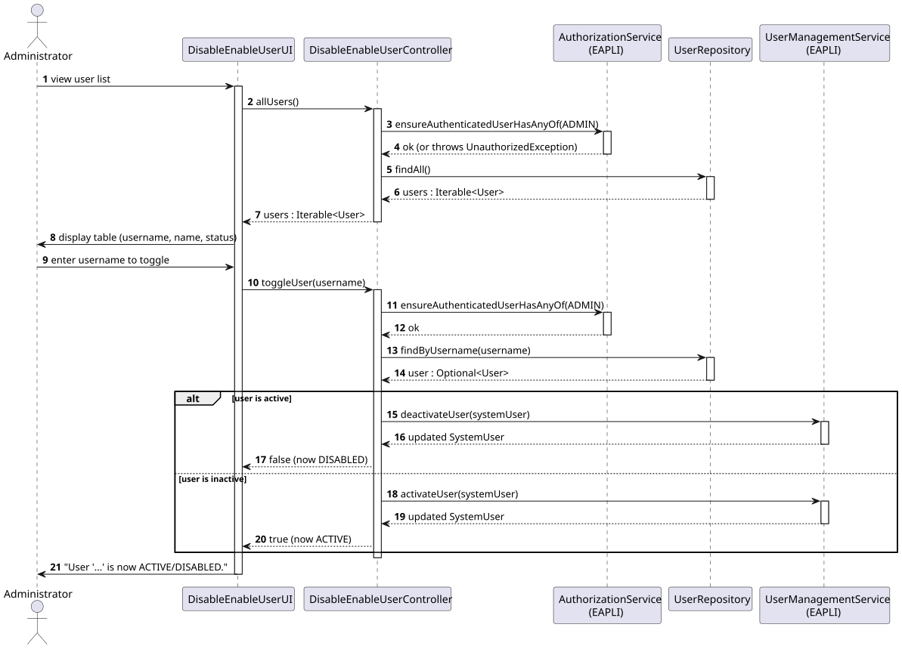
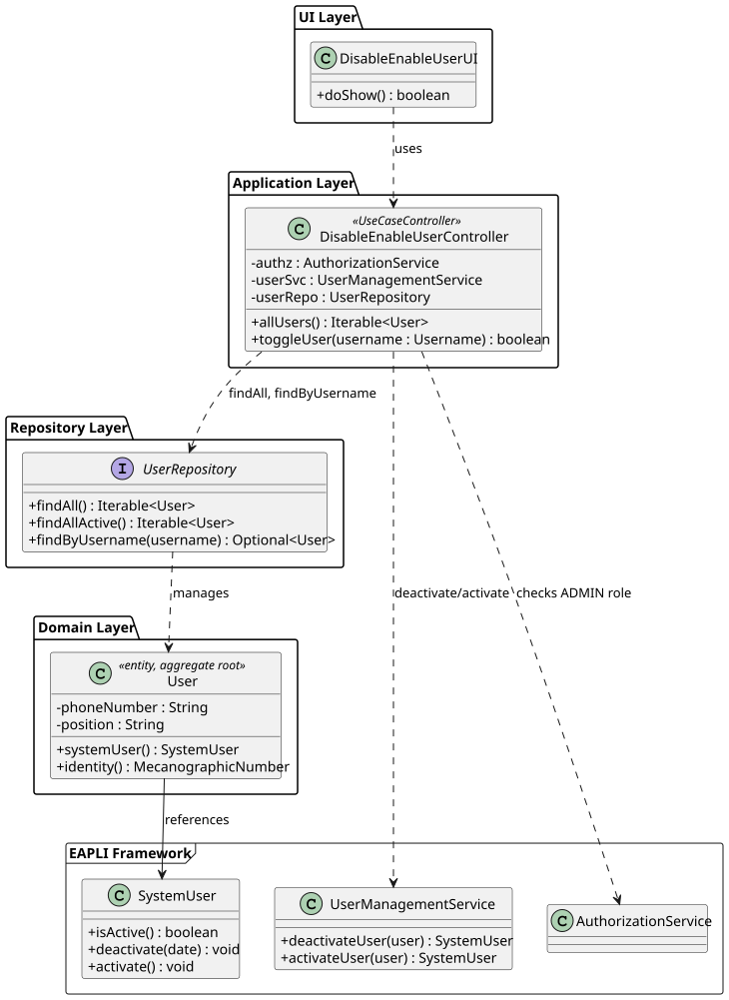

# US032 — Disable/Enable Backoffice User

## 1. Context

This US was implemented in Sprint 2 and allows the Administrator to disable or enable backoffice users in the AISafe system. It depends on US030 (Authentication and Authorization) and US031 (Register Users), which must be in place so that there are users to manage and only an authenticated Admin can invoke this feature.

No new domain entities were introduced. The active/inactive state is managed by EAPLI's `SystemUser`, and the `UserManagementService` provides `deactivateUser()` and `activateUser()` methods that persist the change.

---

## 2. Requirements

**US032** As Administrator, I want to be able to disable/enable users of the backoffice.

**Acceptance Criteria:**

- **AC032.1** The Administrator must be able to disable an active backoffice user.
- **AC032.2** The Administrator must be able to re-enable a disabled backoffice user.
- **AC032.3** The system must display the current status (ACTIVE / DISABLED) of each user before the action.
- **AC032.4** Only an authenticated Administrator may perform this action.
- **AC032.5** Attempting to disable an already-disabled user (or enable an already-active user) must be handled gracefully.

**Dependencies/References:**

- US030 — Authentication and Authorization must be implemented first.
- US031 — Register Users must be implemented first (users must exist to be managed).

---

## 3. Analysis

No new aggregates were created. The `User` aggregate already references a `SystemUser` (EAPLI framework) via a `@OneToOne` association. The active/inactive state is owned by `SystemUser` and managed through EAPLI's `UserManagementService`.

The main classes involved are:

| Class | Type | Responsibility |
|-------|------|----------------|
| `User` | Entity / Aggregate Root | AISafe-specific user data; references `SystemUser` |
| `SystemUser` | EAPLI entity | Owns the `active` flag; exposes `deactivate()` and `activate()` |
| `UserManagementService` | EAPLI service | Persists deactivation/activation via `userRepository.save()` |
| `DisableEnableUserController` | Application controller | Orchestrates the use case; enforces ADMIN role |
| `DisableEnableUserUI` | UI | Lists all users with status; collects username input |

The following sequence diagram illustrates the flow:



The following class diagram shows the classes involved:



---

## 4. Design

### 4.1. Realization

1. The UI lists all users (active and disabled) by calling `controller.allUsers()`, which calls `userRepo.findAll()`.
2. The administrator enters the username of the user to toggle.
3. The controller calls `userRepo.findByUsername(username)` to retrieve the `User`.
4. If the `SystemUser` is active, `userSvc.deactivateUser(systemUser)` is called; otherwise `userSvc.activateUser(systemUser)`.
5. The UI displays the new status.

The toggle approach avoids separate "disable" and "enable" menu entries, keeping the interface simple.

### 4.2. Acceptance Tests

All tests are automated with JUnit 5 and located in `src/test/java/aisafe/usermanagement/domain/DisableEnableUserTest.java`. The test suite runs **8 tests**, all passing.

Detailed coverage is summarized in [tests.md](tests.md).

**Manual test — AC032.1 (disable active user):**

1. Run `AiSafeConsoleApp` and login as `admin` (role: ADMIN).
2. Navigate to `Users > 1 — Manage Users > 1 — Disable/Enable User`.
3. View the list of all users showing their current status (ACTIVE or DISABLED).
4. Enter the username of an ACTIVE user (e.g., `operator`).
5. Confirm the action.
6. Expected: The user status changes to DISABLED and a success message is displayed.

**Manual test — AC032.2 (re-enable disabled user):**

1. Login as `admin`.
2. Navigate to `Users > 1 — Manage Users > 1 — Disable/Enable User`.
3. Select a DISABLED user.
4. Confirm the action.
5. Expected: The user status changes back to ACTIVE.

**Manual test — AC032.3 (display user status):**

1. Navigate to `Disable/Enable User` menu.
2. Expected: All users are listed with their current status label (ACTIVE or DISABLED) clearly visible.

**Manual test — AC032.4 (authorization):**

1. Login as a non-admin user (e.g., `operator` with BACKOFFICE_OPERATOR role).
2. Try to navigate to `Users > Manage Users`.
3. Expected: Access is denied; only ADMIN users can access user management.

**Manual test — AC032.5 (idempotent toggle):**

1. Login as `admin`.
2. Select an ACTIVE user and disable them.
3. Immediately attempt the same action again on the now-DISABLED user.
4. Expected: The system handles the repeated action gracefully and informs the user that the user is already DISABLED.

---

**AC032.1 — Disable an active user**

**Test:** `ensureActiveUserCanBeDeactivated`

```java
@Test
void ensureActiveUserCanBeDeactivated() {
    final SystemUser sys = dummySystemUser("user2");
    sys.deactivate(Calendar.getInstance());
    assertFalse(sys.isActive());
}
```

---

**AC032.2 — Re-enable a disabled user**

**Test:** `ensureInactiveUserCanBeReactivated`

```java
@Test
void ensureInactiveUserCanBeReactivated() {
    final SystemUser sys = dummySystemUser("user3");
    sys.deactivate(Calendar.getInstance());
    sys.activate();
    assertTrue(sys.isActive());
}
```

**Test:** `ensureReactivatedUserIsFullyActive` — verifies the user can be deactivated again after re-activation

```java
@Test
void ensureReactivatedUserIsFullyActive() {
    final SystemUser sys = dummySystemUser("user4");
    sys.deactivate(Calendar.getInstance());
    sys.activate();
    sys.deactivate(Calendar.getInstance());
    assertFalse(sys.isActive());
}
```

---

**AC032.3 — User aggregate reflects SystemUser active state**

**Test:** `ensureUserAggregateReflectsDeactivatedState`

```java
@Test
void ensureUserAggregateReflectsDeactivatedState() {
    final SystemUser sys = dummySystemUser("user7");
    final User user = buildUser(sys, "MECNUM1");
    assertTrue(user.systemUser().isActive());
    sys.deactivate(Calendar.getInstance());
    assertFalse(user.systemUser().isActive());
}
```

---

**AC032.5 — Edge cases handled gracefully**

**Test:** `ensureDeactivatingAlreadyInactiveUserThrows`

```java
@Test
void ensureDeactivatingAlreadyInactiveUserThrows() {
    final SystemUser sys = dummySystemUser("user5");
    sys.deactivate(Calendar.getInstance());
    assertThrows(IllegalStateException.class,
            () -> sys.deactivate(Calendar.getInstance()));
}
```

**Test:** `ensureActivatingAlreadyActiveUserIsIdempotent`

```java
@Test
void ensureActivatingAlreadyActiveUserIsIdempotent() {
    final SystemUser sys = dummySystemUser("user6");
    assertTrue(sys.isActive());
    sys.activate(); // must not throw
    assertTrue(sys.isActive());
}
```

---

## 5. Implementation

The implementation is distributed across the following packages in `aisafe.base`:

| Package | Class | Role |
|---------|-------|------|
| `aisafe.usermanagement.application` | `DisableEnableUserController` | Use case orchestrator |
| `aisafe.app.console.presentation.authz` | `DisableEnableUserUI` | Console UI |
| `aisafe.app.console.presentation` | `MainMenu` | Added option 3 "Disable/Enable User" to Users submenu |

No changes were required to the domain layer or repositories.

---

## 6. Integration/Demonstration

**Prerequisites:** Run from the `aisafe.base` directory with Maven 3.9+ and Java 21.

**To disable/enable a user:**

1. Login with admin credentials (`admin` / `Password1`).
2. Select **2 — Users >** from the main menu.
3. Select **3 — Disable/Enable User**.
4. The system displays all users with their current status (ACTIVE / DISABLED).
5. Enter the username of the user to toggle.
6. The system confirms the new status: `User '...' is now ACTIVE/DISABLED.`

---

## 7. Observations

- The active/inactive state is not stored in the `T_AISAFE_USER` table; it lives in the `SystemUser` managed by the EAPLI framework.
- `userRepo.findAll()` is used (not `findAllActive()`) so that disabled users are also shown and can be re-enabled.
- The `UserManagementService.deactivateUser()` throws `IllegalStateException` if the user is already deactivated. This is caught in the UI and displayed as a friendly error message.
