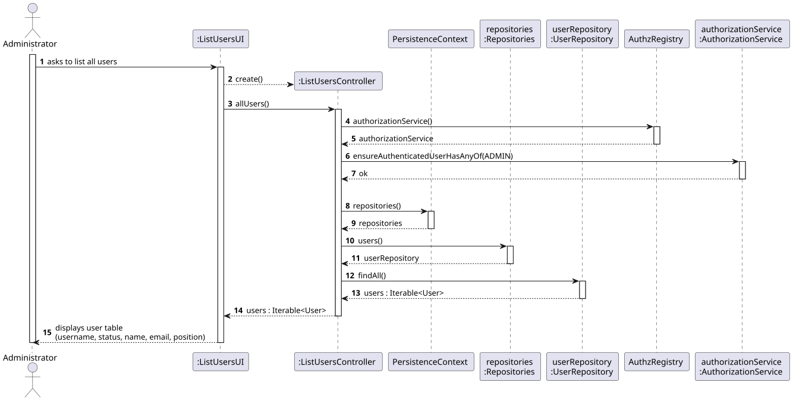
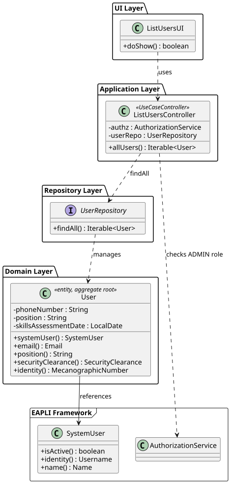

# US033 — List Backoffice Users

## 1. Context

This US was implemented in Sprint 2 and allows the Administrator to list all registered backoffice users in the AISafe system. It depends on US030 (Authentication and Authorization) and US031 (Register Users), which must be in place so that only an authenticated Admin can invoke this feature and users exist to be listed.

No new domain entities were introduced. The listing reuses the existing `User` aggregate and `UserRepository`.

---

## 2. Requirements

**US033** As Administrator, I want to be able to list all users of the backoffice.

**Acceptance Criteria:**

- **AC033.1** The system must display all registered users, including both active and inactive.
- **AC033.2** Each user entry must show: username, status (ACTIVE / INACTIVE), first name, last name, email, and position.
- **AC033.3** Only an authenticated Administrator may access this feature.

**Dependencies/References:**

- US030 — Authentication and Authorization must be implemented first.
- US031 — Register Users must be implemented first (users must exist to be listed).

---

## 3. Analysis

No new aggregates were created. The `User` aggregate already holds all the fields needed for display. The `UserRepository.findAll()` method returns all users regardless of their active/inactive state, satisfying AC033.1.

The main classes involved are:

| Class | Type | Responsibility |
|-------|------|----------------|
| `User` | Entity / Aggregate Root | AISafe-specific user data; references `SystemUser` |
| `SystemUser` | EAPLI entity | Owns the `active` flag; exposes `isActive()` |
| `UserRepository` | Repository interface | Provides `findAll()` |
| `ListUsersController` | Application controller | Orchestrates the use case; enforces ADMIN role |
| `ListUsersUI` | UI | Retrieves and displays the user list in a formatted table |

The following sequence diagram illustrates the flow:



The following class diagram shows the classes involved:



---

## 4. Design

### 4.1. Realization

1. The UI calls `controller.allUsers()`.
2. The controller verifies the authenticated user has the ADMIN role via `authz.ensureAuthenticatedUserHasAnyOf(AiSafeRoles.ADMIN)`.
3. The controller calls `userRepo.findAll()` and returns the result.
4. The UI iterates over the returned users and prints a formatted table showing username, status, first name, last name, email, and position.

`findAll()` is used instead of `findAllActive()` so that disabled users are also shown and can be identified (AC033.1).

### 4.2. Acceptance Tests

No new domain class was introduced. The unit tests are located in `src/test/java/aisafe/usermanagement/domain/UserTest.java` and cover the `User` aggregate and its value objects as exercised by this use case. The test suite relevant to US033 runs **7 tests**, all passing.

---

**AC033.2 — User fields are accessible for display**

**Test:** `ensureUserSkillsAssessmentDateGetterReturnsCorrectValue` — verifies that `skillsAssessmentDate()` returns the value set at construction.

```java
@Test
void ensureUserSkillsAssessmentDateGetterReturnsCorrectValue() {
    final LocalDate assessmentDate = LocalDate.now().plusDays(10);
    final User user = baseBuilder()
            .withMecanographicNumber("SKILLS1")
            .withSystemUser(dummySystemUser("user_skills", AiSafeRoles.PILOT))
            .withSkillsAssessmentDate(assessmentDate)
            .build();
    assertEquals(assessmentDate, user.skillsAssessmentDate());
}
```

**Test:** `ensureSecurityClearanceToStringContainsExpirationDate` — verifies that `toString()` includes the expiration date.

```java
@Test
void ensureSecurityClearanceToStringContainsExpirationDate() {
    final LocalDate date = LocalDate.now().plusYears(1);
    final SecurityClearance clearance = new SecurityClearance(SecurityLevel.LOW, date);
    assertTrue(clearance.toString().contains(date.toString()));
}
```

---

**AC033.2 — SecurityLevel codes are correct**

**Test:** `ensureSecurityLevelGetCodeReturnsCorrectValues` — verifies `getCode()` for all five levels.

```java
@Test
void ensureSecurityLevelGetCodeReturnsCorrectValues() {
    assertEquals(1, SecurityLevel.LOW.getCode());
    assertEquals(2, SecurityLevel.GUARDED.getCode());
    assertEquals(3, SecurityLevel.ELEVATED.getCode());
    assertEquals(4, SecurityLevel.HIGH.getCode());
    assertEquals(5, SecurityLevel.CRITICAL.getCode());
}
```

**Test:** `ensureSecurityLevelFromCodeReturnsCorrectLevel` — verifies `fromCode()` returns the correct constant for each valid code.

```java
@Test
void ensureSecurityLevelFromCodeReturnsCorrectLevel() {
    assertEquals(SecurityLevel.LOW,      SecurityLevel.fromCode(1));
    assertEquals(SecurityLevel.GUARDED,  SecurityLevel.fromCode(2));
    assertEquals(SecurityLevel.ELEVATED, SecurityLevel.fromCode(3));
    assertEquals(SecurityLevel.HIGH,     SecurityLevel.fromCode(4));
    assertEquals(SecurityLevel.CRITICAL, SecurityLevel.fromCode(5));
}
```

---

**AC033.2 — SecurityClearance equality**

**Test:** `ensureSecurityClearanceNotEqualToNull` — verifies `equals(null)` returns `false`.

```java
@Test
void ensureSecurityClearanceNotEqualToNull() {
    final SecurityClearance clearance =
            new SecurityClearance(SecurityLevel.HIGH, LocalDate.now().plusYears(1));
    assertNotEquals(null, clearance);
}
```

**Test:** `ensureSecurityClearanceWithSameLevelButDifferentDateIsNotEqual` — verifies two clearances with the same level but different dates are not equal.

```java
@Test
void ensureSecurityClearanceWithSameLevelButDifferentDateIsNotEqual() {
    final SecurityClearance a = new SecurityClearance(SecurityLevel.HIGH, LocalDate.now().plusYears(1));
    final SecurityClearance b = new SecurityClearance(SecurityLevel.HIGH, LocalDate.now().plusYears(2));
    assertNotEquals(a, b);
}
```

---

**AC033.2 — Email validation**

**Test:** `ensureEmailRejectsNull` — verifies the constructor rejects a `null` address.

```java
@Test
void ensureEmailRejectsNull() {
    assertThrows(IllegalArgumentException.class, () -> new Email(null));
}
```

Acceptance tests are documented in [tests.md](tests.md).

---

## 5. Implementation

The implementation is distributed across the following packages in `aisafe.base`:

| Package | Class | Role |
|---------|-------|------|
| `aisafe.usermanagement.application` | `ListUsersController` | Use case orchestrator; enforces ADMIN role |
| `aisafe.app.console.presentation.authz` | `ListUsersUI` | Console UI; displays the formatted user table |
| `aisafe.app.console.presentation` | `MainMenu` | Option 2 "List Users" under the Users submenu |

No changes were required to the domain layer or repositories.

---

## 6. Integration/Demonstration

**Prerequisites:** Run from the `aisafe.base` directory with Maven 3.9+ and Java 21.

**To list all users:**

1. Login with admin credentials (`admin` / `Password1`).
2. Select **2 — Users >** from the main menu.
3. Select **2 — List Users**.
4. The system displays a table with all registered users and their current status.

Expected output format:

```
Username             Status   First Name      Last Name       Email                          Position
----------------------------------------------------------------------------------------------------
admin                ACTIVE   Admin           User            admin@aisafe.com               Administrator
operator             ACTIVE   Op              User            operator@aisafe.com            Operator
pilot1               DISABLED Pilot           One             pilot1@aisafe.com              Pilot
```

---

## 7. Observations

- `userRepo.findAll()` is used (not `findAllActive()`) so that disabled users are also visible in the list and can be identified for re-enabling via US032.
- The status label is derived at the UI layer from `user.systemUser().isActive()`: `true` → `ACTIVE`, `false` → `INACTIVE`.
- The `Users >` submenu, including this option, is only rendered when the authenticated user has the ADMIN role (enforced in `MainMenu.buildMainMenu()`).
