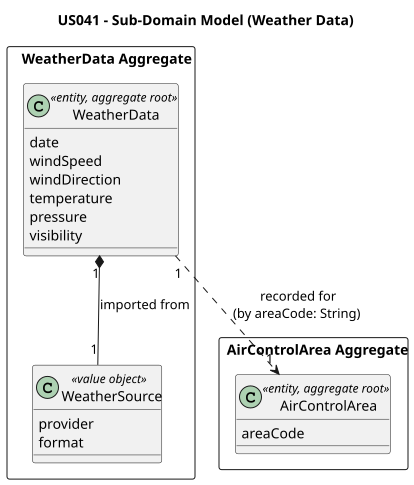
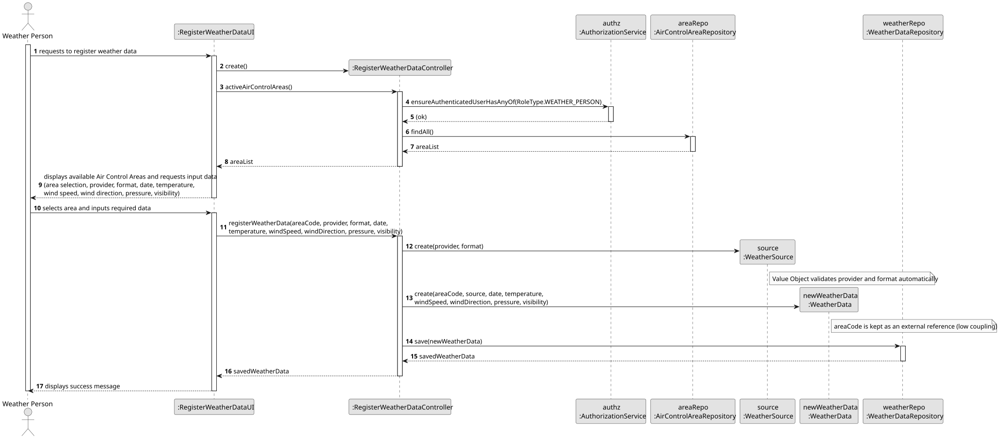
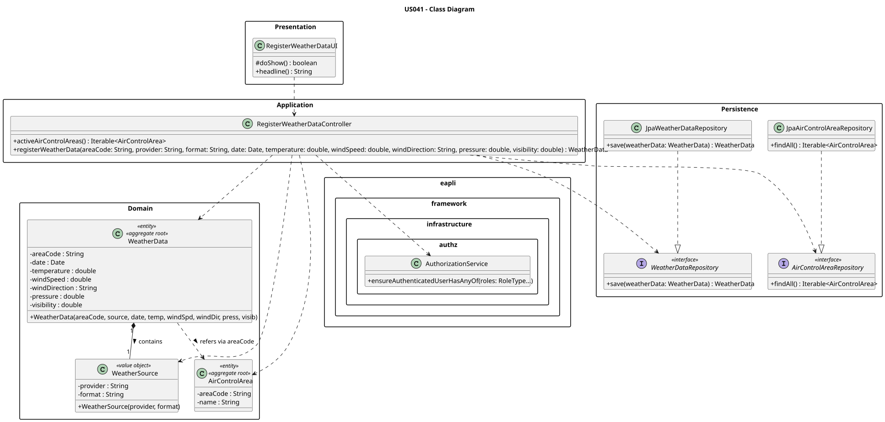

# US041 — Register Weather Data

## 1. Context

This US is implemented in Sprint 2 and allows the Weather Person to register weather data in the AISafe system for a specific air control area. It depends on US030 (Authentication and Authorization), which must be in place so that only an authenticated Weather Person can invoke this feature.

The `WeatherData` is an independent aggregate whose creation is bound to the prior existence of an `AirControlArea` (US050). This use case acts as a foundational dependency for flight safety assessments that require up-to-date meteorological conditions.

---

## 2. Requirements

**US041** As a Weather Person, I want to register weather data in the system for a specific air control area.

**Acceptance Criteria:**

- **AC041.1** The system must allow the Weather Person to register weather information (date, temperature, wind speed, wind direction, pressure, visibility, and source).
- **AC041.2** The weather data must be explicitly linked to a pre-existing Air Control Area in the system.
- **AC041.3** Only an authenticated Weather Person (`WEATHER_PERSON` role) may perform this action.

**Dependencies/References:**

- US030 — Authentication and Authorization must be implemented first.
- US050 — Register an Air Control Area (weather data is geographically bound to an existing area).
- Acts as a prerequisite for:
  - Flight safety assessments that consume meteorological conditions per area.

---

## 3. Analysis

The `WeatherData` aggregate was designed following DDD principles. Its identity is a surrogate `Long` key generated at persistence time. To maintain low coupling and avoid loading heavy spatial data unnecessarily, `WeatherData` does not encapsulate the `AirControlArea` entity — instead it holds an external reference (`areaCode`) as a primitive `String`, normalised to uppercase on construction.

The main classes involved are:

| Class | Type | Responsibility |
|-------|------|----------------|
| `WeatherData` | Entity / Aggregate Root | Holds area code reference, date/time, wind speed, wind direction, pressure, and visibility |
| `WeatherSource` | Value Object | Encapsulates the origin and format of the weather data provider |
| `WeatherDataRepository` | Repository Interface | Persistence contract for the WeatherData aggregate |
| `AirControlAreaRepository` | Repository Interface | Used to list available areas for user selection |
| `RegisterWeatherDataController` | Application Controller | Orchestrates the use case; enforces `WEATHER_PERSON` role |
| `RegisterWeatherDataUI` | UI | Collects weather fields and target area selection from the operator |

The following domain model excerpt shows the aggregate structure:

---

## 4. Design

### 4.1. Realization

1. The UI (`RegisterWeatherDataUI`) lists available Air Control Areas for the operator to select.
2. The controller calls `authz.ensureAuthenticatedUserHasAnyOf(WEATHER_PERSON)`.
3. The controller fetches the list of active Air Control Areas via `AirControlAreaRepository`.
4. The operator selects the target area and provides the weather fields: date, temperature, wind speed, wind direction, pressure, visibility, and source.
5. Input is validated inline before calling the controller (non-null date, non-negative numeric values).
6. The controller instantiates `WeatherData` with the validated data — domain invariants are enforced inside the constructor.
7. The record is persisted via `WeatherDataRepository.save()`.
8. The UI confirms success: `Weather data registered successfully for area '...'.`

The following sequence diagram illustrates the flow:

The following class diagram shows the classes involved:

---

### 4.2. Acceptance Tests

All automated tests and manual acceptance test scripts are documented in [tests.md](tests.md).

---

## 5. Implementation

The implementation is distributed across the following packages in `aisafe.base`:

| Package | Class | Role |
|---------|-------|------|
| `aisafe.weatherdata.domain` | `WeatherData` | Aggregate root, table `T_WEATHER_DATA` |
| `aisafe.weatherdata.domain` | `WeatherSource` | Value object (`@Embeddable`) — weather data provider origin and format |
| `aisafe.weatherdata.repositories` | `WeatherDataRepository` | Repository interface |
| `aisafe.weatherdata.application` | `RegisterWeatherDataController` | Use case orchestrator |
| `aisafe.infrastructure.persistence.inmemory` | `InMemoryWeatherDataRepository` | In-memory persistence |
| `aisafe.infrastructure.persistence.jpa` | `JpaWeatherDataRepository` | JPA persistence |
| `aisafe.app.console.presentation.weatherdata` | `RegisterWeatherDataUI` | Console UI |

`RepositoryFactory` must expose a `weatherData()` method, and both `InMemoryRepositoryFactory` and `JpaRepositoryFactory` must provide implementations.

---

## 6. Integration/Demonstration

**Prerequisites:** Run from the `aisafe.base` directory with Maven 3.9+ and Java 21. The bootstrap must have been executed first so that at least one Air Control Area and the `weather_person` user exist in the database.

**To register weather data:**

1. Login with Weather Person credentials (username: `weather_person`, password: `Password1`).
2. Select **Weather > Register Weather Data** from the main menu.
3. Select an existing Air Control Area from the presented list (e.g., `PT-N`).
4. Enter the data source provider and format (e.g., `IPMA` / `JSON`).
5. Enter the date and time of the observation (e.g., `2025-05-14 10:00`).
6. Enter the weather fields: temperature, wind speed, wind direction, pressure, and visibility.
7. The system confirms: `Weather data successfully registered!`

---

## 7. Observations

- `WeatherData` uses a surrogate `Long` identity (`@GeneratedValue`) because no natural business key uniquely identifies a weather record — the same area can have multiple records at different times.
- `areaCode` is stored as a simple `@Column` string rather than a `@ManyToOne` join, avoiding loading heavy spatial data when working with weather records and preserving Low Coupling between aggregates. **Note:** The domain model V5 shows `WeatherData --> AirControlArea` as a direct conceptual association; the implementation deliberately uses a primitive identifier (Low Coupling pattern) rather than a JPA entity reference.
- `WeatherSource` is mapped with `@Embeddable` / `@Embedded` inside `WeatherData`, keeping the provider metadata co-located without requiring an extra table.
- The controller queries `AirControlAreaRepository` to present a validated list of areas; this prevents the operator from entering a free-text code that does not correspond to any existing area.
