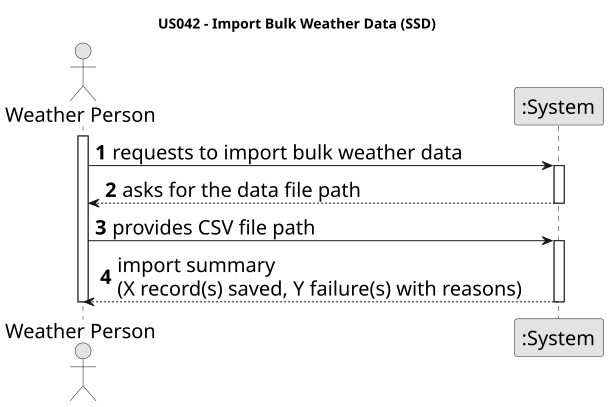
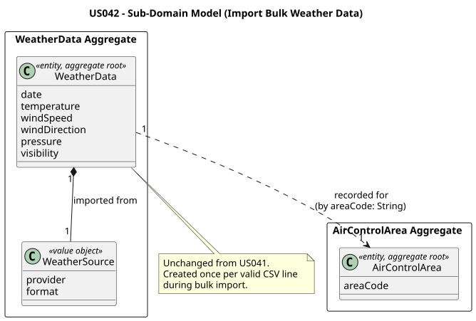
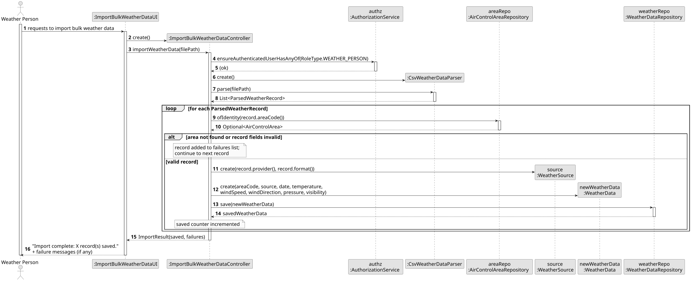
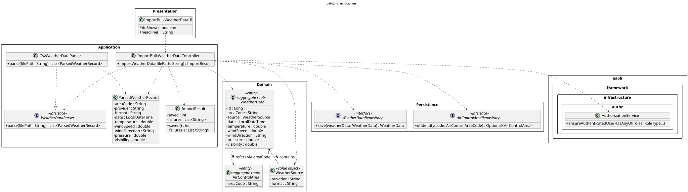

# US042 — Import Bulk Weather Data

## 1. Context

This US is implemented in Sprint 3 and allows the Weather Person to import multiple weather data records at once from a file, rather than entering them one at a time as in US041. It depends on US030 (Authentication and Authorization) so that only an authenticated Weather Person can invoke this feature, and on US041 (Register Weather Data) which established the `WeatherData` aggregate and `WeatherSource` value object that are fully reused here.

A non-functional requirement (Supplementary Specification — Supportability) states that the import system must be designed to support additional data source formats beyond CSV without structural changes to the core domain. This is addressed by introducing a `WeatherDataParser` interface in the application layer, with `CsvWeatherDataParser` as the initial implementation.

---

## 2. Requirements

**US042** As a Weather Person, I want to import bulk weather data into the system from a file.

**Acceptance Criteria:**

- **AC042.1** The system must allow the Weather Person to import all valid records from a CSV file; each valid record is persisted as a `WeatherData` entry.
- **AC042.2** Each imported record must be linked to a valid and existing `AirControlArea` — records referencing an unknown area code are rejected.
- **AC042.3** Only an authenticated Weather Person (`WEATHER_PERSON` role) may perform this action.
- **AC042.4** Records with invalid or malformed data are skipped; the remaining valid records in the same file are still saved (partial import).
- **AC042.5** The system reports the total count of successfully imported records and the count of failures, along with a reason per failure.
- **AC042.6** The import subsystem is structured around a `WeatherDataParser` interface so that new formats (JSON, XML, etc.) can be added without modifying the controller or domain.

**Dependencies/References:**

- US030 — Authentication and Authorization must be implemented first.
- US041 — Register Weather Data (provides the `WeatherData` aggregate and `WeatherSource` value object reused here).
- US050 — Register an Air Control Area (weather data is geographically bound to an existing area).

---

## 3. Analysis

The system-level interaction between the Weather Person and the system:


> Source: [puml/US042-SSD.puml](puml/US042-SSD.puml)

The `WeatherData` aggregate and `WeatherSource` value object from US041 require no changes. The controller resolves the authenticated user's role, delegates file parsing to a `WeatherDataParser` implementation, validates each parsed record against the `AirControlAreaRepository`, and persists valid records via `WeatherDataRepository.save()`. The cross-aggregate reference pattern remains unchanged: `WeatherData` stores only the area code string, not an entity reference.

The extensibility requirement is fulfilled at the application layer: `WeatherDataParser` is an interface; `CsvWeatherDataParser` is the sole implementation for now. Adding a new format requires only a new class implementing that interface — no domain or repository changes.

**CSV record format (one line per record, first line is header):**

```
area_code,provider,format,date,temperature,windSpeed,windDirection,pressure,visibility
PT-N,IPMA,CSV,2025-05-14T10:00:00,20.0,15.0,N,1013.0,10.0
```

The main classes involved are:

| Class | Type | Responsibility |
|-------|------|----------------|
| `WeatherData` | Entity / Aggregate Root | Existing — holds area code reference, date/time, meteorological fields |
| `WeatherSource` | Value Object | Existing — encapsulates provider and format |
| `WeatherDataRepository` | Repository Interface | Existing — `save()` reused per record |
| `AirControlAreaRepository` | Repository Interface | Existing — `ofIdentity()` used to validate each area code |
| `WeatherDataParser` | Application Interface | **New** — strategy contract: `parse(filePath)` → `List<ParsedWeatherRecord>` |
| `ParsedWeatherRecord` | Data Carrier | **New** — plain holder for one parsed line before domain object construction |
| `CsvWeatherDataParser` | Application Service | **New** — implements `WeatherDataParser` for CSV format |
| `ImportResult` | Value Object | **New** — holds saved count and list of failure messages |
| `ImportBulkWeatherDataController` | Application Controller | **New** — enforces `WEATHER_PERSON` role, orchestrates parse → validate → persist loop |
| `ImportBulkWeatherDataUI` | UI | **New** — prompts for file path, displays import summary |

The following domain model excerpt shows the aggregate structure:



---

## 4. Design

### 4.1. Realization

1. The UI (`ImportBulkWeatherDataUI`) prompts the Weather Person for the path to the import file.
2. The controller calls `authz.ensureAuthenticatedUserHasAnyOf(WEATHER_PERSON)`.
3. The controller instantiates a `CsvWeatherDataParser` and calls `parse(filePath)`, obtaining a `List<ParsedWeatherRecord>`.
4. For each `ParsedWeatherRecord` the controller:
   - Calls `AirControlAreaRepository.ofIdentity(areaCode)` — if the area is not found, the record is added to the failure list with a descriptive message and processing continues with the next record.
   - Constructs a `WeatherSource` value object from the record's provider and format fields.
   - Constructs a `WeatherData` aggregate — if the constructor throws `IllegalArgumentException` (invalid field values), the record is added to the failure list.
   - Calls `WeatherDataRepository.save(weatherData)` and increments the saved counter.
5. The controller returns an `ImportResult` containing the saved count and the list of failure messages.
6. The UI displays: `Import complete: X record(s) saved.` followed by any failure messages.

The following sequence diagram illustrates the flow:


> Source: [puml/US042-SD.puml](puml/US042-SD.puml)

The following class diagram shows the classes involved:


> Source: [puml/US042-class-diagram.puml](puml/US042-class-diagram.puml)

---

### 4.2. Acceptance Tests

| Test ID | Description | Expected Result |
|---------|-------------|-----------------|
| AC042.1 | CSV file with 2 valid records | Both persisted; `result.saved() == 2` |
| AC042.2 | CSV file with 1 valid + 1 unknown area code | 1 saved, 1 failure with area code message |
| AC042.3 | Non-WEATHER_PERSON user calls controller | `UnauthorizedException` thrown |
| AC042.4 | CSV file with 1 malformed line + 1 valid | 1 saved, 1 failure with parse error message |
| AC042.5 | Empty CSV file (header only) | `result.saved() == 0`, `result.failures()` is empty |

> These five scenarios map to the core acceptance criteria. `ImportBulkWeatherDataControllerTest`
> contains **9** `@Test` methods in total — the five above plus edge cases (header-only
> file, file-not-found, blank lines, and the `WeatherDataParser` strategy contract).

---
