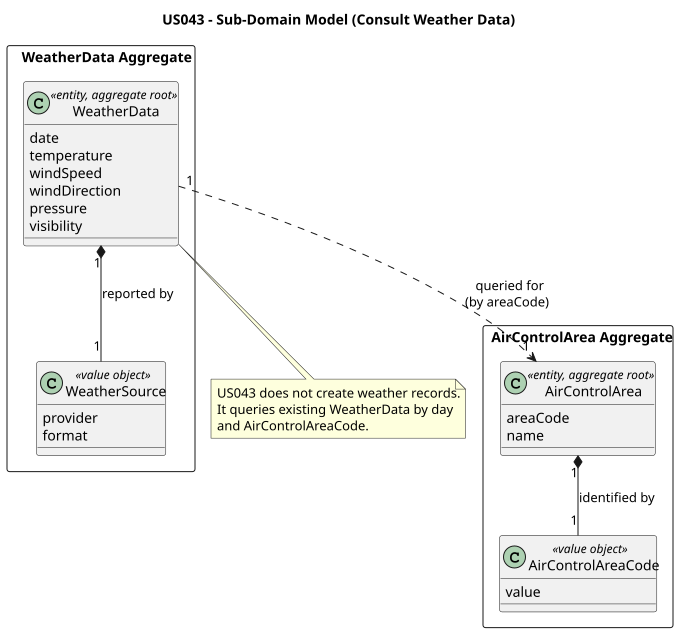
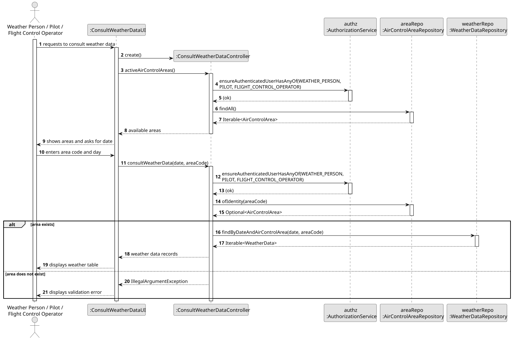
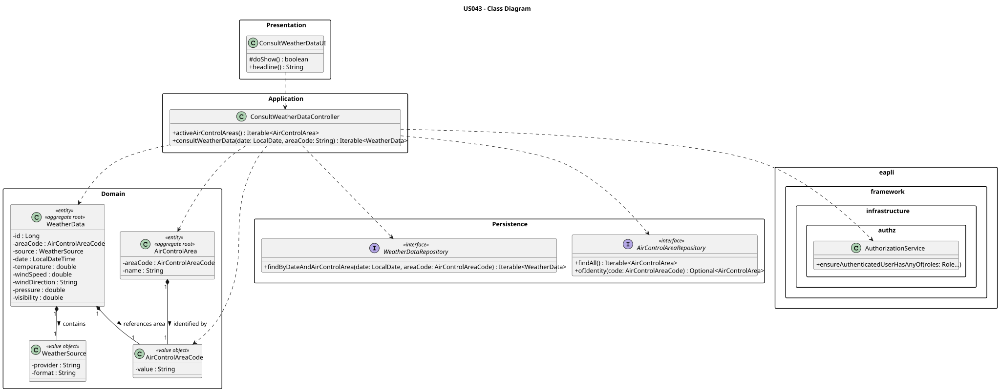

# US043 — Consult Weather Data

## 1. Context

This user story allows authorized users (Weather Person, Pilot, Flight Control Operator) to query and view weather data for a specific date and air control area. Access to accurate meteorological information is critical for making safe and efficient decisions regarding flight planning and operations.

---

## 2. Requirements

**US043** As a Weather Person, a Pilot, or a Flight Control Operator, I want to consult weather data in the system for a given day and a specific air control area so that I can make informed decisions about flight operations.

**Acceptance Criteria:**

- **AC043.1** Weather data can be queried by a specific date and a selected air control area.
- **AC043.2** The query results are displayed clearly and include all relevant meteorological information (e.g., temperature, wind speed, precipitation).
- **AC043.3** Access to this feature is restricted to users with the roles: `WEATHER_PERSON`, `PILOT`, or `FLIGHT_CONTROL_OPERATOR`.

**Dependencies/References:**

- This US depends on **US030** for user authentication and role-based authorization.
- It assumes the existence of `WeatherData` and `AirControlArea` entities in the system.

---
## 3. Analysis

This feature is a query-based capability that allows authorized operational users to retrieve weather records already stored in the system. It reuses the `WeatherData` aggregate created in US041 and the bulk import capability from US042 as upstream data sources. No new domain aggregate is required for US043.

Following the existing DDD model, `WeatherData` remains the aggregate root for meteorological readings and stores an `AirControlAreaCode` as an external reference instead of holding an `AirControlArea` entity. This keeps the weather data aggregate independent from the air control area aggregate while still allowing queries by area code. The application layer is responsible for validating that the requested area exists before executing the query.

The query is day-based, while `WeatherData` stores a `LocalDateTime`. Therefore, the repository contract must retrieve all records whose timestamp falls within the selected day, from `00:00` inclusive to the following day at `00:00` exclusive.

Authorization is handled in the application controller using the existing `AuthorizationService`. Access is granted only to `WEATHER_PERSON`, `PILOT`, and `FLIGHT_CONTROL_OPERATOR`, as required by AC043.3.

The main classes involved are:

| Class | Type | Responsibility |
|-------|------|----------------|
| `WeatherData` | Entity / Aggregate Root | Existing - represents meteorological readings for one air control area at a specific timestamp. |
| `AirControlAreaCode` | Value Object | Existing - identifies the air control area referenced by the weather record. |
| `AirControlArea` | Entity / Aggregate Root | Existing - provides the selectable list of valid air control areas. |
| `AirControlAreaRepository` | Repository Interface | Existing - validates area existence and lists available areas. |
| `WeatherDataRepository` | Repository Interface | Extended with `findByDateAndAirControlArea(date, areaCode)`. |
| `ConsultWeatherDataController` | Application Controller | New - enforces role access, validates area existence, and delegates the weather query. |
| `ConsultWeatherDataUI` | UI | New - prompts for date/area and displays all relevant meteorological information. |

The following domain model excerpt shows the aggregate structure:

> Source: [puml/US043-domain-model.puml](puml/US043-domain-model.puml)

---

## 4. Design

### 4.1. Realization

1. The `ConsultWeatherDataUI` calls `ConsultWeatherDataController.activeAirControlAreas()` so the user can select a valid area.
2. The controller checks that the authenticated user has one of the allowed roles: `WEATHER_PERSON`, `PILOT`, or `FLIGHT_CONTROL_OPERATOR`.
3. The UI displays the available air control areas and prompts for an area code and a day in `yyyy-MM-dd` format.
4. The UI calls `ConsultWeatherDataController.consultWeatherData(date, areaCode)`.
5. The controller repeats the authorization check, converts the area code to `AirControlAreaCode`, and validates area existence through `AirControlAreaRepository`.
6. The controller delegates to `WeatherDataRepository.findByDateAndAirControlArea(date, areaCode)`.
7. The repository implementation returns every `WeatherData` record for that area whose timestamp falls within the selected day.
8. The UI prints a compact table containing date/time, source, temperature, wind speed, wind direction, pressure, and visibility. If there are no records, the UI displays a clear "No weather data found" message.

The following sequence diagram illustrates the flow:

> Source: [puml/US043-SD.puml](puml/US043-SD.puml)

The following class diagram shows the classes involved:

> Source: [puml/US043-class-diagram.puml](puml/US043-class-diagram.puml)

### 4.2. Acceptance Tests

| Test ID | Description | Expected Result |
|---------|-------------|-----------------|
| AC043.1 | Query with a valid date and area with existing data. | Weather data for that day and area is displayed. |
| AC043.1b| Query for a date/area with no data. | "No weather data found" message is shown. |
| AC043.3 | A user without the required role attempts to access. | Access is denied with an authorization error. |

---

## 5. Implementation

*(To be detailed in a future phase)*

---

## 6. Integration/Demonstration

*(To be detailed in a future phase)*

---

## 7. Observations

*(To be detailed in a future phase)*
