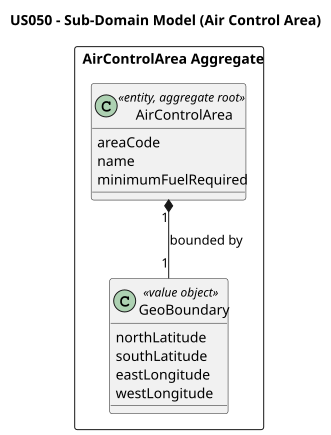
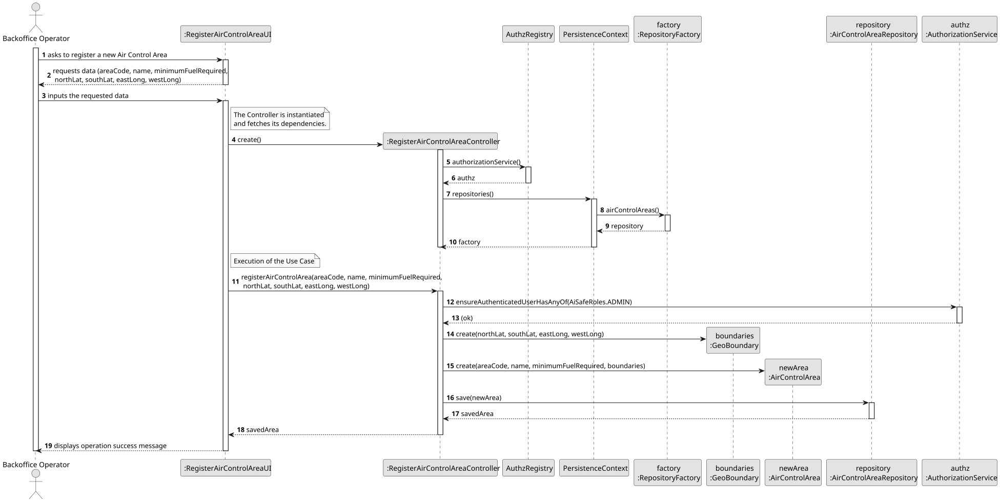
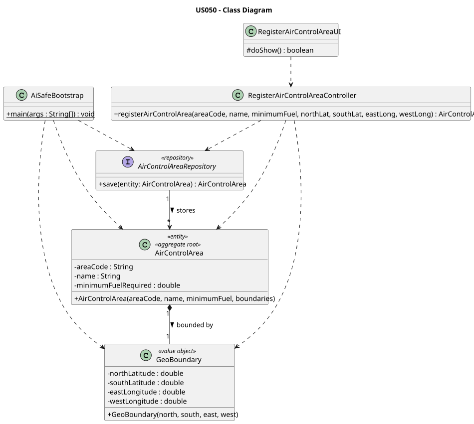

# US050 — Register an Air Control Area

## 1. Context

This US is implemented in Sprint 2 and allows the Backoffice Operator to register a new air control area in the AISafe system. It depends on US030 (Authentication and Authorization), which must be in place so that only an authenticated Backoffice Operator can invoke this feature.

The `AirControlArea` is an independent aggregate with no upstream dependencies and acts as a foundational dependency for US041 (Register Weather Data) and US052 (Create an Airport), both of which require a pre-existing area. Registration must also be achievable via the bootstrap process on system startup.

---

## 2. Requirements

**US050** As a Backoffice Operator, I want to register an air control area.

**Acceptance Criteria:**

- **AC050.1** The system must allow the Backoffice Operator to register a new air control area by providing a unique area code, a name, the minimum fuel required, and its geographic boundaries.
- **AC050.2** The area code must be globally unique in the system (it is the aggregate identity).
- **AC050.3** The geographic boundaries must be logically valid (north latitude must be strictly greater than south latitude; latitudes within −90 to 90; longitudes within −180 to 180).
- **AC050.4** The registration must also be achievable by a bootstrap process upon system startup.

**Dependencies/References:**

- US030 — Authentication and Authorization must be implemented first.
- No domain prerequisites.
- Acts as a prerequisite for:
  - US041 — Register Weather Data (weather data is geographically bound to an area)
  - US052 — Create an Airport (an airport belongs to an air control area)

---

## 3. Analysis

The `AirControlArea` aggregate was designed following DDD principles. Its identity is an `AirControlAreaCode` value object (the area code string, normalised to uppercase), which must be globally unique. The geographic boundary logic is fully encapsulated in the `GeoBoundary` Value Object, keeping the aggregate root clean and cohesive.

The main classes involved are:

| Class | Type | Responsibility |
|-------|------|----------------|
| `AirControlArea` | Entity / Aggregate Root | Holds area code (identity), name, minimum fuel, and geographic boundaries |
| `AirControlAreaCode` | Value Object (Identity) | Validates, normalises (uppercase), and stores the area code; used as `@EmbeddedId` |
| `GeoBoundary` | Value Object | Validates and stores geographic coordinates (north/south latitude, east/west longitude) |
| `AirControlAreaRepository` | Repository Interface | Persistence contract for the AirControlArea aggregate |
| `RegisterAirControlAreaController` | Application Controller | Orchestrates the use case; enforces uniqueness and `BACKOFFICE_OPERATOR` role |
| `RegisterAirControlAreaUI` | UI | Collects area code, name, fuel, and boundary coordinates from the operator |

The following domain model excerpt shows the aggregate structure:

---

## 4. Design

### 4.1. Realization

1. The UI (`RegisterAirControlAreaUI`) prompts the operator for the area code, name, minimum fuel required, and geographic boundaries (north/south latitude, east/west longitude).
2. Input is validated inline before calling the controller (non-blank strings, numeric values within valid ranges).
3. The controller calls `authz.ensureAuthenticatedUserHasAnyOf(BACKOFFICE_OPERATOR, ADMIN)`.
4. The controller checks that no area with the same code already exists via `AirControlAreaRepository`.
5. The controller instantiates `GeoBoundary` — spatial invariants are enforced inside the constructor.
6. The controller instantiates `AirControlArea` with the validated data — remaining domain invariants are enforced inside the constructor.
7. The area is persisted via `AirControlAreaRepository.save()`.
8. The UI confirms success: `Air Control Area '...' registered successfully.`

The following sequence diagram illustrates the flow:

The following class diagram shows the classes involved:

---

### 4.2. Acceptance Tests

All automated tests (unit tests and controller tests) and manual acceptance test scripts are documented in [tests.md](tests.md).

---

## 5. Implementation

The implementation is distributed across the following packages in `aisafe.base`:

| Package | Class | Role |
|---------|-------|------|
| `aisafe.aircontrolarea.domain` | `AirControlArea` | Aggregate root, table `T_AIR_CONTROL_AREA` |
| `aisafe.aircontrolarea.domain` | `AirControlAreaCode` | Identity value object (`@Embeddable`, `@EmbeddedId`) — normalises and validates the area code |
| `aisafe.aircontrolarea.domain` | `GeoBoundary` | Value object (`@Embeddable`) — geographic boundary validation |
| `aisafe.aircontrolarea.repositories` | `AirControlAreaRepository` | Repository interface |
| `aisafe.aircontrolarea.application` | `RegisterAirControlAreaController` | Use case orchestrator |
| `aisafe.infrastructure.persistence.inmemory` | `InMemoryAirControlAreaRepository` | In-memory persistence |
| `aisafe.infrastructure.persistence.jpa` | `JpaAirControlAreaRepository` | JPA persistence |
| `aisafe.app.console.presentation.aircontrolarea` | `RegisterAirControlAreaUI` | Console UI |

`RepositoryFactory` must expose an `airControlAreas()` method, and both `InMemoryRepositoryFactory` and `JpaRepositoryFactory` must provide implementations. Bootstrap support is implemented in `AiSafeBootstrap`, which seeds a default valid air control area if one does not already exist.

---

## 6. Integration/Demonstration

**Prerequisites:** Run from the `aisafe.base` directory with Maven 3.9+ and Java 21.

**To register an Air Control Area:**

1. Login with Backoffice Operator credentials.
2. Select **Air Control Management > Register Air Control Area** from the main menu.
3. Enter the area code (e.g., `PT-N`).
4. Enter the area name (e.g., `North Portugal`).
5. Enter the minimum fuel required (e.g., `500.0`).
6. Enter the geographic boundaries: north latitude, south latitude, east longitude, west longitude.
7. The system confirms: `Air Control Area 'PT-N' registered successfully.`

**Bootstrap verification:**

1. Run the bootstrap application.
2. Confirm that the default air control area is created when missing.
3. Confirm that the bootstrap does **not** duplicate the same area code on subsequent runs.

---

## 7. Observations

- `GeoBoundary` acts as an autonomous validator. By delegating all spatial logic to this Value Object, the `AirControlArea` aggregate root remains clean and highly cohesive.
- `GeoBoundary` is mapped with `@Embeddable` / `@Embedded` inside `AirControlArea`, avoiding unnecessary table joins and keeping boundary data co-located with the area record.
- `AirControlAreaCode` is implemented as a dedicated `@Embeddable` Value Object used as `@EmbeddedId` on `AirControlArea`. It normalises the input to uppercase on construction, ensuring consistent identity comparison across the system.
- Uniqueness is enforced both in the controller (pre-save lookup via `containsOfIdentity`) and at the database level via the `@EmbeddedId` constraint, providing a user-friendly error rather than relying solely on the database exception.