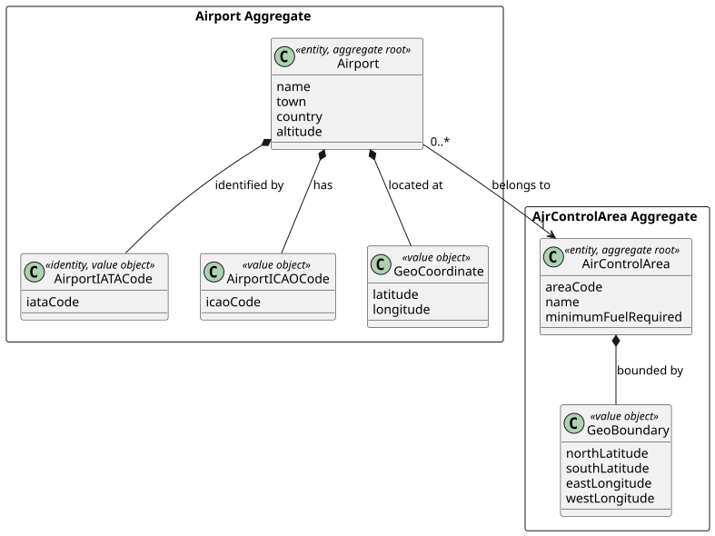
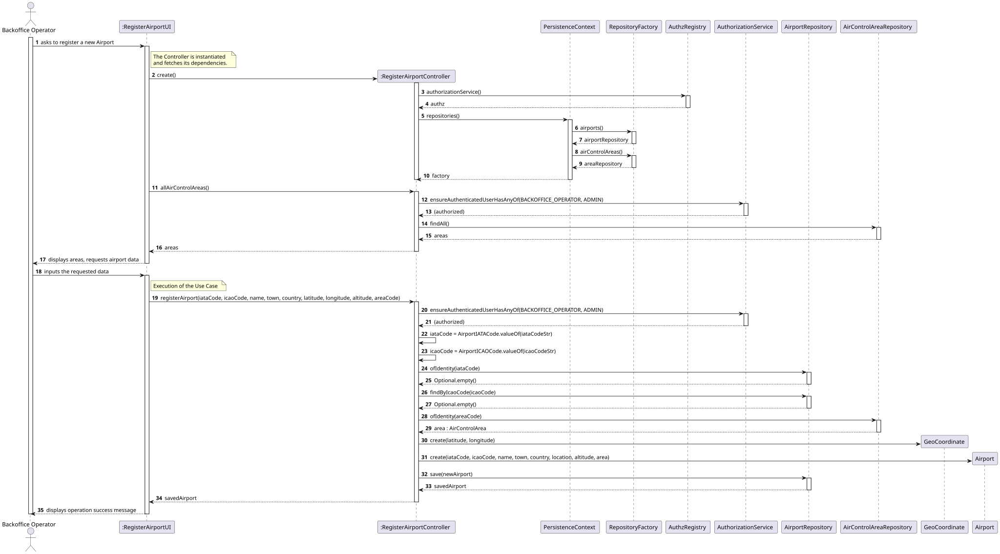
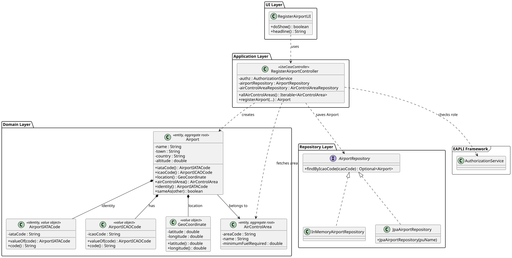

# US052

## 1. Context

This US was implemented in Sprint 2 and allows a Backoffice Operator to register an airport in the system, associating it with an existing Air Control Area. It depends on US050 (Register an Air Control Area), which must be completed first so that airports can be associated with a valid area.

The implementation follows the DDD layered architecture established in the project: a UI layer collects input, an application controller orchestrates the use case, the domain enforces invariants, and the repository persists the aggregate.

### 1.1 List of issues

Analysis: Define the domain model for Airport, including IATA/ICAO codes and geographic coordinates.

Design: Define the architecture for airport registration, domain model and persistence.

Implement: Implement the Airport domain entity, value objects, repository, controller and UI.

Test: Unit tests for `Airport`, `AirportIATACode`, `AirportICAOCode` and `GeoCoordinate` (all above 90% coverage).


## 2. Requirements

**US052** As a Backoffice Operator, I want to register an airport in a given air control area.

**Acceptance Criteria:**

- **AC052.1** An airport must be associated with exactly one air control area.
- **AC052.2** The airport IATA code must be exactly 3 uppercase letters and unique worldwide.
- **AC052.3** The airport ICAO code must be exactly 4 uppercase letters and unique worldwide.
- **AC052.4** The airport must have valid location coordinates (latitude between -90 and 90, longitude between -180 and 180).
- **AC052.5** This must also be achievable by a bootstrap process.

**Dependencies/References:**

- **US050** — Register an Air Control Area. An airport must belong to an existing area.

---

## 3. Analysis


An airport is a key concept in the AISafe system — it is the origin and destination of flights and belongs to exactly one Air Control Area.

The main design decisions made were:

**IATA and ICAO codes** — Airport codes are different from company codes. Airport IATA codes have 3 letters (e.g. LIS, OPO) while company IATA codes have 2 letters (e.g. TP, BA). Therefore separate Value Objects were created: `AirportIATACode` and `AirportICAOCode`, distinct from the existing `IATACode` and `ICAOCode` used by `AirTransportCompany`.

**Geographic coordinates** — The project document specifies "Coordinates" as a single concept for an airport location. A `GeoCoordinate` Value Object was created to encapsulate latitude and longitude with their validation rules. This is distinct from `GeoBoundary` (used by `AirControlArea`) which defines an area with 4 boundary coordinates.

The main classes identified are:

| Class | Type | Responsibility |
|-------|------|----------------|
| `Airport` | Entity / Aggregate Root | Holds airport data |
| `AirportIATACode` | Value Object / Identity | 3-letter IATA code, unique worldwide |
| `AirportICAOCode` | Value Object | 4-letter ICAO code, unique worldwide |
| `GeoCoordinate` | Value Object | Geographic point (latitude + longitude) |
| `AirportRepository` | Repository Interface | Persistence contract |

The following diagram shows the domain model excerpt relevant to this US:



---

## 4. Design

### 4.1. Realization

The use case follows the standard layered flow: `RegisterAirportUI` first displays available Air Control Areas, then collects all airport data and delegates to `RegisterAirportController`. The controller verifies authorization, checks IATA and ICAO code uniqueness, fetches the Air Control Area, creates the `GeoCoordinate` and `Airport` domain objects, and persists via `AirportRepository`.

The following sequence diagram illustrates this flow:



The following class diagram shows the classes involved:




### 4.2. Acceptance Tests


All tests are automated with JUnit 5 and located in `src/test/java/aisafe/airport/domain/`.

---

**AC052.1 — Airport must belong to an Air Control Area**

**Test:** `ensureAirControlAreaCannotBeNull` — verifies that an airport cannot be created without an Air Control Area.

```java
@Test
void ensureAirControlAreaCannotBeNull() {
    assertThrows(IllegalArgumentException.class, () ->
            new Airport(new AirportIATACode("LIS"), new AirportICAOCode("LPPT"),
                    "Name", "Town", "Country",
                    validLocation(), 100.0, null));
}
```

**Test:** `ensureValidAirportCanBeCreated` — verifies that a valid airport is correctly created with all fields.

```java
@Test
void ensureValidAirportCanBeCreated() {
    final Airport airport = validAirport();
    assertEquals("LIS", airport.iataCode().code());
    assertEquals("LPPT", airport.icaoCode().code());
    assertEquals("PT-N", airport.airControlArea().areaCode());
}
```

---

**AC052.2 — IATA code must be exactly 3 uppercase letters**

**Test:** `ensureValidIATACodeIsAccepted`

```java
@Test
void ensureValidIATACodeIsAccepted() {
    final AirportIATACode code = new AirportIATACode("LIS");
    assertEquals("LIS", code.code());
}
```

**Test:** `ensureIATACodeMustBeExactly3Letters`

```java
@Test
void ensureIATACodeMustBeExactly3Letters() {
    assertThrows(IllegalArgumentException.class, () -> new AirportIATACode("LI"));
    assertThrows(IllegalArgumentException.class, () -> new AirportIATACode("LISB"));
}
```

**Test:** `ensureIATACodeMustBeUppercase`

```java
@Test
void ensureIATACodeMustBeUppercase() {
    assertThrows(IllegalArgumentException.class, () -> new AirportIATACode("lis"));
}
```

---

**AC052.3 — ICAO code must be exactly 4 uppercase letters**

**Test:** `ensureValidICAOCodeIsAccepted`

```java
@Test
void ensureValidICAOCodeIsAccepted() {
    final AirportICAOCode code = new AirportICAOCode("LPPT");
    assertEquals("LPPT", code.code());
}
```

**Test:** `ensureICAOCodeMustBeExactly4Letters`

```java
@Test
void ensureICAOCodeMustBeExactly4Letters() {
    assertThrows(IllegalArgumentException.class, () -> new AirportICAOCode("LPP"));
    assertThrows(IllegalArgumentException.class, () -> new AirportICAOCode("LPPTE"));
}
```

---

**AC052.4 — Location coordinates must be valid**

**Test:** `ensureLatitudeCannotBeAbove90`

```java
@Test
void ensureLatitudeCannotBeAbove90() {
    assertThrows(IllegalArgumentException.class, () -> new GeoCoordinate(91.0, 0.0));
}
```

**Test:** `ensureLongitudeCannotBeAbove180`

```java
@Test
void ensureLongitudeCannotBeAbove180() {
    assertThrows(IllegalArgumentException.class, () -> new GeoCoordinate(0.0, 181.0));
}
```

**Test:** `ensureValidCoordinateCanBeCreated`

```java
@Test
void ensureValidCoordinateCanBeCreated() {
    final GeoCoordinate coord = new GeoCoordinate(38.7756, -9.1354);
    assertEquals(38.7756, coord.latitude());
    assertEquals(-9.1354, coord.longitude());
}
```

---

**Airport domain invariants**

**Test:** `ensureNameCannotBeNull`

```java
@Test
void ensureNameCannotBeNull() {
    assertThrows(IllegalArgumentException.class, () ->
            new Airport(new AirportIATACode("LIS"), new AirportICAOCode("LPPT"),
                    null, "Town", "Country",
                    validLocation(), 100.0, validArea()));
}
```

**Test:** `ensureTwoAirportsWithSameIATACodeAreEqual`

```java
@Test
void ensureTwoAirportsWithSameIATACodeAreEqual() {
    final Airport a1 = validAirport();
    final Airport a2 = new Airport(
            new AirportIATACode("LIS"), new AirportICAOCode("LPPT"),
            "Other Name", "Other Town", "Other Country",
            new GeoCoordinate(40.0, -8.0), 200.0, validArea()
    );
    assertEquals(a1, a2);
}
```

---

## 5. Implementation

The implementation is distributed across the following packages in `aisafe.base`:

| Package | Class | Role |
|---------|-------|------|
| `aisafe.airport.domain` | `Airport` | Aggregate root |
| `aisafe.airport.domain` | `AirportIATACode` | 3-letter IATA code value object |
| `aisafe.airport.domain` | `AirportICAOCode` | 4-letter ICAO code value object |
| `aisafe.airport.domain` | `GeoCoordinate` | Geographic point value object |
| `aisafe.airport.repositories` | `AirportRepository` | Repository interface |
| `aisafe.airport.application` | `RegisterAirportController` | Use case orchestrator |
| `aisafe.infrastructure.persistence.inmemory` | `InMemoryAirportRepository` | In-memory persistence |
| `aisafe.infrastructure.persistence.jpa` | `JpaAirportRepository` | JPA persistence |
| `aisafe.app.console.presentation.airport` | `RegisterAirportUI` | Console UI |

**Design decisions:**

`AirportIATACode` and `AirportICAOCode` were created as separate Value Objects from the existing `IATACode` and `ICAOCode` (used by `AirTransportCompany`) because airport codes follow different formats — 3 letters for airport IATA and 4 letters for airport ICAO, as specified in section 3.4.2 of the project document.

`GeoCoordinate` was created as a Value Object to encapsulate latitude and longitude as a single concept ("Coordinates" as described in section 3.2), with centralized validation. This is distinct from `GeoBoundary` which defines an area.

The test suite comprises **17 tests** for `Airport` (97% coverage), **13 tests** for `AirportIATACode` (92% coverage), **14 tests** for `AirportICAOCode` (91% coverage), and **12 tests** for `GeoCoordinate` (95% coverage), all passing.

---


## 6. Integration/Demonstration


The feature is accessible through the console application after logging in as a Backoffice Operator.

**To compile and run all tests:**
```bash
mvn clean test
```

**To run the application:**
```bash
# For development and quick testing (data is lost on exit)
./run-bootstrap.sh && ./run-inmemory.sh

# For demonstration with persistent data
./run-bootstrap.sh && ./run-jpa.sh
```

**To register an airport:**

1. Login with Backoffice Operator credentials.
2. Select **4. Air Control >** from the main menu.
3. Select **2. Register Airport**.
4. The system displays available Air Control Areas.
5. Fill in IATA code (3 letters), ICAO code (4 letters), name, town, country, latitude, longitude, altitude and area code.
6. The system confirms: `Airport successfully registered!` with all details.

---

## 7. Observations

- The separation between `AirportIATACode`/`AirportICAOCode` and the company codes `IATACode`/`ICAOCode` reflects a real-world distinction in aviation — airport codes and airline codes are managed by different IATA registries and follow different formats.
- `GeoCoordinate` could potentially be reused by other domain entities that require a geographic point, such as `Node` (used in flight segments). This was a deliberate design choice to avoid duplicating coordinate validation across the domain.
- An alternative design would have been to store latitude and longitude as plain `double` fields directly in `Airport`. This was rejected in favour of the Value Object approach to keep validation centralised and the domain more expressive.