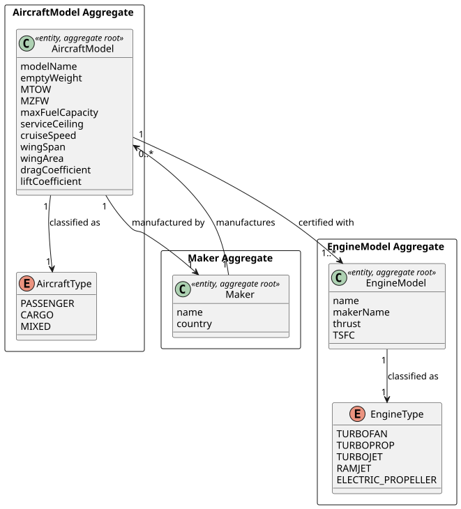
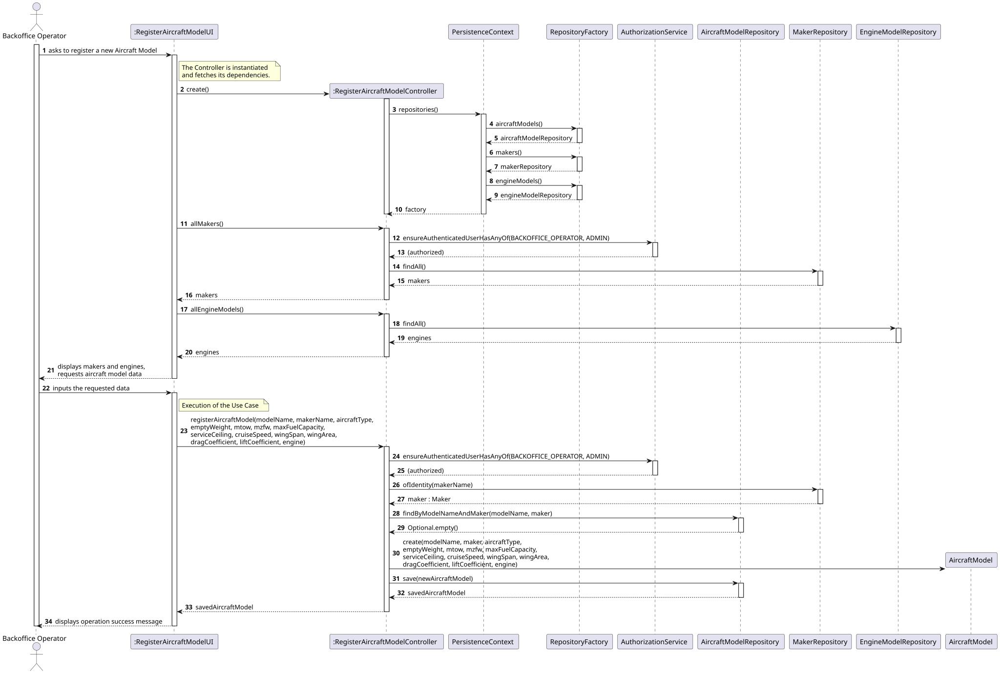
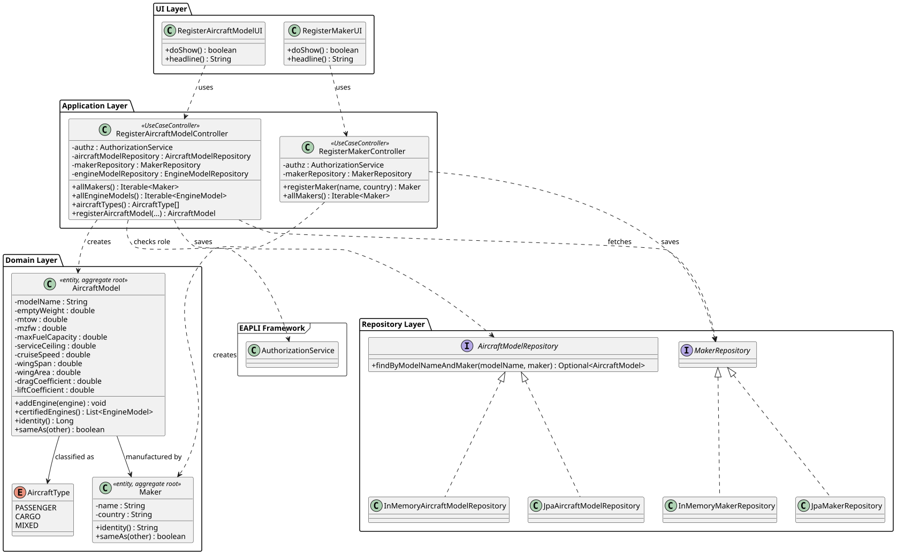

# US055

## 1. Context

This US was implemented in Sprint 2 and allows a Backoffice Operator to register a new aircraft model in the system. The implementation also required creating the `Maker` aggregate, which was not yet present in the codebase, as it is a direct dependency of `AircraftModel`.

### 1.1 List of issues

Analysis: Define the domain model for `AircraftModel` and `Maker`, including their relationship and the uniqueness constraint on `modelName + Maker`.

Design: Define the architecture for aircraft model registration, including the `Maker` aggregate, domain model and persistence.

Implement: Implement `Maker` and `AircraftModel` domain entities, value objects, repositories, controllers and UIs.

Test: Unit tests for `Maker` (94% coverage) and `AircraftModel` (93% coverage), all above 90%.

---

## 2. Requirements

**US055** As a Backoffice Operator, I want to register a new aircraft model.

**Acceptance Criteria:**

- **AC055.1** The aircraft model must have a name and a manufacturer (`Maker`), and their combination must be unique in the system.
- **AC055.2** At least one certified engine model must be associated at creation time.
- **AC055.3** The aircraft model must have a type: `PASSENGER`, `CARGO`, or `MIXED`.
- **AC055.4** The aircraft model must have valid flight characteristics: empty weight, MTOW, MZFW, max fuel capacity, service ceiling, cruise speed, wing span, wing area, drag coefficient, lift coefficient and max range — all strictly positive. MTOW must be greater than or equal to empty weight.
- **AC055.5** This must also be achievable by a bootstrap process.

**Dependencies/References:**

- **US056** — Create an engine model. At least one `EngineModel` must exist in the system before an `AircraftModel` can be registered.
- **US057** — Add an engine model to an aircraft model. The `addEngine()` method implemented in US055 is the foundation for US057.

---

## 3. Analysis

An aircraft model is a key concept in the AISafe system — it defines the physical and aerodynamic characteristics used in flight simulation. An aircraft model is manufactured by exactly one `Maker` and must have at least one certified engine model.

The main design decisions made were:

**Maker aggregate** — The `Maker` aggregate was created as a separate aggregate root with `name` (identity) and `country`. The `name` is used as the natural key — it is unique and human-readable. The combination `modelName + Maker` must be unique across the system.

**Engine association** — At least one `EngineModel` must be provided at creation time (enforced in the constructor). Additional engines can be added later via US057. The `certifiedEngines` list is unmodifiable externally to protect the invariant.

**MTOW validation** — MTOW must be greater than or equal to empty weight, since an aircraft cannot have a maximum take-off weight lower than its own empty weight.

The main classes identified are:

| Class | Type | Responsibility |
|-------|------|----------------|
| `AircraftModel` | Entity / Aggregate Root | Holds aircraft model data and certified engines |
| `AircraftType` | Enumeration | PASSENGER, CARGO, MIXED |
| `Maker` | Entity / Aggregate Root | Holds manufacturer data |
| `AircraftModelRepository` | Repository Interface | Persistence contract for AircraftModel |
| `MakerRepository` | Repository Interface | Persistence contract for Maker |

The following diagram shows the domain model excerpt relevant to this US:



---

## 4. Design

### 4.1. Realization

The use case follows the standard layered flow: `RegisterAircraftModelUI` displays available makers and engine models, collects all aircraft model data and delegates to `RegisterAircraftModelController`. The controller verifies authorization, checks the `modelName + Maker` uniqueness constraint, creates the `AircraftModel` domain object with the selected engine, and persists via `AircraftModelRepository`.

A separate `RegisterMakerUI` and `RegisterMakerController` were created to allow backoffice operators to register manufacturers before creating aircraft models.

The following sequence diagram illustrates this flow:



The following class diagram shows the classes involved:




### 4.2. Acceptance Tests

All tests are automated with JUnit 5 and located in `src/test/java/aisafe/`.

---

**AC055.1 — Model name and maker combination must be unique**

**Test:** `ensureTwoModelsWithSameNameAndMakerAreEqual` — verifies that two aircraft models with the same name and maker are considered equal.

```java
@Test
void ensureTwoModelsWithSameNameAndMakerAreEqual() {
    final AircraftModel a = validAircraftModel();
    final AircraftModel b = new AircraftModel(
            "737-800", validMaker(), AircraftType.CARGO,
            41140, 79016, 62732, 20894,
            12500, 230, 34.3, 125.0,
            0.026, 1.5, 5765.0, validEngine()
    );
    assertEquals(a, b);
}
```

**Test:** `ensureTwoModelsWithDifferentNamesAreNotEqual` — verifies that different model names produce different entities.

```java
@Test
void ensureTwoModelsWithDifferentNamesAreNotEqual() {
    final AircraftModel a = validAircraftModel();
    final AircraftModel b = new AircraftModel(
            "737-900", validMaker(), AircraftType.PASSENGER,
            41140, 79016, 62732, 20894,
            12500, 230, 34.3, 125.0,
            0.026, 1.5, 5765.0, validEngine()
    );
    assertNotEquals(a, b);
}
```

---

**AC055.2 — At least one engine model must be associated**

**Test:** `ensureFirstEngineCannotBeNull` — verifies that an aircraft model cannot be created without an engine.

```java
@Test
void ensureFirstEngineCannotBeNull() {
    assertThrows(IllegalArgumentException.class, () ->
            new AircraftModel("737-800", validMaker(), AircraftType.PASSENGER,
                    41140, 79016, 62732, 20894,
                    12500, 230, 34.3, 125.0,
                    0.026, 1.5, 5765.0, null));
}
```

**Test:** `ensureValidAircraftModelCanBeCreated` — verifies that a valid model with one engine is correctly created.

```java
@Test
void ensureValidAircraftModelCanBeCreated() {
    final AircraftModel model = validAircraftModel();
    assertEquals("737-800", model.modelName());
    assertEquals("Boeing", model.maker().name());
    assertEquals(AircraftType.PASSENGER, model.aircraftType());
    assertEquals(1, model.certifiedEngines().size());
}
```

**Test:** `ensureCannotAddNullEngineModel` — verifies that a null engine cannot be added.

```java
@Test
void ensureCannotAddNullEngineModel() {
    final AircraftModel model = validAircraftModel();
    assertThrows(IllegalArgumentException.class, () -> model.addEngine(null));
}
```

---

**AC055.3 — Aircraft type must be valid**

**Test:** `ensureAircraftTypeCannotBeNull` — verifies that aircraft type is mandatory.

```java
@Test
void ensureAircraftTypeCannotBeNull() {
    assertThrows(IllegalArgumentException.class, () ->
            new AircraftModel("737-800", validMaker(), null,
                    41140, 79016, 62732, 20894,
                    12500, 230, 34.3, 125.0,
                    0.026, 1.5, 5765.0, validEngine()));
}
```

---

**AC055.4 — Flight characteristics must be valid**

**Test:** `ensureEmptyWeightMustBePositive`

```java
@Test
void ensureEmptyWeightMustBePositive() {
    assertThrows(IllegalArgumentException.class, () ->
            new AircraftModel("737-800", validMaker(), AircraftType.PASSENGER,
                    0, 79016, 62732, 20894,
                    12500, 230, 34.3, 125.0,
                    0.026, 1.5, 5765.0, validEngine()));
}
```

**Test:** `ensureMTOWMustBeGreaterThanEmptyWeight`

```java
@Test
void ensureMTOWMustBeGreaterThanEmptyWeight() {
    assertThrows(IllegalArgumentException.class, () ->
            new AircraftModel("737-800", validMaker(), AircraftType.PASSENGER,
                    79016, 41140, 62732, 20894,
                    12500, 230, 34.3, 125.0,
                    0.026, 1.5, 5765.0, validEngine()));
}
```

---

**Maker domain invariants**

**Test:** `ensureNameCannotBeNull`

```java
@Test
void ensureNameCannotBeNull() {
    assertThrows(IllegalArgumentException.class, () -> new Maker(null, "USA"));
}
```

**Test:** `ensureTwoMakersWithSameNameAreEqual`

```java
@Test
void ensureTwoMakersWithSameNameAreEqual() {
    final Maker a = new Maker("Boeing", "USA");
    final Maker b = new Maker("Boeing", "United States");
    assertEquals(a, b);
}
```

---


## 5. Implementation

The implementation is distributed across the following packages in `aisafe.base`:

| Package | Class | Role |
|---------|-------|------|
| `aisafe.maker.domain` | `Maker` | Aggregate root for manufacturer |
| `aisafe.maker.repositories` | `MakerRepository` | Repository interface for Maker |
| `aisafe.maker.application` | `RegisterMakerController` | Use case orchestrator for Maker registration |
| `aisafe.aircraftmodel.domain` | `AircraftModel` | Aggregate root for aircraft model |
| `aisafe.aircraftmodel.domain` | `AircraftType` | Enum: PASSENGER, CARGO, MIXED |
| `aisafe.aircraftmodel.repositories` | `AircraftModelRepository` | Repository interface |
| `aisafe.aircraftmodel.application` | `RegisterAircraftModelController` | Use case orchestrator |
| `aisafe.infrastructure.persistence.inmemory` | `InMemoryMakerRepository` | In-memory persistence for Maker |
| `aisafe.infrastructure.persistence.inmemory` | `InMemoryAircraftModelRepository` | In-memory persistence for AircraftModel |
| `aisafe.infrastructure.persistence.jpa` | `JpaMakerRepository` | JPA persistence for Maker |
| `aisafe.infrastructure.persistence.jpa` | `JpaAircraftModelRepository` | JPA persistence for AircraftModel |
| `aisafe.app.console.presentation.maker` | `RegisterMakerUI` | Console UI for Maker registration |
| `aisafe.app.console.presentation.aircraftmodel` | `RegisterAircraftModelUI` | Console UI for AircraftModel registration |

**Design decisions:**

`Maker` uses `name` as its natural identity key — manufacturer names are unique in the aviation domain and human-readable, making a generated surrogate key unnecessary.

`AircraftModel` uses a generated `Long` id because the uniqueness constraint is composite (`modelName + Maker`) and JPA composite keys would add unnecessary complexity.

The `certifiedEngines` list is exposed as an unmodifiable view via `Collections.unmodifiableList()` to protect the aggregate's invariant that at least one engine must always be present.

The test suite comprises **15 tests** for `Maker` (94% coverage) and **25 tests** for `AircraftModel` (93% coverage), all passing.

---

## 6. Integration/Demonstration


The feature is accessible through the console application after logging in as a Backoffice Operator.

**To compile and run all tests:**
```bash
mvn clean test
```

**To run the application:**
```bash
# For development and quick testing (data is lost on exit)
./run-inmemory.sh

# For demonstration with persistent data (requires H2 server in a separate terminal)
./start-h2.sh      # Terminal 1 — keep running
./run-bootstrap.sh # Terminal 2 — first time only
./run-jpa.sh       # Terminal 2 — every time
```

**To register an aircraft model:**

1. Login with Backoffice Operator credentials.
2. Select **7. Aircraft >** from the main menu.
3. Select **2. Register Maker** and register a manufacturer.
4. Select **1. Register Engine Model** and register an engine model (US056).
5. Select **3. Register Aircraft Model**.
6. Choose a maker from the list, fill in all aircraft characteristics and select an engine model.
7. The system confirms: `Aircraft Model successfully registered!` with model name, maker, type and number of engines.

---

## 7. Observations

- The `Maker` aggregate was created as part of this US because it is a direct dependency of `AircraftModel` and was not yet implemented in the codebase. The `EngineModel` aggregate (US056), implemented by another team member, references the maker only by name (`makerName` as String) — a deliberate simplification. For `AircraftModel`, the full `Maker` aggregate reference was used to correctly model the domain.
- The `InMemoryAircraftModelRepository` uses Java reflection to set the generated `id` field, consistent with the approach adopted for `InMemoryEngineModelRepository`. This is a known limitation of the in-memory persistence strategy when using `@GeneratedValue`.
- An alternative design for the `Maker` identity would have been to use a generated surrogate key. This was rejected in favour of the natural key (`name`) because manufacturer names are unique in the aviation domain and provide better readability in queries and logs.
