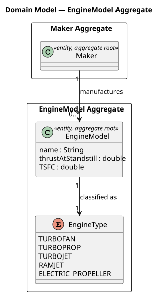
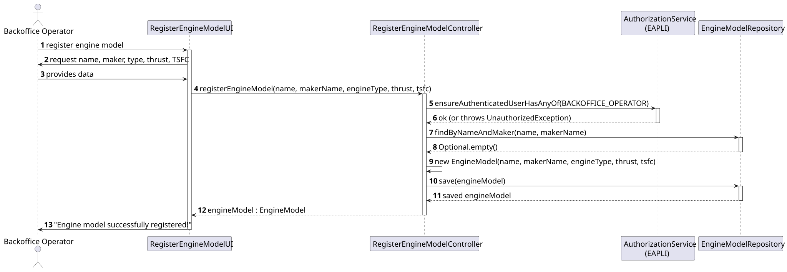
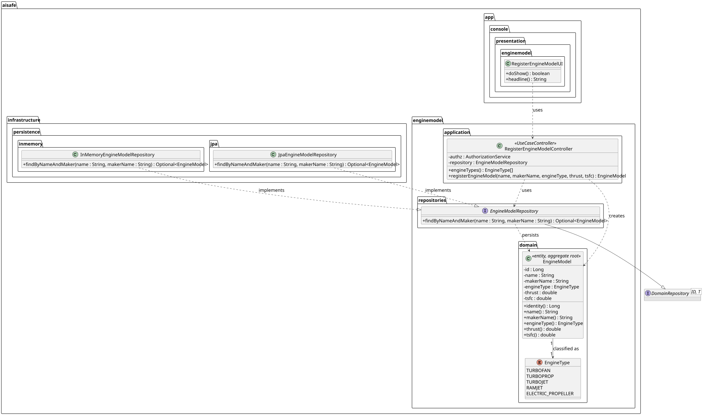

# US056 — Create an Aircraft Engine Model

## 1. Context

This US is implemented in Sprint 2 and allows the Backoffice Operator to register a new engine model in the AISafe system. Engine models are foundational data required by US057 (Add Engine Model to Aircraft Model) and US058 (Remove Engine Model from Aircraft Model).

The `EngineModel` aggregate is independent and stores the technical specifications of an aircraft engine.

---

## 2. Requirements

**US056** As Backoffice Operator, I want to register a new engine model to be used by aircraft.

**Acceptance Criteria:**

- **AC056.1** The combination of model name and manufacturer must be unique in the system.
- **AC056.2** The engine type must be one of the defined types: TURBOFAN, TURBOPROP, TURBOJET, RAMJET, ELECTRIC_PROPELLER.
- **AC056.3** Thrust (power, in kN) must be greater than zero.
- **AC056.4** TSFC (fuel efficiency, in kg/(kN·h)) must be greater than zero.
- **AC056.5** Only an authenticated Backoffice Operator may perform this action.
- **AC056.6** This must also be achievable by a bootstrap process.

**Dependencies/References:**

- Acts as a prerequisite for:
  - US057 — Add Engine Model to Aircraft Model
  - US058 — Remove Engine Model from Aircraft Model

---

## 3. Analysis

The `EngineModel` aggregate stores the technical specification of an aircraft engine. Its identity is a generated `Long` (surrogate key), while business uniqueness is enforced by the `(name, makerName)` combination — both at the controller level and via a `@UniqueConstraint` at the database level.

The maker is referenced by name (string) rather than a foreign key to the `Maker` aggregate, to maintain low coupling.

| Class | Type | Responsibility |
|-------|------|----------------|
| `EngineModel` | Entity / Aggregate Root | Stores name, maker, type, thrust, TSFC |
| `EngineType` | Enum | TURBOFAN, TURBOPROP, TURBOJET, RAMJET, ELECTRIC_PROPELLER |
| `EngineModelRepository` | Repository Interface | Persistence contract |
| `RegisterEngineModelController` | Application Controller | Orchestrates the use case; enforces BACKOFFICE_OPERATOR role |
| `RegisterEngineModelUI` | UI | Collects all fields from the operator |

The following domain model excerpt shows the aggregate structure:



---

## 4. Design

### 4.1. Realization

1. The UI (`RegisterEngineModelUI`) prompts for name, maker, engine type, thrust, and TSFC.
2. The engine type is selected from a numbered list; invalid selections loop until valid.
3. The controller calls `authz.ensureAuthenticatedUserHasAnyOf(BACKOFFICE_OPERATOR)`.
4. The controller checks uniqueness via `findByNameAndMaker()` before creation.
5. A new `EngineModel` is instantiated — domain invariants enforced in the constructor.
6. The model is persisted via `EngineModelRepository.save()`.
7. The UI confirms: `Engine model successfully registered!`

The following sequence diagram illustrates the flow:



The following class diagram shows the classes involved:



### 4.2. Acceptance Tests

All tests are automated with JUnit 5 and located in `src/test/java/aisafe/enginemodel/domain/EngineModelTest.java`.

---

**AC056.1 — Uniqueness (name + maker)**

**Test:** `ensureValidEngineModelCanBeCreated`

```java
@Test
void ensureValidEngineModelCanBeCreated() {
    final EngineModel model = new EngineModel(VALID_NAME, VALID_MAKER, VALID_TYPE, VALID_THRUST, VALID_TSFC);
    assertEquals(VALID_NAME, model.name());
    assertEquals(VALID_MAKER, model.makerName());
}
```

---

**AC056.2 — Engine type validation**

**Test:** `ensureEngineTypeCannotBeNull`

```java
@Test
void ensureEngineTypeCannotBeNull() {
    assertThrows(IllegalArgumentException.class,
            () -> new EngineModel(VALID_NAME, VALID_MAKER, null, VALID_THRUST, VALID_TSFC));
}
```

---

**AC056.3 — Thrust validation**

**Test:** `ensureThrustMustBePositive`

```java
@Test
void ensureThrustMustBePositive() {
    assertThrows(IllegalArgumentException.class,
            () -> new EngineModel(VALID_NAME, VALID_MAKER, VALID_TYPE, 0.0, VALID_TSFC));
}
```

**Test:** `ensureThrustCannotBeNegative`

```java
@Test
void ensureThrustCannotBeNegative() {
    assertThrows(IllegalArgumentException.class,
            () -> new EngineModel(VALID_NAME, VALID_MAKER, VALID_TYPE, -10.0, VALID_TSFC));
}
```

---

**AC056.4 — TSFC validation**

**Test:** `ensureTsfcMustBePositive`

```java
@Test
void ensureTsfcMustBePositive() {
    assertThrows(IllegalArgumentException.class,
            () -> new EngineModel(VALID_NAME, VALID_MAKER, VALID_TYPE, VALID_THRUST, 0.0));
}
```

**Test:** `ensureTsfcCannotBeNegative`

```java
@Test
void ensureTsfcCannotBeNegative() {
    assertThrows(IllegalArgumentException.class,
            () -> new EngineModel(VALID_NAME, VALID_MAKER, VALID_TYPE, VALID_THRUST, -0.1));
}
```

---

**Name and maker validation**

**Test:** `ensureNameCannotBeNull`, `ensureNameCannotBeBlank`, `ensureMakerNameCannotBeNull`, `ensureMakerNameCannotBeBlank`

```java
@Test
void ensureNameCannotBeNull() {
    assertThrows(IllegalArgumentException.class,
            () -> new EngineModel(null, VALID_MAKER, VALID_TYPE, VALID_THRUST, VALID_TSFC));
}
```

---

## 5. Implementation

The implementation is distributed across the following packages in `aisafe.base`:

| Package | Class | Role |
|---------|-------|------|
| `aisafe.enginemodel.domain` | `EngineModel` | Aggregate root, table `T_ENGINE_MODEL` |
| `aisafe.enginemodel.domain` | `EngineType` | Enum: TURBOFAN, TURBOPROP, TURBOJET, RAMJET, ELECTRIC_PROPELLER |
| `aisafe.enginemodel.repositories` | `EngineModelRepository` | Repository interface |
| `aisafe.enginemodel.application` | `RegisterEngineModelController` | Use case orchestrator |
| `aisafe.infrastructure.persistence.inmemory` | `InMemoryEngineModelRepository` | In-memory persistence |
| `aisafe.infrastructure.persistence.jpa` | `JpaEngineModelRepository` | JPA persistence |
| `aisafe.app.console.presentation.enginemodel` | `RegisterEngineModelUI` | Console UI |

---

## 6. Integration/Demonstration

**To register an Engine Model:**

1. Login with Backoffice Operator credentials.
2. Select the engine models submenu from the main menu.
3. Select **Register Engine Model**.
4. Enter the model name (e.g. `CFM56`).
5. Enter the maker name (e.g. `CFM International`).
6. Select the engine type from the displayed list.
7. Enter thrust in kN (e.g. `120.0`).
8. Enter TSFC in kg/(kN·h) (e.g. `0.372`).
9. The system confirms: `Engine model successfully registered!`

---

## 7. Observations

- The table is named `T_ENGINE_MODEL` following the project naming convention.
- Business uniqueness is enforced both in the controller (`findByNameAndMaker`) and at the database level via `@UniqueConstraint(columnNames = {"name", "makerName"})`.
- The maker is stored by name (external reference) rather than a foreign key to the `Maker` aggregate, to keep the aggregates loosely coupled.
- The identity is a surrogate `Long` generated by the database (`@GeneratedValue`). The `InMemoryEngineModelRepository` uses reflection to assign IDs since the EAPLI framework does not natively support generated IDs for in-memory repositories.
