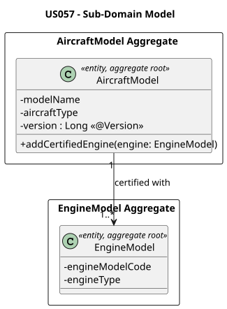
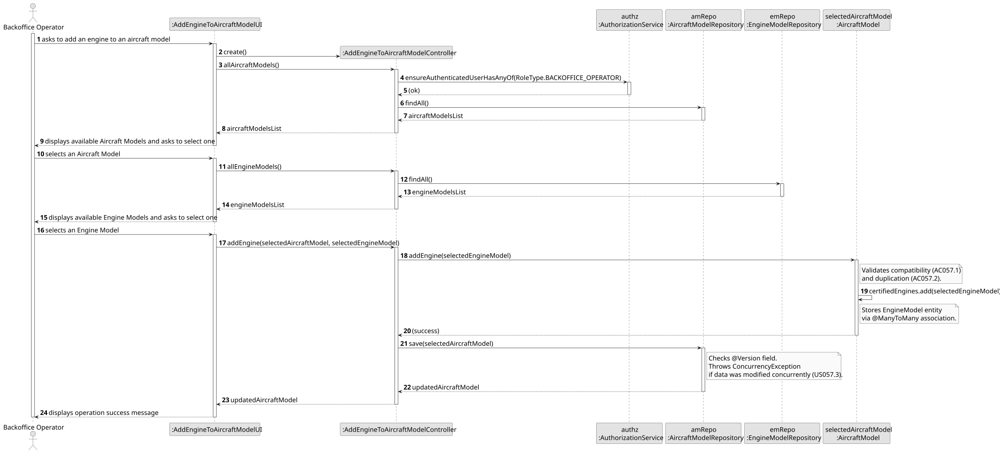
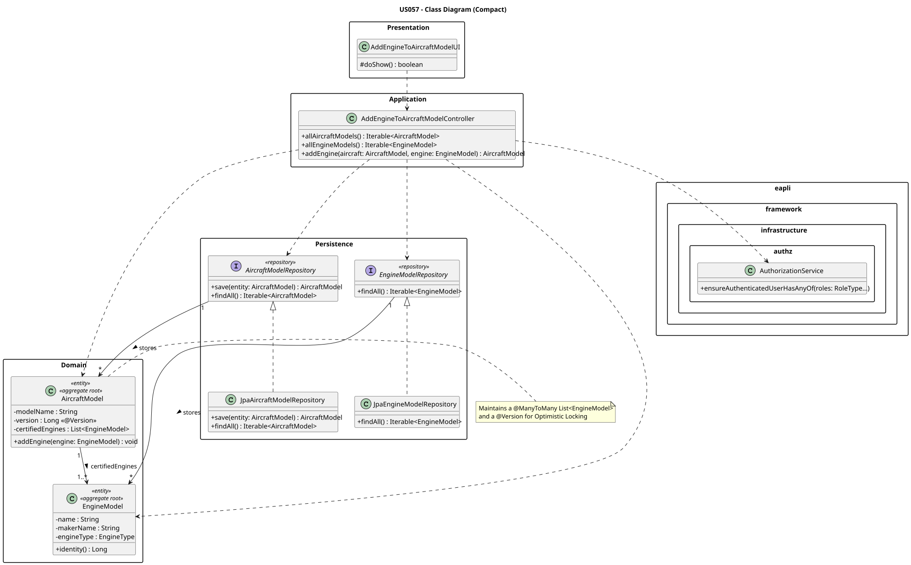

# US 057 - Add an Engine Model to an Aircraft Model

## 1. Context
This US is implemented in Sprint 2 and allows the Backoffice Operator to add an engine model to an aircraft model's list of certified engines in the AISafe system. It depends on US030 (Authentication and Authorization), which must be in place so that only an authenticated Backoffice Operator can invoke this feature.

The `AircraftModel` is an independent aggregate that is updated in this operation. This use case depends on the prior existence of aircraft models and engine models (US055 and US056) and acts as a foundational dependency for US070 (Add an aircraft), which requires the aircraft's theoretical model to have certified engines associated with it before a physical aircraft can be instantiated.

---

## 2. Requirements

**US057** As a Backoffice Operator, I want to add an engine model to an aircraft model's list of certified engines.

**Acceptance Criteria:**

- **AC057.1** The engine type must be compatible with the aircraft model.
- **AC057.2** The same engine model cannot be added twice to the same aircraft model.
- **AC057.3** The system must handle concurrent updates to the same aircraft model (Optimistic Locking) and inform the user if the data was changed by someone else in the meantime.
- **AC057.4** The user performing this action must be authenticated and have the `BACKOFFICE_OPERATOR` role.

**Dependencies/References:**

- **US055** — Create an Aircraft Model: the base entity must already exist in the system.
- **US056** — Create an Aircraft Engine Model: the catalog of engines must be populated.
- **US030 / US031** — Authentication and Authorization: required to validate the Backoffice Operator role.
- Acts as a prerequisite for:
  - **US070** — Add an Aircraft (an aircraft's model must have at least one certified engine)

---

## 3. Analysis

Since this use case modifies an existing aggregate rather than creating a new one, the architectural focus shifts to **Data Consistency and Concurrency Control**.

The main classes involved are:

| Class | Type | Responsibility |
|-------|------|----------------|
| `AircraftModel` | Entity / Aggregate Root | Holds the aircraft type, list of certified `EngineModel` entities, and version for optimistic locking |
| `AircraftModelRepository` | Repository Interface | Persistence contract for the aggregate |
| `AddEngineToAircraftModelController` | Application Controller | Orchestrates the use case; enforces `BACKOFFICE_OPERATOR` role |
| `AddEngineToAircraftModelUI` | UI | Collects the aircraft model and engine model selections from the operator |

**Architectural Decision (Certified Engines):** The `AircraftModel` holds a `@ManyToMany List<EngineModel>` of certified engines. Engine compatibility is validated inside `addEngine()` by comparing the new engine's type against the type of the first engine already certified in the list, ensuring consistency.

**Architectural Decision (Concurrency Control):** Because multiple Backoffice Operators might try to update the same `AircraftModel` simultaneously, **Optimistic Locking** is applied. The `AircraftModel` entity holds a `version` attribute annotated with JPA's `@Version`. When a concurrent update conflict occurs, JPA throws an `OptimisticLockException`, which the repository layer catches and wraps into a `ConcurrencyException` to be presented to the user.

The following domain model excerpt shows the aggregate structure:

---

## 4. Design

### 4.1. Realization

1. The UI (`AddEngineToAircraftModelUI`) lists available aircraft models and engine models for the operator to select.
2. The controller calls `authz.ensureAuthenticatedUserHasAnyOf(BACKOFFICE_OPERATOR)`.
3. The controller fetches the selected `AircraftModel` from `AircraftModelRepository`.
4. The controller fetches the selected `EngineModel` from `EngineModelRepository` and extracts its identity.
5. The `AircraftModel` aggregate validates compatibility (AC057.1) and checks for duplicates (AC057.2) inside `addEngine()`.
6. The updated `AircraftModel` is persisted via `AircraftModelRepository.save()`. JPA detects any version conflict and throws `OptimisticLockException` (AC057.3).
7. The UI confirms success or displays the appropriate error message.

The following sequence diagram illustrates the flow:

The following class diagram shows the classes involved:

### 4.2. Acceptance Tests

All automated tests and manual acceptance test scripts are documented in [tests.md](tests.md).

---

## 5. Implementation

The implementation is distributed across the following packages in `aisafe.base`:

| Package | Class | Role |
|---------|-------|------|
| `aisafe.aircraftmodel.domain` | `AircraftModel` | Aggregate root, table `T_AIRCRAFT_MODEL` |
| `aisafe.aircraftmodel.repositories` | `AircraftModelRepository` | Repository interface |
| `aisafe.aircraftmodel.application` | `AddEngineToAircraftModelController` | Use case orchestrator |
| `aisafe.infrastructure.persistence.inmemory` | `InMemoryAircraftModelRepository` | In-memory persistence |
| `aisafe.infrastructure.persistence.jpa` | `JpaAircraftModelRepository` | JPA persistence |
| `aisafe.app.console.presentation.aircraftmodel` | `AddEngineToAircraftModelUI` | Console UI |

`RepositoryFactory` must expose an `aircraftModels()` method, and both `InMemoryRepositoryFactory` and `JpaRepositoryFactory` must provide implementations.

---

## 6. Integration/Demonstration

**Prerequisites:** Run from the `aisafe.base` directory with Maven 3.9+ and Java 21.

**Scenario A: Happy Path & Duplication Prevention**

1. Login with Backoffice Operator credentials.
2. Select **Aircraft Configuration > Add Engine to Aircraft Model** from the main menu.
3. Select an existing Aircraft Model (e.g., `Boeing 737`).
4. Select a compatible Engine Model (e.g., `CFM56`).
5. The system confirms: `Engine 'CFM56' successfully added to aircraft model 'Boeing 737'.`
6. Repeat steps 2–4 with the **same** Aircraft and Engine models.
7. The system rejects the operation with a business rule violation message.

**Scenario B: Concurrency Control (Optimistic Locking)**

1. Open **two separate terminal windows** and run the Backoffice Application in both.
2. Login as `backoffice_operator` in both terminals.
3. In **Terminal 1**, navigate to `Add Engine to Aircraft Model` and select an Aircraft Model, but do **not** confirm yet.
4. In **Terminal 2**, select the **same** Aircraft Model, select an engine, and confirm the addition. (Operation succeeds.)
5. Return to **Terminal 1**, select an engine, and confirm.
6. The system detects the version mismatch and aborts the operation, displaying a user-friendly concurrency error.

---

## 7. Observations

- The `AircraftModel` aggregate stores certified engines as a `@ManyToMany List<EngineModel>`. Engine compatibility is validated by comparing the new engine's type against the first certified engine in the list, and duplicates are detected by comparing engine name and maker name before adding.
- The `@Version` field on `AircraftModel` is the sole mechanism for optimistic locking; no pessimistic locking strategy is used.
- Engine type compatibility is enforced exclusively in the domain layer (`AircraftModel.addEngine()`), keeping the controller free of business rules. Compatibility is determined by comparing the new engine's type against the first engine already certified in the list.
- The UI must filter available engine models by engine type to reduce operator error, even though the domain enforces the rule independently.
- **Domain model note:** The domain model V5 lists `maxRange` as a field of `AircraftModel`. This field is not yet present in the current Java implementation and should be added in a future sprint to maintain alignment with the domain model.
