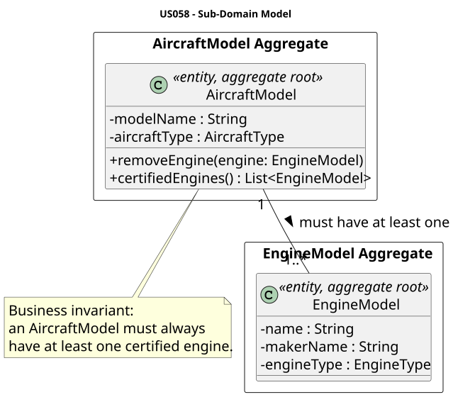
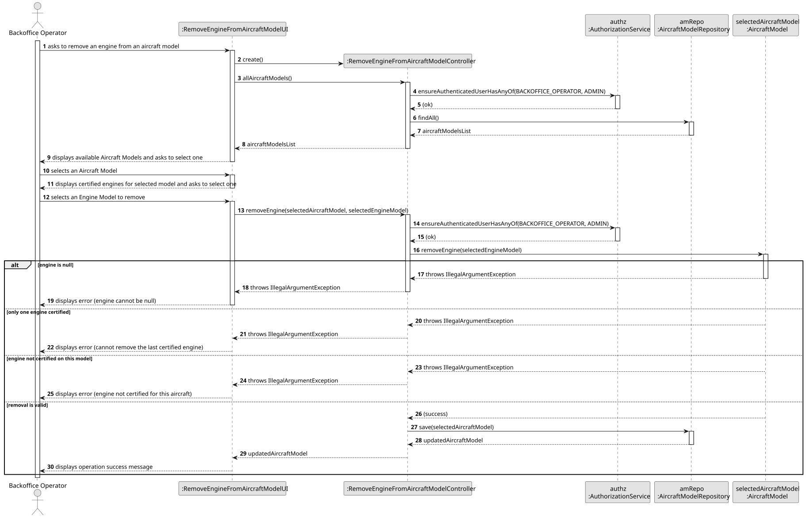
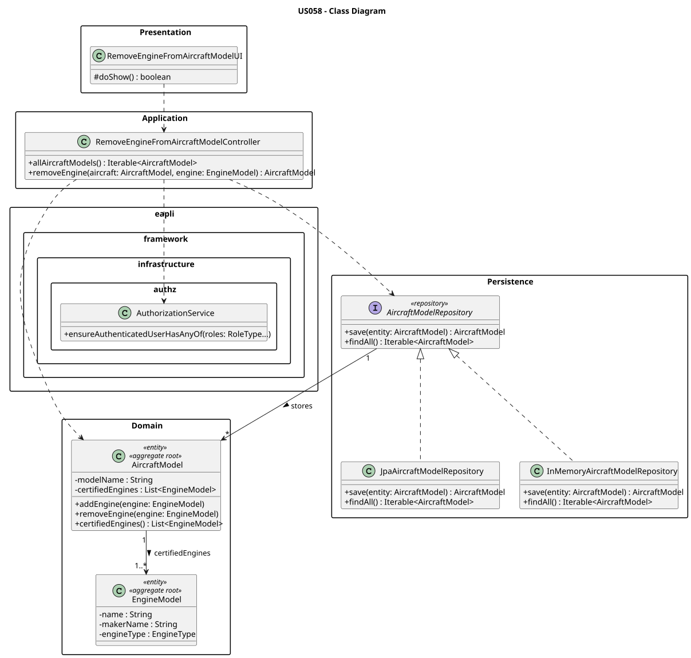

### US058 - Remove an Engine Model from an Aircraft Model

## 1. Context

This US is implemented in Sprint 2 and allows the Backoffice Operator to remove a certified engine model from an aircraft model's list of certified engines in the AISafe system. It depends on US030/US031 (Authentication and Authorization), which must be in place so that only an authenticated Backoffice Operator can invoke this feature.

This use case depends on the prior existence of aircraft models with at least two certified engines (US055, US056, US057). Its main business constraint is that an `AircraftModel` must always have at least one certified engine — removing the last one is forbidden.

---

## 2. Requirements

**US058** As a Backoffice Operator, I want to remove a certified engine model from an aircraft model.

##### Acceptance Criteria

* **AC058.1:** The engine model selected for removal must be currently certified on the chosen aircraft model.
* **AC058.2:** An aircraft model must maintain at least one certified engine model at all times. Removing the last engine must be rejected with an appropriate error message.
* **AC058.3:** The user performing this action must be authenticated and have the `BACKOFFICE_OPERATOR` role.

##### Dependencies / References

* Requires **US055** (Create an Aircraft Model) — the aircraft model must exist.
* Requires **US056** (Create an Engine Model) — the engine model must exist.
* Requires **US057** (Add Engine Model to Aircraft Model) — the engine must already be certified on the aircraft model.
* Requires **US030 / US031** (Authentication and Authorization) to validate the Backoffice Operator role.

---

## 3. Analysis

Since this use case modifies an existing aggregate rather than creating a new one, the focus is on enforcing domain invariants during removal.

### Main Components

* **AircraftModel** — Aggregate Root that enforces all business rules related to its certified engines collection.
* **EngineModel** — Entity whose reference is removed from the `AircraftModel`.

### Key Business Rule

The `AircraftModel` aggregate enforces that `certifiedEngines` always contains at least one element. The `removeEngine()` method checks this invariant before performing the removal, throwing an `IllegalArgumentException` if violated.

### Domain Model



---

## 4. Design

### 4.1 Realization

The Controller loads the list of aircraft models and presents them to the user. After the user selects a model, its currently certified engines are displayed for selection. The Controller then delegates the removal to the `AircraftModel` aggregate root, which enforces all invariants, and persists the updated aggregate via the repository.

---

## Sequence Diagram



---

## Class Diagram



---

### 4.2 Acceptance Tests

**Test 1** — Engine can be removed when more than one engine is certified.

```java
@Test
void ensureCanRemoveEngineWhenMoreThanOneExists() {
    final AircraftModel model = validAircraftModel();
    final EngineModel second = new EngineModel("GE90", "GE Aviation", EngineType.TURBOFAN, 330.0, 0.31);
    model.addEngine(second);
    model.removeEngine(second);
    assertEquals(1, model.certifiedEngines().size());
}
```

**Test 2** — Cannot remove the last certified engine.

```java
@Test
void ensureCannotRemoveLastEngine() {
    final AircraftModel model = validAircraftModel();
    assertThrows(IllegalArgumentException.class, () -> model.removeEngine(validEngine()));
}
```

**Test 3** — Cannot remove an engine that is not certified on the model.

```java
@Test
void ensureCannotRemoveEngineThatIsNotCertified() {
    final AircraftModel model = validAircraftModel();
    final EngineModel second = new EngineModel("GE90", "GE Aviation", EngineType.TURBOFAN, 330.0, 0.31);
    model.addEngine(second);
    final EngineModel notCertified = new EngineModel("V2500", "IAE", EngineType.TURBOFAN, 111.0, 0.33);
    assertThrows(IllegalArgumentException.class, () -> model.removeEngine(notCertified));
}
```

**Test 4** — Cannot pass null as the engine to remove.

```java
@Test
void ensureCannotRemoveNullEngine() {
    final AircraftModel model = validAircraftModel();
    final EngineModel second = new EngineModel("GE90", "GE Aviation", EngineType.TURBOFAN, 330.0, 0.31);
    model.addEngine(second);
    assertThrows(IllegalArgumentException.class, () -> model.removeEngine(null));
}
```

---

## 5. Implementation

### Key Implementation Details

* **`AircraftModel.removeEngine(EngineModel engine)`** — Added to the domain class. Validates:
  1. Engine is not null.
  2. The certified engines list has more than one element (enforces the minimum-one invariant).
  3. The engine exists in the certified list (matched by name and makerName). Uses `removeIf` and checks the return value to detect non-certified engines.

* **`RemoveEngineFromAircraftModelController`** — Follows the same pattern as `AddEngineToAircraftModelController`. Uses `AircraftModelRepository` only (no need to query `EngineModelRepository` since the engines to display are already loaded from the selected `AircraftModel`).

* **`RemoveEngineFromAircraftModelUI`** — Displays the aircraft models list, then shows the certified engines of the selected model, and delegates to the controller. All validation errors are caught and displayed to the user.

---

## 6. Integration / Demonstration

To test this functionality, ensure the system has been bootstrapped first so that Aircraft Models with multiple certified Engine Models exist in the database.

```
# Login as Backoffice Operator
# Navigate to: Aircraft > Remove Engine from Aircraft Model
# Select an aircraft model with 2+ certified engines
# Select the engine to remove
```

---

## 7. Observations

All business logic (invariant enforcement, existence check) is placed entirely inside the `AircraftModel` domain class, keeping the Controller thin and respecting the Aggregate Root pattern of Domain-Driven Design.
