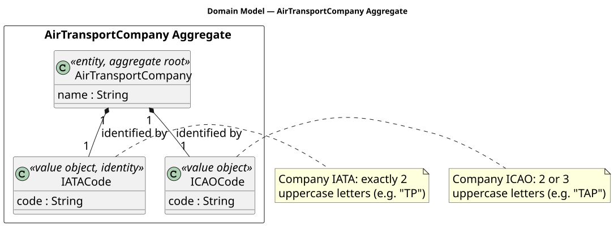
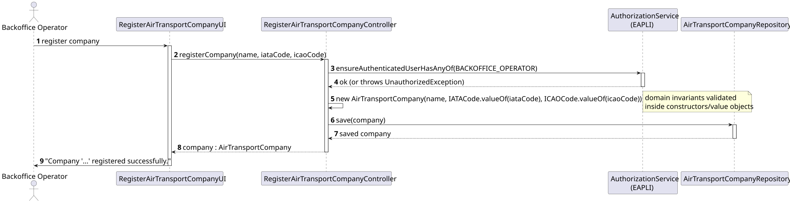
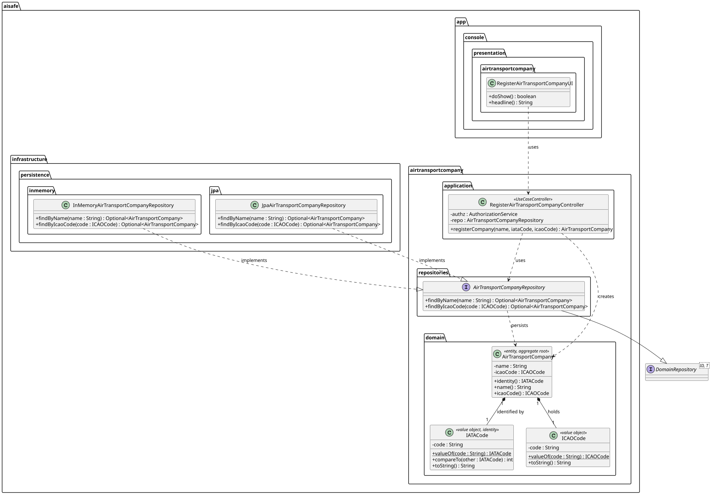

# US060 — Register Air Transport Company

## 1. Context

This US is implemented in Sprint 2 and allows the Backoffice Operator to register a new Air Transport Company in the AISafe system. It depends on US030 (Authentication and Authorization), which must be in place so that only an authenticated Backoffice Operator can invoke this feature.

The `AirTransportCompany` is an independent aggregate and acts as a foundational dependency for US070 (Register Aircraft) and US073 (Create Flight Route), which associate resources with a company.

---

## 2. Requirements

**US060** As Backoffice Operator, I want to register an Air Transport Company.

**Acceptance Criteria:**

- **AC060.1** The company name must be provided and must be unique in the system.
- **AC060.2** The IATA code must be exactly 2 uppercase alphabetic characters (e.g. `TP`).
- **AC060.3** The ICAO code must be 2 or 3 uppercase alphabetic characters (e.g. `TAP`).
- **AC060.4** The IATA code must be unique in the system (it is the aggregate identity).
- **AC060.5** The ICAO code must be unique in the system.
- **AC060.6** Only an authenticated Backoffice Operator may perform this action.
- **AC060.7** This must also be achievable by a bootstrap process.

**Dependencies/References:**

- US030 — Authentication and Authorization must be implemented first.
- Acts as a prerequisite for:
  - US070 — Register Aircraft (an aircraft belongs to a company)
  - US073 — Create Flight Route (a route is operated by a company)

---

## 3. Analysis

The `AirTransportCompany` aggregate was designed following DDD principles. Its identity is the `IATACode` (a 2-letter code that uniquely identifies an airline company internationally). The `ICAOCode` is also a required identifier and must be unique.

The main classes involved are:

| Class | Type | Responsibility |
|-------|------|----------------|
| `AirTransportCompany` | Entity / Aggregate Root | Holds company name, IATA identity, and ICAO code |
| `IATACode` | Value Object (Identity) | Validates and stores the 2-letter company IATA code |
| `ICAOCode` | Value Object | Validates and stores the 2–3-letter company ICAO code |
| `AirTransportCompanyRepository` | Repository Interface | Persistence contract for the aggregate |
| `RegisterAirTransportCompanyController` | Application Controller | Orchestrates the use case; enforces BACKOFFICE_OPERATOR role |
| `RegisterAirTransportCompanyUI` | UI | Collects name, IATA, and ICAO from the operator |

The following domain model excerpt shows the aggregate structure:

---

## 4. Design

### 4.1. Realization

1. The UI (`RegisterAirTransportCompanyUI`) prompts the operator for company name, IATA code, and ICAO code.
2. Input is validated inline before calling the controller (non-blank, correct length).
3. The controller calls `authz.ensureAuthenticatedUserHasAnyOf(BACKOFFICE_OPERATOR)`.
4. The controller instantiates `AirTransportCompany` with the validated value objects — domain invariants are enforced inside the constructors.
5. The company is persisted via `AirTransportCompanyRepository.save()`.
6. The UI confirms success: `Company '...' registered successfully.`

The following sequence diagram illustrates the flow:

The following class diagram shows the classes involved:

### 4.2. Acceptance Tests

All automated tests and manual acceptance test scripts are documented in [tests.md](tests.md).

---

## 5. Implementation

The implementation is distributed across the following packages in `aisafe.base`:

| Package | Class | Role |
|---------|-------|------|
| `aisafe.airtransportcompany.domain` | `AirTransportCompany` | Aggregate root, table `T_AIR_TRANSPORT_COMPANY` |
| `aisafe.airtransportcompany.domain` | `IATACode` | Identity value object — 2 uppercase letters |
| `aisafe.airtransportcompany.domain` | `ICAOCode` | Value object — 2–3 uppercase letters |
| `aisafe.airtransportcompany.repositories` | `AirTransportCompanyRepository` | Repository interface |
| `aisafe.airtransportcompany.application` | `RegisterAirTransportCompanyController` | Use case orchestrator |
| `aisafe.infrastructure.persistence.inmemory` | `InMemoryAirTransportCompanyRepository` | In-memory persistence |
| `aisafe.infrastructure.persistence.jpa` | `JpaAirTransportCompanyRepository` | JPA persistence |
| `aisafe.app.console.presentation.airtransportcompany` | `RegisterAirTransportCompanyUI` | Console UI |

`RepositoryFactory` must be extended with an `airTransportCompanies()` method, and both `InMemoryRepositoryFactory` and `JpaRepositoryFactory` must provide implementations.

---

## 6. Integration/Demonstration

**Prerequisites:** Run from the `aisafe.base` directory with Maven 3.9+ and Java 21.

**To register an Air Transport Company:**

1. Login with Backoffice Operator credentials.
2. Select **2 — Companies >** from the main menu.
3. Select **1 — Register Air Transport Company**.
4. Enter the company name (e.g. `TAP Air Portugal`).
5. Enter the IATA code (e.g. `TP`).
6. Enter the ICAO code (e.g. `TAP`).
7. The system confirms: `Company 'TAP Air Portugal' (TP / TAP) registered successfully.`

---

## 7. Observations

- The table is named `T_AIR_TRANSPORT_COMPANY` to follow the project naming convention and avoid reserved SQL keywords.
- `IATACode` is the aggregate identity and is persisted as a simple `@Column(unique = true)` string.
- `ICAOCode` is also marked `@Column(unique = true)` to enforce AC060.5.
- The `IATACode` and `ICAOCode` classes are also referenced by the `Airport` aggregate (with different length validations: 3 letters for airport IATA, 4 letters for airport ICAO). When the `Airport` aggregate is implemented, consider extracting shared base classes or parameterising the validation.
