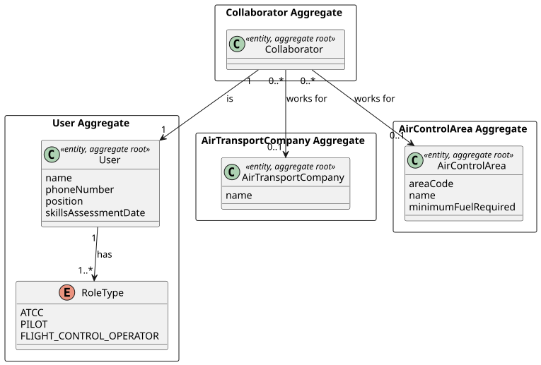
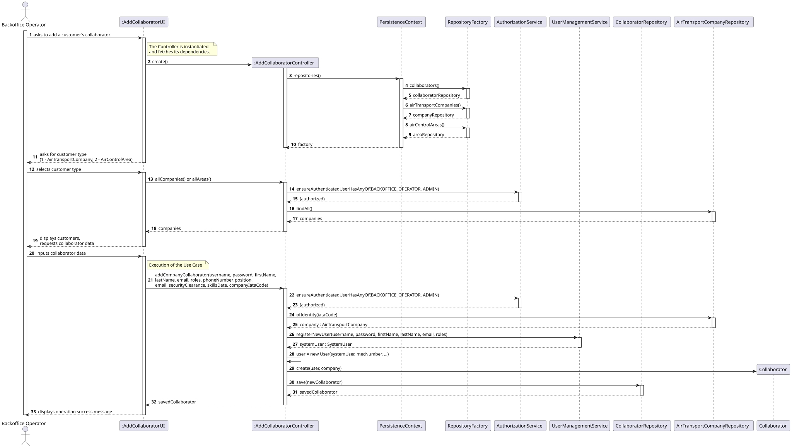
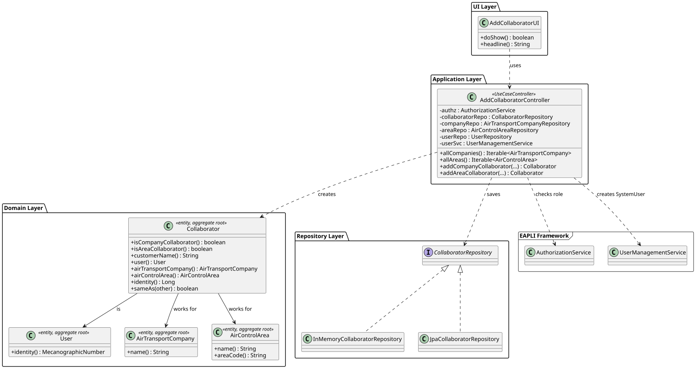

# US061

## 1. Context

This US was implemented in Sprint 2 and allows a Backoffice Operator to register a collaborator for a customer. A customer may be an Air Transport Company or an Air Control Area. The collaborator is also a system user with a specific role.

### 1.1 List of issues

Analysis: Define the domain model for `Collaborator`, including its relationship with `User`, `AirTransportCompany` and `AirControlArea`.

Design: Define the architecture for collaborator registration, including the `Collaborator` aggregate, domain model and persistence.

Implement: Implement `Collaborator` domain entity, repository, controller and UI. Integrate with the existing `User` creation flow.

Test: Unit tests for `Collaborator` (95% coverage), all above 90%.

---

## 2. Requirements

**US061** As a Backoffice Operator, I want to register a customer's collaborator.

**Acceptance Criteria:**

- **AC061.1** A collaborator must be associated with exactly one customer — either an `AirTransportCompany` or an `AirControlArea`.
- **AC061.2** The collaborator must also be a system user with a valid username, password and role.
- **AC061.3** Each collaborator must be a distinct system user — no two collaborators share the same username.
- **AC061.4** There is no need to verify that the collaborator's email belongs to the customer's domain.
- **AC061.5** This must also be achievable by a bootstrap process.

**Dependencies/References:**

- **US030** — Authentication and Authorization must be implemented first.
- **US031** — Register users. The collaborator registration reuses the user creation flow.
- **US050** — Register an Air Control Area. An `AirControlArea` must exist before an FCO collaborator can be registered.
- **US060** — Register an Air Transport Company. A company must exist before an ATCC/Pilot collaborator can be registered.

---

## 3. Analysis

A collaborator is a person who works for a customer of the AISafe system and also has access to the system as a user. Based on clarification from the client:

- A collaborator of an **AirTransportCompany** has role `ATCC` or `PILOT`.
- A collaborator of an **AirControlArea** has role `FLIGHT_CONTROL_OPERATOR`. A Flight Control Operator is responsible for managing air traffic in one Air Control Area.

The `Collaborator` aggregate was created as a separate aggregate root that references both a `User` and a customer. This approach was chosen over adding the customer reference directly to `User` because:

- A `Collaborator` has its own lifecycle — it can be listed (US062), edited (US063) and disabled (US064).
- It avoids modifying the existing `User` aggregate which is already implemented and tested.
- It cleanly separates the system user concept from the business collaborator concept.

The main classes identified are:

| Class | Type | Responsibility |
|-------|------|----------------|
| `Collaborator` | Entity / Aggregate Root | Associates a User with a customer |
| `CollaboratorRepository` | Repository Interface | Persistence contract |
| `AddCollaboratorController` | Controller | Orchestrates collaborator registration |

The following diagram shows the domain model excerpt relevant to this US:



---

## 4. Design

### 4.1. Realization

The use case follows the standard layered flow: `AddCollaboratorUI` first asks the operator to choose the customer type (company or area), displays the available customers, collects user credentials and delegates to `AddCollaboratorController`. The controller creates the `SystemUser` via EAPLI's `UserManagementService`, creates the AISafe `User`, creates the `Collaborator` and persists both.

The following sequence diagram illustrates this flow:



The following class diagram shows the classes involved:



### 4.2. Acceptance Tests


All tests are automated with JUnit 5 and located in `src/test/java/aisafe/collaborator/domain/`.

---

**AC061.1 — Collaborator must be associated with exactly one customer**

**Test:** `ensureCompanyCollaboratorCanBeCreated` — verifies that a collaborator can be associated with an AirTransportCompany.

```java
@Test
void ensureCompanyCollaboratorCanBeCreated() {
    final Collaborator collaborator = new Collaborator(validUser("user1"), validCompany());
    assertTrue(collaborator.isCompanyCollaborator());
    assertFalse(collaborator.isAreaCollaborator());
    assertEquals("TAP Air Portugal", collaborator.customerName());
}
```

**Test:** `ensureAreaCollaboratorCanBeCreated` — verifies that a collaborator can be associated with an AirControlArea.

```java
@Test
void ensureAreaCollaboratorCanBeCreated() {
    final Collaborator collaborator = new Collaborator(validUser("user2"), validArea());
    assertTrue(collaborator.isAreaCollaborator());
    assertFalse(collaborator.isCompanyCollaborator());
    assertEquals("Northern Portugal", collaborator.customerName());
}
```

**Test:** `ensureCompanyCannotBeNull` — verifies that a null company is rejected.

```java
@Test
void ensureCompanyCannotBeNull() {
    assertThrows(IllegalArgumentException.class,
            () -> new Collaborator(validUser("user3"), (AirTransportCompany) null));
}
```

**Test:** `ensureAreaCannotBeNull` — verifies that a null area is rejected.

```java
@Test
void ensureAreaCannotBeNull() {
    assertThrows(IllegalArgumentException.class,
            () -> new Collaborator(validUser("user4"), (AirControlArea) null));
}
```

---

**AC061.2 — Collaborator must be a system user**

**Test:** `ensureCompanyCollaboratorHasCorrectUser` — verifies that the collaborator references the correct user.

```java
@Test
void ensureCompanyCollaboratorHasCorrectUser() {
    final User user = validUser("user5");
    final Collaborator collaborator = new Collaborator(user, validCompany());
    assertEquals(user, collaborator.user());
}
```

**Test:** `ensureUserCannotBeNullForCompanyCollaborator`

```java
@Test
void ensureUserCannotBeNullForCompanyCollaborator() {
    assertThrows(IllegalArgumentException.class,
            () -> new Collaborator(null, validCompany()));
}
```

**Test:** `ensureUserCannotBeNullForAreaCollaborator`

```java
@Test
void ensureUserCannotBeNullForAreaCollaborator() {
    assertThrows(IllegalArgumentException.class,
            () -> new Collaborator(null, validArea()));
}
```

---

**Collaborator domain invariants**

**Test:** `ensureAirTransportCompanyGetterWorks`

```java
@Test
void ensureAirTransportCompanyGetterWorks() {
    final AirTransportCompany company = validCompany();
    final Collaborator collaborator = new Collaborator(validUser("user12"), company);
    assertEquals(company, collaborator.airTransportCompany());
    assertNull(collaborator.airControlArea());
}
```

**Test:** `ensureAirControlAreaGetterWorks`

```java
@Test
void ensureAirControlAreaGetterWorks() {
    final AirControlArea area = validArea();
    final Collaborator collaborator = new Collaborator(validUser("user13"), area);
    assertEquals(area, collaborator.airControlArea());
    assertNull(collaborator.airTransportCompany());
}
```

---

## 5. Implementation


The implementation is distributed across the following packages in `aisafe.base`:

| Package | Class | Role |
|---------|-------|------|
| `aisafe.collaborator.domain` | `Collaborator` | Aggregate root |
| `aisafe.collaborator.repositories` | `CollaboratorRepository` | Repository interface |
| `aisafe.collaborator.application` | `AddCollaboratorController` | Use case orchestrator |
| `aisafe.infrastructure.persistence.inmemory` | `InMemoryCollaboratorRepository` | In-memory persistence |
| `aisafe.infrastructure.persistence.jpa` | `JpaCollaboratorRepository` | JPA persistence |
| `aisafe.app.console.presentation.collaborator` | `AddCollaboratorUI` | Console UI |

**Design decisions:**

The `Collaborator` aggregate was created as a separate entity rather than adding a customer reference directly to `User`. This keeps the `User` aggregate focused on authentication and system access, while `Collaborator` handles the business relationship between a user and a customer.

The `Collaborator` has two constructors — one for `AirTransportCompany` and one for `AirControlArea` — which makes the association explicit and prevents accidental creation of a collaborator without a customer.

The `AddCollaboratorController` reuses the existing user creation flow from `AddUserController`, calling `UserManagementService.registerNewUser()` to create the `SystemUser` and then creating the AISafe `User` and `Collaborator`.

The test suite comprises **23 tests** for `Collaborator` (95% coverage), all passing.

---

## 6. Integration/Demonstration

The feature is accessible through the console application after logging in as a Backoffice Operator.

**To compile and run all tests:**
```bash
mvn clean test
```

**To run the application:**
```bash
# For development and quick testing (data is lost on exit)
./run-inmemory.sh

# For demonstration with persistent data (requires H2 server in a separate terminal)
./start-h2.sh      # Terminal 1 — keep running
./run-bootstrap.sh # Terminal 2 — first time only
./run-jpa.sh       # Terminal 2 — every time
```

**To register a collaborator:**

1. Login with Backoffice Operator credentials.
2. Select **8. Collaborators >** from the main menu.
3. Select **1. Add Customer's Collaborator**.
4. Choose the customer type: **1 - Air Transport Company** or **2 - Air Control Area**.
5. Select the customer from the list.
6. Fill in username, password, name, email, phone, position, security clearance and skills date.
7. The system confirms: `Collaborator successfully registered!` with customer name and username.

---

## 7. Observations

- The client confirmed that a Flight Control Operator (FCO) is a collaborator of an `AirControlArea`, not a generic flight control entity. By default, an FCO manages exactly one Air Control Area.
- The `Collaborator` aggregate uses a generated `Long` id because it has no natural business key — two collaborators could have the same user in different customers (although this is prevented at the application level).
- The `InMemoryCollaboratorRepository` uses Java reflection to set the generated `id` field, consistent with the approach adopted for other aggregates using `@GeneratedValue` in the project.
- Email domain validation is explicitly out of scope as stated in the requirements — the system does not verify that the collaborator's email belongs to the customer's domain.
