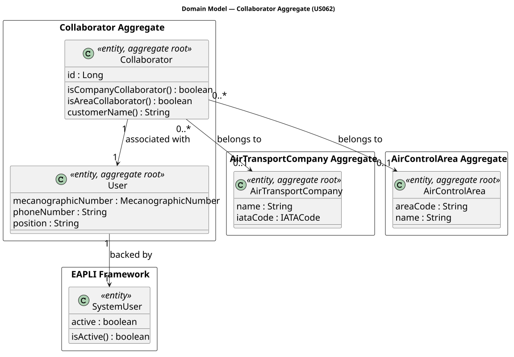
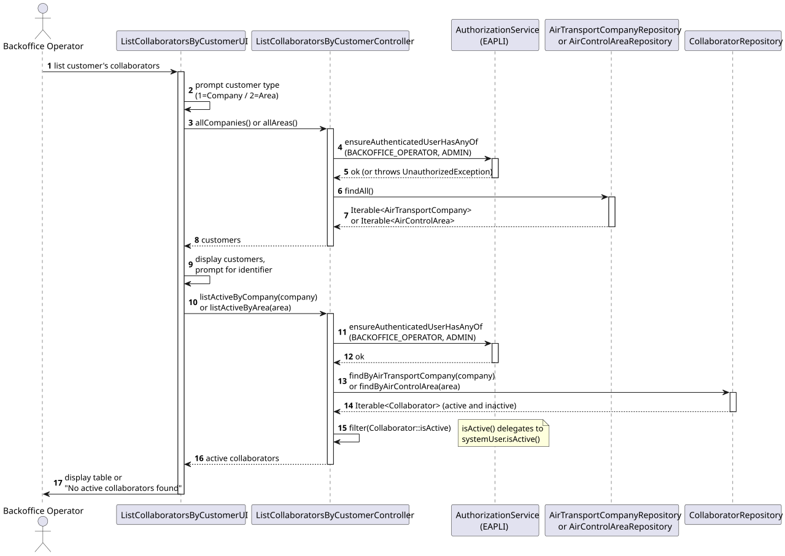
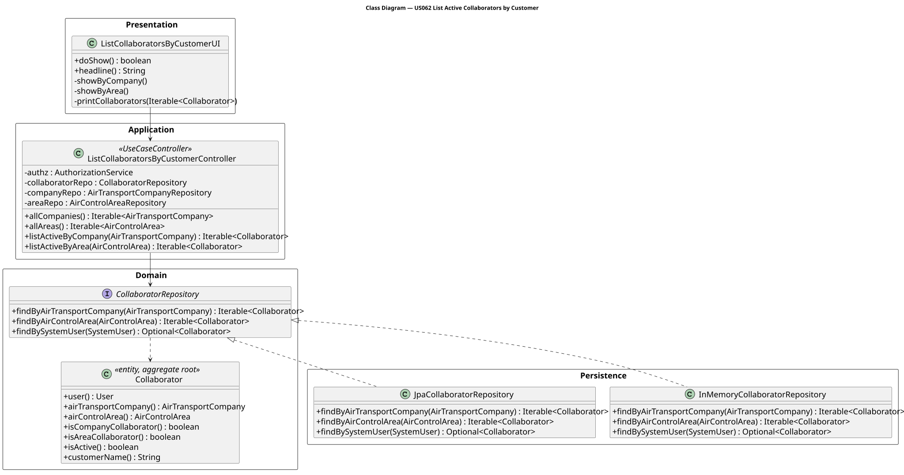

# US062 — List Active Collaborators of a Given Customer

## 1. Context

This US is implemented in Sprint 2 and allows the Backoffice Operator to list all active collaborators associated with a given customer. Disabled collaborators must not be listed.

A "customer" in AISafe is either an `AirTransportCompany` or an `AirControlArea`. A `Collaborator` links a `User` to one of these two customer types. The active/disabled state is determined by `collaborator.user().systemUser().isActive()` — there is no separate enabled flag on the `Collaborator` entity itself.

This US depends on US031 (Register Collaborator) and US030 (Authentication and Authorization).

---

## 2. Requirements

**US062** As a Backoffice Operator, I want to list all active collaborators of a given customer. Disabled collaborators must not be listed.

**Acceptance Criteria:**

- **AC062.1** The operator must first choose the customer type: Air Transport Company or Air Control Area.
- **AC062.2** The system must list available customers of the chosen type and prompt for a customer identifier.
- **AC062.3** Only collaborators whose associated system user is active must be listed.
- **AC062.4** If no active collaborators exist for the selected customer, an informative message must be displayed.
- **AC062.5** Only an authenticated Backoffice Operator or Admin may perform this action.

**Dependencies/References:**

- US030 — Authentication and Authorization must be implemented first.
- US031 — Register Collaborator must be implemented first.
- US060 — Register Air Transport Company (prerequisite for company collaborators).
- US061 — Register Air Control Area (prerequisite for area collaborators).

---

## 3. Analysis

The `Collaborator` aggregate holds a `@OneToOne` reference to a `User`, which in turn holds a `@OneToOne` reference to the EAPLI `SystemUser`. Active state is read from `SystemUser.isActive()`.

The main classes involved are:

| Class | Type | Responsibility |
|-------|------|----------------|
| `Collaborator` | Entity / Aggregate Root | Links a User to a customer (company or area) |
| `User` | Entity / Aggregate Root | AISafe user, holds reference to SystemUser |
| `AirTransportCompany` | Entity / Aggregate Root | Company customer |
| `AirControlArea` | Entity / Aggregate Root | Area customer |
| `CollaboratorRepository` | Repository Interface | Persistence contract; now includes `findActiveByAirTransportCompany` and `findActiveByAirControlArea` |
| `ListCollaboratorsByCustomerController` | Application Controller | Orchestrates the use case; enforces BACKOFFICE_OPERATOR or ADMIN role |
| `ListCollaboratorsByCustomerUI` | UI | Prompts for customer type and identifier; displays results |

The following domain model excerpt shows the aggregate structure:



---

## 4. Design

### 4.1. Realization

1. The UI (`ListCollaboratorsByCustomerUI`) prompts the operator to choose customer type (company or area).
2. The UI lists available customers of the chosen type and prompts for an identifier (IATA code or area code).
3. The controller calls `authz.ensureAuthenticatedUserHasAnyOf(BACKOFFICE_OPERATOR, ADMIN)`.
4. The controller delegates to `CollaboratorRepository.findActiveByAirTransportCompany(company)` or `findActiveByAirControlArea(area)`.
5. The repository filters by customer reference and `systemUser.isActive() == true`.
6. The UI displays a formatted table of results (Mecanographic No., Name, Position, Status).

The following sequence diagram illustrates the flow:



The following class diagram shows the classes involved:



### 4.2. Repository Implementation

**In-memory:** iterates `findAll()` and filters by customer reference and active flag.

**JPA:** uses JPQL via the EAPLI `match` helper:
```
e.airTransportCompany = :company AND e.user.systemUser.active = true
e.airControlArea = :area AND e.user.systemUser.active = true
```

---

## 5. Implementation

The implementation is distributed across the following packages in `aisafe.base`:

| Package | Class | Role |
|---------|-------|------|
| `aisafe.collaborator.repositories` | `CollaboratorRepository` | Added `findActiveByAirTransportCompany` and `findActiveByAirControlArea` |
| `aisafe.collaborator.application` | `ListCollaboratorsByCustomerController` | Use case orchestrator |
| `aisafe.infrastructure.persistence.inmemory` | `InMemoryCollaboratorRepository` | In-memory filtering implementation |
| `aisafe.infrastructure.persistence.jpa` | `JpaCollaboratorRepository` | JPQL-based filtering implementation |
| `aisafe.app.console.presentation.collaborator` | `ListCollaboratorsByCustomerUI` | Console UI |

---

## 6. Integration/Demonstration

**Prerequisites:** Run from the `aisafe.base` directory with Maven 3.9+ and Java 21.

**To list active collaborators:**

1. Login with Backoffice Operator or Admin credentials.
2. Select **8 — Collaborators >** from the main menu.
3. Select **2 — List Customer's Collaborators**.
4. Choose customer type: `1` for Air Transport Company, `2` for Air Control Area.
5. The system lists available customers.
6. Enter the customer identifier (IATA code or area code).
7. The system displays a table of active collaborators, or a message if none exist.

---

## 7. Observations

- The active flag is read from `Collaborator → User → SystemUser.isActive()`. There is no dedicated flag on `Collaborator` itself.
- The JPA path `e.user.systemUser.active` navigates through two `@OneToOne` joins. Hibernate 6 resolves this automatically via implicit joins.
- Disabled collaborators are silently excluded from results (not flagged or highlighted).
