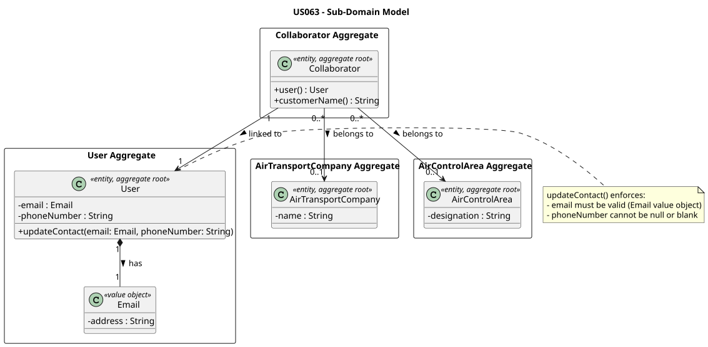
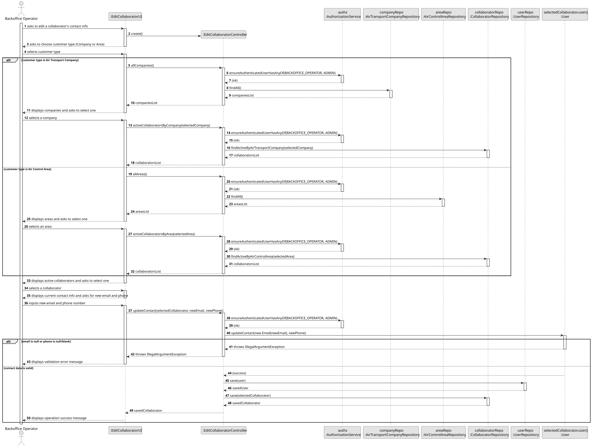
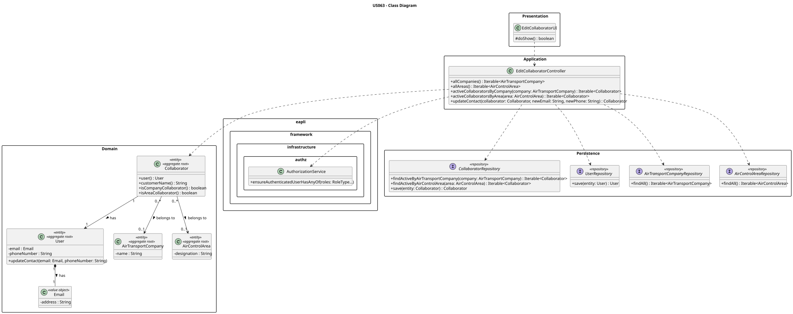

# US063 — Edit Contact Information of a Customer's Collaborator

## 1. Context

This US is implemented in Sprint 2 and allows the Backoffice Operator to update the email address and phone number of an existing collaborator. A collaborator is a `User` linked to either an `AirTransportCompany` or an `AirControlArea`.

This US depends on US030 (Authentication and Authorization), US060 (Register Air Transport Company), US050 (Register Air Control Area), and US061 (Add Collaborator). The collaborator must already exist in the system before their contact information can be edited.

---

## 2. Requirements

**US063** As a Backoffice Operator, I want to edit the contact information (email and phone number) of a collaborator of a given customer.

**Acceptance Criteria:**

- **AC063.1** The operator must first choose the customer type: Air Transport Company or Air Control Area.
- **AC063.2** The system must list available customers of the chosen type and prompt for selection.
- **AC063.3** The system must list only active collaborators for the selected customer.
- **AC063.4** The updated email must be a valid email address.
- **AC063.5** The updated phone number must not be null or blank.
- **AC063.6** Only an authenticated Backoffice Operator or Admin may perform this action.

**Dependencies/References:**

- US030 — Authentication and Authorization must be implemented first.
- US031 — Register Users must be implemented first.
- US050 — Register Air Control Area (prerequisite for area collaborators).
- US060 — Register Air Transport Company (prerequisite for company collaborators).
- US061 — Add Collaborator (collaborator must exist before being edited).
- US062 — List Collaborators (shares the same active-collaborator filtering logic).

---

## 3. Analysis

The contact information (email and phone number) belongs to the `User` aggregate, not to `Collaborator` itself. The `Collaborator` acts as a link between a `User` and a customer. Therefore, editing contact info requires updating the `User` aggregate and persisting it via `UserRepository`.

The active/disabled state of a collaborator is determined by `collaborator.user().systemUser().isActive()` — only active collaborators are listed for selection.

### Main Components

| Class | Type | Responsibility |
|-------|------|----------------|
| `Collaborator` | Entity / Aggregate Root | Links a User to a customer; exposes `user()` |
| `User` | Entity / Aggregate Root | Holds `email` and `phoneNumber`; enforces `updateContact()` invariants |
| `Email` | Value Object | Validates email format on construction |
| `AirTransportCompany` | Entity / Aggregate Root | Company customer |
| `AirControlArea` | Entity / Aggregate Root | Area customer |
| `EditCollaboratorController` | Application Controller | Orchestrates the use case; enforces authorization |
| `EditCollaboratorUI` | UI | Console interaction: customer selection, collaborator selection, contact input |

### Domain Model



---

## 4. Design

### 4.1. Realization

1. The UI prompts the operator to choose customer type (Company or Area).
2. The controller lists customers of the chosen type (requires `BACKOFFICE_OPERATOR` or `ADMIN`).
3. The operator selects a customer; the controller fetches only active collaborators for that customer.
4. The operator selects a collaborator and inputs a new email and phone number.
5. The controller calls `collaborator.user().updateContact(new Email(newEmail), newPhone)`, which validates both fields.
6. The controller saves the `User` via `UserRepository` and the `Collaborator` via `CollaboratorRepository`.
7. The UI displays a success message or the validation error if thrown.

---

## Sequence Diagram



---

## Class Diagram



---

### 4.2. Acceptance Tests

**Test 1** — `updateContact()` updates email and phone when both are valid.

```java
@Test
void ensureUpdateContactChangesEmailAndPhone() {
    final User user = validUser();
    user.updateContact(new Email("new@aisafe.com"), "912000000");
    assertEquals("new@aisafe.com", user.email().address());
    assertEquals("912000000", user.phoneNumber());
}
```

**Test 2** — `updateContact()` rejects a null email.

```java
@Test
void ensureUpdateContactRejectsNullEmail() {
    final User user = validUser();
    assertThrows(IllegalArgumentException.class,
            () -> user.updateContact(null, "912000000"));
}
```

**Test 3** — `updateContact()` rejects a null phone number.

```java
@Test
void ensureUpdateContactRejectsNullPhone() {
    final User user = validUser();
    assertThrows(IllegalArgumentException.class,
            () -> user.updateContact(new Email("new@aisafe.com"), null));
}
```

**Test 4** — `updateContact()` rejects a blank phone number.

```java
@Test
void ensureUpdateContactRejectsBlankPhone() {
    final User user = validUser();
    assertThrows(IllegalArgumentException.class,
            () -> user.updateContact(new Email("new@aisafe.com"), "   "));
}
```

All four tests are implemented in `UserTest.java`.

---

## 5. Implementation

### Key Implementation Details

- **`User.updateContact(Email email, String phoneNumber)`** — validates both fields and updates them atomically. Email validation is handled by the `Email` value object constructor (rejects invalid formats, converts to lowercase).

- **`EditCollaboratorController.updateContact()`** — saves both the `User` and the `Collaborator` aggregates after the domain update. This is necessary because `Collaborator` holds a `@OneToOne` reference to `User`, and the JPA context may not cascade the save automatically.

- **`EditCollaboratorUI`** — presents current contact information before prompting for new values, improving operator UX.

---

## 6. Integration/Demonstration

1. Login as Backoffice Operator or Admin.
2. Select **8 — Collaborators >** from the main menu.
3. Select **3 — Edit Customer's Collaborator**.
4. Choose customer type: `1` for Air Transport Company, `2` for Air Control Area.
5. Select the customer from the list.
6. Select the collaborator to edit.
7. Enter the new email and phone number.

---

## 7. Observations

- The active flag is read from `Collaborator → User → SystemUser.isActive()`. Disabled collaborators are not shown for selection.
- Email validation is enforced by the `Email` value object — passing an invalid format string to `new Email(...)` throws `IllegalArgumentException` before `updateContact()` is even called.
