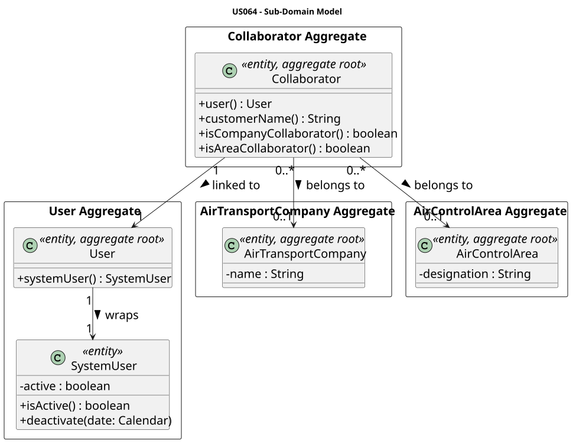
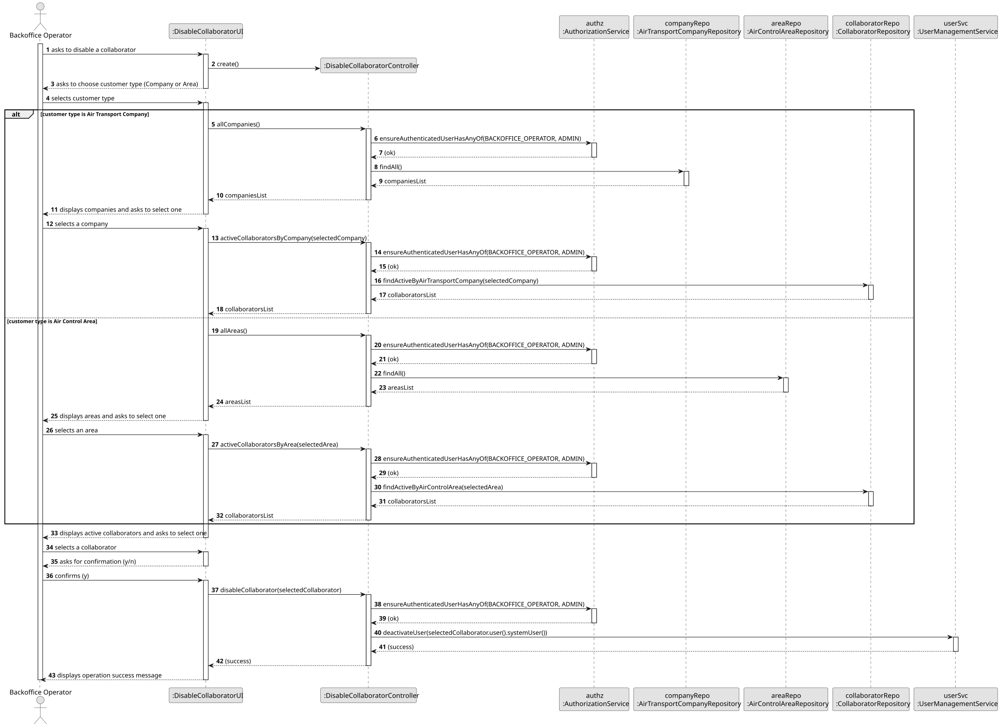
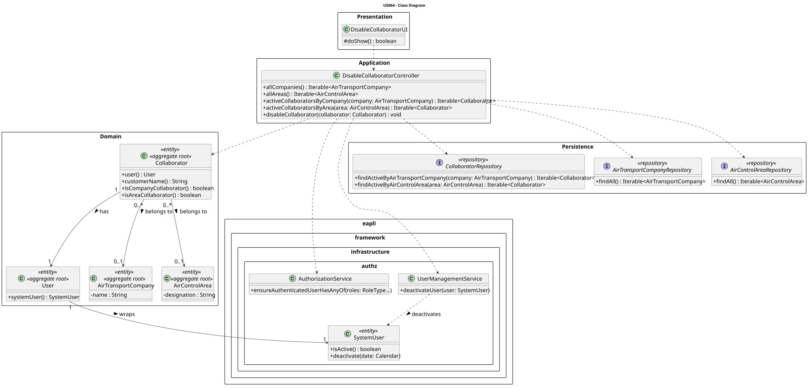

# US064 — Disable Customer's Collaborator

## 1. Context

This US is implemented in Sprint 2 and allows the Backoffice Operator to disable an existing Customer's Collaborator in the AISafe system. It depends on US030 (Authentication and Authorization) and US061 (Add Customer's Collaborator), which must be in place before a collaborator can be disabled.

A collaborator belongs to either an `AirTransportCompany` or an `AirControlArea`. Disabling a collaborator deactivates the underlying `SystemUser`, preventing further login. The collaborator record itself is not deleted — the operation is reversible.

---

## 2. Requirements

**US064** As Backoffice Operator, I want to disable a Customer's Collaborator.

**Acceptance Criteria:**

- **AC064.1** The operator must first select the customer type (Air Transport Company or Air Control Area) and then choose the specific customer.
- **AC064.2** Only active collaborators are listed for selection.
- **AC064.3** Once disabled, the collaborator's `SystemUser` is deactivated and no longer appears in active collaborator queries.
- **AC064.4** Disabling an already-inactive collaborator is not permitted.
- **AC064.5** Only an authenticated Backoffice Operator (or Admin) may perform this action.

**Dependencies/References:**

- US030 — Authentication and Authorization must be implemented first.
- US061 — Add Customer's Collaborator (a collaborator must exist to be disabled).
- US062 — List Customer's Collaborators (shares the same repository queries).

---

## 3. Analysis

The `Collaborator` aggregate holds a 1-to-1 reference to a `User`, which in turn wraps an EAPLI `SystemUser`. Disabling a collaborator delegates to the framework's `UserManagementService.deactivateUser()`, which calls `SystemUser.deactivate()`. This approach respects the existing user management infrastructure and keeps the `Collaborator` aggregate free of activation-state logic.

The `CollaboratorRepository` exposes `findActiveByAirTransportCompany()` and `findActiveByAirControlArea()` queries that filter on `systemUser.active = true`, so disabled collaborators automatically disappear from all active-collaborator listings.

The main classes involved are:

| Class | Type | Responsibility |
|-------|------|----------------|
| `Collaborator` | Entity / Aggregate Root | Holds user reference, customer association, and helper methods |
| `User` | Entity / Aggregate Root | Wraps `SystemUser`; exposes email and phone number |
| `SystemUser` | Entity (EAPLI) | Holds the active/inactive flag; `deactivate()` sets it to false |
| `CollaboratorRepository` | Repository Interface | Queries active collaborators by company or area |
| `AirTransportCompanyRepository` | Repository Interface | Fetches all companies for selection |
| `AirControlAreaRepository` | Repository Interface | Fetches all areas for selection |
| `DisableCollaboratorController` | Application Controller | Orchestrates the use case; enforces BACKOFFICE_OPERATOR role |
| `DisableCollaboratorUI` | UI | Guides the operator through customer-type → customer → collaborator selection |

The following domain model excerpt shows the aggregate structure:



---

## 4. Design

### 4.1. Realization

1. The UI (`DisableCollaboratorUI`) prompts the operator to choose a customer type (1 — Air Transport Company, 2 — Air Control Area).
2. Based on the selection, the controller calls `allCompanies()` or `allAreas()` (both enforce the BACKOFFICE_OPERATOR role).
3. The operator selects a specific company or area by its code.
4. The controller calls `activeCollaboratorsByCompany()` or `activeCollaboratorsByArea()` to retrieve only active collaborators.
5. The operator selects a collaborator by number and confirms the action.
6. The controller calls `disableCollaborator(collaborator)`, which delegates to `UserManagementService.deactivateUser(collaborator.user().systemUser())`.
7. The UI confirms: `Collaborator successfully disabled!`

The following sequence diagram illustrates the flow:



The following class diagram shows the classes involved:



---

### 4.2. Acceptance Tests

All tests are automated with JUnit 5 and located in `src/test/java/aisafe/collaborator/application/DisableCollaboratorTest.java`.

---

**AC064.1 — Collaborator creation and type identification**

**Test:** `ensureCompanyCollaboratorCanBeCreated`

```java
@Test
void ensureCompanyCollaboratorCanBeCreated() {
    final Collaborator c = new Collaborator(validUser("u1"), validCompany());
    assertTrue(c.isCompanyCollaborator());
    assertFalse(c.isAreaCollaborator());
}
```

**Test:** `ensureAreaCollaboratorCanBeCreated`

```java
@Test
void ensureAreaCollaboratorCanBeCreated() {
    final Collaborator c = new Collaborator(validUser("u2"), validArea());
    assertTrue(c.isAreaCollaborator());
    assertFalse(c.isCompanyCollaborator());
}
```

---

**AC064.2 — Only active collaborators are listed**

**Test:** `ensureCollaboratorUserIsActive`

```java
@Test
void ensureCollaboratorUserIsActive() {
    final Collaborator c = new Collaborator(validUser("u3"), validCompany());
    assertTrue(c.user().systemUser().isActive());
}
```

---

**AC064.3 — Disabling deactivates the underlying SystemUser**

**Test:** `ensureSystemUserCanBeDeactivated`

```java
@Test
void ensureSystemUserCanBeDeactivated() {
    final SystemUser su = buildSystemUser("u4");
    assertTrue(su.isActive());
    su.deactivate(Calendar.getInstance());
    assertFalse(su.isActive());
}
```

**Test:** `ensureDeactivatedCollaboratorUserIsInactive`

```java
@Test
void ensureDeactivatedCollaboratorUserIsInactive() {
    final Collaborator c = new Collaborator(validUser("u5"), validCompany());
    c.user().systemUser().deactivate(Calendar.getInstance());
    assertFalse(c.user().systemUser().isActive());
}
```

**Test:** `ensureCollaboratorUserIsNotNullAfterCreation`

```java
@Test
void ensureCollaboratorUserIsNotNullAfterCreation() {
    final Collaborator c = new Collaborator(validUser("u6"), validArea());
    assertNotNull(c.user());
    assertNotNull(c.user().systemUser());
}
```

---

**AC064.4 — Disabling an already-inactive collaborator throws**

**Test:** `ensureDeactivatingAlreadyInactiveUserThrows`

```java
@Test
void ensureDeactivatingAlreadyInactiveUserThrows() {
    final Collaborator c = new Collaborator(validUser("u7"), validCompany());
    c.user().systemUser().deactivate(Calendar.getInstance());
    assertThrows(IllegalStateException.class,
            () -> c.user().systemUser().deactivate(Calendar.getInstance()));
}
```

---

**AC064.1 — Null user is rejected**

**Test:** `ensureNullUserThrowsForCompanyCollaborator`

```java
@Test
void ensureNullUserThrowsForCompanyCollaborator() {
    assertThrows(IllegalArgumentException.class,
            () -> new Collaborator(null, validCompany()));
}
```

**Test:** `ensureNullUserThrowsForAreaCollaborator`

```java
@Test
void ensureNullUserThrowsForAreaCollaborator() {
    assertThrows(IllegalArgumentException.class,
            () -> new Collaborator(null, validArea()));
}
```

---

**Customer name resolution**

**Test:** `ensureCompanyCollaboratorCustomerName`

```java
@Test
void ensureCompanyCollaboratorCustomerName() {
    final Collaborator c = new Collaborator(validUser("u8"), validCompany());
    assertEquals("TAP Air Portugal", c.customerName());
}
```

**Test:** `ensureAreaCollaboratorCustomerName`

```java
@Test
void ensureAreaCollaboratorCustomerName() {
    final Collaborator c = new Collaborator(validUser("u9"), validArea());
    assertEquals("Northern Portugal", c.customerName());
}
```

---

## 5. Implementation

The implementation is distributed across the following packages in `aisafe.base`:

| Package | Class | Role |
|---------|-------|------|
| `aisafe.collaborator.domain` | `Collaborator` | Aggregate root; holds user reference and customer association |
| `aisafe.collaborator.repositories` | `CollaboratorRepository` | Repository interface with active-collaborator queries |
| `aisafe.collaborator.application` | `DisableCollaboratorController` | Use case orchestrator |
| `aisafe.infrastructure.persistence.inmemory` | `InMemoryCollaboratorRepository` | In-memory persistence |
| `aisafe.infrastructure.persistence.jpa` | `JpaCollaboratorRepository` | JPA persistence; queries filter on `e.user.systemUser.active = true` |
| `aisafe.app.console.presentation.collaborator` | `DisableCollaboratorUI` | Console UI; accessible from the main menu (item 4) |

The `disableCollaborator()` method delegates entirely to the EAPLI `UserManagementService.deactivateUser()`. The `Collaborator` aggregate itself holds no activation state — the active/inactive flag lives in `SystemUser`.

---

## 6. Integration / Demonstration

**Prerequisites:** Run from the `aisafe.base` directory with Maven 3.9+ and Java 21.

**To disable a Customer's Collaborator:**

1. Login with Backoffice Operator credentials.
2. Select **4 — Disable Customer's Collaborator** from the main menu.
3. Choose customer type: `1` for Air Transport Company, `2` for Air Control Area.
4. Select the company or area by its code.
5. Choose the collaborator to disable from the active collaborators list.
6. Confirm with `y`.
7. The system confirms: `Collaborator successfully disabled!`

---

## 7. Observations

- The deactivation is **not permanent** — `SystemUser` can be re-activated. However, no re-enable flow exists for collaborators in this sprint; that would require a separate US.
- The `CollaboratorRepository` JPA queries filter on `e.user.systemUser.active = true`, so disabled collaborators are automatically excluded from all future `findActive*` calls without any change to the domain model.
- The `Collaborator` aggregate holds `@ManyToOne` references to both `AirTransportCompany` and `AirControlArea`. Exactly one of these is non-null depending on the collaborator type; the other is always null. The `isCompanyCollaborator()` and `isAreaCollaborator()` helpers reflect this invariant.
