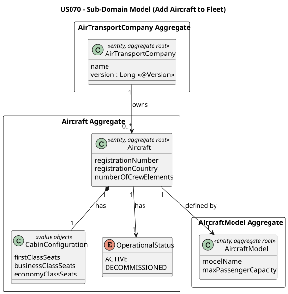
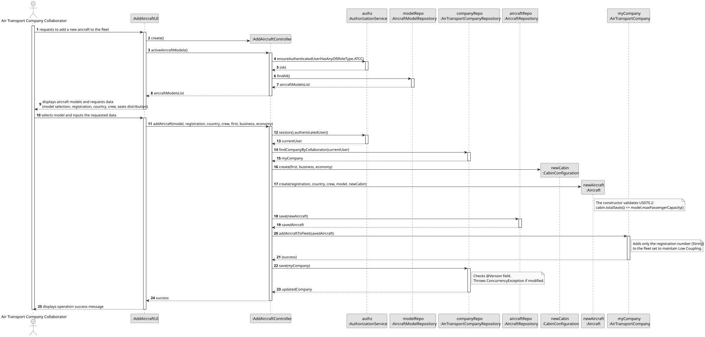
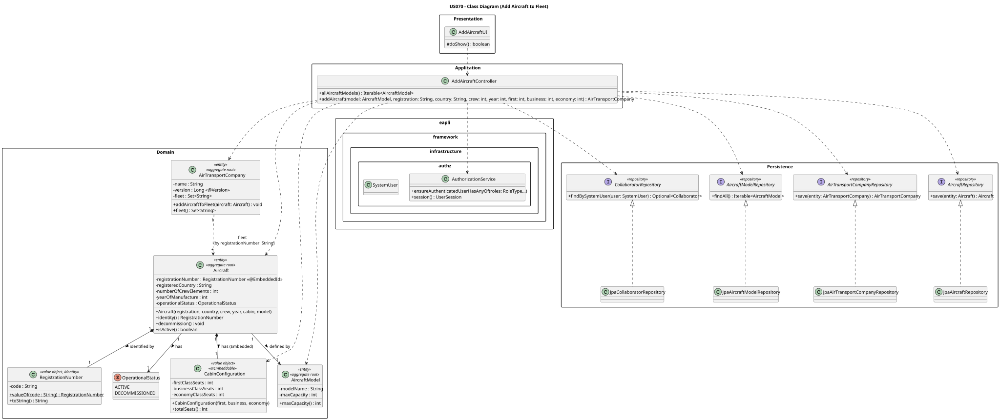

# US070 — Add Aircraft to Air Transport Company

## 1. Context

This US is implemented in Sprint 2 and allows an Air Transport Company Collaborator (ATCC) to add a new physical aircraft to their company's fleet in the AISafe system. It depends on US030 (Authentication and Authorization), which must be in place so that only an authenticated ATCC can invoke this feature.

The `Aircraft` is an independent aggregate, but its creation is tightly coupled to the prior existence of an `AirTransportCompany` (US060) and `AircraftModel` (US055). This use case acts as a foundational dependency for US080 (Create a flight plan), which requires an active aircraft to be assigned to a flight.

---

## 2. Requirements

**US070** As an Air Transport Company Collaborator, I want to add an aircraft to my company's fleet.

**Acceptance Criteria:**

- **AC070.1** The aircraft is of a given model, and the number of seats of each type/class must be provided.
- **AC070.2** The total number of seats configured in the cabin must not exceed the associated model's maximum capacity.
- **AC070.3** An aircraft is identified by its registration number, which must be globally unique.
- **AC070.4** The aircraft must be registered to a country.
- **AC070.5** The aircraft has an operational status (e.g., ACTIVE).
- **AC070.6** Only an authenticated Air Transport Company Collaborator (ATCC) may perform this action.

**Dependencies/References:**

- US030 — Authentication and Authorization must be implemented first.
- US055 — Create an Aircraft Model (provides the catalog of available models and their max capacities).
- US057 — Add an Engine Model to an Aircraft Model (the selected model must have at least one certified engine).
- US060 — Register an Air Transport Company (provides the fleet where the aircraft will be added).
- Acts as a prerequisite for:
  - US071 — Decommission an Aircraft
  - US080 — Create a Flight Plan (a flight plan uses an aircraft from the fleet)

---

## 3. Analysis

The `Aircraft` aggregate was designed following DDD principles. Its identity is the aircraft `registration` number, which must be unique. To ensure low coupling between domains, the `Aircraft` references the `AircraftModel` strictly by its ID, and the `AirTransportCompany` references its owned aircraft by their registration IDs. The seat distribution logic is encapsulated within a `CabinConfiguration` Value Object.

The main classes involved are:

| Class | Type | Responsibility |
|-------|------|----------------|
| `Aircraft` | Entity / Aggregate Root | Holds registration (identity), registered country, crew count, year of manufacture, operational status, and reference to the model |
| `RegistrationNumber` | Value Object (Identity) | Validates, normalises (uppercase), and stores the registration number; used as `@EmbeddedId` |
| `CabinConfiguration` | Value Object | Validates and stores the number of seats (first, business, economy) and calculates total capacity; null for CARGO aircraft |
| `AircraftRepository` | Repository Interface | Persistence contract for the Aircraft aggregate |
| `AirTransportCompanyRepository` | Repository Interface | Used to fetch the ATCC's company and update its fleet |
| `AircraftModelRepository` | Repository Interface | Used to fetch available aircraft models for user selection |
| `AddAircraftController` | Application Controller | Orchestrates the use case, validates capacity rules, enforces ATCC role |
| `AddAircraftUI` | UI | Collects registration, country, crew count, year, and cabin seat distribution from the operator |

The following domain model excerpt shows the aggregate structure:



---

## 4. Design

### 4.1. Realization

1. The UI (`AddAircraftUI`) prompts the ATCC for the aircraft's registration number, country, number of crew elements, year of manufacture, model selection, and seat configuration (first, business, economy).
2. Input is validated inline before calling the controller (non-blank strings, crew ≥ 1, year between 1900 and current year, total seats > 0).
3. The controller calls `authz.ensureAuthenticatedUserHasAnyOf(ATCC)`.
4. The controller identifies the authenticated user's `AirTransportCompany` via `CollaboratorRepository` and `AirTransportCompanyRepository`.
5. The controller instantiates `CabinConfiguration` (for PASSENGER/MIXED models) and validates that its total seats do not exceed the `AircraftModel`'s maximum capacity. CARGO models do not require a cabin configuration.
6. The controller instantiates `Aircraft` with the validated data — domain invariants are enforced inside the constructor.
7. The aircraft is persisted via `AircraftRepository.save()`.
8. The company's fleet is updated via `company.addAircraftToFleet()` and persisted via `AirTransportCompanyRepository.save()` (triggering Optimistic Locking via `@Version`).
9. The UI confirms success: `Aircraft '...' successfully added to the fleet.`

The following sequence diagram illustrates the flow:



The following class diagram shows the classes involved:



---

### 4.2. Acceptance Tests

All automated tests and manual acceptance test scripts are documented in [tests.md](tests.md).

---

## 5. Implementation

The implementation is distributed across the following packages in `aisafe.base`:

| Package | Class | Role |
|---------|-------|------|
| `aisafe.aircraft.domain` | `Aircraft` | Aggregate root, table `T_AIRCRAFT` |
| `aisafe.aircraft.domain` | `RegistrationNumber` | Identity value object (`@Embeddable`, `@EmbeddedId`) — normalises and validates the registration number |
| `aisafe.aircraft.domain` | `CabinConfiguration` | Value object (`@Embeddable`) — seat distribution and total capacity; absent for CARGO aircraft |
| `aisafe.aircraft.repositories` | `AircraftRepository` | Repository interface |
| `aisafe.aircraft.application` | `AddAircraftController` | Use case orchestrator |
| `aisafe.infrastructure.persistence.inmemory` | `InMemoryAircraftRepository` | In-memory persistence |
| `aisafe.infrastructure.persistence.jpa` | `JpaAircraftRepository` | JPA persistence |
| `aisafe.app.console.presentation.aircraft` | `AddAircraftUI` | Console UI |

`RepositoryFactory` must expose an `aircrafts()` method, and both `InMemoryRepositoryFactory` and `JpaRepositoryFactory` must provide implementations. Bootstrap support is implemented in `AiSafeBootstrap`, which seeds a default valid Air Transport Company and an active Aircraft in its fleet if they do not already exist.

---

## 6. Integration/Demonstration

**Prerequisites:** Run from the `aisafe.base` directory with Maven 3.9+ and Java 21. The bootstrap must have been executed first to seed models and companies.

**To add an Aircraft to a company's fleet:**

1. Login with Air Transport Company Collaborator (ATCC) credentials (e.g., username: `atcc1`, password: `Password1`).
2. Select **Fleet Management > Add Aircraft to Fleet** from the main menu.
3. Select an existing Aircraft Model from the presented list by number (e.g., `1` for `737-800 — Boeing`).
4. Enter the registration number (e.g., `CS-TUG`).
5. Enter the registered country (e.g., `Portugal`).
6. Enter the number of crew elements (e.g., `20`).
7. Enter the number of seats for each class: first class, business class, and economy class (e.g., `20`, `20`, `60`).
8. Enter the year of manufacture (e.g., `2020`).
9. The system confirms with a summary, e.g.:
   ```
   Aircraft 'CS-TUG' successfully added to fleet of TAP Air Portugal!
     Model      : 737-800 (Boeing)
     Country    : Portugal
     Crew       : 20
     Cabin      : First=20  Business=20  Economy=60  (Total=100)
   ```

**Validation scenarios:**

- Entering a total seat count that exceeds the model's maximum capacity produces: `The cabin configuration exceeds the aircraft model's maximum capacity.`
- Attempting to register an aircraft with a registration number that already exists produces: `An aircraft with that registration number already exists.`

---

## 7. Observations

- `RegistrationNumber` is implemented as a dedicated `@Embeddable` Value Object used as `@EmbeddedId` on `Aircraft`. It normalises the input to uppercase, ensuring consistent identity comparison.
- `CabinConfiguration` acts as an autonomous validator. By delegating seat counting and validation to this Value Object, the `Aircraft` aggregate root remains clean and highly cohesive. For CARGO aircraft, `CabinConfiguration` is `null` by design — the constructor enforces this distinction based on the `AircraftModel`'s type.
- The capacity rule (AC070.2) is enforced during `Aircraft` instantiation: if `maxCapacity > 0`, the constructor checks that `cabin.totalSeats() <= model.maxCapacity()`.
- `numberOfCrewElements` must be ≥ 1, and `yearOfManufacture` must be between 1900 and the current year — both validated in the `Aircraft` constructor.
- `AirTransportCompany` uses `@ElementCollection` to store Aircraft registration strings rather than direct entity references, preserving aggregate boundary isolation and Low Coupling.
- The `@Version` annotation on `AirTransportCompany` triggers Optimistic Locking when two ATCCs add an aircraft to the same company simultaneously; the second operation receives a user-friendly concurrency error.
- The `Aircraft` aggregate is independently persisted — the link to the company's fleet is stored on the `AirTransportCompany` side via `addAircraftToFleet()`, not inside `Aircraft` itself.
