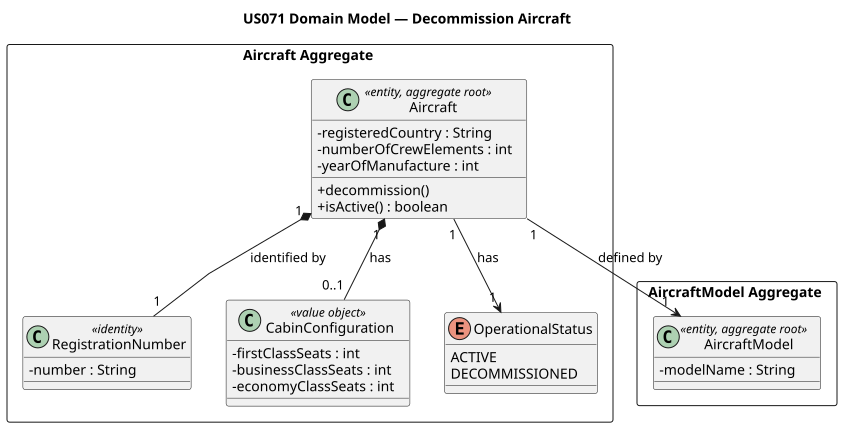
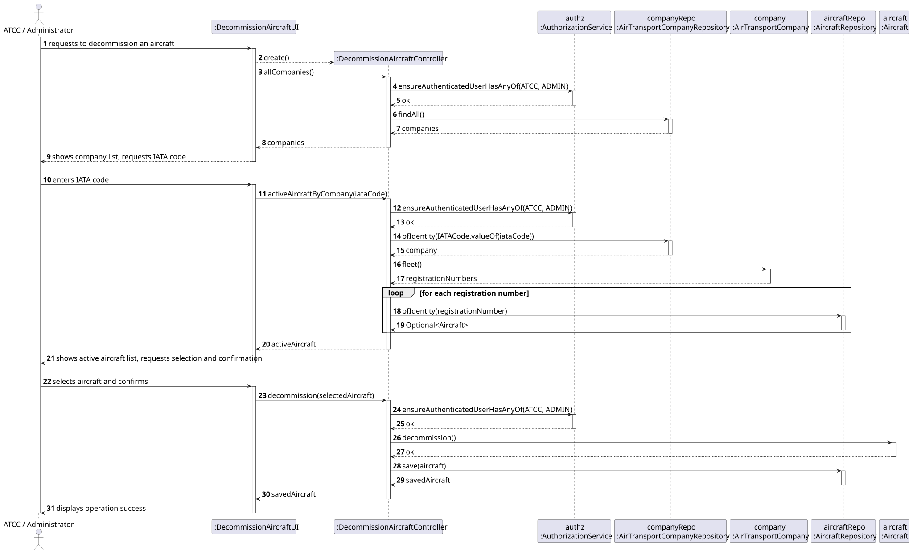
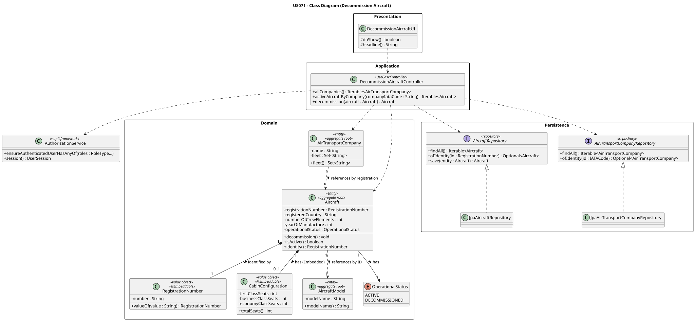

# US071 — Decommission an Aircraft

## 1. Context

This US is implemented in Sprint 2 and allows an Air Transport Company Collaborator (ATCC) or Administrator to permanently retire an aircraft from service in the AISafe system. It depends on US030 (Authentication and Authorization) and US070 (Add Aircraft), which must be in place so that an aircraft exists and only authenticated users with the correct role can invoke this feature.

The `Aircraft` aggregate is updated in-place: its `OperationalStatus` transitions from `ACTIVE` to `DECOMMISSIONED`. Decommissioned aircraft are excluded from any subsequent fleet operations, and flight planning (US080) must only consider active aircraft.

---

## 2. Requirements

**US071** As an Air Transport Company Collaborator, I want to decommission an aircraft from my company's fleet.

**Acceptance Criteria:**

- **AC071.1** Only aircraft with `ACTIVE` status may be decommissioned. Attempting to decommission an already-decommissioned aircraft must raise an error.
- **AC071.2** The system must ask for explicit confirmation before performing the decommission operation.
- **AC071.3** After decommissioning, the aircraft's operational status must be permanently changed to `DECOMMISSIONED` and persisted.
- **AC071.4** Only an authenticated Air Transport Company Collaborator (ATCC) or Administrator may perform this action.
- **AC071.5** The UI must list only active aircraft for selection; decommissioned aircraft must not appear.

**Dependencies/References:**

- US030 — Authentication and Authorization must be implemented first.
- US070 — Add Aircraft (an aircraft must exist in the fleet before it can be decommissioned).
- Affects:
    - US080 — Create a Flight Plan (only active aircraft may be assigned to a flight plan).

---

## 3. Analysis

The `Aircraft` aggregate manages its own lifecycle. The decommission operation is a domain method on the aggregate root itself (`decommission()`), enforcing the invariant that an aircraft cannot be decommissioned twice. The state transition is persisted through the repository after the domain method succeeds.

The main classes involved are:

| Class                            | Type                    | Responsibility                                                                         |
|----------------------------------|-------------------------|----------------------------------------------------------------------------------------|
| `Aircraft`                       | Entity / Aggregate Root | Holds operational status; exposes `decommission()` and `isActive()` domain methods     |
| `OperationalStatus`              | Enum                    | Defines the two states: `ACTIVE` and `DECOMMISSIONED`                                 |
| `AircraftRepository`             | Repository Interface    | Persistence contract; used to fetch all aircraft and to save the updated aggregate     |
| `AirTransportCompanyRepository`  | Repository Interface    | Used to fetch and list all registered companies for selection in the UI                |
| `DecommissionAircraftController` | Application Controller  | Orchestrates the use case; enforces ATCC/Admin role; filters active aircraft; persists |
| `DecommissionAircraftUI`         | UI                      | Lists companies and active aircraft; collects selection; prompts for confirmation       |

The following domain model excerpt shows the aggregate structure:



---

## 4. Design

### 4.1. Realization

1. The UI (`DecommissionAircraftUI`) calls `controller.allCompanies()` and displays all registered companies with their IATA codes.
2. The operator enters the company's IATA code.
3. The UI calls `controller.activeAircraftByCompany(iataCode)` and displays the list of active aircraft (registration, model, country). Note: the current implementation returns all active aircraft regardless of company; the `companyIataCode` parameter is reserved for future ownership filtering.
4. The operator selects an aircraft by number.
5. The UI prompts: `"Are you sure you want to decommission <registration>? (yes/no)"`.
6. If confirmed with `"yes"`, the UI calls `controller.decommission(aircraft)`.
7. The controller calls `authz.ensureAuthenticatedUserHasAnyOf(ATCC, ADMIN)`.
8. The controller calls `aircraft.decommission()` — the domain method checks the current status and throws `IllegalStateException` if already decommissioned, otherwise sets `operationalStatus = DECOMMISSIONED`.
9. The controller persists the updated aircraft via `aircraftRepo.save(aircraft)`.
10. The UI prints the success message with the registration number and new status.

The following sequence diagram illustrates the flow:



The following class diagram shows the classes involved:



---

### 4.2. Acceptance Tests

The four acceptance tests for US071 are implemented in `AircraftTest`:

| Test Method                                       | AC Covered | What It Verifies                                                          |
|---------------------------------------------------|------------|---------------------------------------------------------------------------|
| `ensureDecommissionChangesStatus()`               | AC071.3    | Status changes from `ACTIVE` to `DECOMMISSIONED` after `decommission()`  |
| `ensureCannotDecommissionAlreadyDecommissioned()` | AC071.1    | `IllegalStateException` is thrown on a second `decommission()` call      |
| `ensureIsActiveReturnsTrueForActiveAircraft()`    | AC071.5    | `isActive()` returns `true` for a freshly created aircraft               |
| `ensureIsActiveReturnsFalseAfterDecommission()`   | AC071.5    | `isActive()` returns `false` after `decommission()` is called            |

---

## 5. Implementation

### Key Implementation Details

- `Aircraft.decommission()` — Domain method that guards against double-decommission with an `IllegalStateException` and sets `operationalStatus = DECOMMISSIONED`.
- `Aircraft.isActive()` — Helper that returns `true` only when `operationalStatus == ACTIVE`; used by the controller to filter the aircraft list shown in the UI.
- `operationalStatus` → Persisted as a `String` column via `@Enumerated(EnumType.STRING)`, making the stored value human-readable in the database.
- `DecommissionAircraftController.activeAircraftByCompany()` — Iterates all aircraft from the repository and filters by `isActive()`. The `companyIataCode` parameter scopes future filtering when company-to-aircraft ownership is fully tracked.
- No structural changes are made to related aggregates (e.g., `AirTransportCompany`) upon decommissioning; the aircraft's own status is the single source of truth for eligibility.
- Repository implementations used:
    - `InMemoryAircraftRepository` (tests and development)
    - `JpaAircraftRepository` (production, persists to `T_AIRCRAFT` table)

---

## 6. Integration / Demonstration

### Run Instructions

```bash
# Terminal 1 — keep running
./start-h2.sh

# Terminal 2 — seed data once (first time only)
./run-bootstrap.sh

# Terminal 2 — run the application
./run-jpa.sh

# Login with:
# Username: atcc (or a specific Air Transport Company Collaborator account)
# Password: Password1

# Navigate to:
# Fleet Management -> Decommission Aircraft
```

Expected session flow:

```
--- Available Companies ---
  [TAP] TAP Air Portugal
  [RYR] Ryanair

Company IATA Code: TAP

--- Active Aircraft ---
  [1] CS-TUG | Model: A320neo | Country: Portugal
  [2] CS-TUH | Model: A320neo | Country: Portugal

Select aircraft to decommission (number): 1
Are you sure you want to decommission CS-TUG? (yes/no): yes

 Aircraft successfully decommissioned!
  Registration : CS-TUG
  Status       : DECOMMISSIONED
```

---

## 7. Observations

The decommission operation is modelled as a **domain method within the aggregate** rather than a service-level status update. This keeps the invariant (`ACTIVE → DECOMMISSIONED` is a one-way, permanent transition) co-located with the entity that owns it, preventing accidental re-activation from outside the domain.

The UI enforces an explicit confirmation step (`yes/no`) to protect against accidental decommissioning, which satisfies **AC071.2** at the presentation layer independently of the domain guard in **AC071.1**.
