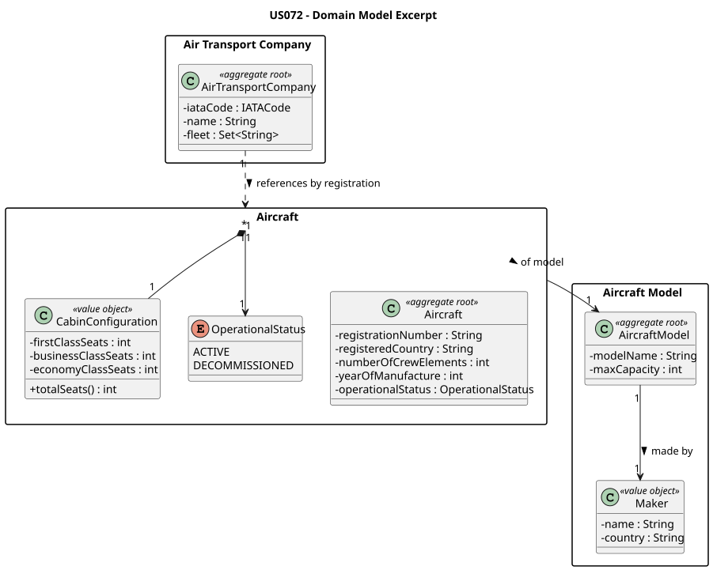
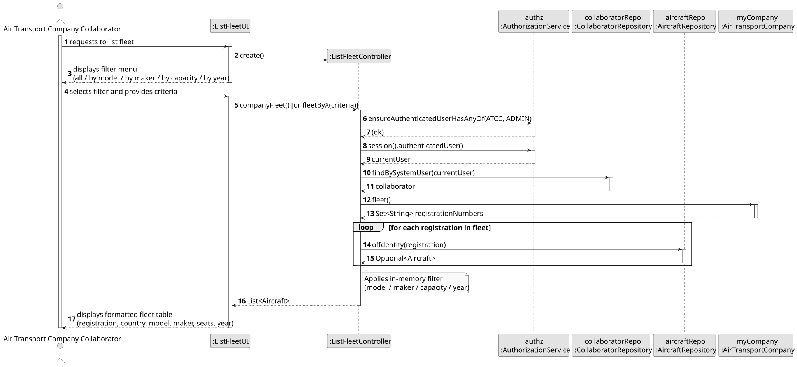
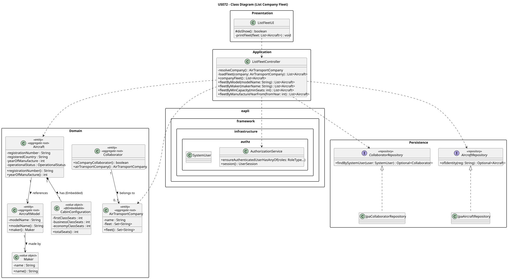

# US072 — List the Fleet of an Air Transport Company

## 1. Context

This US is implemented in Sprint 2 and allows an Air Transport Company Collaborator (ATCC) to consult the list of aircraft belonging to their company's fleet. The listing supports four optional filters: by aircraft model (US072a), by maker (US072b), by minimum passenger capacity (US072c), and by year of manufacture (US072d).

It depends on US070 (Add Aircraft to Fleet) which must have registered at least one aircraft, and on US030 (Authentication and Authorization) so that only an authenticated ATCC can invoke this feature.

---

## 2. Requirements

**US072** As an Air Transport Company Collaborator, I want to list my company's fleet.

**Acceptance Criteria:**

- **AC072.1** The system displays all aircraft registered to the authenticated ATCC's company.
- **AC072.2 (US072a)** The ATCC may filter the list by aircraft model name.
- **AC072.3 (US072b)** The ATCC may filter the list by aircraft maker name.
- **AC072.4 (US072c)** The ATCC may filter the list to show only aircraft with a total seat count greater than or equal to a given minimum.
- **AC072.5 (US072d)** The ATCC may filter the list to show only aircraft manufactured from a given year onwards.
- **AC072.6** Only an authenticated Air Transport Company Collaborator (ATCC) may perform this action.

**Dependencies/References:**

- US030 — Authentication and Authorization must be implemented first.
- US070 — Add Aircraft to Fleet (provides the data that is listed here).

---

## 3. Analysis

The `AirTransportCompany` aggregate stores its fleet as a `Set<String>` of registration numbers (low coupling). To list the fleet, the controller resolves the authenticated user's company, iterates over the registration numbers, fetches each `Aircraft` aggregate from the `AircraftRepository`, and applies the selected filter in memory.

The main classes involved are:

| Class                           | Type                   | Responsibility                                                                         |
|---------------------------------|------------------------|----------------------------------------------------------------------------------------|
| `Aircraft`                      | Entity / Aggregate Root | Holds registration, country, model, cabin, status, and year of manufacture             |
| `CabinConfiguration`            | Value Object           | Exposes `totalSeats()` used for capacity filtering                                     |
| `AircraftModel`                 | Entity / Aggregate Root | Provides `modelName()` and `maker()` used for model/maker filtering                   |
| `AirTransportCompany`           | Entity / Aggregate Root | Holds the fleet set (registration strings)                                             |
| `AircraftRepository`            | Repository Interface   | Used to fetch each `Aircraft` by registration number                                   |
| `CollaboratorRepository`        | Repository Interface   | Used to resolve the authenticated user's `AirTransportCompany`                        |
| `ListFleetController`           | Application Controller | Orchestrates fleet loading, enforces ATCC role, applies in-memory filters              |
| `ListFleetUI`                   | UI                     | Presents filter menu and formats the result table                                      |

The following domain model excerpt shows the aggregate structure:


> Source: [puml/US072-domain-model.puml](puml/US072-domain-model.puml)

---

## 4. Design

### 4.1. Realization

1. The UI (`ListFleetUI`) presents the authenticated ATCC with a filter menu: all, by model, by maker, by minimum seats, or by manufacture year.
2. The controller calls `authz.ensureAuthenticatedUserHasAnyOf(ATCC, ADMIN)`.
3. The controller resolves the authenticated user's `AirTransportCompany` via `CollaboratorRepository.findBySystemUser()`.
4. The controller iterates over `company.fleet()` (a `Set<String>` of registration numbers) and fetches each `Aircraft` from `AircraftRepository.ofIdentity()`.
5. The applicable filter is applied in memory over the loaded `Aircraft` list.
6. The UI renders a formatted table with registration, country, model, maker, total seats, and year of manufacture.
7. The total count is displayed at the bottom of the listing.

The following sequence diagram illustrates the flow:


> Source: [puml/US072-SD.puml](puml/US072-SD.puml)

The following class diagram shows the classes involved:


> Source: [puml/US072-class-diagram.puml](puml/US072-class-diagram.puml)

---

### 4.2. Acceptance Tests

| Test ID     | Description                                              | Expected Result                           |
|-------------|----------------------------------------------------------|-------------------------------------------|
| AC072.1     | List all fleet with two registered aircraft              | Both aircraft appear in the table         |
| AC072.2     | Filter by model name "737-800"                           | Only 737-800 aircraft returned            |
| AC072.3     | Filter by maker "Boeing"                                 | Only Boeing aircraft returned             |
| AC072.4     | Filter by minimum seats = 170; fleet has one with 178    | Only the 178-seat aircraft returned       |
| AC072.5     | Filter by manufacture year from 2019; only 2017 exists  | Empty result                              |
| AC072.6     | Non-ATCC user attempts to list fleet                     | `IllegalStateException` thrown            |

---

## 5. Implementation

### Key Implementation Details

- `ListFleetController.resolveCompany()` — resolves the authenticated user to their `AirTransportCompany` using `CollaboratorRepository.findBySystemUser()`. Throws `IllegalStateException` if the user is not a company collaborator.
- `ListFleetController.loadFleet(company)` — iterates over `company.fleet()` (Set of registration strings) and fetches each `Aircraft` via `aircraftRepo.ofIdentity(reg)`.
- All filter methods (`fleetByModel`, `fleetByMaker`, `fleetByMinCapacity`, `fleetByManufactureYearFrom`) call `loadFleet()` and apply a predicate in memory.
- Filtering is case-insensitive for string comparisons (model name, maker name).
- `Aircraft.yearOfManufacture()` was added in US072d to support age-based filtering; it was also used to improve US070 with year-of-manufacture input.

## 6. Integration / Demonstration

### Run Instructions

```bash
# Run bootstrap (creates initial data)
./run-bootstrap.sh

# Run the application
./run-backoffice.sh

# Login with:
# Username: atcc1
# Password: Password1

# Navigate to:
# Fleet Management -> List Fleet
```

## 7. Observations

Filtering is applied in memory after loading the fleet from the repository. This approach is simple and correct for the expected fleet sizes in this domain. For very large fleets, server-side JPQL queries would be more efficient, but that optimisation is out of scope here.
