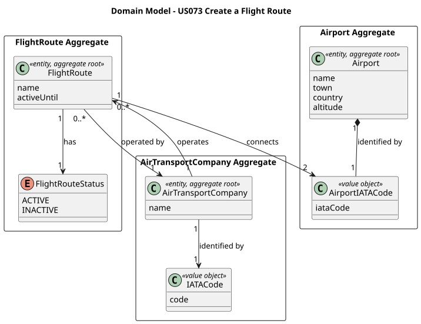
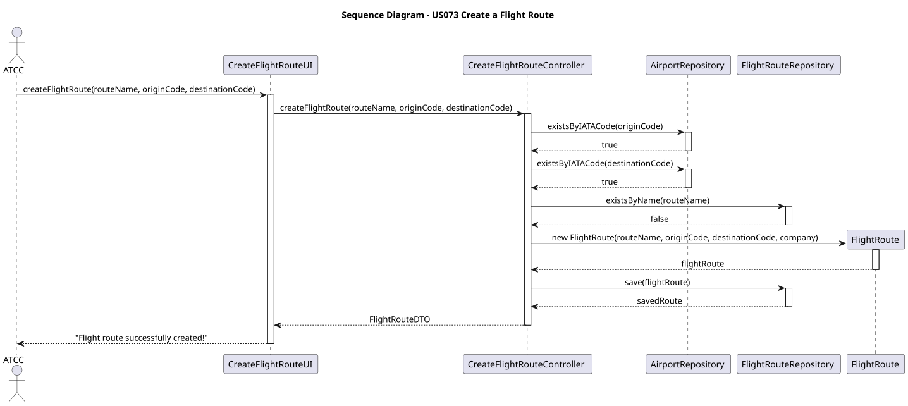
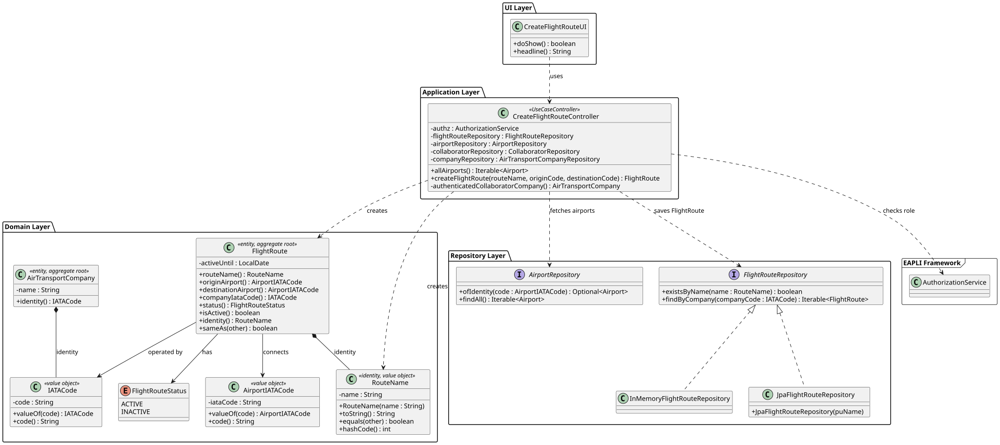

# US073 — Create a Flight Route

## 1. Context

This US is being implemented for the first time in Sprint 3. It allows an **Air Transport Company Collaborator (ATCC)** to create a new flight route for their company, defining the origin and destination airports and assigning a unique route name that follows the required naming convention.

`FlightRoute` is a new aggregate in the domain. It depends on `Airport` (US052) and `AirTransportCompany` (US060) being already registered in the system. Flight routes are a foundational prerequisite for US080 (Create a Flight Plan), since every flight plan is instantiated from a route.

### 1.1 List of issues

- **Analysis:** Define the domain rules for `FlightRoute`, including route name format and uniqueness constraints.
- **Design:** Define the architecture for flight route creation — domain model, persistence, and layers.
- **Implement:** Implement the `FlightRoute` aggregate, `RouteName` value object, repository, controller, and UI.
- **Test:** Unit tests for `FlightRoute` and `RouteName` (domain package coverage above 90%).

---

## 2. Requirements

**US073** As an Air Transport Company Collaborator, I want to add a flight route for my company, so that pilots can use it as the basis for creating flight plans.

**Acceptance Criteria:**

- **AC073.1** A route must be defined between exactly two airports (origin and destination), both already registered in the system.
- **AC073.2** Origin and destination airports must be different.
- **AC073.3** The route name must follow the format: 2 uppercase letters (company initials) followed by 1 to 4 digits (e.g. `TP123`). The format is validated by the `RouteName` value object.
- **AC073.4** The route name must be unique within the system.
- **AC073.5** Only an authenticated Air Transport Company Collaborator (`ATCC` role) may perform this action.
- **AC073.6** The collaborator can only create routes for their own company — the company is derived from the authenticated user's session, not provided as input.

**Dependencies/References:**

- **US030** — Authentication and authorization must be in place (role `ATCC`).
- **US052** — Create an Airport. Both airports referenced by the route must already be registered.
- **US060** — Register an Air Transport Company. The company must exist before a route can be created.
- Acts as a prerequisite for:
  - **US074** — Delete (deactivate) a flight route.
  - **US080** — Create a flight plan (a flight plan is always associated with a route).

---

## 3. Analysis

A flight route represents a named connection between two airports operated by a specific air transport company.

The main design decisions taken were:

**Route name format** — The project document specifies that a route name consists of the company's 2-letter initials followed by up to 4 numeric digits (e.g. `TP123`). A `RouteName` Value Object encapsulates and enforces this format via regex validation (`[A-Z]{2}[0-9]{1,4}`). This is consistent with how other structured codes are handled in the domain (e.g. `AirportIATACode`, `IATACode`).

**Route status** — A route can be `ACTIVE` or `INACTIVE` (deactivated from a given date onwards, per US074). This enables soft deactivation without deleting the aggregate — past references from flight plans remain valid.

**Uniqueness** — Route name uniqueness is enforced at the controller level via a pre-check through the repository, and also at the database level with a unique constraint, to prevent race conditions.

**Company binding** — The company is not an input: it is resolved from the currently authenticated user's `ATCC` session. This guarantees AC073.6 structurally.

The main classes identified are:

| Class | Type | Responsibility |
|-------|------|----------------|
| `FlightRoute` | Entity / Aggregate Root | Holds route data and enforces invariants |
| `RouteName` | Value Object | Route name format validation (`[A-Z]{2}[0-9]{1,4}`) |
| `FlightRouteStatus` | Enum | `ACTIVE` / `INACTIVE` |
| `FlightRouteRepository` | Repository Interface | Persistence contract |
| `CreateFlightRouteController` | Application Controller | Orchestrates the use case; enforces `ATCC` role |
| `CreateFlightRouteUI` | UI | Collects route name, origin and destination from the user |

The following diagram shows the domain model excerpt relevant to this US:



---

## 4. Design

### 4.1. Realization

1. The UI (`CreateFlightRouteUI`) prompts the collaborator for a route name, origin airport IATA code, and destination airport IATA code.
2. The controller calls `authz.ensureAuthenticatedUserHasAnyOf(AiSafeRoles.ATCC)`.
3. The controller resolves the authenticated collaborator's company from the session.
4. Both airport IATA codes are validated: the controller checks that each exists in `AirportRepository`. If either is missing, an `IllegalArgumentException` is thrown.
5. The origin and destination codes are compared — they must differ (AC073.2).
6. The route name uniqueness is checked via `FlightRouteRepository.existsByName(routeName)`. If the name already exists, an `IllegalStateException` is thrown.
7. A new `FlightRoute` is constructed from the validated inputs and the resolved company. Domain invariants are enforced inside the constructor.
8. The route is persisted via `FlightRouteRepository.save()`.
9. The UI confirms: `Flight route 'TP123' (OPO → LIS) created successfully.`

The following sequence diagram illustrates this flow:



The following class diagram shows the classes involved:



### 4.2. Acceptance Tests

All tests are automated with JUnit 5 and located in `src/test/java/aisafe/flightroute/domain/`.

---

**AC073.1 — Route must reference two valid registered airports**

```java
@Test
void ensureOriginAirportCannotBeNull() {
    assertThrows(IllegalArgumentException.class, () ->
            new FlightRoute(new RouteName("TP123"), null,
                    new AirportIATACode("LIS"), company));
}

@Test
void ensureDestinationAirportCannotBeNull() {
    assertThrows(IllegalArgumentException.class, () ->
            new FlightRoute(new RouteName("TP123"), new AirportIATACode("OPO"),
                    null, company));
}
```

---

**AC073.2 — Origin and destination airports must be different**

```java
@Test
void ensureOriginAndDestinationCannotBeTheSame() {
    assertThrows(IllegalArgumentException.class, () ->
            new FlightRoute(new RouteName("TP123"),
                    new AirportIATACode("OPO"),
                    new AirportIATACode("OPO"), company));
}
```

---

**AC073.3 — Route name must follow the format `[A-Z]{2}[0-9]{1,4}`**

```java
@Test
void ensureValidRouteNameIsAccepted() {
    final RouteName name = new RouteName("TP123");
    assertEquals("TP123", name.toString());
}

@Test
void ensureRouteNameWithOnlyOneLetterIsRejected() {
    assertThrows(IllegalArgumentException.class, () -> new RouteName("T123"));
}

@Test
void ensureRouteNameWithMoreThanTwoLettersIsRejected() {
    assertThrows(IllegalArgumentException.class, () -> new RouteName("TAP123"));
}

@Test
void ensureRouteNameWithNoDigitsIsRejected() {
    assertThrows(IllegalArgumentException.class, () -> new RouteName("TP"));
}

@Test
void ensureRouteNameWithMoreThanFourDigitsIsRejected() {
    assertThrows(IllegalArgumentException.class, () -> new RouteName("TP12345"));
}
```

---

**AC073.4 — Route name must be unique**

```java
@Test
void ensureDuplicateRouteNameIsRejected() {
    when(flightRouteRepository.existsByName(new RouteName("TP001"))).thenReturn(true);
    assertThrows(IllegalStateException.class, () ->
            controller.createFlightRoute("TP001", "OPO", "LIS"));
}
```

---

**Additional domain tests — equality and status**

```java
@Test
void ensureTwoRoutesWithSameNameAreEqual() {
    final FlightRoute r1 = new FlightRoute(new RouteName("TP123"),
            new AirportIATACode("OPO"), new AirportIATACode("LIS"), company);
    final FlightRoute r2 = new FlightRoute(new RouteName("TP123"),
            new AirportIATACode("OPO"), new AirportIATACode("LIS"), company);
    assertEquals(r1, r2);
}

@Test
void ensureNewRouteIsActive() {
    final FlightRoute route = new FlightRoute(new RouteName("TP123"),
            new AirportIATACode("OPO"), new AirportIATACode("LIS"), company);
    assertEquals(FlightRouteStatus.ACTIVE, route.status());
}
```

---

## 5. Implementation

The implementation is distributed across the following packages in `aisafe.base`:

| Package | Class | Role |
|---------|-------|------|
| `aisafe.flightroute.domain` | `FlightRoute` | Aggregate root, table `T_FLIGHT_ROUTE` |
| `aisafe.flightroute.domain` | `RouteName` | Identity value object — `[A-Z]{2}[0-9]{1,4}` |
| `aisafe.flightroute.domain` | `FlightRouteStatus` | Status enum: `ACTIVE` / `INACTIVE` |
| `aisafe.flightroute.repositories` | `FlightRouteRepository` | Repository interface |
| `aisafe.flightroute.application` | `CreateFlightRouteController` | Use case orchestrator — enforces `ATCC` role |
| `aisafe.infrastructure.persistence.inmemory` | `InMemoryFlightRouteRepository` | In-memory persistence |
| `aisafe.infrastructure.persistence.jpa` | `JpaFlightRouteRepository` | JPA persistence |
| `aisafe.app.console.presentation.flightroute` | `CreateFlightRouteUI` | Console UI |

`RepositoryFactory` must be extended with a `flightRoutes()` method, and both `InMemoryRepositoryFactory` and `JpaRepositoryFactory` must provide their respective implementations.

**Key design decisions:**

- `RouteName` was designed as a Value Object to centralise format validation, following the same pattern as `AirportIATACode` and `IATACode`.
- `FlightRouteStatus` supports soft deactivation (per US074) without deleting the aggregate, preserving historical references from flight plans.
- The company is not an input to the use case — it is resolved from the authenticated session (`ATCC` role). This ensures AC073.6 structurally rather than procedurally.

---

## 6. Integration/Demonstration

**Prerequisites:** The following user stories must be completed and their data bootstrapped:

- US030 — Authentication (`ATCC` role must be available)
- US052 — At least two airports registered (e.g. `OPO` and `LIS`)
- US060 — Air transport company registered (e.g. `TP / TAP`)
- US061 — At least one `ATCC` collaborator registered for the company

**To run the application:**

```bash
# For development and quick testing (data is lost on exit)
./run-inmemory.sh

# For demonstration with persistent data
./start-h2.sh       # Terminal 1 — keep running
./run-bootstrap.sh  # Terminal 2 — first time only
./run-jpa.sh        # Terminal 2 — every time
```

**To create a flight route (step-by-step):**

1. Login with Air Transport Company Collaborator credentials.
2. Select **Flight Routes** from the main menu.
3. Select **Create Flight Route**.
4. Enter route name (e.g. `TP123`).
5. Enter origin airport IATA code (e.g. `OPO`).
6. Enter destination airport IATA code (e.g. `LIS`).
7. The system confirms: `Flight route 'TP123' (OPO → LIS) created successfully.`

**To compile and run all tests:**

```bash
mvn clean test
```

---

## 7. Observations

- Route name uniqueness is enforced system-wide (not per company) to avoid ambiguity in flight designators, which combine the airline code with a route number. This aligns with real-world IATA conventions and with the project document, which states the route name must be unique without scope qualification.
- An alternative design would have been to enforce uniqueness only per company. This was not adopted because the project document does not restrict uniqueness to a single company.
- `RouteName` could potentially be reused by other aggregates that reference routes by name. The Value Object approach keeps validation centralised and the domain expressive.
- `FlightRouteStatus` was designed with future extensibility in mind — additional statuses (e.g. `SUSPENDED`) could be added without breaking existing logic, since the `deactivate(fromDate)` operation is guarded by a status check.
