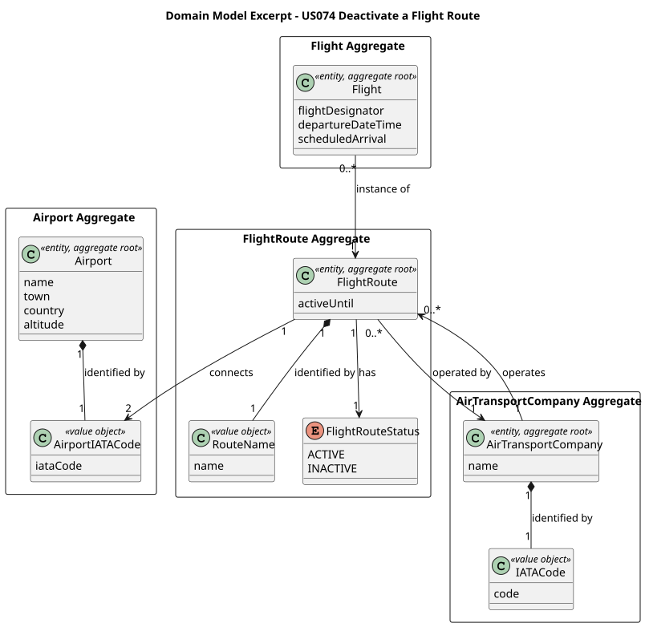

# US074 — Deactivate a Flight Route

## 1. Context

This US is implemented in Sprint 3 and allows an Air Transport Company Collaborator (ATCC) to deactivate a flight route from a given date onwards. It depends on US030 (Authentication and Authorization), which must be in place so that only an authenticated ATCC can invoke this feature.

The `FlightRoute` aggregate already holds an `activeUntil` date and a `FlightRouteStatus` (as defined in the Domain Model), making this use case a natural extension of the existing structure — no new domain fields are required. This use case acts as a guard for US080 (Create a Flight Plan): once a route is deactivated, no new flights may be scheduled on it from the deactivation date onwards.

---

## 2. Requirements

**US074** As an Air Transport Company Collaborator, I want to deactivate a flight route from a given date onwards.

**Acceptance Criteria:**

- **AC074.1** The route is not physically deleted from the database (Soft Delete). Instead, it is deactivated from the specified date onwards by setting `activeUntil` and transitioning `FlightRouteStatus` to `INACTIVE`.
- **AC074.2** No new flights may be created on a deactivated route for any date on or after the `activeUntil` date.
- **AC074.3** The system must reject the deactivation request if there are already planned flights on that route whose departure date is on or after the requested deactivation date.
- **AC074.4** Only an authenticated Air Transport Company Collaborator (ATCC) may perform this action. The route to be deactivated must belong to the company of the logged-in user.

**Dependencies/References:**

- US030 — Authentication and Authorization must be implemented first.
- US060 — Register an Air Transport Company (provides the company associated with the logged-in ATCC).
- US073 — Create a Flight Route (the route must exist before it can be deactivated).
- Acts as a business constraint for:
  - US080 — Create a Flight Plan (must verify that the selected route is `ACTIVE` or, if `INACTIVE`, that the planned departure date is strictly before `activeUntil`)

---

## 3. Analysis

The `FlightRoute` aggregate already contains the two elements required by this use case: the `activeUntil` date (which stores the deactivation boundary) and the `FlightRouteStatus` enum (which transitions from `ACTIVE` to `INACTIVE`). No new fields are added to the domain model.

The business rule in AC074.3 — "cannot deactivate if planned flights exist after the given date" — cannot be enforced within `FlightRoute` alone, since the route aggregate does not know about the flights that reference it. This rule is orchestrated by the `DeactivateFlightRouteController`, which queries `FlightRepository` before delegating to the domain object. This respects the **Low Coupling** principle and the **Controller** and **Information Expert** GRASP patterns.

The main classes involved are:

| Class                             | Type                    | Responsibility                                                                                                             |
|-----------------------------------|-------------------------|----------------------------------------------------------------------------------------------------------------------------|
| `FlightRoute`                     | Entity / Aggregate Root | Holds `activeUntil` (deactivation boundary) and `FlightRouteStatus`; identified by `RouteName`; exposes `deactivate(date)` |
| `RouteName`                       | Value Object            | Business identity of `FlightRoute`; encapsulates the route name format (`[A-Z]{2}[0-9]{1,4}`)                              |
| `FlightRouteStatus`               | Enum                    | `ACTIVE` / `INACTIVE` — represents the current operational state of the route                                              |
| `AirportIATACode`                 | Value Object            | Identifies the origin and destination airports of the route                                                                |
| `FlightRouteRepository`           | Repository Interface    | Persistence contract for the `FlightRoute` aggregate; provides routes filtered by company and status                       |
| `FlightRepository`                | Repository Interface    | Used to check whether planned flights exist after the requested deactivation date (cross-aggregate query)                  |
| `DeactivateFlightRouteController` | Application Controller  | Orchestrates the use case; enforces ATCC role; resolves company ownership; coordinates the planned-flight check            |
| `DeactivateFlightRouteUI`         | UI                      | Lists the ATCC's active routes and collects the deactivation date from the user                                            |

The following domain model excerpt shows the aggregate structure:

