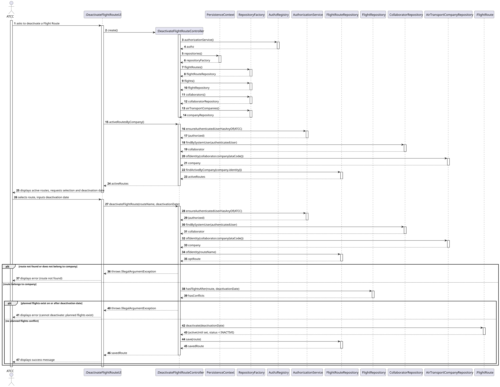
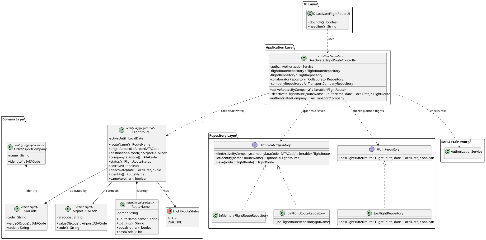

# US074 — Deactivate a Flight Route

## 1. Context

This US is implemented in Sprint 3 and allows an Air Transport Company Collaborator (ATCC) to deactivate a flight route from a given date onwards. It depends on US030 (Authentication and Authorization), which must be in place so that only an authenticated ATCC can invoke this feature.

The `FlightRoute` aggregate already holds an `activeUntil` date and a `FlightRouteStatus` (as defined in the Domain Model), making this use case a natural extension of the existing structure — no new domain fields are required. This use case acts as a guard for US080 (Create a Flight Plan): once a route is deactivated, no new flights may be scheduled on it from the deactivation date onwards.

---

## 2. Requirements

**US074** As an Air Transport Company Collaborator, I want to deactivate a flight route from a given date onwards.

**Acceptance Criteria:**

- **AC074.1** The route is not physically deleted from the database (Soft Delete). Instead, it is deactivated from the specified date onwards by setting `activeUntil` and transitioning `FlightRouteStatus` to `INACTIVE`.
- **AC074.2** No new flights may be created on a deactivated route for any date on or after the `activeUntil` date.
- **AC074.3** The system must reject the deactivation request if there are already planned flights on that route whose departure date is on or after the requested deactivation date.
- **AC074.4** Only an authenticated Air Transport Company Collaborator (ATCC) may perform this action. The route to be deactivated must belong to the company of the logged-in user.

**Dependencies/References:**

- US030 — Authentication and Authorization must be implemented first.
- US060 — Register an Air Transport Company (provides the company associated with the logged-in ATCC).
- US073 — Create a Flight Route (the route must exist before it can be deactivated).
- Acts as a business constraint for:
  - US080 — Create a Flight Plan (must verify that the selected route is `ACTIVE` or, if `INACTIVE`, that the planned departure date is strictly before `activeUntil`)

---

## 3. Analysis

The `FlightRoute` aggregate already contains the two elements required by this use case: the `activeUntil` date (which stores the deactivation boundary) and the `FlightRouteStatus` enum (which transitions from `ACTIVE` to `INACTIVE`). No new fields are added to the domain model.

The business rule in AC074.3 — "cannot deactivate if planned flights exist after the given date" — cannot be enforced within `FlightRoute` alone, since the route aggregate does not know about the flights that reference it. This rule is orchestrated by the `DeactivateFlightRouteController`, which queries `FlightRepository` before delegating to the domain object. This respects the **Low Coupling** principle and the **Controller** and **Information Expert** GRASP patterns.

The main classes involved are:

| Class                             | Type                    | Responsibility                                                                                                             |
|-----------------------------------|-------------------------|----------------------------------------------------------------------------------------------------------------------------|
| `FlightRoute`                     | Entity / Aggregate Root | Holds `activeUntil` (deactivation boundary) and `FlightRouteStatus`; identified by `RouteName`; exposes `deactivate(date)` |
| `RouteName`                       | Value Object            | Business identity of `FlightRoute`; encapsulates the route name format (`[A-Z]{2}[0-9]{1,4}`)                              |
| `FlightRouteStatus`               | Enum                    | `ACTIVE` / `INACTIVE` — represents the current operational state of the route                                              |
| `AirportIATACode`                 | Value Object            | Identifies the origin and destination airports of the route                                                                |
| `FlightRouteRepository`           | Repository Interface    | Persistence contract for the `FlightRoute` aggregate; provides routes filtered by company and status                       |
| `FlightRepository`                | Repository Interface    | Used to check whether planned flights exist after the requested deactivation date (cross-aggregate query)                  |
| `DeactivateFlightRouteController` | Application Controller  | Orchestrates the use case; enforces ATCC role; resolves company ownership; coordinates the planned-flight check            |
| `DeactivateFlightRouteUI`         | UI                      | Lists the ATCC's active routes and collects the deactivation date from the user                                            |

The following domain model excerpt shows the aggregate structure:


---

## 4. Design

### 4.1. Realization

1. The UI (`DeactivateFlightRouteUI`) requests the list of active routes belonging to the logged-in ATCC's company from the controller.
2. The routes are displayed and the user selects one and enters the deactivation date.
3. The controller calls `authz.ensureAuthenticatedUserHasAnyOf(ATCC)`.
4. The controller resolves the authenticated ATCC's `AirTransportCompany` via `CollaboratorRepository`.
5. The controller verifies that the selected `FlightRoute` belongs to that company (AC074.4).
6. The controller queries `FlightRepository.hasFlightsAfter(route, date)` — an existence query that returns `true` if any `FlightPlan` on this route has `departureDateTime >= deactivationDate` (AC074.3).
7. If planned flights are found, the controller returns an error; the UI informs the user that the deactivation was rejected.
8. If no planned flights exist, the controller calls `flightRoute.deactivate(date)`, which sets `activeUntil = date` and transitions `FlightRouteStatus` to `INACTIVE`.
9. The updated `FlightRoute` is persisted via `FlightRouteRepository.save(flightRoute)`.
10. The UI confirms success: `Route '...' deactivated from [date] onwards.`

The following sequence diagram illustrates the flow:



The following class diagram shows the classes involved:



### 4.2. Acceptance Tests

All automated tests and manual acceptance test scripts are documented in [tests.md](tests.md).

---

## 5. Implementation

The implementation is distributed across the following packages in `aisafe.base`:

| Package | Class | Role |
|---------|-------|------|
| `aisafe.flightroute.domain` | `FlightRoute` | Aggregate root, table `T_FLIGHT_ROUTE`; exposes `deactivate(date)` |
| `aisafe.flightroute.repositories` | `FlightRouteRepository` | Repository interface; provides `findActiveByCompany()` |
| `aisafe.flightroute.application` | `DeactivateFlightRouteController` | Use case orchestrator |
| `aisafe.flightroute.repositories` | `FlightRepository` | Used to verify AC074.3 via `hasFlightsAfter(route, date)` |
| `aisafe.infrastructure.persistence.jpa` | `JpaFlightRouteRepository` | JPA persistence for `FlightRoute` |
| `aisafe.infrastructure.persistence.jpa` | `JpaFlightRepository` | Implements `hasFlightsAfter()` via an existence query over `FlightPlan` |
| `aisafe.infrastructure.persistence.inmemory` | `InMemoryFlightRepository` | Implements `hasFlightsAfter()` by delegating to the `FlightPlanRepository` |
| `aisafe.app.console.presentation.flightroute` | `DeactivateFlightRouteUI` | Console UI |

A "planned flight" is a `FlightPlan` (introduced by US080) that references a route via its
`routeName` and carries a concrete `departureDateTime`. The `FlightRepository` exposes a single
focused query method (ISP) so that the controller does not load all flight plans into memory:

```java
// FlightRepository interface (aisafe.flightroute.repositories)
boolean hasFlightsAfter(FlightRoute route, LocalDate deactivationDate);

// JpaFlightRepository — existence query over the FlightPlan aggregate
@Override
public boolean hasFlightsAfter(final FlightRoute route, final LocalDate deactivationDate) {
    final Map<String, Object> params = new HashMap<>();
    params.put("route", route.identity().name());
    params.put("date", deactivationDate.atStartOfDay());
    return matchOne(
            "e.routeName.name = :route AND e.departureDateTime >= :date", params).isPresent();
}
```

> **Design note.** Until US080 existed there was no domain concept able to answer
> "are there planned flights on this route after date X?" — `FlightRoute` does not hold its flights,
> and the early `FlightPlan` (DSL import) had neither a route reference nor a departure date.
> The `FlightRepository` contract was therefore defined first and backed by a temporary stub
> (returning `false`), acting as a deliberate extension point (Protected Variations / DIP).
> Once US080 enriched `FlightPlan` with `routeName` and `departureDateTime`, the stub was replaced
> by the real existence query **without any change to the controller or the UI**.

---

## 6. Integration/Demonstration

**Prerequisites:** Run from the `aisafe.base` directory with Maven 3.9+ and Java 21. The bootstrap must have been executed first so that at least one Flight Route and its associated company exist.

**To deactivate a Flight Route:**

1. Login with Air Transport Company Collaborator (ATCC) credentials (e.g., username: `atcc1`, password: `Password1`).
2. Select **Flight Routes > Deactivate Flight Route** from the main menu.
3. The system lists the active routes of the ATCC's company, e.g.:
   ```
   [1] LIS → OPO  (TAP Air Portugal)  — ACTIVE
   [2] LIS → CDG  (TAP Air Portugal)  — ACTIVE
   ```
4. Enter the number of the route to deactivate (e.g., `1`).
5. Enter the deactivation date (e.g., `2025-08-01`).
6. The system confirms:
   ```
   Route 'LIS → OPO' deactivated from 2025-08-01 onwards.
   ```

**Rejection scenario:**

- If planned flights exist for `LIS → OPO` on or after `2025-08-01`, the system displays:
  ```
  Cannot deactivate: there are planned flights on this route from 2025-08-01 onwards.
  ```

---

## 7. Observations

- The `activeUntil` field and `FlightRouteStatus` enum (`ACTIVE` / `INACTIVE`) are already defined in the Domain Model V7. This use case sets `activeUntil` to the chosen date and transitions the status to `INACTIVE` — no new domain fields are introduced.
- The planned-flight check (AC074.3) is intentionally placed in the controller and not inside `FlightRoute.deactivate()`. The route aggregate does not hold references to its flights, so it cannot enforce this rule itself. The controller acts as the orchestrator, keeping each aggregate within its own boundary.
- The existence query in `JpaFlightRepository.hasFlightsAfter()` (over the `FlightPlan` aggregate) is preferred over loading all flight plans into memory — this follows the query-efficiency guidelines taught in the course. A "planned flight" is any `FlightPlan` referencing the route with a departure on or after the deactivation date; since flight plans have no cancelled state, all statuses (`DRAFT`, `VALIDATED`, `TESTED`) count.
- The ownership check (AC074.4) is enforced in the controller by comparing the route's company with the ATCC's company resolved from `CollaboratorRepository`. A route that does not belong to the ATCC's company is treated as not found.
- US080 (Create a Flight Plan) must be updated to verify, when scheduling a new flight on a given route, that either the route is `ACTIVE` or the planned departure date is strictly before the route's `activeUntil` date.
