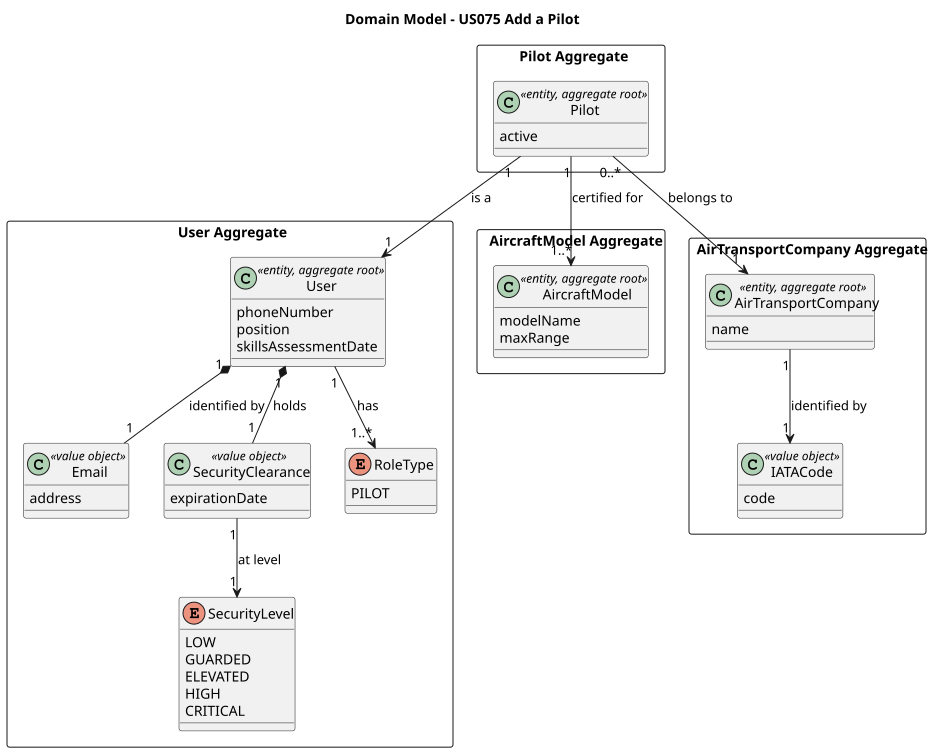
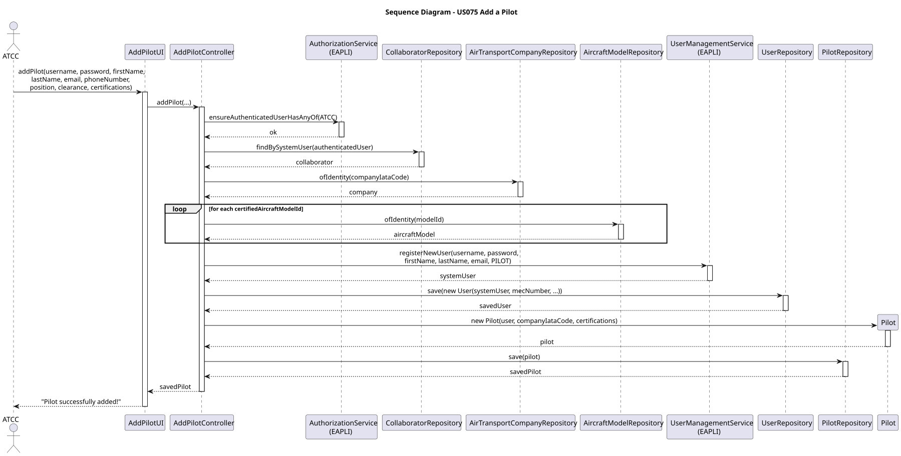
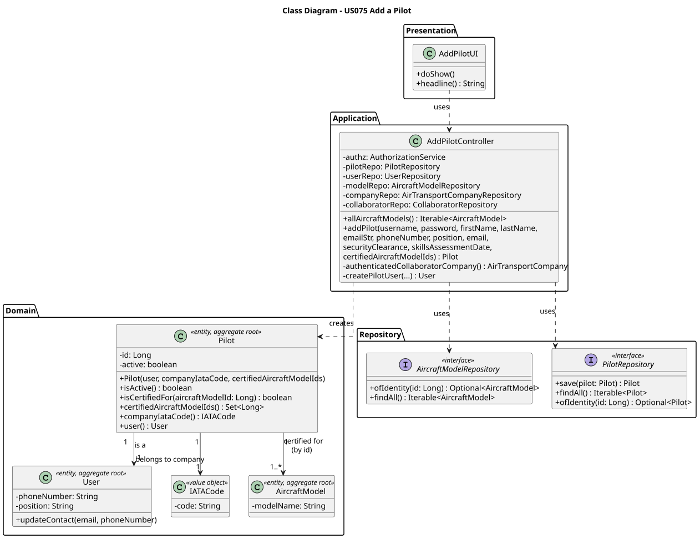

# US075

## 1. Context

This US is being developed for the first time in Sprint 3. It allows an Air Transport Company Collaborator (ATCC) to add a pilot to their company. A pilot is a system user with the PILOT role, certified to operate one or more aircraft models.

### 1.1 List of issues

Analysis: Define the domain rules for `Pilot`, including certification requirements and company association.

Design: Define the architecture for pilot registration, domain model and persistence.

Implement: Implement the `Pilot` aggregate, repository, controller and UI.

Test: Unit tests for `Pilot` (all above 90% coverage).

---

## 2. Requirements

**US075** As an Air Transport Company Collaborator, I want to add a pilot to my company. A pilot is a system's user. A pilot is certified to pilot one or more aircraft models.

**Acceptance Criteria:**

- **AC075.1** A pilot must be a system user with the PILOT role.
- **AC075.2** A pilot must belong to exactly one air transport company — the company of the authenticated collaborator.
- **AC075.3** A pilot must be certified for at least one aircraft model.
- **AC075.4** All aircraft models referenced in the certifications must already exist in the system.
- **AC075.5** A newly added pilot is active by default.

**Dependencies/References:**

- **US055** — Create an Aircraft Model. The aircraft models referenced in the pilot's certifications must already be registered.
- **US060** — Register an Air Transport Company. The company must exist before a pilot can be added.
- **US061** — Add a Customer's Collaborator. The authenticated user must be a company collaborator (ATCC).

---

## 3. Analysis

A pilot is a system user with the PILOT role that belongs to an air transport company and is certified to operate one or more aircraft models.

The main design decisions made were:

**Pilot as separate aggregate** — The `Pilot` aggregate was created separately from `Collaborator` because a pilot has distinct domain behaviour — certifications for aircraft models and an active/inactive status. This keeps each aggregate focused on a single responsibility.

**Company reference by identity** — The `Pilot` references the company via `IATACode` (identity) rather than a full `AirTransportCompany` object reference. This avoids cross-aggregate object references — a DDD principle of low coupling between aggregates.

**Aircraft model reference by identity** — The pilot's certifications are stored as a `Set<Long>` of aircraft model ids rather than full `AircraftModel` references. This keeps the coupling between `Pilot` and `AircraftModel` aggregates low.

**Authentication-based company resolution** — The controller resolves the authenticated collaborator's company automatically from the session — the ATCC does not manually select a company. This enforces AC075.2 — a pilot can only be added to the authenticated collaborator's own company.

**Certification invariant** — A pilot must always have at least one certification. This is enforced in the constructor and the set is exposed as unmodifiable.

The main classes identified are:

| Class | Type | Responsibility |
|-------|------|----------------|
| `Pilot` | Entity / Aggregate Root | Holds pilot data and certifications |
| `PilotRepository` | Repository Interface | Persistence contract |
| `AddPilotController` | Controller | Use case orchestrator |
| `AddPilotUI` | UI | Console UI for pilot registration |

The following diagram shows the domain model excerpt relevant to this US:



---

## 4. Design

### 4.1. Realization

The use case follows the standard layered flow: `AddPilotUI` collects pilot data and selected aircraft model certifications, then delegates to `AddPilotController`. The controller:

1. Verifies the authenticated user has the ATCC role
2. Resolves the authenticated collaborator's company from the session
3. Validates that all selected aircraft models exist
4. Creates a system user with the PILOT role via EAPLI
5. Creates the AISafe `User` aggregate
6. Creates the `Pilot` aggregate and persists it

All user and pilot creation is wrapped in a transaction — if any step fails, the entire operation is rolled back.

The following sequence diagram illustrates this flow:



The following class diagram shows the classes involved:



### 4.2. Acceptance Tests

All tests are automated with JUnit 5 and located in `src/test/java/aisafe/pilot/domain/`.

---

**AC075.1 — Pilot must be a system user with the PILOT role**

The PILOT role is assigned automatically by the controller — the ATCC cannot assign a different role to a pilot.

**Test:** `ensureValidPilotCanBeCreated` — verifies that a valid pilot is correctly created.

```java
@Test
void ensureValidPilotCanBeCreated() {
    final Pilot pilot = new Pilot(validUser(), IATACode.valueOf("TP"),
            Set.of(1L, 2L));
    assertNotNull(pilot);
    assertTrue(pilot.isActive());
}
```

---

**AC075.2 — Pilot must belong to the authenticated collaborator's company**

Authorization is enforced by the controller — the company is resolved automatically from the authenticated session. This is validated through manual integration testing:

1. Login as an ATCC of TAP.
2. Navigate to **Pilots > Add Pilot**.
3. The system automatically associates the pilot with TAP — the ATCC cannot select a different company.

---

**AC075.3 — Pilot must be certified for at least one aircraft model**

**Test:** `ensurePilotMustHaveAtLeastOneCertification`

```java
@Test
void ensurePilotMustHaveAtLeastOneCertification() {
    assertThrows(IllegalArgumentException.class, () ->
            new Pilot(validUser(), IATACode.valueOf("TP"), Set.of()));
}
```

**Test:** `ensurePilotCertificationSetCannotBeNull`

```java
@Test
void ensurePilotCertificationSetCannotBeNull() {
    assertThrows(IllegalArgumentException.class, () ->
            new Pilot(validUser(), IATACode.valueOf("TP"), null));
}
```

---

**AC075.4 — Aircraft models must exist in the system**

Validated by the controller before creating the pilot:
```java
for (final Long modelId : certifiedAircraftModelIds) {
    modelRepo.ofIdentity(modelId).orElseThrow(() ->
            new IllegalArgumentException("Aircraft model not found: " + modelId));
}
```

This is an infrastructure concern validated through manual integration testing.

---

**AC075.5 — Newly added pilot is active by default**

**Test:** `ensurePilotIsActiveByDefault`

```java
@Test
void ensurePilotIsActiveByDefault() {
    final Pilot pilot = new Pilot(validUser(), IATACode.valueOf("TP"), Set.of(1L));
    assertTrue(pilot.isActive());
}
```

---

**Pilot domain invariants**

**Test:** `ensureUserCannotBeNull`

```java
@Test
void ensureUserCannotBeNull() {
    assertThrows(IllegalArgumentException.class, () ->
            new Pilot(null, IATACode.valueOf("TP"), Set.of(1L)));
}
```

**Test:** `ensureCompanyCannotBeNull`

```java
@Test
void ensureCompanyCannotBeNull() {
    assertThrows(IllegalArgumentException.class, () ->
            new Pilot(validUser(), null, Set.of(1L)));
}
```

**Test:** `ensureCertificationsAreUnmodifiable`

```java
@Test
void ensureCertificationsAreUnmodifiable() {
    final Pilot pilot = new Pilot(validUser(), IATACode.valueOf("TP"), Set.of(1L));
    assertThrows(UnsupportedOperationException.class, () ->
            pilot.certifiedAircraftModelIds().add(2L));
}
```

**Test:** `ensureIsCertifiedForReturnsTrueForCertifiedModel`

```java
@Test
void ensureIsCertifiedForReturnsTrueForCertifiedModel() {
    final Pilot pilot = new Pilot(validUser(), IATACode.valueOf("TP"), Set.of(1L));
    assertTrue(pilot.isCertifiedFor(1L));
    assertFalse(pilot.isCertifiedFor(99L));
}
```

---

## 5. Implementation

The implementation is distributed across the following packages in `aisafe.base`:

| Package | Class | Role |
|---------|-------|------|
| `aisafe.pilot.domain` | `Pilot` | Aggregate root |
| `aisafe.pilot.repositories` | `PilotRepository` | Repository interface |
| `aisafe.pilot.application` | `AddPilotController` | Use case orchestrator |
| `aisafe.infrastructure.persistence.inmemory` | `InMemoryPilotRepository` | In-memory persistence |
| `aisafe.infrastructure.persistence.jpa` | `JpaPilotRepository` | JPA persistence |
| `aisafe.app.console.presentation.pilot` | `AddPilotUI` | Console UI |

**Design decisions:**

`Pilot` was created as a separate aggregate from `Collaborator` because a pilot has distinct domain behaviour — certifications and active/inactive status. This keeps each aggregate focused on a single responsibility (SRP).

The company and aircraft model references are stored as identity values (`IATACode` and `Set<Long>`) rather than full object references. This avoids cross-aggregate object references — a DDD principle of low coupling.

The `MecanographicNumber` for pilot users follows the format `PIL00001` instead of `EMP00001` to distinguish pilots from other users in the system.

The test suite comprises tests for `Pilot`, all above 90% coverage and all passing.

---

## 6. Integration/Demonstration

This US integrates with:

- **US055** — aircraft models must exist before certifications can be assigned.
- **US060** — the company must be registered and the authenticated user must be a collaborator of it.
- **US061** — the authenticated user must be an ATCC collaborator.
- **US076** — list pilot roster uses the `PilotRepository`.
- **US077** — remove a pilot deactivates the `Pilot` aggregate.

**To compile and run all tests:**
```bash
mvn clean test
```

**To run the application:**
```bash
# For development and quick testing (data is lost on exit)
./run-inmemory.sh

# For demonstration with persistent data
./start-h2.sh       # Terminal 1 — keep running
./run-bootstrap.sh  # Terminal 2 — first time only
./run-jpa.sh        # Terminal 2 — every time
```

**To add a pilot:**

1. Login with Air Transport Company Collaborator (ATCC) credentials.
2. Select **Pilots >** from the main menu.
3. Select **Add Pilot**.
4. Fill in username, password, name, phone, email, position, security clearance and skills assessment date.
5. Select one or more aircraft models the pilot is certified for.
6. The system confirms: `Pilot successfully added!` with all details.

---

## 7. Observations

- The `MecanographicNumber` for pilots uses the prefix `PIL` instead of `EMP` to distinguish pilot users from other system users at a glance.
- The company is resolved automatically from the authenticated session — this prevents an ATCC from adding a pilot to a company they do not belong to, enforcing AC075.2 without requiring explicit input.
- Aircraft model certifications are stored as a `Set<Long>` of model ids rather than `@ManyToMany` with the `AircraftModel` aggregate. This keeps the coupling between `Pilot` and `AircraftModel` low — the `Pilot` aggregate does not depend on the internal structure of `AircraftModel`.
- An alternative design would have been to include pilots inside the `Collaborator` aggregate. This was rejected because pilots have distinct behaviour (certifications, active status) that would overload the `Collaborator` aggregate — violating SRP.
