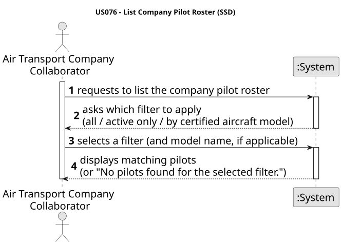
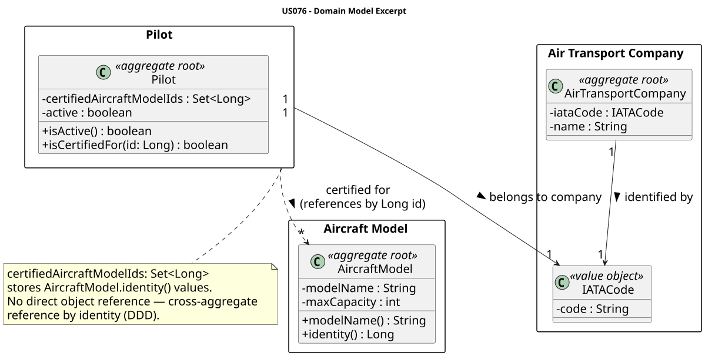
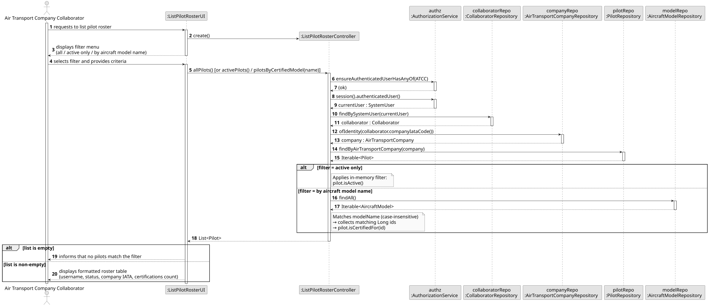
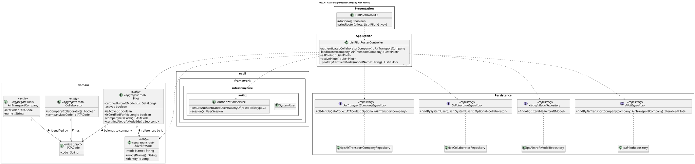

# US076 — List Company Pilot Roster

## 1. Context

This US is implemented in Sprint 3 and allows an Air Transport Company Collaborator (ATCC) to consult the list of pilots belonging to their company. The listing supports three optional filters: all pilots, active pilots only, and pilots certified for a given aircraft model name.

It depends on US075 (Add Pilot) which must have registered at least one pilot, and on US030 (Authentication and Authorization) so that only an authenticated ATCC can invoke this feature. It is analogous to US072 (List Fleet) in structure and filtering approach.

---

## 2. Requirements

**US076** As an Air Transport Company Collaborator, I want to list my company's pilot roster.

**Acceptance Criteria:**

- **AC076.1** The system displays all pilots (active and inactive) registered to the authenticated ATCC's company, where `isActive()` == true counts as active and `isActive()` == false counts as inactive.
- **AC076.2** The ATCC may filter the list to show active pilots only.
- **AC076.3** The ATCC may filter the list by certified aircraft model name using a case-insensitive string comparison against `AircraftModel.modelName()`.
- **AC076.4** Only an authenticated Air Transport Company Collaborator (ATCC) may perform this action.
- **AC076.5** If no pilots match the applied filter, the system displays the message: `"No pilots found for the selected filter."`

**Dependencies/References:**

- US030 — Authentication and Authorization must be implemented first.
- US075 — Add Pilot (provides the data that is listed here).

---

## 3. Analysis

The system-level interaction between the Air Transport Company Collaborator and the system:


> Source: [puml/US076-SSD.puml](puml/US076-SSD.puml)

The `PilotRepository` already exposes `findByAirTransportCompany(company)`, which returns all pilots for a given company. The controller resolves the authenticated user's company via a two-step lookup — `CollaboratorRepository.findBySystemUser()` returns the collaborator's IATA code, then `AirTransportCompanyRepository.ofIdentity(iataCode)` resolves it to the `AirTransportCompany` aggregate root (identical pattern used by `AddPilotController`). The full pilot list is then retrieved and the selected filter is applied in memory.

**Pilot ↔ AircraftModel relationship (DDD cross-aggregate reference by identity):**

`Pilot` stores a `Set<Long> certifiedAircraftModelIds` — there is no direct object reference to `AircraftModel`. The `AircraftModel` aggregate exposes `identity(): Long` (auto-generated) and `modelName(): String`. The certification-name filter is resolved at the application layer: load all `AircraftModel` instances from `AircraftModelRepository`, match by name (case-insensitive), collect matching IDs, and check `pilot.isCertifiedFor(id)`. This keeps aggregate boundaries clean and follows the same cross-aggregate-by-identity pattern used for the company link (`Pilot` stores `IATACode`, not a direct `AirTransportCompany` reference).

The following domain model excerpt shows the aggregate structure:


> Source: [puml/US076-domain-model.puml](puml/US076-domain-model.puml)

The main classes involved are:

| Class | Type | Responsibility |
|-------|------|----------------|
| `Pilot` | Aggregate Root | `isActive()`, `isCertifiedFor(Long)`, `companyIataCode()`, `certifiedAircraftModelIds()` |
| `IATACode` | Value Object | Company identity stored inside `Pilot` |
| `AircraftModel` | Aggregate Root | `modelName()` + `identity()` used for certification-name filter |
| `AirTransportCompany` | Aggregate Root | Required parameter for `findByAirTransportCompany()` |
| `PilotRepository` | Repository Interface | `findByAirTransportCompany(company)` — reused, no new methods needed |
| `AircraftModelRepository` | Repository Interface | `findAll()` — invoked **only** in the model-name filter branch; not called by `allPilots()` or `activePilots()` |
| `CollaboratorRepository` | Repository Interface | Resolves the authenticated ATCC to their company IATA code |
| `AirTransportCompanyRepository` | Repository Interface | Resolves `IATACode` → `AirTransportCompany` |
| `ListPilotRosterController` | Application Controller | Orchestrates roster loading, enforces ATCC role, applies in-memory filters |
| `ListPilotRosterUI` | UI | Presents filter menu and formats the result table |

---

## 4. Design

### 4.1. Realization

1. The UI (`ListPilotRosterUI`) presents the authenticated ATCC with a filter menu: all pilots, active only, or by certified aircraft model name.
2. The controller calls `authz.ensureAuthenticatedUserHasAnyOf(ATCC)`.
3. The controller resolves the authenticated user's `AirTransportCompany` via `CollaboratorRepository.findBySystemUser()` followed by `AirTransportCompanyRepository.ofIdentity(iataCode)`.
4. The private helper `loadRoster(company)` calls `pilotRepo.findByAirTransportCompany(company)` and collects the result into a `List<Pilot>`. All three public methods delegate to this helper so the repository call is written once.
5. The applicable filter is applied in memory:
   - **All**: no filter, full list is returned.
   - **Active only**: `pilot.isActive()` predicate applied.
   - **By model name**: all `AircraftModel` instances loaded via `AircraftModelRepository.findAll()`, matched by name (case-insensitive), and `pilot.isCertifiedFor(id)` checked against each matching ID.
6. The UI renders a formatted table with: username, status (ACTIVE / INACTIVE), company IATA code, and number of certified aircraft models.
7. A total count footer is displayed at the bottom of the listing.

The following sequence diagram illustrates the flow:


> Source: [puml/US076-SD.puml](puml/US076-SD.puml)

The following class diagram shows the classes involved:


> Source: [puml/US076-class-diagram.puml](puml/US076-class-diagram.puml)

---

### 4.2. Acceptance Tests

| Test ID | Description | Expected Result |
|---------|-------------|-----------------|
| AC076.1 | List all pilots; company has two pilots (one active, one inactive) | Both pilots appear in the table |
| AC076.2 | Filter active only; one active, one inactive pilot exist | Only the active pilot is returned |
| AC076.3 | Filter by model name "A320"; pilot 1 certified for A320, pilot 2 not | Only pilot 1 returned |
| AC076.3b | Filter by model name "a320" (lowercase) | Same result as above (case-insensitive) |
| AC076.4 | Non-ATCC user attempts to list roster | `UnauthorizedException` thrown |
| AC076.5 | Filter active only; company has no active pilots | Empty result message displayed |

---

## 5. Implementation

### Key Implementation Details

- `ListPilotRosterController` has two constructors: a public no-arg constructor for runtime (pulls repos from `PersistenceContext`) and a package-private constructor that accepts the four repositories for unit testing (avoids JPA and `AuthzRegistry`).
- `authenticatedCollaboratorCompany()` — private method; resolves the authenticated `SystemUser` to their `AirTransportCompany` via `CollaboratorRepository.findBySystemUser()` → `AirTransportCompanyRepository.ofIdentity(iataCode)`. Identical logic to `AddPilotController.authenticatedCollaboratorCompany()`. Throws `IllegalStateException` if the user is not a company collaborator.
- `loadRoster(company)` — private helper; iterates `PilotRepository.findByAirTransportCompany(company)` and collects results into a `List<Pilot>`. All three public filter methods delegate to this helper.
- `allPilots()` — enforces `ATCC` role, then delegates to `allPilots(company)` → `loadRoster(company)`.
- `activePilots()` — enforces `ATCC` role, then filters `allPilots(company)` by `pilot.isActive()` in memory.
- `pilotsByCertifiedModel(String modelName)` — enforces `ATCC` role; loads all `AircraftModel` instances via `AircraftModelRepository.findAll()`, collects IDs of models whose name matches `modelName.trim()` (case-insensitive via `equalsIgnoreCase`), then filters `allPilots(company)` by `pilot.isCertifiedFor(id)`. `AircraftModelRepository.findAll()` is only called in this branch.
- `ListPilotRosterUI.printRoster()` — prints the standard empty-result message `"No pilots found for the selected filter."` when the list is empty; otherwise renders a four-column table (username, status, company IATA, certifications count) with a total footer.

### Package Structure

| Package | Class | Role |
|---------|-------|------|
| `aisafe.pilot.domain` | `Pilot` | Existing — no changes needed |
| `aisafe.pilot.repositories` | `PilotRepository` | Existing — `findByAirTransportCompany` reused |
| `aisafe.aircraftmodel.repositories` | `AircraftModelRepository` | Existing — `findAll()` used by model-name filter only |
| `aisafe.pilot.application` | `ListPilotRosterController` | **New** — filtering logic + company resolution |
| `aisafe.app.console.presentation.pilot` | `ListPilotRosterUI` | **New** — filter menu + table rendering |
| `aisafe.app.console.presentation` | `MainMenu` | Updated — item 2 added to `buildPilotMenu()` |

---

## 6. Integration / Demonstration

### Run Instructions

```bash
# Terminal 1 — keep running
./start-h2.sh

# Terminal 2 — seed data once (first time only)
./run-bootstrap.sh

# Terminal 2 — run the application
./run-jpa.sh

# Login with:
# Username: atcc1
# Password: Password1

# Navigate to:
# Pilots > List Pilot Roster
```

### Demonstration Scenarios

| Scenario | Filter to select | Expected output |
|----------|-----------------|-----------------|
| All pilots | 1 — All pilots | Table with every pilot registered to `atcc1`'s company |
| Active only | 2 — Active pilots only | Only rows where STATUS = ACTIVE |
| By model name | 3 — By certified aircraft model name → enter `A320` | Only pilots certified for A320 |
| Case-insensitive | 3 → enter `a320` | Same result as above |
| Empty result | 2 — Active pilots only (all pilots inactive) | `No pilots found for the selected filter.` |

---

## 7. Observations

Filtering is applied in memory after loading the full roster from the repository. This approach is consistent with US072 (List Fleet) and avoids introducing new JPQL queries. It is correct for the expected roster sizes in this domain.

The certification filter preserves aggregate boundary discipline: `Pilot` stores only `Long` model IDs (`certifiedAircraftModelIds`), and the `AircraftModel` lookup is performed at the application layer. This prevents a direct dependency between the `Pilot` aggregate and the `AircraftModel` aggregate.

Company resolution follows the identical two-step path used by `AddPilotController`: `CollaboratorRepository.findBySystemUser()` → `AirTransportCompanyRepository.ofIdentity(iataCode)`.
