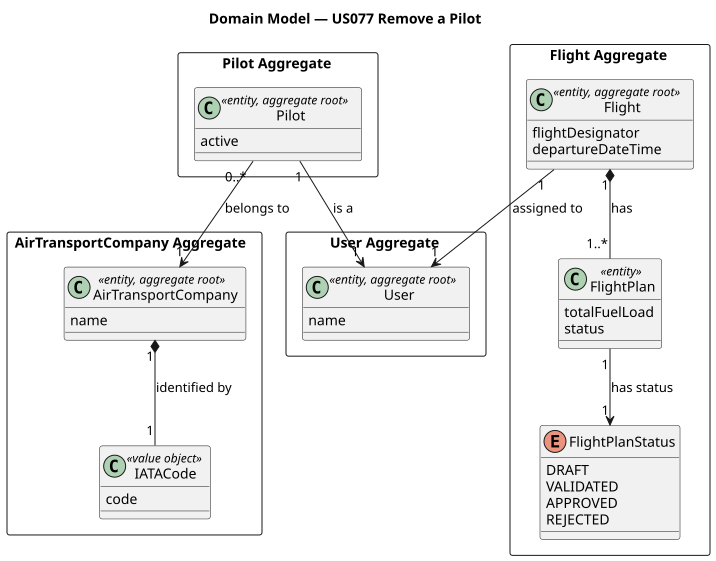
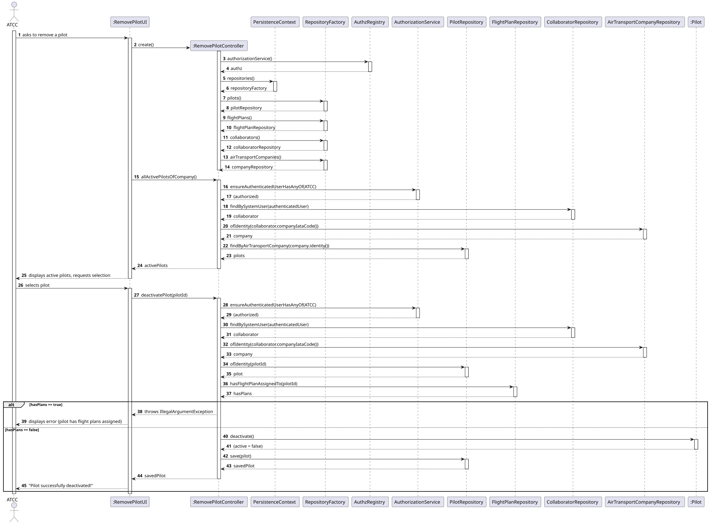
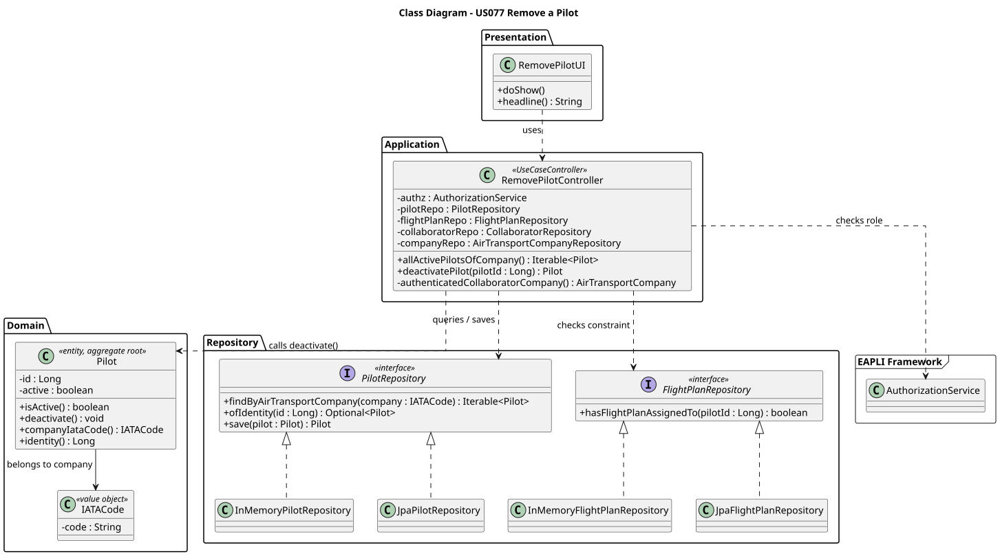

# US077 — Remove a Pilot

## 1. Context

This US is being implemented for the first time in Sprint 3. It allows an **Air Transport Company Collaborator (ATCC)** to make a pilot inactive in their company's roster. A pilot that is made inactive is not deleted from the system — the record is preserved for historical traceability, but the pilot can no longer be assigned to new flight plans.

`Pilot` is an existing aggregate (US075). This US adds deactivation behaviour to that aggregate.

### 1.1 List of issues

- **Requirements:** Define the rules for pilot deactivation, including the blocking constraint on active flight plans.
- **Analysis:** Identify what "flight plans assigned" means and which domain objects are involved.
- **Design:** Sequence diagram and class diagram for the deactivation flow.
- **Implement:** Add `deactivate()` to the domain, controller, UI and wire into the menu.
- **Test:** Unit tests for domain deactivation + integration tests for the controller.

---

## 2. Requirements

**US077** As an Air Transport Company Collaborator, I want to make a pilot inactive in my company's roster.

**Acceptance Criteria:**

- **AC077.1** Only an authenticated Air Transport Company Collaborator (`ATCC` role) may perform this action.
- **AC077.2** The pilot is made **inactive** — the record is not deleted. An inactive pilot does not appear on the active roster.
- **AC077.3** A pilot that has flight plans assigned **cannot** be deactivated.
- **AC077.4** The collaborator can only deactivate pilots of their own company — the company is derived from the authenticated user's session.

**Dependencies/References:**

- **US030** — Authentication and authorization must be in place (role `ATCC`).
- **US075** — Add a Pilot. A pilot must exist and be active before it can be deactivated.
- **US080** — Create a Flight Plan. A pilot with an assigned flight plan cannot be deactivated.

---

## 3. Analysis

Deactivating a pilot means setting the `Pilot` aggregate's `active` flag to `false` while keeping the record in the system for historical traceability (AC077.2). The deactivation is blocked if the pilot has any flight plan assigned (AC077.3).

The main design decisions taken were:

**`deactivate()` as a domain method on `Pilot`** — The `active` field is owned by `Pilot`. Following the Information Expert principle, the deactivation behaviour belongs inside the aggregate. The method enforces the invariant that an already-inactive pilot cannot be deactivated again, throwing `IllegalStateException`. The flight-plan guard is intentionally *not* placed inside the domain method — it requires querying a separate aggregate (`FlightPlan`), which would violate aggregate isolation. The guard is enforced at the application layer.

**Cross-aggregate check via `FlightPlanRepository`** — `FlightPlan` references its assigned pilot by `Long` identity (not by object reference) to keep Low Coupling between aggregates. The constraint from AC077.3 is checked in the controller by calling `FlightPlanRepository.hasFlightPlanAssignedTo(Long pilotId)`. This method returns `true` if any `FlightPlan` with the given pilot id exists, regardless of status — if a pilot is referenced in any flight plan, they cannot be deactivated.

**Company scoping** — The authenticated ATCC's company is resolved from the session using the same `authenticatedCollaboratorCompany()` helper present in `AddPilotController`. The controller only lists and deactivates pilots whose `companyIataCode` matches the authenticated user's company (AC077.4).

**Soft-delete** — The `Pilot` record is never deleted. Setting `active = false` preserves the full record and keeps all cross-aggregate references (from `FlightPlan`) valid.

The main classes identified are:

| Class | Type | Responsibility |
|-------|------|----------------|
| `Pilot` | Entity / Aggregate Root | Owns `active` flag; enforces deactivation invariant via `deactivate()` |
| `FlightPlanRepository` | Repository Interface | Guards AC077.3 via `hasFlightPlanAssignedTo(Long pilotId)` |
| `PilotRepository` | Repository Interface | Lists active pilots filtered by company |
| `RemovePilotController` | Application Controller | Orchestrates the use case; enforces `ATCC` role and company scope |
| `RemovePilotUI` | UI | Lists active pilots, requests selection and confirmation |

The following diagram shows the domain model excerpt relevant to this US:



---

## 4. Design

### 4.1. Realization

The use case follows the standard layered flow: `RemovePilotUI` lists the active pilots of the authenticated ATCC's company, requests the user's selection and confirmation, then delegates to `RemovePilotController`. The controller:

1. Verifies the authenticated user has the `ATCC` role
2. Resolves the authenticated collaborator's company from the session
3. Lists only active pilots that belong to that company (`allActivePilotsOfCompany()`)
4. Resolves the selected pilot by id and verifies it belongs to the same company
5. Checks whether any flight plan is assigned to the pilot via `FlightPlanRepository`
6. If a flight plan exists, throws `IllegalArgumentException` (AC077.3)
7. Otherwise, calls `pilot.deactivate()` which sets `active = false` and enforces the already-inactive guard
8. Persists the updated pilot via `PilotRepository` (auto-tx)

The following sequence diagram illustrates this flow:



The following class diagram shows the classes involved:



### 4.2. Acceptance Tests

All tests are automated with JUnit 5:
- Domain unit tests: `src/test/java/aisafe/pilot/domain/PilotTest.java`
- Integration tests: `src/test/java/aisafe/pilot/application/RemovePilotControllerTest.java`

---

**AC077.1 — Only ATCC may perform this action**

**Test:** `ensureAllActivePilotsThrowsWhenNotAuthenticated`

```java
@Test
void ensureAllActivePilotsThrowsWhenNotAuthenticated() {
    assertThrows(UnauthenticatedException.class,
            () -> controller.allActivePilotsOfCompany());
}
```

**Test:** `ensureAllActivePilotsThrowsWhenWrongRole`

```java
@Test
void ensureAllActivePilotsThrowsWhenWrongRole() {
    AuthenticationContext.authenticate(OPERATOR_USERNAME, OPERATOR_PASSWORD);
    assertThrows(UnauthorizedException.class,
            () -> controller.allActivePilotsOfCompany());
}
```

---

**AC077.2 — Pilot is made inactive, not deleted**

**Test:** `ensureDeactivateSetsActiveToFalse` (domain)

```java
@Test
void ensureDeactivateSetsActiveToFalse() {
    final Pilot pilot = new Pilot(validUser("pilot-deact-1"), validCompany(), Set.of(1L));
    pilot.deactivate();
    assertFalse(pilot.isActive());
}
```

**Test:** `ensureDeactivatePilotSetsActiveToFalse` (controller)

```java
@Test
void ensureDeactivatePilotSetsActiveToFalse() {
    AuthenticationContext.authenticate(ATCC_USERNAME, ATCC_PASSWORD);
    final Pilot result = controller.deactivatePilot(pilotToDeactivate1.identity());
    assertFalse(result.isActive());
}
```

**Test:** `ensureDeactivatePilotIsPersisted`

```java
@Test
void ensureDeactivatePilotIsPersisted() {
    AuthenticationContext.authenticate(ATCC_USERNAME, ATCC_PASSWORD);
    controller.deactivatePilot(pilotToDeactivate2.identity());
    final Optional<Pilot> found = PersistenceContext.repositories().pilots()
            .ofIdentity(pilotToDeactivate2.identity());
    assertTrue(found.isPresent());
    assertFalse(found.get().isActive());
}
```

---

**AC077.3 — Cannot deactivate pilot with flight plans assigned**

**Test:** `ensureDeactivatePilotThrowsWhenFlightPlansAssigned`

```java
@Test
void ensureDeactivatePilotThrowsWhenFlightPlansAssigned() {
    AuthenticationContext.authenticate(ATCC_USERNAME, ATCC_PASSWORD);
    assertThrows(IllegalArgumentException.class,
            () -> controller.deactivatePilot(pilotWithFlightPlan.identity()));
}
```

---

**AC077.4 — Only own company pilots**

**Test:** `ensureDeactivatePilotThrowsWhenPilotBelongsToOtherCompany`

```java
@Test
void ensureDeactivatePilotThrowsWhenPilotBelongsToOtherCompany() {
    AuthenticationContext.authenticate(ATCC_USERNAME, ATCC_PASSWORD);
    assertThrows(IllegalArgumentException.class,
            () -> controller.deactivatePilot(otherCompanyPilot.identity()));
}
```

---

## 5. Implementation

The implementation is distributed across the following packages in `aisafe.base`:

| Package | Class | Role |
|---------|-------|------|
| `aisafe.pilot.domain` | `Pilot` | Aggregate root — `deactivate()` added |
| `aisafe.flightplan.repositories` | `FlightPlanRepository` | `hasFlightPlanAssignedTo(Long)` added |
| `aisafe.infrastructure.persistence.inmemory` | `InMemoryFlightPlanRepository` | In-memory implementation |
| `aisafe.infrastructure.persistence.jpa` | `JpaFlightPlanRepository` | JPA implementation |
| `aisafe.pilot.application` | `RemovePilotController` | Use case orchestrator |
| `aisafe.app.console.presentation.pilot` | `RemovePilotUI` | Console UI |

**Design decisions:**

`deactivate()` is a domain method on `Pilot` — following the Information Expert principle, the `active` field is owned by the aggregate, so the behaviour that changes it belongs there. The method enforces the invariant that an already-inactive pilot cannot be deactivated again (`IllegalStateException`).

The flight-plan guard is enforced at the application layer, not inside the domain method — checking `FlightPlan` requires querying a separate aggregate, which would violate aggregate isolation if placed inside `Pilot`.

`RemovePilotController` uses auto-tx (no explicit `tx.begin/commit/rollback`) because the operation updates a single aggregate — consistent with the pattern used by `DecommissionAircraftController`.

The test suite comprises **2 domain unit tests** (`PilotTest`) + **11 integration tests** (`RemovePilotControllerTest`) = **13 automated tests**, all passing.

---

## 6. Integration/Demonstration

This US integrates with:

- **US075** — Add a Pilot. The pilot must exist and be active before it can be deactivated.
- **US080** — Create a Flight Plan. A pilot assigned to any flight plan cannot be deactivated.

**To compile and run all tests:**
```bash
mvn clean test
```

**To run the application:**
```bash
./run-inmemory.sh
```

**To deactivate a pilot:**

1. Login with Air Transport Company Collaborator (ATCC) credentials.
2. Select **Pilots >** from the main menu.
3. Select **Remove Pilot**.
4. The system lists active pilots of your company — select one by number.
5. Confirm with `yes`.
6. The system confirms: `Pilot successfully deactivated.`

---

## 7. Observations

- The deactivation is a soft-delete — the `Pilot` record is never removed from the database. This preserves historical traceability and keeps all cross-aggregate references (e.g. from `FlightPlan`) valid.
- The flight-plan guard (`hasFlightPlanAssignedTo`) checks all flight plans regardless of status (DRAFT, VALIDATED, TESTED). A pilot referenced in any flight plan — even one not yet approved — cannot be deactivated. This is a conservative but safe design choice.
- An alternative design would have been to place the `deactivate()` guard (including the flight-plan check) entirely inside the domain method. This was not adopted because the flight-plan check requires querying a separate aggregate (`FlightPlan`), which would violate aggregate isolation and introduce infrastructure concerns into the domain.
- `Pilot` uses a database-generated `Long` as its identity — unlike other aggregates in this domain (e.g. `FlightRoute` with `RouteName`, `Airport` with `AirportIATACode`) which use natural business identities as value objects. This is because a pilot has no natural single-field business key that is both unique and stable across the system.
- The `RemovePilotController` reuses the `authenticatedCollaboratorCompany()` helper pattern established by `AddPilotController`, keeping company resolution consistent across all pilot use cases.
- If a pilot is deactivated and later needs to be reactivated, a new use case would be required (e.g. US078 "Reactivate a Pilot"). The `active` field design supports this without schema changes.
