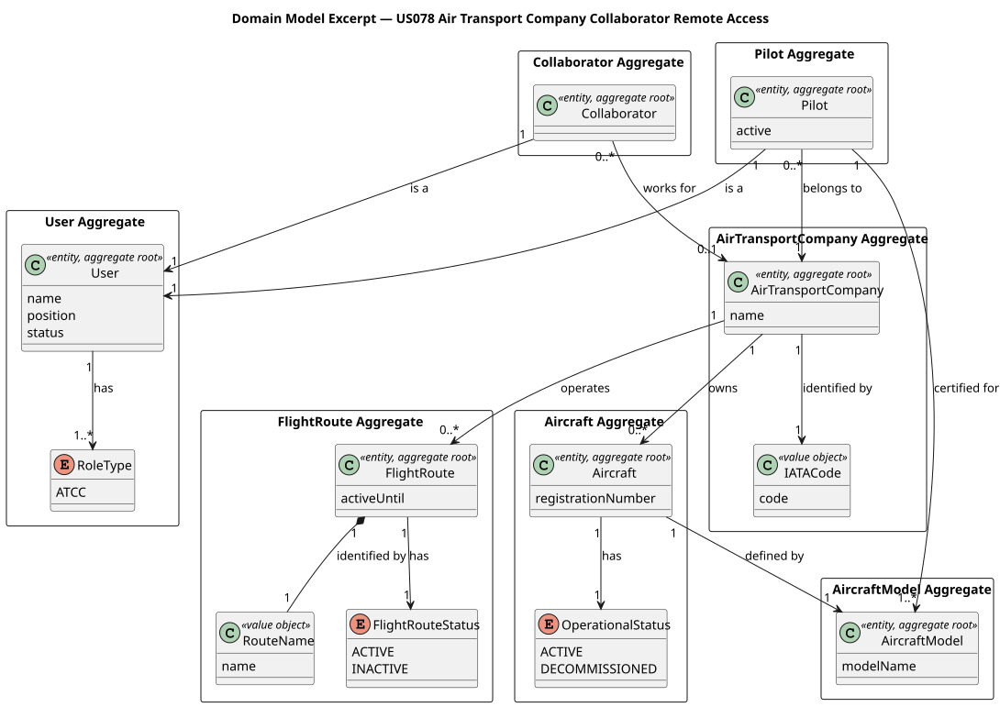
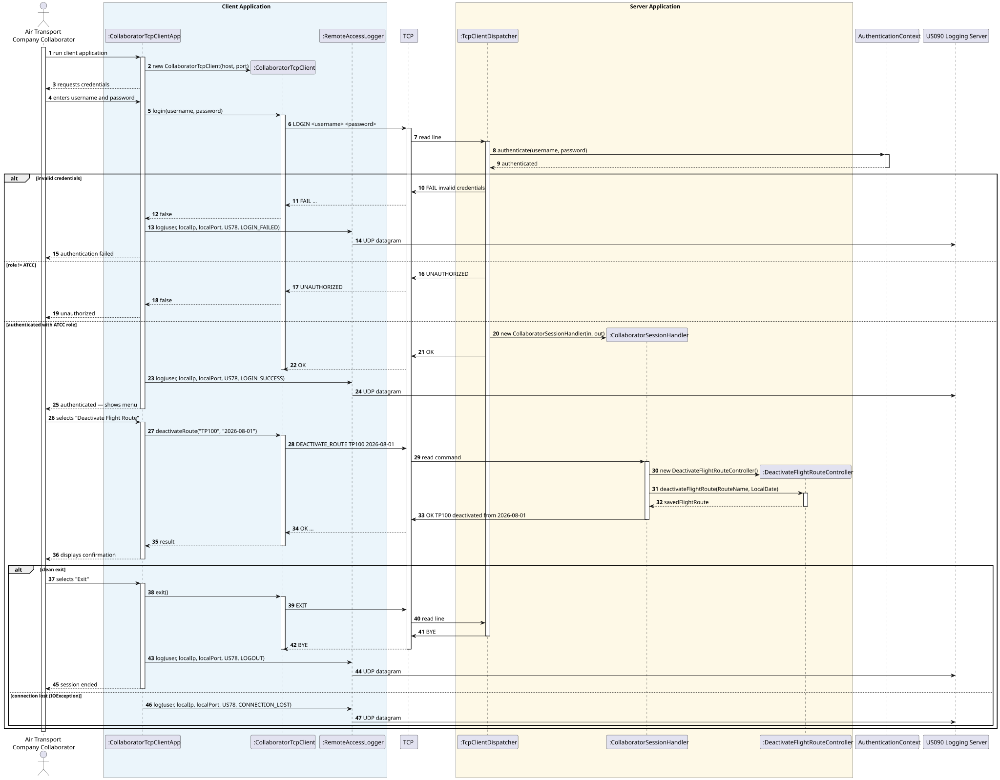
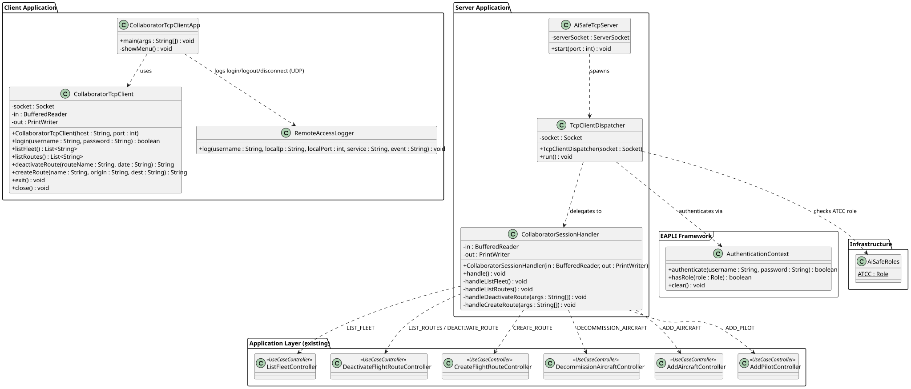

# US078 — Air Transport Company Collaborator Remote Access

## 1. Context

This US is implemented in Sprint 3. It allows an **Air Transport Company Collaborator (ATCC)** to remotely access the AISafe system using a dedicated TCP client application — the **Air Transport Company App**. The client communicates with a TCP server embedded in the main AISafe application; no direct interaction with the database is permitted from the client side.

The TCP server is shared across all remote-access user stories (US044, US078, US086). Each actor connects to the same server on the same port and, after authentication, is granted access only to the commands corresponding to their role. For US078, the role is `ATCC`.

The ATCC user stories that must be remotely available are the company-management use cases already implemented in previous sprints: List Fleet (US072, incl. the US072a-d filters), Create / Deactivate Flight Route (US073/US074), Decommission Aircraft (US071), pilot roster management (US076/US077), Add Aircraft (US070) and Add Pilot (US075). US078 adds **no new business logic** — it is a delivery mechanism that invokes the existing application controllers server-side.

### 1.1 List of issues

- **Analysis:** Define the TCP protocol, the authentication mechanism, and the set of ATCC commands to be exposed remotely. Identify the existing controllers to reuse.
- **Design:** Define the architecture — the shared TCP server, the new `CollaboratorSessionHandler`, the `CollaboratorTcpClient`/`App`, the client-side UDP remote-access logging, and the protocol specification. Produce sequence and class diagrams.
- **Implement:** Add the `ATCC` branch to `TcpClientDispatcher`, implement `CollaboratorSessionHandler`, the standalone client `CollaboratorTcpClientApp`, and the `RemoteAccessLogger` (client-side UDP, US090).
- **Test:** Unit tests on the session handler (in-memory streams), implementation tests over a real loopback socket, and manual integration tests.

---

## 2. Requirements

**US078** As an Air Transport Company Collaborator, I want to remotely access the system using the Air Transport Company App.

**Acceptance Criteria:**

| AC      | Description                                                                                                                                          |
|---------|------------------------------------------------------------------------------------------------------------------------------------------------------|
| AC078.1 | A specific TCP-based network client application is required to communicate with the server application embedded in the system.                       |
| AC078.2 | The client application interaction with the system must be limited to the TCP connection — any direct interaction with the database is unacceptable. |
| AC078.3 | All the Air Transport Company Collaborator user stories must be remotely available using this client application.                                    |
| AC078.4 | Authentication and authorization must be enforced — only authenticated users with the `ATCC` role may execute collaborator commands.                 |

**ATCC user stories available remotely:**

| US     | Description                     | Command                  | Reused Controller                 |
|--------|---------------------------------|--------------------------|-----------------------------------|
| US072  | List the company's fleet        | `LIST_FLEET`             | `ListFleetController`             |
| US072a | List fleet by model             | `LIST_FLEET_BY_MODEL`    | `ListFleetController`             |
| US072b | List fleet by maker             | `LIST_FLEET_BY_MAKER`    | `ListFleetController`             |
| US072c | List fleet by capacity          | `LIST_FLEET_BY_CAPACITY` | `ListFleetController`             |
| US072d | List fleet by age               | `LIST_FLEET_BY_AGE`      | `ListFleetController`             |
| US071  | Decommission an aircraft        | `DECOMMISSION_AIRCRAFT`  | `DecommissionAircraftController`  |
| US073  | Create a flight route           | `CREATE_ROUTE`           | `CreateFlightRouteController`     |
| US074  | List active flight routes       | `LIST_ROUTES`            | `DeactivateFlightRouteController` |
| US074  | Deactivate a flight route       | `DEACTIVATE_ROUTE`       | `DeactivateFlightRouteController` |
| US076  | List the company's pilot roster | `LIST_PILOTS`            | `ListPilotRosterController`       |
| US077  | Remove (deactivate) a pilot     | `REMOVE_PILOT`           | `RemovePilotController`           |

> Scope note: this iteration exposes the **eleven commands** above, covering US071–US074, US076, US077 and the US072a-d fleet filters.

**Dependencies/References:**

| Dependency    | Reason                                                                                                                    |
|---------------|---------------------------------------------------------------------------------------------------------------------------|
| US030         | Authentication and authorization must be in place; the `ATCC` role must exist.                                            |
| US060 / US061 | The ATCC is a `Collaborator` linked to an `AirTransportCompany`; the company is resolved from the authenticated session.  |
| US070–US077   | The collaborator use-case controllers reused server-side must already exist.                                              |
| US086         | Provides the shared TCP skeleton (`AiSafeTcpServer`, `TcpClientDispatcher`, `AuthenticationContext`) reused by US078.     |
| US090         | The Remote Accesses Logging Server receives the UDP datagrams emitted by the US078 client app on login/logout/disconnect. |

---

## 3. Analysis

US078 requires a standalone TCP client application and reuses the TCP server embedded in the main AISafe application. The client connects to the server, authenticates as an ATCC, and then issues commands that map to existing collaborator use cases — the server executes those use cases on behalf of the remote user.

### Architecture overview

The TCP server (`AiSafeTcpServer`) runs inside the same JVM as the console application, sharing the same persistence context and EAPLI authentication infrastructure. One `TcpClientDispatcher` thread is spawned per accepted connection; it handles authentication and then delegates to a role-specific session handler. For the `ATCC` role this is the new `CollaboratorSessionHandler`. The UDP remote-access logging is emitted by the **client** application.

```
[CollaboratorTcpClientApp]  ──TCP──►  [AiSafeTcpServer]
                                             │
                                     [TcpClientDispatcher]  (one thread per connection)
                                             │  authenticates via AuthenticationContext
                                             │  role == ATCC?
                                             ▼
                                     [CollaboratorSessionHandler]
                                             │
                          ┌──────────────────┼─────────────────────┐
                          ▼                   ▼                     ▼
            [ListFleetController]  [DeactivateFlightRouteController]  [CreateFlightRouteController] ...
                          │                   │                     │
                          ▼                   ▼                     ▼
            [AircraftRepository]   [FlightRouteRepository]   (existing repositories)

   [CollaboratorTcpClientApp] ─(login/logout/disconnect)─► [RemoteAccessLogger] ──UDP──► [US090 Logging Server]
```

### TCP Protocol

The protocol is text-based and line-oriented (UTF-8, `\n` terminated), identical in spirit to US086. This keeps it simple to implement, test with `telnet`/`nc`, and read in logs.

**Authentication phase:**

```
C→S:  LOGIN <username> <password> ATCC
S→C:  OK
  or
S→C:  FAIL <reason>          (invalid credentials)
  or
S→C:  UNAUTHORIZED           (authenticated but not an ATCC)
```

**Command phase (after successful LOGIN as ATCC):**

```
# List the company's fleet
C→S:  LIST_FLEET
S→C:  OK <count>
S→C:  <registration> | <model> | <maker> | <year> | <status>   (one line per aircraft)

# List active flight routes
C→S:  LIST_ROUTES
S→C:  OK <count>
S→C:  <routeName> | <origin> | <destination> | ACTIVE           (one line per active route)

# Deactivate a flight route
C→S:  DEACTIVATE_ROUTE <routeName> <YYYY-MM-DD>
S→C:  OK <routeName> deactivated from <date>
  or
S→C:  ERROR <message>

# Create a flight route
C→S:  CREATE_ROUTE <routeName>;<originIATA>;<destinationIATA>
S→C:  OK <routeName>
  or
S→C:  ERROR <message>

# Filter the fleet (US072a-d) — same OK <count> + per-aircraft response as LIST_FLEET
C→S:  LIST_FLEET_BY_MODEL <modelName>
C→S:  LIST_FLEET_BY_MAKER <makerName>
C→S:  LIST_FLEET_BY_CAPACITY <minSeats>
C→S:  LIST_FLEET_BY_AGE <fromYear>
S→C:  OK <count>
S→C:  <registration> | <model> | <maker> | <year> | <status>   (one line per aircraft)
  or
S→C:  ERROR <message>          (e.g. invalid number for capacity/age)

# Decommission an aircraft of your fleet
C→S:  DECOMMISSION_AIRCRAFT <registration>
S→C:  OK <registration> decommissioned
  or
S→C:  ERROR <message>

# List the company's pilot roster
C→S:  LIST_PILOTS
S→C:  OK <count>
S→C:  <pilotId> | <company> | <ACTIVE|INACTIVE>                 (one line per pilot)
  or
S→C:  ERROR <message>

# Deactivate (remove) a pilot
C→S:  REMOVE_PILOT <pilotId>
S→C:  OK pilot <pilotId> deactivated
  or
S→C:  ERROR <message>

# End session
C→S:  EXIT
S→C:  BYE
```

Any unrecognised command receives `UNKNOWN_COMMAND`.

### Reuse of existing classes

`CollaboratorSessionHandler` contains **no business logic** — each command is delegated to the corresponding existing application controller (`ListFleetController`, `DeactivateFlightRouteController`, `CreateFlightRouteController`, …). Those controllers already enforce the ATCC role (`authz.ensureAuthenticatedUserHasAnyOf(AiSafeRoles.ATCC)`) and resolve the collaborator's company from the authenticated session, so the same `atcc1 → TAP` ownership rules apply remotely exactly as in the console.

Authentication reuses `AuthenticationContext.authenticate(username, password)` (EAPLI), and role verification uses `AuthenticationContext.hasRole(AiSafeRoles.ATCC)`.

### Remote-access logging (UDP, US090)

On each authentication outcome and at session end, the **client application** (`CollaboratorTcpClientApp`) emits a fire-and-forget UDP datagram to the US090 logging server through `RemoteAccessLogger`. The client knows its own service id (`US78`) and local IP/port (`socket.getLocalAddress()` / `getLocalPort()`); it logs `LOGIN_SUCCESS`/`LOGIN_FAILED` after reading the login reply, `LOGOUT` on clean exit, and `CONNECTION_LOST` on `IOException`. An abruptly killed client cannot emit a datagram — an accepted limitation (only detectable disconnects are reported). The agreed payload is ASCII, pipe-delimited:

```
<timestamp> | <username> | <clientIP> | <clientPort> | <serviceId> | <EVENT>
```

`serviceId = US78`; `EVENT ∈ { LOGIN_SUCCESS, LOGIN_FAILED, LOGOUT, CONNECTION_LOST }`.

### Key design decisions

**Reuse of the shared server** — US078 does not create a new server; it adds an `ATCC` branch to the existing `TcpClientDispatcher`, which already foresaw this extension point (OCP).

**Role-specific session handler** — all ATCC command logic lives in `CollaboratorSessionHandler`, isolated from the dispatcher and from the other roles' handlers.

**Client-side UDP logging** — the UDP datagram is sent by the client app, not the server, because the client owns its service identity (`US78`) and its local IP/port, and because the UDP networking is precisely the exercise of the remote-access client (US044/US078/US086).

**No new domain objects** — the TCP/UDP layer is infrastructure (a delivery mechanism); all aggregates already exist in Domain Model V8.

### Main classes identified

| Class                                                                                                   | Type                     | Responsibility                                                                                                           |
|---------------------------------------------------------------------------------------------------------|--------------------------|--------------------------------------------------------------------------------------------------------------------------|
| `CollaboratorTcpClientApp`                                                                              | Client Main              | Standalone client entry point; interactive ATCC menu; emits UDP log events                                               |
| `CollaboratorTcpClient`                                                                                 | Client                   | Encapsulates TCP communication: `login()`, `listFleet()` (+ `listFleetBy*` filters), `decommissionAircraft()`, `listRoutes()`, `createRoute()`, `deactivateRoute()`, `listPilots()`, `removePilot()`, `exit()` |
| `RemoteAccessLogger`                                                                                    | UDP logger (client-side) | Lives in the shared package (`aisafe.app.logging`); sends remote-access events to the US090 logging server              |
| `AiSafeTcpServer` *(existing)*                                                                          | Server                   | Opens `ServerSocket` on port 9999; accepts connections; spawns dispatcher threads                                        |
| `TcpClientDispatcher` *(modified)*                                                                      | `Runnable`               | Authenticates one connection; adds the `ATCC` branch delegating to `CollaboratorSessionHandler`                          |
| `CollaboratorSessionHandler`                                                                            | Session Handler          | ATCC command loop; delegates each command to an existing controller                                                      |
| `AuthenticationContext` *(existing)*                                                                    | Auth adapter             | Authenticates credentials via EAPLI; verifies role                                                                       |
| `ListFleetController`, `DeactivateFlightRouteController`, `CreateFlightRouteController`, … *(existing)* | Controllers              | Execute the collaborator use cases; reused server-side                                                                   |
| `AiSafeRoles.ATCC` *(existing)*                                                                         | Role constant            | Used in the dispatcher to authorize collaborator access                                                                  |

The following domain model excerpt shows the aggregates touched by this use case:



## 4. Design

### 4.1. Realization

The flow has two phases: **authentication** and **command execution**.

**Authentication phase:**

1. `CollaboratorTcpClientApp` starts and creates a `CollaboratorTcpClient` connected to the server host and port.
2. The user enters credentials; `CollaboratorTcpClient.login(username, password)` sends `LOGIN <username> <password> ATCC` — the service token declares to the shared server that this connection expects the ATCC handler (AC078.4).
3. Server-side, `TcpClientDispatcher` reads the `LOGIN` line and calls `AuthenticationContext.authenticate(username, password)`.
4. On failure, the server sends `FAIL invalid credentials` and closes; the **client** logs `LOGIN_FAILED` via `RemoteAccessLogger` after reading the reply.
5. If authenticated but not an ATCC (`AuthenticationContext.hasRole(AiSafeRoles.ATCC)` is false), the server sends `UNAUTHORIZED` and closes.
6. If authenticated as ATCC, the server sends `OK` and instantiates `CollaboratorSessionHandler`; the **client** logs `LOGIN_SUCCESS` after reading `OK`.

**Command phase — `DEACTIVATE_ROUTE` (representative):**

7. The ATCC selects "Deactivate Flight Route" and provides a route name and date.
8. `CollaboratorTcpClient.deactivateRoute(name, date)` sends `DEACTIVATE_ROUTE <routeName> <date>`.
9. `CollaboratorSessionHandler` parses the arguments and calls `DeactivateFlightRouteController.deactivateFlightRoute(new RouteName(name), LocalDate.parse(date))`.
10. The controller verifies ATCC ownership and the planned-flight rule (AC074.3/AC074.4) and persists the change.
11. On success the server responds `OK <routeName> deactivated from <date>`; on failure `ERROR <message>`.

**Exit:**

12. The ATCC selects "Exit"; `CollaboratorTcpClient.exit()` sends `EXIT`; the server responds `BYE`; the **client** logs `LOGOUT` on clean exit and `CONNECTION_LOST` if it catches an `IOException`.

The following sequence diagram illustrates the full flow:



The following class diagram shows the classes involved:



### 4.2. Acceptance Tests

All automated tests and manual acceptance scripts are documented in [tests.md](tests.md).

---

## 5. Implementation

The implementation is distributed across the following packages in `aisafe.base`:

| Package                         | Class                              | Role                                                                                       |
|---------------------------------|------------------------------------|--------------------------------------------------------------------------------------------|
| `aisafe.tcpserver`              | `AiSafeTcpServer` *(existing)*     | Accepts connections; spawns `TcpClientDispatcher` daemon threads                           |
| `aisafe.tcpserver`              | `TcpClientDispatcher` *(modified)* | Adds the `ATCC` branch delegating to `CollaboratorSessionHandler`                          |
| `aisafe.tcpserver.collaborator` | `CollaboratorSessionHandler`       | ATCC command loop: `LIST_FLEET` (+ `_BY_MODEL`/`_BY_MAKER`/`_BY_CAPACITY`/`_BY_AGE`), `DECOMMISSION_AIRCRAFT`, `LIST_ROUTES`, `CREATE_ROUTE`, `DEACTIVATE_ROUTE`, `LIST_PILOTS`, `REMOVE_PILOT`, `EXIT` |
| `aisafe.app.logging`            | `RemoteAccessLogger`               | Client-side UDP logger (shared package, reused by US078/US086); sends datagrams to US090 on login/logout/disconnect |
| `aisafe.app.collaborator`       | `CollaboratorTcpClient`            | Client-side TCP communication                                                              |
| `aisafe.app.collaborator`       | `CollaboratorTcpClientApp`         | Standalone client entry point; interactive ATCC menu; emits UDP log events                 |
| `aisafe.app.console`            | `AiSafeConsoleApp` *(existing)*    | Already starts `AiSafeTcpServer` in a daemon thread                                        |

The `ATCC` branch added to `TcpClientDispatcher`. Routing is driven by the optional **service
token** (the 4th token of the `LOGIN` line), the OCP extension point already present for the
other remote-access apps. The US086 pilot client omits the token (3-token `LOGIN`), so its
legacy path is preserved:

```java
// LOGIN <username> <password> [service]  — the optional 4th token selects the service.
final String service = parts.length >= 4 ? parts[3].trim() : "";

if (!AuthenticationContext.authenticate(username, password)) {
    out.println("FAIL invalid credentials");
    return;
}

if ("ATCC".equals(service)) {                            // US078 — Air Transport Company App
    if (AuthenticationContext.hasRole(AiSafeRoles.ATCC)) {
        out.println("OK");
        new CollaboratorSessionHandler(in, out).handle();
    } else {
        out.println("UNAUTHORIZED");
    }
} else if ("WEATHER".equals(service)) {                  // US044 — Weather Person App
    if (AuthenticationContext.hasRole(AiSafeRoles.WEATHER_PERSON)) {
        out.println("OK");
        new WeatherPersonSessionHandler(in, out).handle();
    } else {
        out.println("UNAUTHORIZED");
    }
} else {                                                 // US086 — Pilot App / no token declared
    if (AuthenticationContext.hasRole(AiSafeRoles.PILOT)) {
        out.println("OK");
        new PilotSessionHandler(in, out).handle();
    } else {
        out.println("UNAUTHORIZED");
    }
}
```

Each command delegates to an existing controller — no business logic is duplicated:

```java
// DEACTIVATE_ROUTE <routeName> <YYYY-MM-DD>
final FlightRoute saved = new DeactivateFlightRouteController()
        .deactivateFlightRoute(new RouteName(routeName), LocalDate.parse(date));
out.println("OK " + saved.identity() + " deactivated from " + date);
```

The UDP event is emitted client-side, fire-and-forget:

```java
// RemoteAccessLogger (aisafe.app.logging) — invoked by CollaboratorTcpClientApp.
// host, port and serviceId ("US78") are set in the constructor.
public void log(String username, String clientIp, int clientPort, String event) {
    final String payload = String.join(" | ",
            LocalDateTime.now().format(TIMESTAMP), username, clientIp,
            String.valueOf(clientPort), serviceId, event);
    try (DatagramSocket socket = new DatagramSocket()) {
        final byte[] data = payload.getBytes(StandardCharsets.US_ASCII);
        socket.send(new DatagramPacket(data, data.length, InetAddress.getByName(host), port));
    } catch (Exception ignored) {
        // fire-and-forget — never block the client on logging
    }
}
```

---

## 6. Integration/Demonstration

**Prerequisites:** Run from the `aisafe.base` directory with Maven 3.9+ and Java 21. The bootstrap creates `atcc1 / Password1` (role `ATCC`, company TAP) automatically. The US090 logging server should be running to observe the UDP events (optional).

**Start the server:**

1. Run `AiSafeConsoleApp` — the TCP server starts on port 9999 automatically.

**Connect and authenticate:**

2. Run `CollaboratorTcpClientApp` in a separate terminal.
3. Enter host `localhost` and port `9999`.
4. Enter credentials `atcc1` / `Password1`.
5. The server responds `OK`, the client emits a `LOGIN_SUCCESS` UDP event, and the collaborator menu is displayed:
   ```
   === Air Transport Company Remote Menu ===
   -- Fleet --
   1. List Fleet
   2. List Fleet by Model
   3. List Fleet by Maker
   4. List Fleet by Capacity (min seats)
   5. List Fleet by Age (from year)
   6. Decommission Aircraft
   -- Flight Routes --
   7. List Flight Routes
   8. Create Flight Route
   9. Deactivate Flight Route
   -- Pilots --
   10. List Pilots
   11. Remove Pilot
   0. Exit
   ```

**Deactivate a route:**

6. Select option `9`, enter `TP100` and `2026-08-01`.
7. The server responds:
   ```
   OK TP100 deactivated from 2026-08-01
   ```

**Authentication / authorization failure scenarios:**

- Wrong credentials → server responds `FAIL invalid credentials` and closes; the client emits a `LOGIN_FAILED` UDP event.
- Non-ATCC account (e.g. `pilot1`) → server responds `UNAUTHORIZED` and closes.

---

## 7. Observations

- The TCP server is shared across US044, US078 and US086. Each role dispatches to a dedicated session handler (`CollaboratorSessionHandler` for US078), keeping role-specific logic isolated — this is the OCP extension point already present in `TcpClientDispatcher`.
- `CollaboratorSessionHandler` contains no business logic; it delegates every command to an existing application controller. The controllers enforce the `ATCC` role and resolve the company from the authenticated session, so remote ownership rules match the console exactly (AC078.3/AC078.4).
- `CollaboratorTcpClientApp` is a standalone application with only JDK imports — it has no dependency on any JPA or repository class; all persistence is performed exclusively server-side (AC078.2).
- The UDP remote-access events are emitted by the **client** (`CollaboratorTcpClientApp`): `LOGIN_SUCCESS`/`LOGIN_FAILED` after the login reply, `LOGOUT` on clean exit, `CONNECTION_LOST` on `IOException`. A brutally killed client cannot report — an accepted limitation; only detectable disconnects are logged. The datagram format is shared by US044/US078/US086 and consumed by US090/US091.
- `TcpClientDispatcher` always calls `AuthenticationContext.clear()` in a `finally` block so the thread-local EAPLI session is released even on an unexpected disconnect.
- The LOGIN command includes a service token (ATCC) as a 4th token. This allows the shared `TcpClientDispatcher` to route to `CollaboratorSessionHandler` only for users with the `ATCC` role, regardless of which other handlers are active (e.g. `PILOT` for US086). The US086 pilot client omits the token (3-token LOGIN), preserving backward compatibility.
