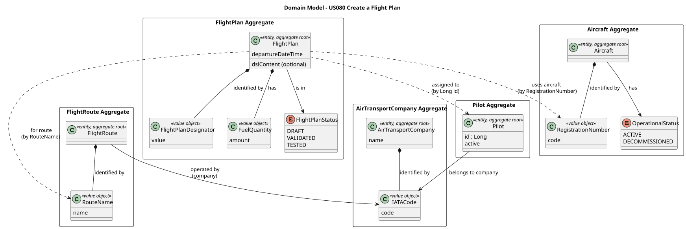
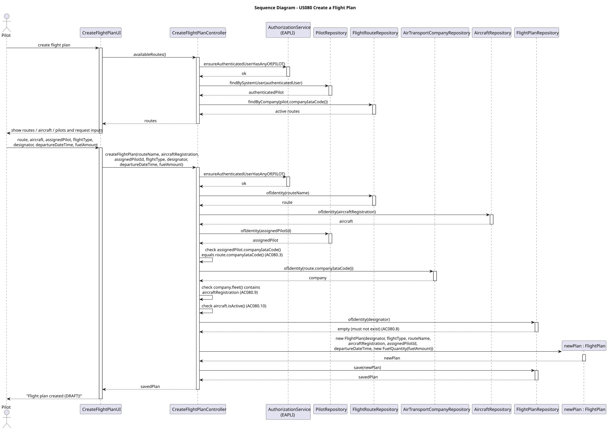
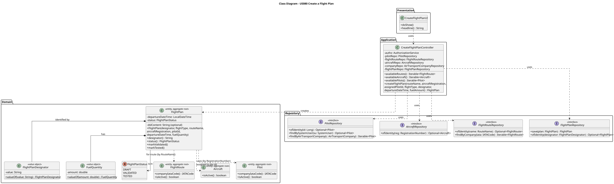

# US080 — Create a Flight Plan

## 1. Context

This US is being developed in Sprint 3. It allows a Pilot to register a flight plan for an existing flight route, providing the aircraft, departure date/time and fuel quantity. The pilot assigned to the plan must belong to the route's company. The flight plan is created with status `DRAFT` and is the starting point of a multi-step validation process — semantic validation via the Flight DSL (US083) and flight testing in the simulator (US085).

### 1.1 List of issues

Analysis: Define the domain rules for `FlightPlan` form-based creation: the relation to `FlightRoute`, `Aircraft` and `Pilot`, the company-matching invariants, and the initial status.

Design: Define the architecture for flight plan registration (UI, controller, repository) and align with the pre-existing `FlightPlan` aggregate already partially shaped by US081 (creation from DSL file) and US083 (DSL specification).

Implement: Implement the form-based `FlightPlan` creation, the application controller, the console UI, and integrate with the Pilots' menu.

Test: Unit tests for `FlightPlan` domain invariants (above 90% coverage) and manual acceptance tests for the end-to-end flow.

---

## 2. Requirements

**US080** As a Pilot, I want to register a flight plan for a route.

> *(Enunciado, p. 19, lines 9–12):* "I must add the aircraft, departure date/time, fuel quantity, pilot. The pilot must be of the route's company. Flight plan status is set to 'draft' when created and must undergo a multi-step validation process."

**Acceptance Criteria:**

- **AC080.1** Only an authenticated user with the `PILOT` role may register a flight plan.
- **AC080.2** The flight plan must reference an existing `FlightRoute` already registered in the system.
- **AC080.3** The pilot assigned to the flight plan must belong to the company of the flight route — i.e. `pilot.companyIataCode()` must equal `flightRoute.companyIataCode()`.
- **AC080.4** The aircraft referenced in the flight plan must already exist in the system.
- **AC080.5** The fuel quantity must be strictly positive.
- **AC080.6** The departure date/time must be in the future (it is not allowed to plan a flight in the past).
- **AC080.7** The flight plan is created with status `DRAFT`.
- **AC080.8** The flight plan has a unique identifier. *(The specific identifier scheme — e.g. flight designator format `xxNNNN` — is deferred to the Analysis phase.)*
- **AC080.9** The aircraft assigned to the flight plan must belong to the company of the flight route.
- **AC080.10** The aircraft must be in `ACTIVE` operational status (not `DECOMMISSIONED`).

**Notes on interpretation:**

The enunciado does not provide an explicit "Acceptance Criteria" section for US080. The criteria above are derived from the user story statement and from the system specifications (sections 3.2 and 3.4 of the requirements document).

The user story is read with the interpretation that the **assigned pilot is an explicit input**, chosen by the authenticated pilot from the active pilots of the route's company. The "pilot" listed alongside "aircraft, departure date/time, fuel quantity" is a field that the operator must provide. The rule *"The pilot must be of the route's company"* (literally stated in the enunciado) only makes sense if the pilot is an actual choice — otherwise it would be trivially satisfied and there would be no need to mention it. Under this reading the use case supports both self-assignment (the authenticated pilot selects themselves) and assignment of another pilot of the same company (e.g. a senior pilot scheduling a flight plan for a colleague), provided the AC080.3 constraint holds.

The full set of inputs the operator must provide is therefore: **flight route, aircraft, departure date/time, fuel quantity, assigned pilot**.

**Dependencies/References:**

- **US030** — Authentication and Authorization (the user must be authenticated with the `PILOT` role).
- **US055** — Create an Aircraft Model (the aircraft model must exist for the aircraft to exist).
- **US060** — Register an Air Transport Company (the route belongs to a company; the pilot also belongs to a company).
- **US070** — Add an Aircraft to Fleet (the aircraft must be registered).
- **US073** — Create a flight route (the route must exist before a flight plan can reference it).
- **US075** — Add a pilot (the pilot must be registered, with `companyIataCode` set).
- Acts as a prerequisite for:
  - **US082** — Insert weather data in a flight (operates on an existing flight plan).
  - **US083** — Flight DSL specification and validation (LPROG — semantic validation of the plan).
  - **US085** — Test/validate flight plan (LAPR4 — tests the plan in simulation).

**Out of scope for this user story:**

- Flight plan creation **from a DSL file** — covered by US081 (LPROG).
- The **multi-step validation process** itself (lexical/syntactic/semantic validation, fuel calculations, collision detection) — covered by US083 (LPROG) and US085 (LAPR4). US080 only puts the plan in `DRAFT`; the subsequent validation states are the responsibility of those user stories.
- **Creation of the flight route** — covered by US073.
- **Multi-leg flight plans** with intermediate stops and segment definitions — relevant only for the DSL-based flight plans (US081) and consumed by the simulation (US100). The form-based creation in US080 registers a single-leg plan covering the route from its declared origin to its destination.
- **Crew assignment and passenger/cargo load** — section 3.2 lists these as part of a flight's domain, but they are not in the explicit input list for US080 ("aircraft, departure date/time, fuel quantity, pilot") and are therefore not handled here.

---

## 3. Analysis

The flight plan is a central concept in the AISafe domain. It is created in two distinct ways: via a **DSL file** imported by the pilot (US081, LPROG) and via a **form-based UI** filled by the pilot (this US080). A single `FlightPlan` aggregate root represents both — it is the same domain concept regardless of the creation source.

The main design decisions were:

**Single `FlightPlan` aggregate** — Rather than creating two separate aggregates (one for DSL, one for form-based), the existing `FlightPlan` (originally created for US081) is extended to support both creation paths. This keeps the domain concept unified and lets downstream user stories (US083 semantic validation, US085 flight testing) operate on a single type. The DSL-specific field `dslContent` becomes optional — it is non-null when the plan was imported from a file and null when it was created via the form.

**Form-based fields added** — To satisfy AC080.2 through AC080.6, the `FlightPlan` is extended with five new attributes: `routeName` (the `RouteName` of the `FlightRoute` the plan is for), `aircraftRegistration` (the `RegistrationNumber` of the assigned aircraft), `pilotId` (the `Long` identity of the assigned `Pilot`), `departureDateTime` (a `LocalDateTime`), and `fuelQuantity` (a `FuelQuantity` value object).

**References to other aggregates by identity** — Following the DDD principle of low coupling between aggregates, `FlightPlan` references `FlightRoute`, `Aircraft` and `Pilot` only by their identity value objects (`RouteName`, `RegistrationNumber`, `Long`), never by object reference. This is consistent with the `Pilot` aggregate (US075), which references `AircraftModel` by id only.

**`FuelQuantity` as a Value Object** — A new value object encapsulates the fuel amount along with the positivity validation (AC080.5). Storing it as a plain `double` would scatter the validation across the constructor and any setter. Making it a VO keeps the rule in one place and makes the domain more expressive.

**`departureDateTime` as plain `LocalDateTime`** — A single date-time field with a single rule ("must be in the future") does not justify a dedicated value object. The constraint is enforced in the `FlightPlan` constructor (AC080.6). This is consistent with `User.skillsAssessmentDate` and similar single-rule date fields elsewhere in the project.

**Designator chosen by the pilot, validated** — The `FlightPlanDesignator` is supplied by the pilot when creating the plan via the form (mirroring how the DSL specifies it for US081). The aggregate validates the designator's format and the controller validates its uniqueness and its coherence with the route's company prefix (the first two letters of the designator must match `route.companyIataCode()`).

**Status starts at `DRAFT`** — The constructor sets `status = DRAFT` (AC080.7), reusing the existing `FlightPlanStatus` enum. Downstream user stories (US083, US085) transition the status to `VALIDATED` and `TESTED` via the already-existing `markValidated()` and `markTested()` methods on the aggregate — US080 does not touch these transitions.

**Cross-aggregate invariants handled in the controller** — AC080.3 (pilot of route's company), AC080.9 (aircraft of route's company), and AC080.10 (aircraft ACTIVE) involve more than one aggregate. They are validated in the application controller before the aggregate is constructed. The aggregate itself owns only its own invariants (fuel > 0, departure in future, all required IDs non-null, status starts at `DRAFT`).

The main classes identified are:

| Class | Type | Responsibility |
|-------|------|----------------|
| `FlightPlan` | Entity / Aggregate Root | Holds the plan; extended with form-based fields; owns the status lifecycle |
| `FlightPlanDesignator` | Value Object (identity) | Unique flight plan identifier |
| `FlightPlanStatus` | Enum | `DRAFT` (initial) → `VALIDATED` → `TESTED` |
| `FuelQuantity` | Value Object (new) | Encapsulates the fuel amount with positivity validation |
| `FlightRoute` | Other aggregate (referenced by `RouteName`) | The route the plan is for |
| `RouteName` | Value Object (identity of `FlightRoute`) | Format `[A-Z]{2}[0-9]{1,4}` (e.g. `TP123`) |
| `Aircraft` | Other aggregate (referenced by `RegistrationNumber`) | The aircraft assigned |
| `RegistrationNumber` | Value Object (identity of `Aircraft`) | The aircraft's unique registration |
| `Pilot` | Other aggregate (referenced by `Long` id) | The pilot assigned |
| `IATACode` | Value Object | The company IATA code used in cross-aggregate matching |

The following diagram shows the domain model excerpt relevant to this US:



---

## 4. Design

### 4.1. Realization

The use case follows the standard layered flow established in the project: `CreateFlightPlanUI` collects the inputs and delegates to `CreateFlightPlanController`, which orchestrates the lookups, enforces the cross-aggregate rules, builds the `FlightPlan` aggregate and persists it through `FlightPlanRepository`.

To present the choices to the pilot, the controller first resolves the **authenticated pilot's company** (the session user is a `Pilot`, resolved via `PilotRepository.findBySystemUser`) and then offers only the data scoped to that company:

- `availableRoutes()` — the active `FlightRoute`s of the pilot's company (`FlightRouteRepository.findByCompany`, filtered by `isActive`).
- `availableAircraft()` — the active aircraft of the company's fleet (`company.fleet()` registration numbers resolved through `AircraftRepository.ofIdentity`, filtered by `Aircraft.isActive`).
- `availablePilots()` — the active pilots of the company (`PilotRepository.findByAirTransportCompany`, filtered by `Pilot.isActive`).

The creation step then performs:

1. `authz.ensureAuthenticatedUserHasAnyOf(AiSafeRoles.PILOT)` — only a pilot may create a plan (AC080.1).
2. Fetch the `FlightRoute` by `RouteName`; it must exist (AC080.2).
3. Fetch the `Aircraft` by `RegistrationNumber`; it must exist (AC080.4).
4. Fetch the assigned `Pilot` by id; it must exist.
5. Validate that the assigned pilot belongs to the route's company — `pilot.companyIataCode()` equals `route.companyIataCode()` (AC080.3).
6. Validate that the aircraft belongs to the route's company — the company's `fleet()` contains the aircraft registration (AC080.9).
7. Validate that the aircraft is `ACTIVE` (AC080.10).
8. Validate that the designator does not already exist (`FlightPlanRepository.ofIdentity` absent) — AC080.8. The designator format itself is validated by the `FlightPlanDesignator` value object.
9. Instantiate the `FlightPlan` through the new form-based constructor — the constructor enforces the aggregate-owned invariants: fuel quantity is wrapped in a `FuelQuantity` value object (strictly positive, AC080.5), the departure date/time must be in the future (AC080.6), and the status is set to `DRAFT` (AC080.7).
10. Persist the plan via `FlightPlanRepository.save()`.

Unlike US075 (which creates two coordinated aggregates — `SystemUser` and `User`), US080 creates a **single** aggregate (`FlightPlan`) and therefore does not require an explicit transactional context — the single `save()` is atomic. The preceding repository calls are read-only lookups.

> **Flight type input** — The existing `FlightPlan` entity has a non-null `flightType` attribute (REGULAR / CHARTER), defined as a flight characteristic in section 3.2 of the requirements. Although the US080 statement lists only "aircraft, departure date/time, fuel quantity, pilot", the flight type is a mandatory attribute of the flight domain, so it is also collected by the form. This keeps the form-based plan consistent with the DSL-based plan (US081), which obtains the flight type from the parsed file.

> **Nullable fields to support both creation paths** — Because a single `FlightPlan` aggregate serves both creation paths, the columns specific to each path are nullable. The form-based fields (`routeName`, `aircraftRegistration`, `pilotId`, `departureDateTime`, `fuelQuantity`) are null for plans imported from a DSL file (US081), and the `dslContent` field is null for plans created via this form. Marking any of these `nullable = false` would break the other creation path. This nullability is the accepted trade-off of the single-aggregate decision taken in the Analysis; both constructors guarantee that the fields relevant to their own path are non-null, so a fully-formed plan is never observable with missing data for its creation path.

The following sequence diagram illustrates the flow:



The following class diagram shows the classes involved:



### 4.2. Acceptance Tests

The `FlightPlan` aggregate invariants (fuel positivity, future departure, status starts at `DRAFT`, required identifiers non-null) and the `FuelQuantity` and `FlightPlanDesignator` value objects are covered by automated unit tests. The cross-aggregate rules (AC080.3, AC080.9, AC080.10) and the authorization constraint (AC080.1) are validated end-to-end by manual acceptance tests. All tests are documented in [tests.md](tests.md).

---

## 5. Implementation

The implementation extends the pre-existing `FlightPlan` aggregate (shared with US081) and is distributed across the following packages in `aisafe.base`:

| Package | Class | Role |
|---------|-------|------|
| `aisafe.flightplan.domain` | `FlightPlan` | Aggregate root, table `T_FLIGHT_PLAN`; extended with a form-based constructor and the form fields |
| `aisafe.flightplan.domain` | `FuelQuantity` | **New** value object (`@Embeddable`) — fuel amount with positivity validation |
| `aisafe.flightplan.domain` | `FlightPlanDesignator` | Identity value object — now validates the format `xxN(N)(N)(N)(a)` |
| `aisafe.flightplan.domain` | `FlightPlanStatus` | Enum reused unchanged (`DRAFT` → `VALIDATED` → `TESTED`) |
| `aisafe.flightplan.repositories` | `FlightPlanRepository` | Repository interface (unchanged) |
| `aisafe.flightplan.application` | `CreateFlightPlanController` | **New** use case orchestrator |
| `aisafe.app.console.presentation.flightplan` | `CreateFlightPlanUI` | **New** console UI |

**Key implementation details:**

- **Form-based constructor** — `FlightPlan(FlightPlanDesignator, FlightType, RouteName, RegistrationNumber, Long pilotId, LocalDateTime, FuelQuantity)` sets `status = DRAFT` and `dslContent = null`, and enforces the aggregate-owned invariants (all references non-null, departure in the future, fuel via `FuelQuantity`).
- **Form fields are nullable columns** — The five form fields map to nullable columns (`route_name`, `aircraft_registration`, `assigned_pilot_id`, `departure_date_time`, `fuel_quantity`), so DSL-imported plans (which leave them null) and form-based plans (which leave `dslContent` null) share the same table without conflict. `RouteName`, `RegistrationNumber` and `FuelQuantity` are embedded via `@Embedded` + `@AttributeOverride`.
- **Controller scoping** — `CreateFlightPlanController` resolves the authenticated pilot through `PilotRepository.findBySystemUser` and offers only the active routes, aircraft and pilots of that pilot's company (`availableRoutes()`, `availableAircraft()`, `availablePilots()`).
- **Cross-aggregate validation** — `createFlightPlan(...)` enforces AC080.3 (assigned pilot of the route's company), AC080.9 (aircraft in the route company's `fleet()`), AC080.10 (`aircraft.isActive()`) and AC080.8 (designator unique) before constructing the aggregate. Because a single aggregate is written, no explicit transactional context is used — the single `FlightPlanRepository.save()` is atomic.
- **Menu** — `MainMenu.buildFlightPlanMenu()` exposes **Flight Plans > Create Flight Plan** for users with the `PILOT` role, alongside the existing DSL-file option.
- **No `persistence.xml` change required** — the persistence unit uses `<exclude-unlisted-classes>false</exclude-unlisted-classes>`, so the new `FuelQuantity` `@Embeddable` and the extended `FlightPlan` are discovered automatically.

US080 adds **30 automated unit tests** — **9 for `FuelQuantity`**, **11 for `FlightPlanDesignator`**, and **10 form-based tests added to `FlightPlanTest`**; the full `aisafe.base` suite passes (601 tests at the time of writing). The JPA mapping was additionally validated by booting Hibernate against H2 and confirming the generated `T_FLIGHT_PLAN` schema: `designator`, `flight_type` and `status` are `NOT NULL`, while `dsl_content` and the five form columns (`route_name`, `aircraft_registration`, `assigned_pilot_id`, `departure_date_time`, `fuel_quantity`) are nullable.

---

## 6. Integration/Demonstration

**Prerequisites:** Run from the `aisafe.base` directory with Maven 3.9+ and Java 21. The bootstrap must have seeded an Air Transport Company, an ATCC, at least one aircraft in the company fleet, at least one pilot of the company (US075), and at least one active flight route of the company (US073).

```bat
REM For development and quick testing (data is lost on exit)
run-inmemory.bat

REM For demonstration with persistent data (requires H2 server in a separate terminal)
start-h2.bat       REM Terminal 1 — keep running
run-bootstrap.bat  REM Terminal 2 — first time only
run-jpa.bat        REM Terminal 2 — every time
```

**To create a flight plan:**

1. Login with Pilot credentials (e.g., username: `pilot1`, password: `Password1`).
2. Select **Flight Plans > Create Flight Plan** from the main menu.
3. From the listed routes of your company, enter the route name (e.g. `TP123`).
4. From the listed aircraft, enter the registration (e.g. `CS-TUA`).
5. From the listed pilots, enter the assigned pilot id.
6. Choose the flight type (REGULAR / CHARTER).
7. Enter the designator (e.g. `TP1234`), the departure date/time (e.g. `2026-07-01T14:30`), and the fuel quantity in kg.
8. The system confirms with a summary, e.g.:
   ```
   Flight plan successfully created!
     Designator : TP1234
     Route      : TP123
     Aircraft   : CS-TUA
     Type       : REGULAR
     Departure  : 2026-07-01T14:30
     Fuel       : 15000.0 kg
     Status     : DRAFT
   ```

**Validation scenarios:**

- An unknown route / aircraft / pilot produces: `Flight route not found: ...` / `Aircraft not found: ...` / `Pilot not found: ...`.
- A pilot not of the route's company produces: `The assigned pilot does not belong to the route's company.`
- An aircraft not in the route company's fleet produces: `The aircraft does not belong to the route's company.`
- A decommissioned aircraft produces: `The aircraft is not active and cannot be assigned to a flight plan.`
- A non-positive fuel quantity produces: `Fuel quantity must be strictly positive.`
- A past departure date/time produces: `Departure date/time must be in the future.`
- A duplicate designator produces: `A flight plan with designator '...' already exists.`
- A malformed designator produces a format error from `FlightPlanDesignator`.
- A user without the `PILOT` role does not see the **Flight Plans** menu.

---

## 7. Observations

- **Single aggregate, two creation paths** — `FlightPlan` is created either from a DSL file (US081) or via this form (US080). Keeping a single aggregate keeps the domain concept unified and lets downstream user stories (US083 validation, US085 testing) operate on one type. The trade-off is that the columns specific to each path are nullable; each constructor guarantees the fields relevant to its own path are non-null.
- **References by identity** — The plan references its `FlightRoute`, `Aircraft` and `Pilot` by identity (`RouteName`, `RegistrationNumber`, `Long`), never by object reference, preserving low coupling between aggregates — consistent with the `Pilot` aggregate (US075).
- **Flight type is a required input** — Although the user story lists only "aircraft, departure date/time, fuel quantity, pilot", the flight type (REGULAR / CHARTER) is a mandatory flight attribute (section 3.2) and a non-null column, so it is collected by the form.
- **Status lifecycle untouched by US080** — The plan is created in `DRAFT`. The transitions to `VALIDATED` (US083) and `TESTED` (US085) are performed by the already-existing `markValidated()` / `markTested()` methods; US080 does not trigger them.
- **`FlightPlanDesignator` format validation added** — Previously the designator only rejected blank values. It now enforces the `xxN(N)(N)(N)(a)` format from section 3.2. This change is backward-compatible with the DSL path (all existing DSL designators already match the format).
- **Creator vs assigned pilot** — The acceptance criteria constrain only the *assigned* pilot to the route's company. The UI additionally scopes the selectable routes to the authenticated pilot's own company, so in practice a pilot creates plans within their company; the controller does not impose this as a hard rule beyond the AC, since the enunciado does not require it.
