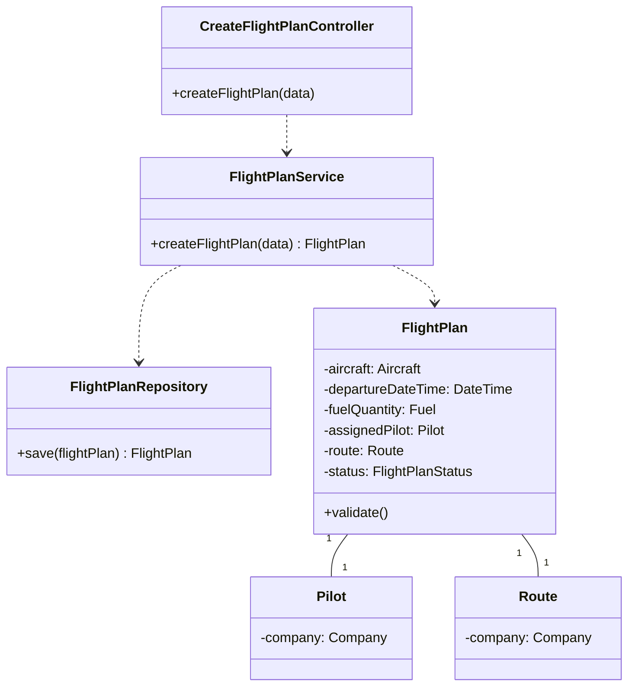
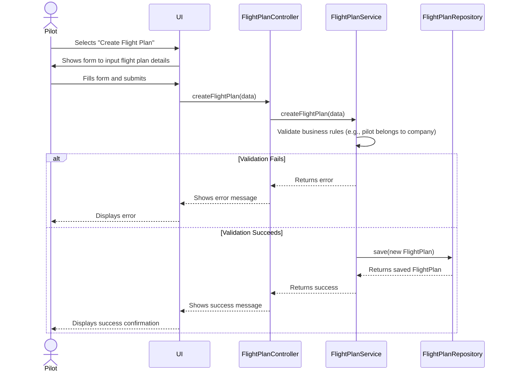

# US080 — Create a Flight Plan

## 1. Context

This user story enables a Pilot to create and submit a new flight plan. The plan is initially created in a "draft" state and must undergo further validation and scheduling steps before it becomes active. This is a core feature for the flight operations domain.

---

## 2. Requirements

**US080** As a Pilot, I want to register a flight plan for a route so that the flight can be formally submitted for validation and scheduling.

**Acceptance Criteria:**

- **AC080.1** The flight plan must include an aircraft, departure date and time, fuel quantity, and an assigned pilot.
- **AC080.2** The assigned pilot must belong to the same company that operates the route.
- **AC080.3** The flight plan status must be set to "draft" upon creation.
- **AC080.4** The flight plan must undergo a multi-step validation process before it can be activated (covered in other user stories).

**Dependencies/References:**

- This US depends on **US030** for user authentication and authorization, as only a user with the `PILOT` role can create a flight plan.
- It also depends on the existence of `Aircraft`, `Route`, and `Company` entities.

---

## 3. Analysis

This user story introduces the `FlightPlan` as a central domain entity. It captures all the necessary details for a single flight instance.

**Domain Model Impact:**

*   **`FlightPlan`**: A new aggregate root that encapsulates the details of a flight.
    *   `aircraft`: The specific aircraft assigned to the flight.
    *   `departureDateTime`: The planned date and time of departure.
    *   `fuelQuantity`: The planned amount of fuel.
    *   `assignedPilot`: The pilot in command.
    *   `route`: The intended route for the flight.
    *   `status`: The lifecycle status of the plan (e.g., `DRAFT`, `VALIDATED`, `SCHEDULED`).

**Business Rules:**

*   **BR01**: A flight plan can only be created by an authenticated user with the `PILOT` role.
*   **BR02**: The pilot assigned to the flight plan must be employed by the same company that owns the route. This ensures operational consistency.
*   **BR03**: Upon creation, a flight plan's status is always initialized to `DRAFT`.
*   **BR04**: The departure date and time must be in the future to be valid.
*   **BR05**: The fuel quantity must be a positive value.

---

## 4. Design

### 4.1. Realization

The implementation will follow a standard controller-service-repository pattern.

1.  **UI Layer**: A new `CreateFlightPlanUI` will be added to the `exemplo.app.backoffice.console` module. It will be accessible from the main menu for users with the `PILOT` role.
2.  **Controller Layer**: A `CreateFlightPlanController` will orchestrate the process, taking input from the UI and invoking the application service.
3.  **Application Service**: The `FlightPlanService` will contain the core logic. It will validate the business rules (e.g., checking if the pilot belongs to the route's company) and, if valid, create a new `FlightPlan` entity.
4.  **Repository**: The `FlightPlanRepository` will be responsible for persisting the new `FlightPlan` entity to the database.

**Class Diagram:**

**Sequence Diagram:**

This diagram illustrates the process of a pilot creating a flight plan.

### 4.2. Persistence

A new table, `FLIGHT_PLAN`, will be created in the database.

*   **`FLIGHT_PLAN` table:**
    *   `ID` (Primary Key)
    *   `AIRCRAFT_ID` (Foreign Key to `AIRCRAFT` table)
    *   `DEPARTURE_DATETIME` (Timestamp)
    *   `FUEL_QUANTITY` (Numeric)
    *   `ASSIGNED_PILOT_ID` (Foreign Key to `SYSTEM_USER` table)
    *   `ROUTE_ID` (Foreign Key to `ROUTE` table)
    *   `STATUS` (Varchar, e.g., 'DRAFT')

---

## 5. Implementation

*Not yet implemented.*

---

## 6. Integration/Demonstration

*Not yet implemented.*

---

## 7. Observations

*Not yet implemented.*

