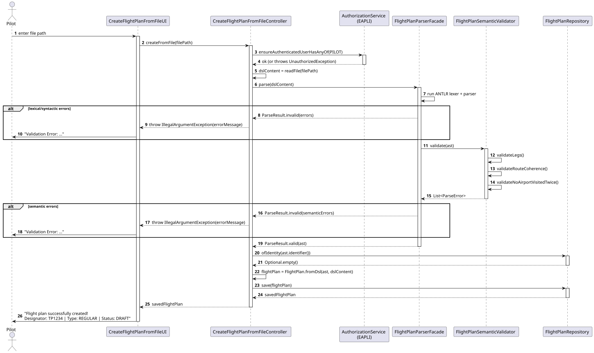
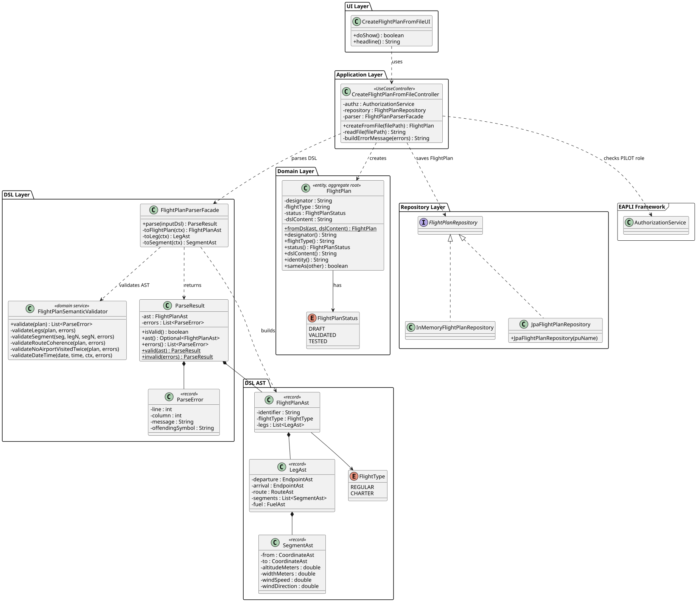

# US081


## 1. Context

*This task was developed for the first time in Sprint 2. The goal is to allow a Pilot to create a flight plan by importing a DSL file, which is then validated through lexical, syntactic and semantic analysis before being stored in the system.*

### 1.1 List of issues

Analysis: Define the validation rules for the Core Flight DSL and the flight plan lifecycle.

Design: Define the architecture for DSL parsing, semantic validation, domain model and persistence.

Implement: Implement the DSL semantic validator, the FlightPlan domain entity, repository, controller and UI.

Test: Unit tests for FlightPlan domain (95% coverage) and FlightPlanSemanticValidator (93% coverage).


## 2. Requirements


**US081** As a Pilot, I want to create a flight plan from a file

**Acceptance Criteria:**

- AC081.1 The flight plan file must conform to the Core Flight DSL specification.
- AC081.2 The file must be validated through lexical, syntactic and semantic analysis.
- AC081.3 Invalid files must produce meaningful error messages including error type, line and column information.
- AC081.4 Only valid flight plans may be imported and used by the system.
- AC081.5 A successfully imported flight plan must be created with status DRAFT.

**Dependencies/References:**

- US083 — Defines and implements the Core Flight DSL grammar (ANTLR). US081 depends on the parser and lexer generated by US083.
- US080 — Defines the FlightPlan domain entity and its lifecycle (DRAFT → VALIDATED → TESTED). US081 creates a FlightPlan in DRAFT status.
- US085 — Responsible for testing/validating a flight plan after creation.

## 3. Analysis

The Core Flight DSL describes a flight plan in a hierarchical, block-based textual format. A flight plan contains one or more legs, each with departure, arrival, route, segments and fuel information.

Validation is performed in three stages:

1. **Lexical analysis** — tokenises the input and detects unrecognised tokens (ANTLR lexer).
2. **Syntactic analysis** — verifies the structure of the DSL against the ANTLR grammar (ANTLR parser).
3. **Semantic analysis** — verifies domain-level rules, implemented in `FlightPlanSemanticValidator`.

The semantic rules implemented are:

| Rule | Description |
|------|-------------|
| Fuel must be strictly positive | Each leg's fuel quantity must be > 0 |
| At least one segment per leg | Each leg must contain at least one segment |
| Segment coordinates must differ | Start and end coordinates of a segment cannot be equal |
| Altitude must be positive | Altitude value in each segment must be > 0 |
| Width must be positive | Width value in each segment must be > 0 |
| Wind speed cannot be negative | Wind speed in each segment must be ≥ 0 |
| Leg sequence coherence | Arrival airport of leg N must match departure airport of leg N+1 |
| Leg time coherence | Arrival time of leg N must precede departure time of leg N+1 |
| Route origin coherence | Route origin must match the first leg's departure airport |
| Route destination coherence | Route destination must match the last leg's arrival airport |
| No airport visited twice | The same airport cannot appear more than once in the flight plan |
| Valid date/time values | All date and time values must be valid calendar values |

All semantic errors are collected in a single execution pass — validation does not stop at the first error found.

The flight plan lifecycle (confirmed with the client):
- `DRAFT` — created via US080 or imported via US081
- `VALIDATED` / `TESTED` — after US085


The main classes identified are:

| Class | Type | Responsibility |
|-------|------|----------------|
| `FlightPlan` | Entity / Aggregate Root | Holds flight plan data and DSL content |
| `FlightPlanStatus` | Enumeration | DRAFT, VALIDATED, TESTED |
| `FlightPlanRepository` | Repository Interface | Persistence contract |
| `FlightPlanParserFacade` | Service | Lexical + syntactic parsing via ANTLR |
| `FlightPlanSemanticValidator` | Domain Service | Semantic validation of the parsed AST |
| `FlightPlanAst` | Value Object (DSL) | Internal representation of the flight plan |

## 4. Design


### 4.1. Realization

The use case follows the standard layered flow: `CreateFlightPlanFromFileUI` collects the file path, delegates to `CreateFlightPlanFromFileController`, which reads the file, calls `FlightPlanParserFacade` for lexical and syntactic validation, then `FlightPlanSemanticValidator` for semantic validation. If all validations pass, `FlightPlan.fromDsl()` creates the aggregate in DRAFT status and persists it via `FlightPlanRepository`.

The following sequence diagram illustrates this flow:



The following class diagram shows the classes involved:




### 4.2. Acceptance Tests

All tests are automated with JUnit 5 and located in `src/test/java/aisafe`.

---

**AC081.5 — Flight plan starts in DRAFT status**

**Test:** `ensureStatusStartsAsDraft` — verifies that a newly created FlightPlan always has DRAFT status.

```java
@Test
void ensureStatusStartsAsDraft() {
    final FlightPlan plan = new FlightPlan("TP1234", "REGULAR", "content");
    assertEquals(FlightPlanStatus.DRAFT, plan.status());
}
```

**Test:** `ensureFromDslCreatesFlightPlanWithCorrectData` — verifies that `fromDsl()` correctly maps the AST to the domain entity.

```java
@Test
void ensureFromDslCreatesFlightPlanWithCorrectData() {
    final FlightPlanAst ast = new FlightPlanAst("TP1234", FlightType.REGULAR, List.of());
    final FlightPlan plan = FlightPlan.fromDsl(ast, "dsl content");
    assertEquals("TP1234", plan.designator());
    assertEquals("REGULAR", plan.flightType());
    assertEquals(FlightPlanStatus.DRAFT, plan.status());
}
```

**AC081.4 — Only valid flight plans may be imported**

**Test:** `ensureValidPlanProducesNoErrors` — verifies that a correctly formed plan passes all semantic checks.

```java
@Test
void ensureValidPlanProducesNoErrors() {
    assertTrue(validator.validate(validPlan()).isEmpty());
}
```

**AC081.2, AC081.3 — Fuel validation**

**Test:** `ensureNegativeFuelProducesError` — verifies that negative fuel is rejected with a descriptive message.

```java
@Test
void ensureNegativeFuelProducesError() {
    final LegAst leg = new LegAst(
            new EndpointAst("LIS", "2026-06-01", "08:00"),
            new EndpointAst("OPO", "2026-06-01", "10:00"),
            new RouteAst("LIS", "OPO"),
            List.of(validSegment()),
            new FuelAst(-100.0, "KG")
    );
    final List<ParseError> errors = validator.validate(
            new FlightPlanAst("TP1234", FlightType.REGULAR, List.of(leg)));
    assertFalse(errors.isEmpty());
    assertTrue(errors.stream().anyMatch(e -> e.message().contains("fuel")));
}
```

**Test:** `ensureZeroFuelProducesError` — verifies that zero fuel is also rejected (must be strictly positive).

```java
@Test
void ensureZeroFuelProducesError() {
    final LegAst leg = new LegAst(
            new EndpointAst("LIS", "2026-06-01", "08:00"),
            new EndpointAst("OPO", "2026-06-01", "10:00"),
            new RouteAst("LIS", "OPO"),
            List.of(validSegment()),
            new FuelAst(0.0, "KG")
    );
    final List<ParseError> errors = validator.validate(
            new FlightPlanAst("TP1234", FlightType.REGULAR, List.of(leg)));
    assertFalse(errors.isEmpty());
}
```

**AC081.2, AC081.3 — Segment validation**

**Test:** `ensureSegmentWithSameStartAndEndProducesError` — verifies that a segment with identical start and end coordinates is rejected.

```java
@Test
void ensureSegmentWithSameStartAndEndProducesError() {
    final SegmentAst badSegment = new SegmentAst(
            new CoordinateAst(38.7, -9.1),
            new CoordinateAst(38.7, -9.1),
            10000.0, 50.0, 10.0, 270.0
    );
    final LegAst leg = new LegAst(
            new EndpointAst("LIS", "2026-06-01", "08:00"),
            new EndpointAst("OPO", "2026-06-01", "10:00"),
            new RouteAst("LIS", "OPO"),
            List.of(badSegment),
            new FuelAst(5000.0, "KG")
    );
    final List<ParseError> errors = validator.validate(
            new FlightPlanAst("TP1234", FlightType.REGULAR, List.of(leg)));
    assertFalse(errors.isEmpty());
    assertTrue(errors.stream().anyMatch(e -> e.message().contains("coordinates")));
}
```

**Test:** `ensureNegativeAltitudeProducesError` — verifies that negative altitude is rejected.

```java
@Test
void ensureNegativeAltitudeProducesError() {
    final SegmentAst badSegment = new SegmentAst(
            new CoordinateAst(38.7, -9.1),
            new CoordinateAst(41.1, -8.6),
            -100.0, 50.0, 10.0, 270.0
    );
    final LegAst leg = new LegAst(
            new EndpointAst("LIS", "2026-06-01", "08:00"),
            new EndpointAst("OPO", "2026-06-01", "10:00"),
            new RouteAst("LIS", "OPO"),
            List.of(badSegment),
            new FuelAst(5000.0, "KG")
    );
    final List<ParseError> errors = validator.validate(
            new FlightPlanAst("TP1234", FlightType.REGULAR, List.of(leg)));
    assertTrue(errors.stream().anyMatch(e -> e.message().contains("altitude")));
}
```

**Test:** `ensureNegativeWindSpeedProducesError` — verifies that negative wind speed is rejected.

```java
@Test
void ensureNegativeWindSpeedProducesError() {
    final SegmentAst badSegment = new SegmentAst(
            new CoordinateAst(38.7, -9.1),
            new CoordinateAst(41.1, -8.6),
            10000.0, 50.0, -5.0, 270.0
    );
    final LegAst leg = new LegAst(
            new EndpointAst("LIS", "2026-06-01", "08:00"),
            new EndpointAst("OPO", "2026-06-01", "10:00"),
            new RouteAst("LIS", "OPO"),
            List.of(badSegment),
            new FuelAst(5000.0, "KG")
    );
    final List<ParseError> errors = validator.validate(
            new FlightPlanAst("TP1234", FlightType.REGULAR, List.of(leg)));
    assertTrue(errors.stream().anyMatch(e -> e.message().contains("wind speed")));
}
```

**Test:** `ensureLegWithNoSegmentsProducesError` — verifies that a leg without segments is rejected.

```java
@Test
void ensureLegWithNoSegmentsProducesError() {
    final LegAst leg = new LegAst(
            new EndpointAst("LIS", "2026-06-01", "08:00"),
            new EndpointAst("OPO", "2026-06-01", "10:00"),
            new RouteAst("LIS", "OPO"),
            List.of(),
            new FuelAst(5000.0, "KG")
    );
    final List<ParseError> errors = validator.validate(
            new FlightPlanAst("TP1234", FlightType.REGULAR, List.of(leg)));
    assertTrue(errors.stream().anyMatch(e -> e.message().contains("segment")));
}
```

**AC081.2, AC081.3 — Leg sequence and route coherence**

**Test:** `ensureLegArrivalMustMatchNextLegDeparture` — verifies that the arrival airport of leg N matches the departure airport of leg N+1.

```java
@Test
void ensureLegArrivalMustMatchNextLegDeparture() {
    final LegAst leg1 = validLeg("LIS", "OPO");
    final LegAst leg2 = validLeg("FAO", "MAD"); // FAO != OPO
    final List<ParseError> errors = validator.validate(
            new FlightPlanAst("TP1234", FlightType.REGULAR, List.of(leg1, leg2)));
    assertFalse(errors.isEmpty());
    assertTrue(errors.stream().anyMatch(e -> e.message().contains("arrival airport")));
}
```

**Test:** `ensureLegArrivalTimeMustPrecedeNextLegDepartureTime` — verifies that arrival time of leg N precedes departure time of leg N+1.
```java
@Test
void ensureLegArrivalTimeMustPrecedeNextLegDepartureTime() {
    final LegAst leg1 = new LegAst(
            new EndpointAst("LIS", "2026-06-01", "08:00"),
            new EndpointAst("OPO", "2026-06-01", "10:00"),
            new RouteAst("LIS", "OPO"),
            List.of(validSegment()),
            new FuelAst(5000.0, "KG")
    );
    final LegAst leg2 = new LegAst(
            new EndpointAst("OPO", "2026-06-01", "09:00"), // before arrival of leg1
            new EndpointAst("MAD", "2026-06-01", "11:00"),
            new RouteAst("OPO", "MAD"),
            List.of(validSegment()),
            new FuelAst(5000.0, "KG")
    );
    final List<ParseError> errors = validator.validate(
            new FlightPlanAst("TP1234", FlightType.REGULAR, List.of(leg1, leg2)));
    assertTrue(errors.stream().anyMatch(e -> e.message().contains("precede")));
}
```

**Test:** `ensureRouteOriginMustMatchFirstLegDeparture` — verifies route origin coherence.

```java
@Test
void ensureRouteOriginMustMatchFirstLegDeparture() {
    final LegAst leg = new LegAst(
            new EndpointAst("LIS", "2026-06-01", "08:00"),
            new EndpointAst("OPO", "2026-06-01", "10:00"),
            new RouteAst("FAO", "OPO"), // FAO != LIS
            List.of(validSegment()),
            new FuelAst(5000.0, "KG")
    );
    final List<ParseError> errors = validator.validate(
            new FlightPlanAst("TP1234", FlightType.REGULAR, List.of(leg)));
    assertTrue(errors.stream().anyMatch(e -> e.message().contains("Route origin")));
}
```

**Test:** `ensureRouteDestinationMustMatchLastLegArrival` — verifies route destination coherence.

```java
@Test
void ensureRouteDestinationMustMatchLastLegArrival() {
    final LegAst leg = new LegAst(
            new EndpointAst("LIS", "2026-06-01", "08:00"),
            new EndpointAst("OPO", "2026-06-01", "10:00"),
            new RouteAst("LIS", "MAD"), // MAD != OPO
            List.of(validSegment()),
            new FuelAst(5000.0, "KG")
    );
    final List<ParseError> errors = validator.validate(
            new FlightPlanAst("TP1234", FlightType.REGULAR, List.of(leg)));
    assertTrue(errors.stream().anyMatch(e -> e.message().contains("Route destination")));
}
```

**Test:** `ensureAirportCannotBeVisitedTwice` — verifies that the same airport cannot appear more than once.

```java
@Test
void ensureAirportCannotBeVisitedTwice() {
    final LegAst leg1 = validLeg("LIS", "OPO");
    final LegAst leg2 = validLeg("OPO", "LIS"); // LIS visited again
    final List<ParseError> errors = validator.validate(
            new FlightPlanAst("TP1234", FlightType.REGULAR, List.of(leg1, leg2)));
    assertTrue(errors.stream().anyMatch(e -> e.message().contains("visited more than once")));
}
```

**AC081.3 — All errors collected in single execution**

**Test:** `ensureAllErrorsAreCollectedInSingleExecution` — verifies that validation does not stop at the first error.

```java
@Test
void ensureAllErrorsAreCollectedInSingleExecution() {
    final SegmentAst badSegment = new SegmentAst(
            new CoordinateAst(38.7, -9.1),
            new CoordinateAst(38.7, -9.1),
            -100.0, -50.0, 10.0, 270.0
    );
    final LegAst leg = new LegAst(
            new EndpointAst("LIS", "2026-06-01", "08:00"),
            new EndpointAst("OPO", "2026-06-01", "10:00"),
            new RouteAst("LIS", "OPO"),
            List.of(badSegment),
            new FuelAst(-100.0, "KG")
    );
    final List<ParseError> errors = validator.validate(
            new FlightPlanAst("TP1234", FlightType.REGULAR, List.of(leg)));
    assertTrue(errors.size() >= 3);
}
```

**FlightPlan domain invariants**

**Test:** `ensureDesignatorCannotBeNull`

```java
@Test
void ensureDesignatorCannotBeNull() {
    assertThrows(IllegalArgumentException.class,
            () -> new FlightPlan(null, "REGULAR", "content"));
}
```

**Test:** `ensureDesignatorIsNormalizedToUpperCase`

```java
@Test
void ensureDesignatorIsNormalizedToUpperCase() {
    final FlightPlan plan = new FlightPlan("tp1234", "REGULAR", "content");
    assertEquals("TP1234", plan.designator());
}
```

**Test:** `ensureTwoFlightPlansWithSameDesignatorAreEqual`

```java

@Test
void ensureTwoFlightPlansWithSameDesignatorAreEqual() {
    final FlightPlan p1 = new FlightPlan("TP1234", "REGULAR", "content");
    final FlightPlan p2 = new FlightPlan("TP1234", "CHARTER", "other");
    assertEquals(p1, p2);
}
```

## 5. Implementation

The implementation is distributed across the following packages in `aisafe.base`:

| Package | Class | Role |
|---------|-------|------|
| `aisafe.flightplan.domain` | `FlightPlan` | Aggregate root |
| `aisafe.flightplan.domain` | `FlightPlanStatus` | Enum: DRAFT, VALIDATED, TESTED |
| `aisafe.flightplan.repositories` | `FlightPlanRepository` | Repository interface |
| `aisafe.flightplan.application` | `CreateFlightPlanFromFileController` | Use case orchestrator |
| `aisafe.dsl.parser` | `FlightPlanParserFacade` | ANTLR-based lexical and syntactic parsing |
| `aisafe.dsl.parser` | `FlightPlanSemanticValidator` | Semantic validation of the parsed AST |
| `aisafe.infrastructure.persistence.inmemory` | `InMemoryFlightPlanRepository` | In-memory persistence |
| `aisafe.infrastructure.persistence.jpa` | `JpaFlightPlanRepository` | JPA persistence |
| `aisafe.app.console.presentation.flightplan` | `CreateFlightPlanFromFileUI` | Console UI |

The `FlightPlanParserFacade` is shared between US081 and US083. US083 is responsible for the ANTLR grammar and generated code; US081 adds the `FlightPlanSemanticValidator` on top.

The `FlightPlan.fromDsl(ast, dslContent)` factory method creates the aggregate from a validated AST and stores the original DSL content for future reference.

The test suite comprises **19 unit tests** for `FlightPlan` (95% coverage) and **14 unit tests** for `FlightPlanSemanticValidator` (93% coverage), all passing.

## 6. Integration/Demonstration

The feature is accessible through the console application after logging in as a Pilot.

```bash
mvn clean test
./run-backoffice.sh
```

**To create a flight plan from a file:**

1. Login with Pilot credentials.
2. Select **Flight Plans >** from the main menu.
3. Select **1 — Create Flight Plan from DSL File**.
4. Enter the full path to the DSL file (e.g. `/home/user/flightplan.dsl`).
5. The system validates the file and confirms: `Flight plan successfully created!` with the designator, type and status.
6. If the file is invalid, all errors are displayed with their location and description.

## 7. Observations

- The `FlightPlanParserFacade` uses ANTLR's error listener mechanism to collect lexical and syntactic errors with line and column information, satisfying AC081.3.
- The `FlightPlanSemanticValidator` collects all semantic errors in a single pass rather than stopping at the first, also satisfying AC081.3.
- The controller (`CreateFlightPlanFromFileController`) was not unit tested due to its dependency on the authentication framework and repository infrastructure, consistent with the approach taken for other controllers in the project.
- Designator uniqueness is enforced by the controller before persisting — if a flight plan with the same designator already exists, an `IllegalStateException` is thrown and shown to the user as a friendly message.

