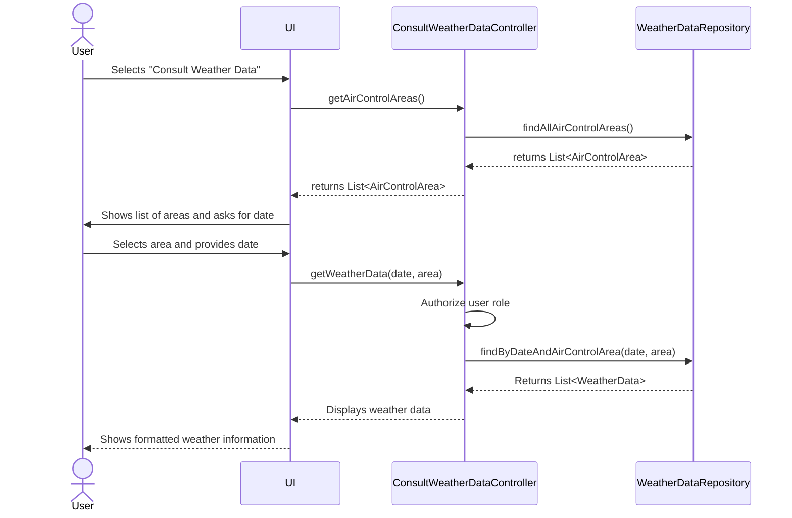

# US082 — Consult Weather Data

## 1. Context

This user story allows authorized users (Weather Person, Pilot, Flight Control Operator) to query and view weather data for a specific date and air control area. Access to accurate meteorological information is critical for making safe and efficient decisions regarding flight planning and operations.

---

## 2. Requirements

**US082** As a Weather Person, a Pilot, or a Flight Control Operator, I want to consult weather data in the system for a given day and a specific air control area so that I can make informed decisions about flight operations.

**Acceptance Criteria:**

- **AC082.1** Weather data can be queried by a specific date and a selected air control area.
- **AC082.2** The query results are displayed clearly and include all relevant meteorological information (e.g., temperature, wind speed, precipitation).
- **AC082.3** Access to this feature is restricted to users with the roles: `WEATHER_PERSON`, `PILOT`, or `FLIGHT_CONTROL_OPERATOR`.

**Dependencies/References:**

- This US depends on **US030** for user authentication and role-based authorization.
- It assumes the existence of `WeatherData` and `AirControlArea` entities in the system.

---

## 3. Analysis

This feature is a query-based capability that allows users to retrieve specific weather information based on filters. The `WeatherDataRepository` will be extended to support querying by date and `AirControlArea`.

The main classes involved are:

| Class | Type | Responsibility |
|-------|------|----------------|
| `WeatherData` | Aggregate Root | Represents meteorological data for a specific time and area. |
| `AirControlArea` | Aggregate Root | Represents a geographical area for which weather data is recorded. |
| `WeatherDataRepository` | Repository | **New Method**: `findByDateAndAirControlArea(date, area)`. |
| `ConsultWeatherDataController` | Application Controller | Orchestrates the query, including role validation. |
| `ConsultWeatherDataUI` | UI | Presents the query form and displays the results. |

---

## 4. Design

### 4.1. Realization

1.  The `ConsultWeatherDataUI` will first call the controller to get a list of all available `AirControlArea`s to present to the user.
2.  The user selects an area and provides a date.
3.  The controller validates that the authenticated user has one of the required roles (`WEATHER_PERSON`, `PILOT`, `FLIGHT_CONTROL_OPERATOR`).
4.  The controller then calls a new method in the `WeatherDataRepository` to fetch the data.
5.  The UI renders the results in a formatted table.

The following sequence diagram illustrates the flow:

### 4.2. Acceptance Tests

| Test ID | Description | Expected Result |
|---------|-------------|-----------------|
| AC082.1 | Query with a valid date and area with existing data. | Weather data for that day and area is displayed. |
| AC082.1b| Query for a date/area with no data. | "No weather data found" message is shown. |
| AC082.3 | A user without the required role attempts to access. | Access is denied with an authorization error. |

---

## 5. Implementation

*(To be detailed in a future phase)*

---

## 6. Integration/Demonstration

*(To be detailed in a future phase)*

---

## 7. Observations

*(To be detailed in a future phase)*
