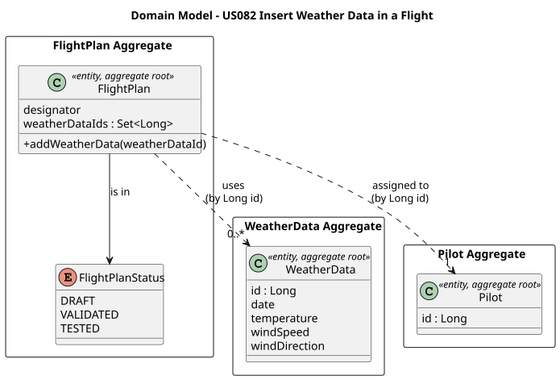
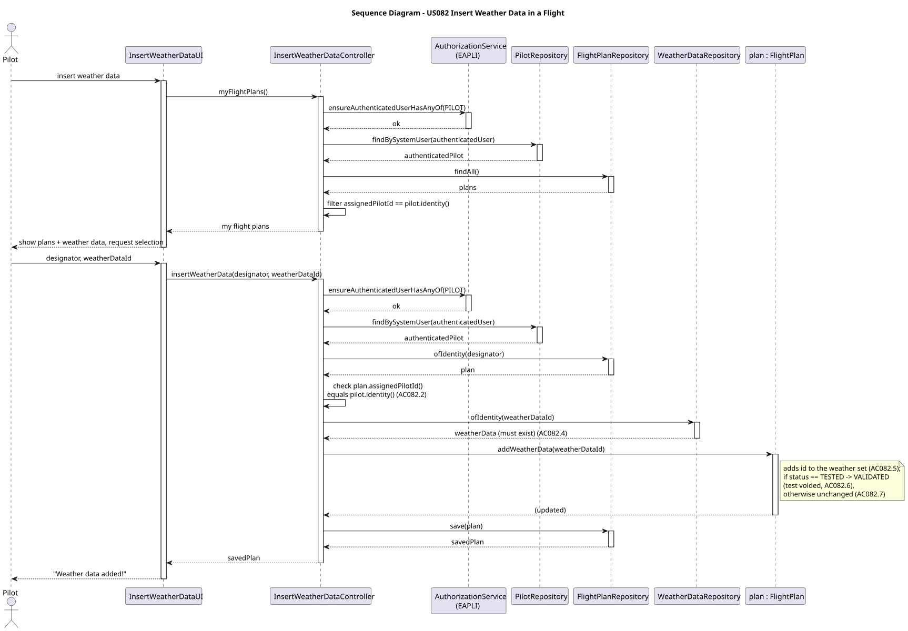
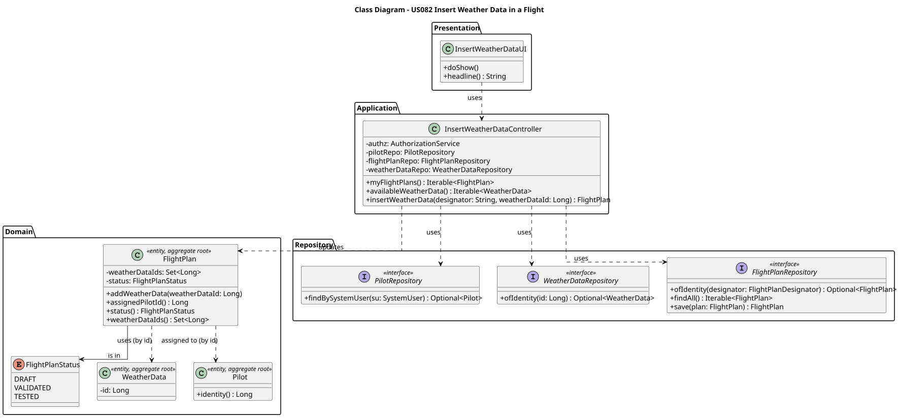

# US082 — Insert Weather Data in a Flight

## 1. Context

This US is being developed in Sprint 3. It allows a Pilot to associate weather data with one of their own flight plans. The weather data has previously been registered in the system by a Weather Person (US041/US042) for a specific air control area. If the flight plan had already been tested, attaching new weather data voids that test, because the simulation/test result depended on the previous weather conditions.

### 1.1 List of issues

Analysis: Define how a `FlightPlan` references the `WeatherData` it uses, the "plan of mine" ownership rule, and the status transition that voids a previous test.

Design: Define the architecture for the use case (UI, controller), the new association on the `FlightPlan` aggregate, and the status-voiding behaviour.

Implement: Extend the `FlightPlan` aggregate to hold its weather data reference(s) and to void a previous test; implement the application controller and the console UI; integrate with the Pilots' menu.

Test: Unit tests for the `FlightPlan` weather-data association and the test-voiding invariant (above 90% coverage), plus manual acceptance tests for the end-to-end flow.

---

## 2. Requirements

**US082** As a Pilot, I want to add weather data to a flight plan of mine.

> *(Enunciado, p. 19):* "If the flight plan has been previously tested, the test is deemed void because of the new weather data."

**Acceptance Criteria:**

- **AC082.1** Only an authenticated user with the `PILOT` role may add weather data to a flight plan.
- **AC082.2** The flight plan must belong to the authenticated pilot — i.e. its assigned pilot is the session user ("of mine").
- **AC082.3** The flight plan must reference an existing flight plan in the system (identified by its designator).
- **AC082.4** The weather data added must already exist in the system (it was registered by a Weather Person — US041/US042).
- **AC082.5** The weather data becomes associated with the flight plan (the plan keeps a reference to it by identity).
- **AC082.6** If the flight plan was previously in `TESTED` status, attaching new weather data voids the test: the status reverts to `VALIDATED`. The previous DSL/semantic validation is not affected — only the flight test is voided.
- **AC082.7** Attaching weather data to a flight plan that is not `TESTED` (i.e. `DRAFT` or `VALIDATED`) does not change its status.

**Notes on interpretation:**

The enunciado does not provide an explicit "Acceptance Criteria" section for US082. The criteria above are derived from the user story statement and from the system specifications (sections 3.2 and 3.4 of the requirements document).

Three points are open for confirmation with the Product Owner / team and will be settled in the Analysis/Design phase:

1. **Void target status (AC082.6).** "The test is deemed void" is read as voiding only the flight test (US085), not the DSL/semantic validation (US083), which does not depend on weather. The status therefore reverts `TESTED → VALIDATED`. An alternative reading would revert all the way to `DRAFT` (re-run the whole multi-step process); this is considered more conservative but less faithful to "the *test* is void".

2. **One or many weather records.** A flight may span more than one air control area, and weather data is recorded per area and date. The plan is therefore modelled to hold a set of weather data references (the pilot may attach more than one over successive operations), rather than a single record. This is the most flexible reading; a single-record interpretation is also defensible.

3. **Area/date matching.** The enunciado does not require the attached weather data to match the flight's air control area(s) or departure date. For US082, any existing weather data record may be attached; constraining it to the route's area(s) and date is treated as a possible future enhancement, not a requirement here.

**Dependencies/References:**

- **US030** — Authentication and Authorization (the user must be authenticated with the `PILOT` role).
- **US041 / US042** — Register / Import weather data (the weather data must already exist in the system).
- **US080** — Create a flight plan (the flight plan must exist, and carries the `assignedPilotId` used for the ownership rule and the `status` that may be voided).
- Relates to:
  - **US085** — Test/validate flight plan (LAPR4 — produces the `TESTED` status that US082 may void).

**Out of scope for this user story:**

- **Weather impact computation** on the flight path or fuel — that belongs to the simulation (US110) and the flight test (US085), and is explicitly out of scope of the back-office (section 3.4.6).
- **Re-validation and re-testing** of the flight plan after the test is voided — performed by US083 (LPROG) and US085 (LAPR4); US082 only voids the previous test by reverting the status.
- **Registering or importing weather data** — covered by US041 and US042; US082 only consumes already-registered weather data.

---

## 3. Analysis

This use case attaches existing weather data to a flight plan owned by the authenticated pilot, and voids a previous flight test when one exists. It modifies a single aggregate — the `FlightPlan` — and only reads the `WeatherData` (to confirm it exists) and the `Pilot` (to confirm ownership).

The main design decisions were:

**Weather data referenced by identity (a set of ids)** — The `FlightPlan` is extended with a `Set<Long>` of `WeatherData` identities, stored via `@ElementCollection`. References are kept by identity (not by object), preserving low coupling between the `FlightPlan` and `WeatherData` aggregates — the same principle already used for the pilot's certifications (US075) and the form-based references in US080. A set (rather than a single value) supports a flight that spans more than one air control area and lets the pilot attach weather data over successive operations (interpretation note #2).

**Test-voiding is a domain behaviour of the `FlightPlan`** — Attaching weather data and voiding a previous test is a single domain operation owned by the aggregate, because the `FlightPlan` is the Information Expert for both its weather set and its `status`. A new method (e.g. `addWeatherData(Long weatherDataId)`) adds the id to the set and, **only if the current status is `TESTED`**, reverts it to `VALIDATED` (AC082.6); for `DRAFT`/`VALIDATED` plans the status is unchanged (AC082.7). The DSL/semantic validation is therefore preserved — only the flight test is voided. This complements the existing `markValidated()` / `markTested()` transitions without altering them.

**Ownership ("of mine") enforced by the controller** — AC082.2 requires the plan to belong to the authenticated pilot. This is an application/authentication concern (it needs the session identity), so it is checked by the controller: it resolves the authenticated `Pilot` via `PilotRepository.findBySystemUser` and verifies that `flightPlan.assignedPilotId()` equals the pilot's identity, before invoking the domain operation.

**Existence checks in the controller** — The controller verifies that the flight plan exists (by its designator, AC082.3) and that the weather data exists (by its id, AC082.4) before the aggregate is modified.

**Single aggregate write** — Only the `FlightPlan` is modified (its weather set and possibly its status). `WeatherData` and `Pilot` are read-only lookups. As in US080, a single `FlightPlanRepository.save()` is atomic, so no explicit transactional context is required.

The main classes identified are:

| Class | Type | Responsibility |
|-------|------|----------------|
| `FlightPlan` | Entity / Aggregate Root | Holds the plan; extended with the weather-data id set; owns the test-voiding status transition |
| `FlightPlanStatus` | Enum | `DRAFT` → `VALIDATED` → `TESTED`; US082 may revert `TESTED → VALIDATED` |
| `WeatherData` | Other aggregate (referenced by `Long` id) | The weather record being attached (registered in US041/US042) |
| `Pilot` | Other aggregate (referenced by `Long` id) | Used to enforce the "of mine" ownership rule |
| `FlightPlanRepository` | Repository Interface | Loads and saves the flight plan |
| `WeatherDataRepository` | Repository Interface | Confirms the weather data exists |
| `PilotRepository` | Repository Interface | Resolves the authenticated pilot |
| `InsertWeatherDataController` | Application Controller | Orchestrates the use case; enforces role, ownership and existence |
| `InsertWeatherDataUI` | UI | Collects the flight plan and weather data selection from the pilot |

The following diagram shows the domain model excerpt relevant to this US:

---

## 4. Design

### 4.1. Realization

The use case follows the standard layered flow: `InsertWeatherDataUI` lets the pilot pick one of their flight plans and a weather data record, then delegates to `InsertWeatherDataController`, which enforces the rules and applies the change to the `FlightPlan` aggregate.

To present the choices to the pilot, the controller resolves the **authenticated pilot** (via `PilotRepository.findBySystemUser`) and offers:

- `myFlightPlans()` — the flight plans assigned to the authenticated pilot. The flight plans are loaded via `FlightPlanRepository.findAll()` and filtered in memory by `assignedPilotId == pilot.identity()` (the same in-memory filtering approach used in US072 for the company fleet).
- `availableWeatherData()` — the weather data records registered in the system (`WeatherDataRepository.findAll()`), for selection by id.

The insertion step then performs:

1. `authz.ensureAuthenticatedUserHasAnyOf(AiSafeRoles.PILOT)` — only a pilot may insert weather data (AC082.1).
2. Resolve the authenticated `Pilot` from the session.
3. Load the `FlightPlan` by its `FlightPlanDesignator`; it must exist (AC082.3).
4. Verify ownership — `flightPlan.assignedPilotId()` must equal the authenticated pilot's identity (AC082.2).
5. Verify the `WeatherData` exists via `WeatherDataRepository.ofIdentity(weatherDataId)` (AC082.4).
6. Invoke `flightPlan.addWeatherData(weatherDataId)` — the aggregate adds the id to its weather set (AC082.5) and, **only if its status is `TESTED`**, reverts it to `VALIDATED`, voiding the test (AC082.6); otherwise the status is unchanged (AC082.7).
7. Persist the plan via `FlightPlanRepository.save()`.

As in US080, only a **single aggregate** (`FlightPlan`) is written, so no explicit transactional context is used — the `save()` is atomic. The `WeatherData` and `Pilot` accesses are read-only lookups.

The following sequence diagram illustrates the flow:

The following class diagram shows the classes involved:

### 4.2. Acceptance Tests

The `FlightPlan` weather-data association and the test-voiding behaviour (`addWeatherData` adds the id; reverts `TESTED → VALIDATED`; leaves `DRAFT`/`VALIDATED` unchanged) are covered by automated unit tests on the aggregate. The cross-aggregate rules — authorization (AC082.1), ownership (AC082.2) and the existence of the flight plan and weather data (AC082.3, AC082.4) — are validated end-to-end by manual acceptance tests. All tests are documented in [tests.md](tests.md).
