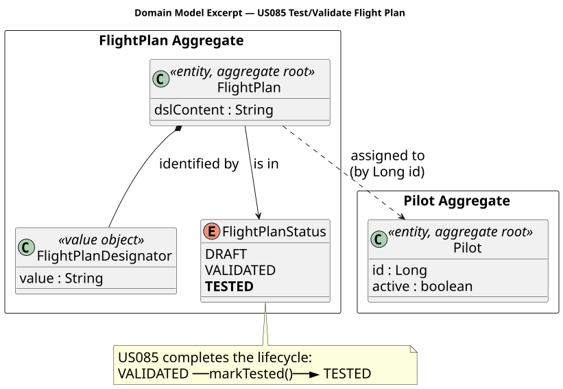
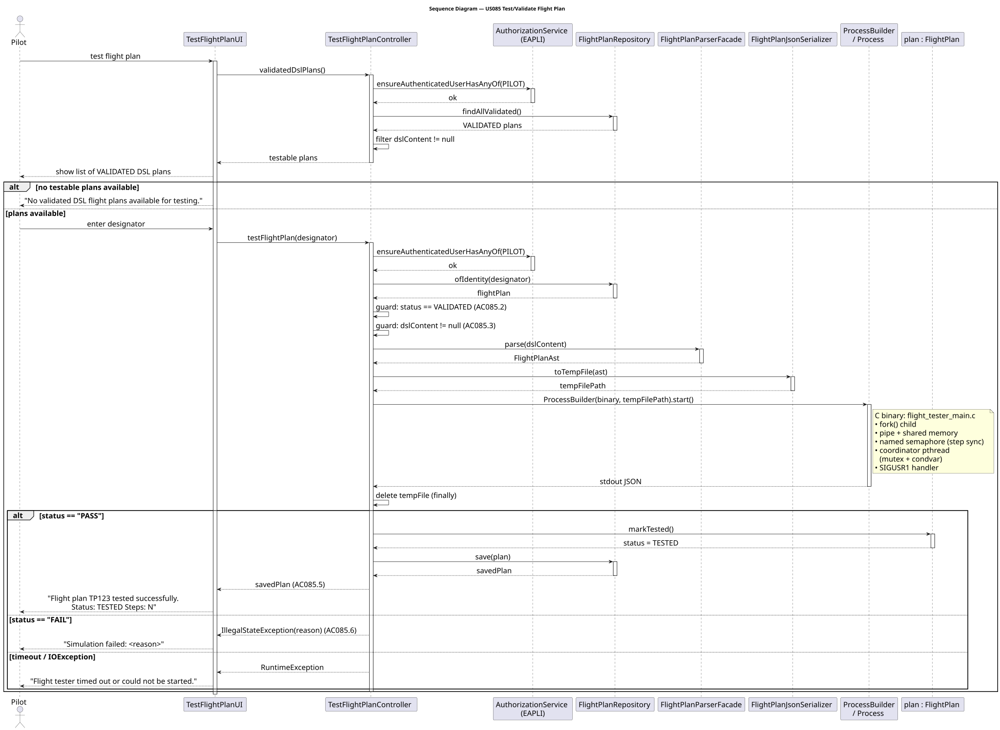
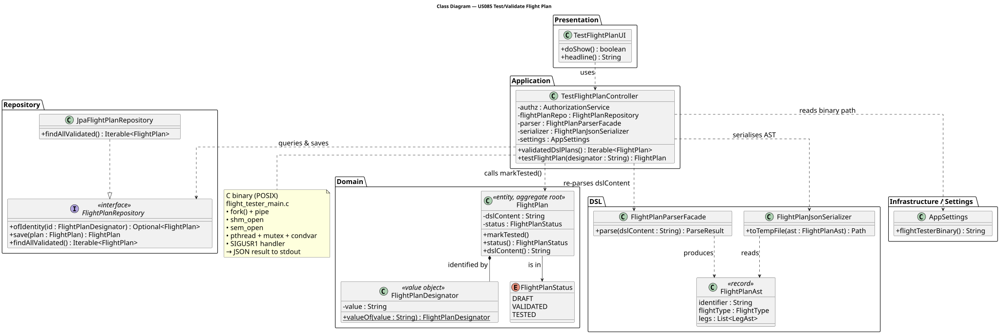

# US085 — Test/Validate Flight Plan

## 1. Context

This US is being implemented in Sprint 3. It allows a Pilot to run a simulation test against
a VALIDATED flight plan, transitioning its status from `VALIDATED` to `TESTED`.

The test component is implemented in C using POSIX APIs (processes, pipes, signals, shared
memory, pthreads, mutexes, condition variables, and semaphores), as required by the SCOMP
subject. The Java application layer invokes the C binary via `ProcessBuilder`, passing the
flight plan data as a temporary JSON file, and processes the result to update the domain.

The `FlightPlan` aggregate already defines the `TESTED` status and the `markTested()` method
(established when US080/US081 modelled the lifecycle). This US completes that lifecycle.

### 1.1 List of issues

- **Analysis:** Define which flight plans are testable (only DSL-based plans with full
  coordinate data), identify the C/Java integration contract, and confirm no new aggregates
  are needed.
- **Design:** Specify the C binary architecture (parent/child/pipe/semaphore/shared-memory
  topology), the JSON exchange format, and the Java controller/UI flow.
- **Implement (C):** Build `flight_tester` binary — fork, pipe, shared memory, semaphore,
  pthread with mutex + condition variable, SIGUSR1 signal handling, JSON result output.
- **Implement (Java):** `FlightPlanJsonSerializer`, `TestFlightPlanController`,
  `TestFlightPlanUI`, `findAllValidated()` on repository, menu integration.
- **Test:** C unit tests for the tester binary; Java unit tests for the controller (mocked
  process); manual end-to-end acceptance tests.

---

## 2. Requirements

**US085** As a Pilot, I want to test/validate a flight plan I've made.

> *(Enunciado, p. 19):* "The validation must include validation of the flight plan described
> using the DSL and its test. The test component must be implemented in the C language."

**Acceptance Criteria:**

| AC | Description |
|----|-------------|
| AC085.1 | Only an authenticated user with the `PILOT` role may trigger a flight plan test. |
| AC085.2 | Only flight plans in `VALIDATED` status may be tested. |
| AC085.3 | Only DSL-based flight plans (those with non-null `dslContent`) can be tested, as they embed the full coordinate/altitude data required by the simulator. |
| AC085.4 | The test component must be implemented in C using POSIX APIs: `fork`, pipes, `shm_open` (shared memory), named semaphores (`sem_open`), `pthread_create`, `pthread_mutex_t`, `pthread_cond_t`, and `SIGUSR1` signal handling. |
| AC085.5 | On a successful test, the flight plan status transitions from `VALIDATED` to `TESTED` and is persisted. |
| AC085.6 | On a failed test, the flight plan status remains `VALIDATED` and the failure reason is reported to the user. |
| AC085.7 | The Java layer may not implement the flight simulation logic — it only invokes the C binary and processes its JSON result. |

**Dependencies/References:**

| Dependency | Reason |
|-----------|--------|
| US030 | Authentication and authorisation (`PILOT` role) must be in place. |
| US081 | Creates DSL-based flight plans (the input for US085). |
| US083 | Validates DSL plans and transitions them to `VALIDATED` — prerequisite state for US085. |
| US086 | US085 must eventually be exposed remotely via the TCP pilot client (`PilotSessionHandler`). Not implemented in the current sprint for the TCP path — the console path is the focus. |

**Out of scope for this user story:**

- Testing form-based flight plans (US080) — they lack route coordinates and cannot be
  simulated by the C tester.
- Multi-flight collision detection — that is US102. This tester validates a single plan in
  isolation.
- Full simulation report with graphical output — that is US114.
- Weather data integration in the simulation — that is US082.

---

## 3. Analysis

The `FlightPlan` aggregate is the central concept. It already supports the full lifecycle
(`DRAFT` → `VALIDATED` → `TESTED`) and exposes `markTested()`. No new aggregates or value
objects are required — this US completes the lifecycle that US080/US081 designed.

### 3.1 Which flight plans are testable?

A flight plan is testable if and only if two conditions hold simultaneously:

1. Its status is `VALIDATED` (AC085.2) — only plans that passed DSL semantic validation
   (US083) or were explicitly validated may proceed to testing.
2. Its `dslContent` is non-null (AC085.3) — the DSL source embeds full route geometry in
   its `SegmentAst` records (`from`/`to` lat/lon, `altitudeMeters`, `windSpeed`,
   `windDirection`). Form-based plans (US080) store only `RouteName`,
   `RegistrationNumber`, and `Long pilotId` — no coordinates — so they cannot be
   simulated.

The `FlightPlanAst` produced by re-parsing `dslContent` through `FlightPlanParserFacade`
provides everything the C tester needs:

| AST field | Maps to C tester JSON field |
|-----------|----------------------------|
| `FlightPlanAst.identifier` | `"identifier"` |
| `FlightPlanAst.flightType` | `"flight_type"` (`"REGULAR"` / `"CHARTER"`) |
| `LegAst.segments[i].from` | `"start_coord": [lat, lon]` |
| `LegAst.segments[i].to` | `"end_coord": [lat, lon]` |
| `LegAst.segments[i].altitudeMeters` | `"altitude_m"` |

### 3.2 C / Java integration contract

The Java controller acts as a thin orchestrator: it prepares the input, delegates the
simulation to the C binary, and interprets the output. It never contains flight simulation
logic (AC085.7).

**Input (Java → C):** a UTF-8 temporary JSON file containing a one-element array in the
same format as `simulation/flight_plans.json`:

```json
[
  {
    "identifier": "TP123",
    "flight_type": "REGULAR",
    "legs": [
      {
        "segments": [
          {
            "start_coord": [38.7749, -9.1290],
            "end_coord":   [40.4093, -3.6770],
            "altitude_m":  9000.0,
            "mode":        "cruise"
          }
        ]
      }
    ]
  }
]
```

**Output (C → Java):** a single JSON object written to stdout:

```json
{ "identifier": "TP123", "status": "PASS", "steps": 42 }
```

or on failure:

```json
{ "identifier": "TP123", "status": "FAIL", "reason": "segment altitude out of range" }
```

Exit code `0` = PASS; exit code `1` = FAIL. The Java controller checks exit code and
parses the JSON; on PASS it calls `plan.markTested()` and persists; on FAIL it surfaces
the `reason` field to the user (AC085.5, AC085.6).

### 3.3 C binary internal architecture (POSIX requirements — AC085.4)

The `flight_tester` binary must exercise all six required POSIX mechanisms. The diagram
below shows how they are composed:

```
Parent process  (flight_tester_main.c)
│
├─ parse JSON  →  validate plan
│
├─ sem_open("/fp_test_<pid>", ...)      ← named semaphore (step synchronisation)
├─ pipe(pfd)                            ← anonymous pipe (position updates)
├─ shm_open("/fp_shm_<pid>", ...)       ← shared memory (current position)
│
├─ fork()  ──────────────────────────────────────────────────────────────┐
│                                                                        │ Child process
│   Coordinator pthread (pthread_create)                                 │  • simulates flight
│   ┌──────────────────────────────────────────────────────────────┐    │    step by step
│   │ pthread_mutex_t mutex + pthread_cond_t cond                  │    │  • writes position
│   │                                                              │    │    to pipe after
│   │  loop:                                                       │    │    each step
│   │    read aircraft_position_t from pfd[0]     ← pipe read     │    │  • sem_wait(sem)
│   │    store in history[]                                        │    │    to wait for GO
│   │    sem_post(sem)  →  unblocks child          ← semaphore     │    │  • exits when
│   │    if child exited: pthread_cond_signal(cond)  ← condvar     │    │    route complete
│   └──────────────────────────────────────────────────────────────┘    │
│                                                                        └────────────────────
├─ sigaction(SIGUSR1, ...)               ← signal handler
│     on SIGUSR1: kill(child, SIGTERM), mark FAIL
│
└─ waitpid(child)
   pthread_cond_wait(cond, mutex) until coordinator signals done
   print JSON result to stdout
   sem_close / sem_unlink / shm_unlink / close(pipe)
   exit(0) or exit(1)
```

Each POSIX primitive has a clear, justified role:

| Primitive | Role |
|-----------|------|
| `fork()` | Isolates the flight simulation in a child process |
| `pipe` | Child sends `aircraft_position_t` updates to parent after each step |
| `shm_open` / `mmap` | Shared memory segment holds the latest position (readable by both) |
| `sem_open` (named semaphore) | Parent posts GO after reading each step; child waits before advancing |
| `pthread_create` | Coordinator thread reads the pipe concurrently while parent waits for completion |
| `pthread_mutex_t` + `pthread_cond_t` | Coordinator signals the main thread when all steps are consumed |
| `sigaction(SIGUSR1)` | External abort signal — kills child and marks the test as FAIL |

### 3.4 Key design decisions

**Re-parsing DSL on each invocation** — the Java layer re-parses `dslContent` on demand
rather than persisting the AST or a pre-serialised JSON. This keeps the domain model clean
(no extra columns) and is acceptable for a single, manually-triggered operation.

**No new domain classes** — `markTested()` and `FlightPlanStatus.TESTED` already exist in
the `FlightPlan` aggregate. The only domain-layer change is a new query method,
`findAllValidated()`, on `FlightPlanRepository`.

**`FlightPlanJsonSerializer` placed in `aisafe.dsl`** — this utility converts a
`FlightPlanAst` to the JSON string the C binary expects. It belongs in the DSL package
because it operates on AST records (`LegAst`, `SegmentAst`, `CoordinateAst`), not on
`FlightPlan` domain objects. This keeps the domain package free of serialisation concerns.

**Separate `flight_tester` binary from `flight_simulator`** — the existing
`flight_simulator` (US100–US110) runs a full multi-flight simulation with safety monitoring
and a dashboard report. `flight_tester` validates a single plan in isolation. The two
binaries share compiled object files (`flight_process.o`, `flight_parser.o`,
`validation.o`, `shared_memory.o`, `ipc.o`, `cJSON.o`) to avoid code duplication, while
keeping each binary's responsibility clearly bounded.

**C binary path in `application.properties`** — the path to the `flight_tester` binary is
stored under `flight.tester.binary` so it can be adjusted per environment (developer
machine, CI, production) without recompiling the Java application.

### 3.5 Classes identified

| Class / File | Type | Responsibility |
|--------------|------|----------------|
| `FlightPlan` | Entity / Aggregate Root *(existing)* | Lifecycle owner; `markTested()` already present |
| `FlightPlanStatus` | Enum *(existing)* | `DRAFT` → `VALIDATED` → `TESTED` |
| `FlightPlanRepository` | Repository interface *(extended)* | Add `findAllValidated()` |
| `JpaFlightPlanRepository` | JPA impl *(extended)* | Implement `findAllValidated()` via JPQL |
| `FlightPlanParserFacade` | Parser *(existing, reused)* | Re-parse `dslContent` → `FlightPlanAst` |
| `FlightPlanJsonSerializer` | Utility *(new)* | `FlightPlanAst` → temp JSON file |
| `TestFlightPlanController` | App Controller *(new)* | Auth, list testable plans, invoke C binary, update status |
| `TestFlightPlanUI` | Presentation *(new)* | Console UI for plan selection and result display |
| `AppSettings` | Settings *(extended)* | Expose `flightTesterBinary()` from `application.properties` |
| `flight_tester` | C binary *(new)* | POSIX simulation of a single flight plan; JSON result to stdout |
| `flight_tester_main.c` | C source *(new)* | Entry point — IPC setup, fork, coordinator thread, output |

The following diagram shows the domain model excerpt relevant to this US (no structural
change — the status lifecycle was already modelled by US080/US081):



---

## 4. Design

### 4.1 Realization

The use case follows the same layered flow as US080/US081: the UI collects the selection,
the controller orchestrates auth + business logic, and the repository handles persistence.
The key difference is that the controller delegates the actual simulation to a C binary
(`flight_tester`) via `ProcessBuilder`, never implementing simulation logic itself (AC085.7).

**Phase 1 — List testable plans (`validatedDslPlans`):**

1. `TestFlightPlanUI.doShow()` calls `controller.validatedDslPlans()`.
2. Controller calls `authz.ensureAuthenticatedUserHasAnyOf(AiSafeRoles.PILOT)` (AC085.1).
3. Controller calls `flightPlanRepo.findAllValidated()` (new JPQL query: `e.status = :status`
   with `FlightPlanStatus.VALIDATED`).
4. Results are filtered in the controller to retain only plans where `dslContent != null`
   (AC085.3) — form-based plans are silently excluded.
5. UI displays the filtered list; if empty, shows `"No validated DSL flight plans available
   for testing."` and returns.

**Phase 2 — Run the test (`testFlightPlan`):**

6. Pilot enters a designator; UI calls `controller.testFlightPlan(designator)`.
7. Controller re-checks auth (AC085.1) and loads the plan via `flightPlanRepo.ofIdentity`.
8. Guards: `status == VALIDATED` (AC085.2) and `dslContent != null` (AC085.3); throws
   `IllegalStateException` if either fails.
9. Controller re-parses `dslContent` via `FlightPlanParserFacade.parse()` → `FlightPlanAst`.
10. `FlightPlanJsonSerializer.toTempFile(ast)` serialises the AST to a temporary UTF-8 JSON
    file (`Files.createTempFile("aisafe-fp-", ".json")`).
11. `ProcessBuilder(binary, tempPath).redirectErrorStream(true).start()` invokes the C
    binary; `process.waitFor(30, TimeUnit.SECONDS)` bounds execution time.
12. Stdout is read line-by-line and parsed as JSON: `status` field drives the branch.
13. Temp file is deleted in a `finally` block regardless of outcome.
14. **PASS path:** `plan.markTested()` (status: `VALIDATED` → `TESTED`) + `repo.save(plan)`;
    controller returns `FlightPlan` (AC085.5).
15. **FAIL path:** `IllegalStateException(reason)` is thrown; plan status stays `VALIDATED`
    (AC085.6).
16. **Timeout/IOException:** process destroyed forcibly; `RuntimeException` is thrown with a
    descriptive message.
17. UI catches exceptions and displays the failure reason; on success it prints the designator
    and confirmed `TESTED` status.

Unlike US075 (which creates two coordinated aggregates), US085 modifies a **single**
aggregate (`FlightPlan`) in a single `save()`, so no explicit transactional context is
needed.

The following sequence diagram illustrates the full flow:



The following class diagram shows the classes involved:



### 4.2 Acceptance Tests

Automated unit tests cover the controller and serializer in isolation (process invocation is
stubbed). C unit tests cover the binary independently. Manual acceptance tests verify the
end-to-end integration. All tests are documented in [tests.md](tests.md).

**AC085.1 — Authorization enforcement**

```java
@Test
void ensureNonPilotCannotTestFlightPlan() {
    // given: session authenticated with a non-PILOT role
    // when: controller.testFlightPlan(designator) is called
    // then: AuthorizationException is thrown
}
```

**AC085.2 + AC085.3 — Guard: only VALIDATED DSL plans**

```java
@Test
void ensureDraftPlanCannotBeTested() {
    // given: a FlightPlan in DRAFT status
    // then: IllegalStateException("Cannot test a plan that is not VALIDATED")
}

@Test
void ensureFormBasedPlanCannotBeTested() {
    // given: a VALIDATED FlightPlan with dslContent == null
    // then: IllegalStateException("Flight plan has no DSL content to test")
}
```

**AC085.5 — Successful test transitions status to TESTED**

```java
@Test
void ensureSuccessfulTestMarksFlightPlanAsTested() {
    // given: a VALIDATED DSL FlightPlan
    //   and: C binary stubbed to return {"status":"PASS","steps":10}
    // then: plan.status() == FlightPlanStatus.TESTED
    //   and: repository.save() was called with the updated plan
}
```

**AC085.6 — Failed test leaves status unchanged**

```java
@Test
void ensureFailedTestDoesNotChangeStatus() {
    // given: a VALIDATED DSL FlightPlan
    //   and: C binary stubbed to return {"status":"FAIL","reason":"invalid altitude"}
    // then: IllegalStateException("invalid altitude") is thrown
    //   and: plan.status() == FlightPlanStatus.VALIDATED
    //   and: repository.save() was NOT called
}
```

---

## 5. Implementation

| Package | Class/File | Role |
|---------|-----------|------|
| `aisafe.flightplan.repositories` | `FlightPlanRepository` | Add `findAllValidated()` |
| `aisafe.infrastructure.persistence.jpa` | `JpaFlightPlanRepository` | Implement `findAllValidated()` via JPQL `match()` |
| `aisafe.infrastructure.persistence.inmemory` | `InMemoryFlightPlanRepository` | Implement `findAllValidated()` by iterating in memory |
| `aisafe.dsl` | `FlightPlanJsonSerializer` | **New** — `FlightPlanAst` → temp JSON file |
| `aisafe.flightplan.application` | `TestFlightPlanController` | **New** — use case orchestrator |
| `aisafe.app.console.presentation.flightplan` | `TestFlightPlanUI` | **New** — console UI |
| `aisafe.app.console.presentation` | `MainMenu` | Add "Test Flight Plan" to PILOT Flight Plans submenu |
| `aisafe.infrastructure.application` | `AppSettings` | Add `flightTesterBinary()` |
| `simulation/` | `flight_tester_main.c` | **New** — C entry point |
| `simulation/` | `Makefile` | Add `flight_tester` and `test_flight_tester` targets |
| `simulation/tests/` | `test_flight_tester.c` | **New** — C unit tests |
| `simulation/tests/fixtures/` | `valid_single.json`, `invalid_no_legs.json` | **New** — C test fixtures |
| `src/main/resources/` | `application.properties` | Add `flight.tester.binary` |
| `aisafe.app.console` | `AiSafeBootstrap` | Add `bootstrapValidatedDslFlightPlan()` |

**Key implementation details:**

- `findAllValidated()` uses the `JpaAutoTxRepository.match()` helper with
  `"e.status = :status"` and `params.put("status", FlightPlanStatus.VALIDATED)` — same
  pattern as `JpaPilotRepository.findByAirTransportCompany()`.
- `FlightPlanJsonSerializer.toTempFile(ast)` writes a UTF-8 JSON file to
  `Files.createTempFile("aisafe-fp-", ".json")` and returns the `Path`. Deletion is the
  caller's responsibility (done in the controller's `finally` block).
- `TestFlightPlanController` reads stdout into a background thread before calling
  `process.waitFor(30, TimeUnit.SECONDS)` to prevent pipe-buffer deadlock; on timeout the
  process is `destroyForcibly()` and an exception is thrown.
- The C `flight_tester_main.c` links only against the lightweight object files:
  `flight_parser.o`, `validation.o`, `cJSON.o`. It does not link `shared_memory.o` (which
  is designed for the multi-flight simulator with a different shared memory layout).
- Named semaphore and shared memory segment names are suffixed with `getpid()` to avoid
  collisions in concurrent test runs.
- `flight_parser.c` is patched (Gap G6) to parse the `"flight_type"` JSON field;
  without this patch, `validate_flight_plan()` always returns 0 for parsed plans because
  `flight_type` stays empty and fails the `REGULAR`/`CHARTER` check.

---

## 6. Integration / Demonstration

**Prerequisites:** `flight_tester` binary compiled; at least one DSL-based flight plan in
`VALIDATED` status exists (seeded by `AiSafeBootstrap` as `TP85`).

```bash
# Build C binary
cd aisafe.base/simulation && make flight_tester

# Start the application
mvn -f aisafe.base/pom.xml exec:java
```

1. Login as Pilot (`pilot1` / `Password1`).
2. Navigate: **Flight Plans → Test Flight Plan**.
3. The system lists available VALIDATED DSL plans (including `TP85` from bootstrap).
4. Enter `TP85`.
5. The system invokes `flight_tester`, waits for the result, and displays:
   ```
   Flight plan TP85 tested successfully.
   Status: TESTED
   ```

**Failure scenarios:**

- No VALIDATED DSL plans → `No validated DSL flight plans available for testing.`
- C binary not found → `Error: Flight tester binary not found. Check flight.tester.binary in application.properties.`
- C binary returns FAIL → `Simulation failed: <reason from C output>`
- Process timeout → `Error: Flight tester timed out after 30 seconds.`
- Attempt to test a DRAFT plan → plan not shown in list (filtered by status).

---

## 7. Observations

- **No domain changes** — `markTested()` and `FlightPlanStatus.TESTED` were designed for
  this US by US080/US081. US085 completes the lifecycle without touching the aggregate
  constructor or adding new value objects.
- **DSL-only restriction** — Form-based plans (US080) are excluded because `FlightRoute`
  stores only IATA airport codes, not waypoint coordinates. The C tester requires lat/lon
  segments. Form-based plans with `dslContent == null` are silently filtered out in
  `TestFlightPlanController.validatedDslPlans()`.
- **Gap G6 fix** — `flight_parser.c` now parses the `"flight_type"` JSON field. Without
  this fix, every parsed plan fails `validate_flight_plan()` and the tester always returns
  FAIL.
- **C binary separation** — Using a dedicated `flight_tester` binary (not the full
  `flight_simulator`) keeps the US100 multi-flight simulation independent of the
  single-plan test. The `flight_tester` links only the minimum set of object files.
- **TCP integration deferred** — US086 specifies that all Pilot USs must be remotely
  accessible. US085 will be added to `PilotSessionHandler` as a `TEST_FLIGHT_PLAN` command
  in a future sprint, following the same temporary-file pattern used for `CREATE_FLIGHT_PLAN`.
- **IPC data path vs AC compliance** — the live position data flows child → **pipe** →
  coordinator thread; the **shared-memory** segment carries only the *latest* position and is
  read once at the end for the `last_lat`/`last_lon` output. The shm path therefore primarily
  satisfies the AC085.4 requirement to exercise `shm_open`/`mmap`, while the pipe is the
  load-bearing channel. Worth stating explicitly in the oral defence.
- **Sync-primitive initialisation** — the parent's `mutex`/`done_cond` are stack-allocated and
  are runtime-initialised with `pthread_mutex_init`/`pthread_cond_init` (and destroyed on
  cleanup), not the `PTHREAD_*_INITIALIZER` macros — POSIX only guarantees those macros for
  static storage. This aligns `flight_tester_main.c` with the same principle stated for the
  US105 simulator.
