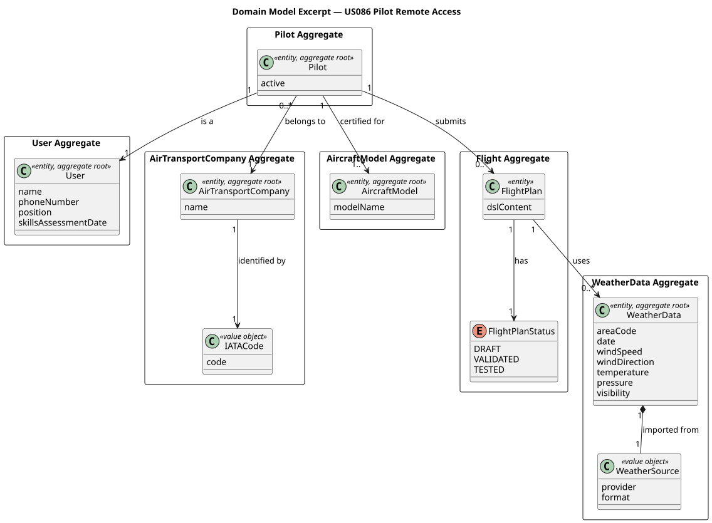
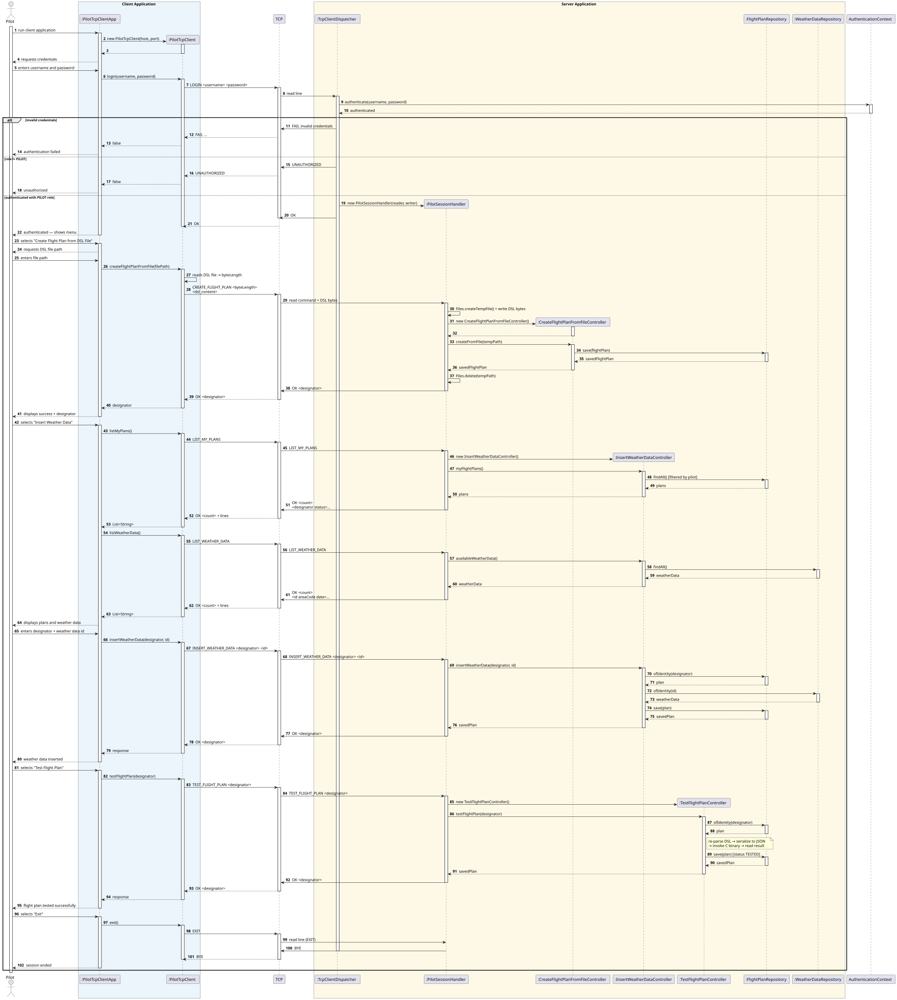
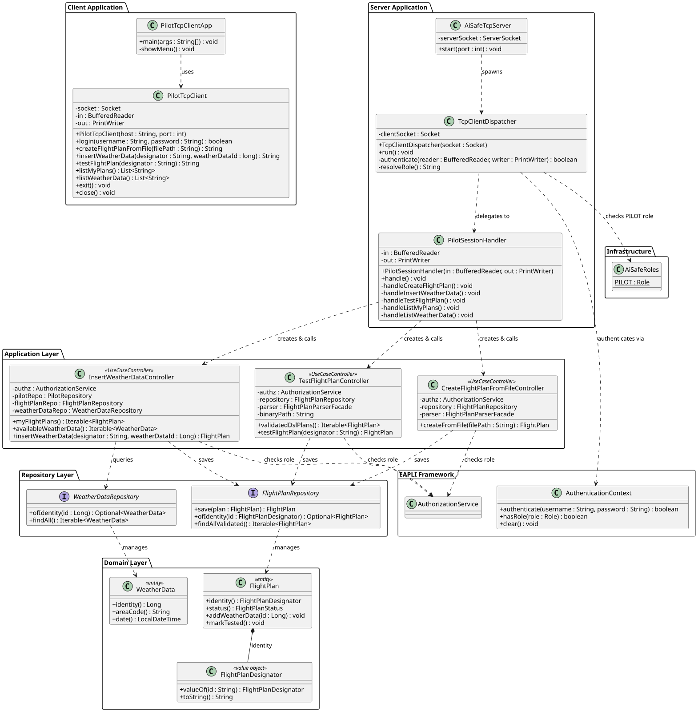

# US086 — Pilot Remote Access

## 1. Context

This US is being implemented for the first time in Sprint 3. It allows a Pilot to remotely access the AISafe system using a dedicated TCP client application — the **Pilot Remote App**. The client communicates with a TCP server embedded in the main AISafe application; no direct interaction with the database is permitted from the client side.

The TCP server is shared across all remote access user stories (US044, US078, US086). Each actor connects to the same server on the same port and, after authentication, is granted access only to the commands corresponding to their role. For US086, the role is `PILOT`.

The Pilot user stories that must be remotely available are US081 (Create a flight plan from a DSL file), US082 (Insert weather data in a flight) and US085 (Test/validate a flight plan). Of these, only US081 is fully implemented in Sprint 3.

### 1.1 List of issues

- **Analysis:** Define the TCP protocol, the authentication mechanism, and the set of Pilot commands to be exposed remotely. Identify the existing classes that can be reused.
- **Design:** Define the architecture — TCP server, `PilotSessionHandler`, `PilotTcpClient` and the protocol specification. Produce sequence and class diagrams.
- **Implement:** Implement the TCP server (`AiSafeTcpServer`), the per-connection dispatcher (`TcpClientDispatcher`), the pilot session handler (`PilotSessionHandler`), and the standalone client application (`PilotTcpClientApp`).
- **Test:** Manual integration tests — connect client, authenticate, execute Pilot commands, verify responses.

---

## 2. Requirements

**US086** As a Pilot, I want to remotely access the system using the Air Transport Company App.

**Acceptance Criteria:**

| AC | Description |
|----|-------------|
| AC086.1 | A specific TCP-based network client application is required to communicate with the server application embedded in the system. |
| AC086.2 | The client application interaction with the system must be limited to the TCP connection — no direct interaction with the database is acceptable. |
| AC086.3 | All Pilot user stories must be remotely available using this client application. |
| AC086.4 | Authentication and authorization must be enforced — only authenticated users with the `PILOT` role may execute Pilot commands. |

**Pilot user stories available remotely:**

| US | Description | Status in Sprint 3 |
|----|-------------|-------------------|
| US081 | Create a flight plan from a DSL file | Implemented — exposed via `CREATE_FLIGHT_PLAN` command |
| US082 | Insert weather data in a flight | Not yet implemented |
| US085 | Test/validate a flight plan | Not yet implemented |

**Dependencies/References:**

| Dependency | Reason |
|-----------|--------|
| US030 | Authentication and authorization must be in place; the `PILOT` role must exist. |
| US081 | Create a Flight Plan from a File — the controller `CreateFlightPlanFromFileController` is reused server-side to handle the `CREATE_FLIGHT_PLAN` command. |
| US075 | Add a Pilot — a pilot user must exist in the system before remote access can be tested. |

---

## 3. Analysis

US086 requires a standalone TCP client application and a TCP server embedded in the main AISafe application. The client connects to the server, authenticates as a Pilot, and then issues commands that map to existing Pilot use cases — the server executes those use cases on behalf of the remote user.

### Architecture overview

The TCP server (`AiSafeTcpServer`) runs inside the same JVM as the console application, sharing the same persistence context and EAPLI authentication infrastructure. One `TcpClientDispatcher` thread is spawned per accepted connection; it handles authentication and then delegates to a role-specific session handler. For the `PILOT` role this is `PilotSessionHandler`.

```
[PilotTcpClientApp]  ──TCP──►  [AiSafeTcpServer]
                                       │
                               [TcpClientDispatcher]  (one thread per connection)
                                       │
                               authenticates via AuthenticationContext
                                       │
                               role == PILOT?
                                       │
                               [PilotSessionHandler]
                                       │
                               [CreateFlightPlanFromFileController]  (existing)
                                       │
                               [FlightPlanRepository]  (existing)
```

### TCP Protocol

The protocol is text-based and line-oriented (UTF-8, `\n` terminated). This choice keeps it simple to implement, test with `telnet` or `nc`, and read in logs.

**Authentication phase:**

```
C→S:  LOGIN <username> <password>
S→C:  OK
  or
S→C:  FAIL <reason>
```

If authentication succeeds but the user does not have the `PILOT` role, the server responds `UNAUTHORIZED` and closes the connection.

**Command phase (after successful LOGIN as PILOT):**

```
# Create a flight plan from DSL content
C→S:  CREATE_FLIGHT_PLAN <charLength>
C→S:  <dsl_content>          (exactly charLength characters)
S→C:  OK <designator>
  or
S→C:  ERROR <message>

# End session
C→S:  EXIT
S→C:  BYE
```

Any unrecognised command receives:
```
S→C:  UNKNOWN_COMMAND
```

### Reuse of existing classes

The `CREATE_FLIGHT_PLAN` command is handled server-side by writing the received DSL content to a temporary file and passing its path to the existing `CreateFlightPlanFromFileController.createFromFile(path)`. This reuses the full 4-stage DSL validation pipeline (lexical → syntactic → range → semantic) without duplicating any logic.

Authentication reuses `AuthenticationContext.authenticate(username, password)`, which delegates to the EAPLI `AuthenticationService`. After authentication, role verification uses `AuthenticationContext.hasRole(AiSafeRoles.PILOT)`.

### Key design decisions

**Thread-per-connection** — each accepted `Socket` is handled by a dedicated `TcpClientDispatcher` thread. This is the simplest model that supports concurrent Pilot sessions without blocking the server's accept loop.

**Role-specific session handler** — the dispatcher handles only authentication and role resolution; all Pilot command logic lives in `PilotSessionHandler`. This keeps each class focused on a single responsibility and makes it straightforward to add handlers for US044 and US078 later.

**Temporary file for DSL transfer** — the server writes the received DSL bytes to a `Files.createTempFile(...)` and passes the path to `CreateFlightPlanFromFileController`. The temp file is deleted after the controller returns. This avoids modifying the controller and reuses the existing file-based validation pipeline.

### Main classes identified

| Class | Type | Responsibility |
|-------|------|----------------|
| `AiSafeTcpServer` | Server | Opens `ServerSocket` on port 9999; accepts connections; spawns `TcpClientDispatcher` threads |
| `TcpClientDispatcher` | `Runnable` | Handles one client connection: reads `LOGIN`, authenticates, checks role, delegates to session handler |
| `PilotSessionHandler` | Session Handler | Handles Pilot commands: `CREATE_FLIGHT_PLAN`, `EXIT`; delegates to existing controllers |
| `PilotTcpClient` | Client | Encapsulates TCP communication: `login()`, `createFlightPlanFromFile()`, `exit()` |
| `PilotTcpClientApp` | Client Main | Standalone client entry point; presents interactive menu to the Pilot |
| `AuthenticationContext` *(existing)* | Auth adapter | Authenticates credentials via EAPLI; verifies role |
| `CreateFlightPlanFromFileController` *(existing)* | Controller | Validates DSL and persists the flight plan; reused server-side |
| `AiSafeRoles.PILOT` *(existing)* | Role constant | Used in dispatcher to verify that the authenticated user is a Pilot |

The following domain model excerpt shows the aggregates involved in this use case:



## 4. Design

### 4.1. Realization

The flow is divided into two phases: **authentication** and **command execution**.

**Authentication phase:**

1. `PilotTcpClientApp` starts, creates a `PilotTcpClient` connected to the server host and port.
2. The user enters credentials; `PilotTcpClient.login(username, password)` sends `LOGIN <username> <password>` over the socket.
3. Server-side, `TcpClientDispatcher` (one thread per connection) reads the `LOGIN` line and calls `AuthenticationContext.authenticate(username, password)`.
4. If authentication fails, the server responds `FAIL invalid credentials` and the connection is closed.
5. If the user is authenticated but does not have the `PILOT` role (checked via `AuthenticationContext.hasRole(AiSafeRoles.PILOT)`), the server responds `UNAUTHORIZED` and closes the connection.
6. If authentication succeeds and the role is `PILOT`, the server responds `OK` and instantiates a `PilotSessionHandler`, delegating all subsequent commands to it.

**Command phase — `CREATE_FLIGHT_PLAN`:**

7. The Pilot selects "Create Flight Plan from DSL File" in the client menu and provides a local DSL file path.
8. `PilotTcpClient.createFlightPlanFromFile(filePath)` reads the file, computes its character length, and sends `CREATE_FLIGHT_PLAN <charLength>\n<dsl_content>`.
9. `PilotSessionHandler` reads the DSL bytes and writes them to a temporary file via `Files.createTempFile(...)`.
10. A new `CreateFlightPlanFromFileController` is instantiated and `createFromFile(tempPath)` is called — reusing the full 4-stage DSL validation pipeline without modification.
11. The temp file is deleted after the controller returns.
12. On success the server responds `OK <designator>`; on failure `ERROR <message>`.

**Exit:**

13. The Pilot selects "Exit"; `PilotTcpClient.exit()` sends `EXIT` and the server responds `BYE`.

The following sequence diagram illustrates the full flow:



The following class diagram shows the classes involved:



### 4.2. Acceptance Tests

Automated tests are split into two classes, both in `src/test/java/aisafe/tcpserver/pilot/`:

- `PilotSessionHandlerTest` — **unit tests** using in-memory streams (`StringReader` / `StringWriter`), no socket or EAPLI context required.
- `PilotSessionHandlerIT` — **implementation tests** using a real loopback `ServerSocket`, verifying the protocol over actual TCP I/O.

Manual integration tests are documented in [tests.md](tests.md).

---

**AC086.1 — EXIT command returns BYE**

**Test:** `ensureExitCommandReturnsBye`

```java
@Test
void ensureExitCommandReturnsBye() throws IOException {
    final String response = runSession("EXIT");
    assertEquals("BYE", response);
}
```

---

**AC086.1 — Unknown command returns UNKNOWN_COMMAND**

**Test:** `ensureUnknownCommandReturnsUnknownCommand`

```java
@Test
void ensureUnknownCommandReturnsUnknownCommand() throws IOException {
    final String response = runSession("HELLO\nEXIT");
    assertTrue(response.contains("UNKNOWN_COMMAND"));
}
```

**Test:** `ensureMultipleUnknownCommandsAreEachRejected`

```java
@Test
void ensureMultipleUnknownCommandsAreEachRejected() throws IOException {
    final String response = runSession("FOO\nBAR\nEXIT");
    assertEquals(2, response.lines().filter(l -> l.equals("UNKNOWN_COMMAND")).count());
}
```

---

**AC086.3 — CREATE_FLIGHT_PLAN with missing or invalid char length returns ERROR**

**Test:** `ensureCreateFlightPlanWithoutByteLengthReturnsError`

```java
@Test
void ensureCreateFlightPlanWithoutByteLengthReturnsError() throws IOException {
    final String response = runSession("CREATE_FLIGHT_PLAN\nEXIT");
    assertTrue(response.contains("ERROR"));
}
```

**Test:** `ensureCreateFlightPlanWithInvalidByteLengthReturnsError`

```java
@Test
void ensureCreateFlightPlanWithInvalidByteLengthReturnsError() throws IOException {
    final String response = runSession("CREATE_FLIGHT_PLAN abc\nEXIT");
    assertTrue(response.contains("ERROR"));
}
```

**Test:** `ensureCreateFlightPlanWithNegativeByteLengthReturnsError`

```java
@Test
void ensureCreateFlightPlanWithNegativeByteLengthReturnsError() throws IOException {
    final String response = runSession("CREATE_FLIGHT_PLAN -10\nEXIT");
    assertTrue(response.contains("ERROR"));
}
```

---

**AC086.4 + AC086.1 — Successful authentication as Pilot (manual)**

1. Run `./run-pilot-client.sh`, enter `localhost` / `9999` / `pilot1` / `Password1`.
2. Expected: server responds `OK` and the Pilot menu is displayed.

---

**AC086.4 — Authentication failure — wrong password (manual)**

1. Run `./run-pilot-client.sh` and enter credentials `pilot1` / `wrongpassword`.
2. Expected: client displays `Authentication failed.` and terminates.

---

**AC086.4 — Authorization failure — non-Pilot user (manual)**

1. Run `./run-pilot-client.sh` and enter credentials `atcc1` / `Password1`.
2. Expected: client displays `Authentication failed.` and terminates (server responded `UNAUTHORIZED`).

---

**AC086.3 — CREATE_FLIGHT_PLAN with valid DSL (manual)**

1. Authenticate as `pilot1`, select option `1`, provide `src/test/resources/dsl/valid/01_single_leg_regular.dsl`.
2. Expected: client displays `Flight plan created: TP123`.

## 5. Implementation

The implementation is distributed across the following packages in `aisafe.base`:

| Package | Class | Role |
|---------|-------|------|
| `aisafe.tcpserver` | `AiSafeTcpServer` | Opens `ServerSocket` on port 9999; accepts connections; spawns `TcpClientDispatcher` daemon threads |
| `aisafe.tcpserver` | `TcpClientDispatcher` | Handles one connection: reads `LOGIN`, authenticates via `AuthenticationContext`, checks `PILOT` role, delegates to `PilotSessionHandler` |
| `aisafe.tcpserver.pilot` | `PilotSessionHandler` | Command loop: `CREATE_FLIGHT_PLAN`, `EXIT`, `UNKNOWN_COMMAND` |
| `aisafe.app.pilot` | `PilotTcpClient` | Client-side TCP communication: `login()`, `createFlightPlanFromFile()`, `exit()` |
| `aisafe.app.pilot` | `PilotTcpClientApp` | Standalone client entry point; interactive Pilot menu |
| `aisafe.app.console` | `AiSafeConsoleApp` | Modified to start `AiSafeTcpServer` in a daemon thread before the console menu |
| `aisafe.app.console` | `AiSafeBootstrap` | Modified to create `pilot1 / Password1` (role `PILOT`, company TAP, certified for Boeing 737-800) |

The `CREATE_FLIGHT_PLAN` command is handled by writing the received DSL content to a temporary file and delegating to the existing `CreateFlightPlanFromFileController.createFromFile(path)`. The temp file is deleted after the controller returns, regardless of outcome:

```java
tempFile = Files.createTempFile("aisafe-dsl-", ".dsl");
Files.writeString(tempFile, dslContent);
final var flightPlan = new CreateFlightPlanFromFileController().createFromFile(tempFile.toString());
out.println("OK " + flightPlan.identity());
```

---

## 6. Integration/Demonstration

**Prerequisites:** Run from the `aisafe.base` directory with Maven 3.9+ and Java 21. The bootstrap creates `pilot1 / Password1` automatically on first run.

**Start the server:**

1. Run `AiSafeConsoleApp` — the TCP server starts on port 9999 automatically.

**Connect and authenticate:**

2. Run `PilotTcpClientApp` in a separate terminal.
3. Enter host `localhost` and port `9999`.
4. Enter credentials `pilot1` / `Password1`.
5. The server responds `OK` and the Pilot menu is displayed:
   ```
   === Pilot Remote Menu ===
   1. Create Flight Plan from DSL File
   0. Exit
   ```

**Create a flight plan:**

6. Select option `1` and provide the path to a valid DSL file, e.g.:
   ```
   DSL file path: /tmp/test.dsl
   ```
7. The server validates and persists the flight plan and responds:
   ```
   Flight plan created: TP800
   ```

**Authentication failure scenario:**

- Attempt login with wrong credentials → server responds `FAIL invalid credentials` and closes.
- Attempt login with a non-Pilot account → server responds `UNAUTHORIZED` and closes.

---

## 7. Observations

- The TCP server is shared across US044, US078, and US086. Each role dispatches to a dedicated session handler (`PilotSessionHandler` for US086), keeping role-specific command logic isolated and making it straightforward to add handlers for other roles in future sprints.
- The `TcpClientDispatcher` always calls `AuthenticationContext.clear()` in a `finally` block to ensure the EAPLI session is released even if the connection is closed unexpectedly. EAPLI's authentication context is thread-local, so concurrent sessions do not interfere with each other.
- The temporary-file approach for DSL transfer reuses `CreateFlightPlanFromFileController` without any modification — the full 4-stage validation pipeline (lexical → syntactic → range → semantic) is exercised server-side exactly as it is in the console UI.
- `PilotTcpClientApp` is a standalone application with its own `main` method. It has no dependency on any JPA or repository class — all persistence is performed exclusively server-side (AC086.2).
- US082 (Insert weather data) and US085 (Test/validate a flight plan) are not yet implemented in Sprint 3 and are therefore not exposed by `PilotSessionHandler`. The command loop returns `UNKNOWN_COMMAND` for any unrecognised input, so the server behaves safely even if a client sends unsupported commands.
