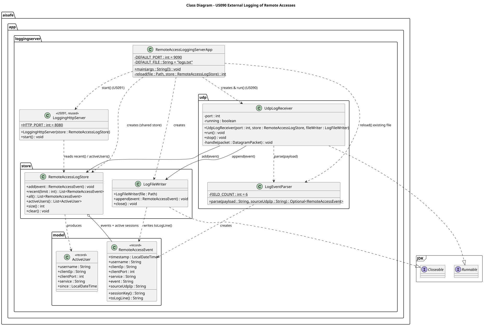
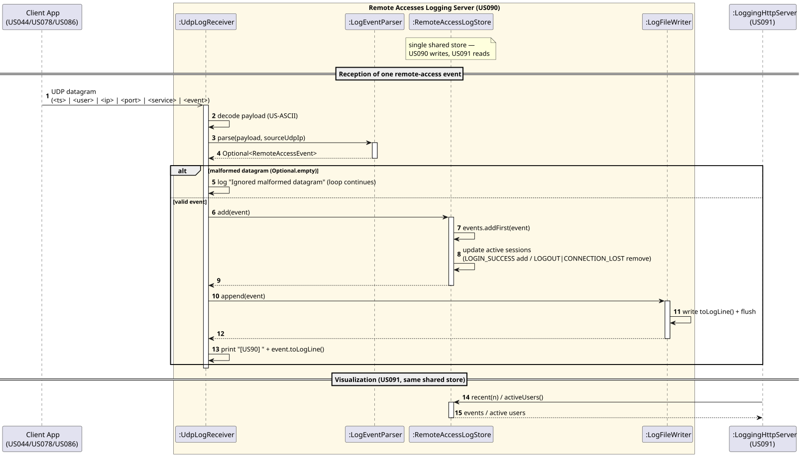

# US090 — External Logging of Remote Accesses

## 1. Context

US090 is the **Remote Accesses Logging Server**: a standalone **UDP server** that receives, records and persists the remote-access events generated by the TCP client applications (US044, US078, US086). It runs on a dedicated network node in the cloud, separate from the AISafe main application. Together with US091 (the HTTP/AJAX visualization) it forms the monitoring subsystem — both are started by the same application (`RemoteAccessLoggingServerApp`) and share the same in-memory store.

Although it lives inside `aisafe.base` for project consistency, the server is **self-contained**: it imports nothing from the AISafe domain or the EAPLI framework (pure JDK), so it can be deployed and run on its own node by launching only `RemoteAccessLoggingServerApp`.

### 1.1 List of issues

- **Analysis:** Define the UDP datagram format received from the clients, the data to record, and the storage strategy that US091 will read.
- **Design:** A UDP receiver, a defensive parser, a thread-safe shared store (recent events + active users) and file persistence. The shared store is the integration seam for US091.
- **Implement:** `RemoteAccessLoggingServerApp`, `UdpLogReceiver`, `LogEventParser`, `RemoteAccessLogStore`, `LogFileWriter`.
- **Test:** Unit tests (parser, store), an integration test over a real UDP socket, and a manual end-to-end test with the US078/US086 clients.

---

## 2. Requirements

**US090** As the system, I want to log all remote accesses (successful logins, failed logins, logouts and disconnects) reported by the remote client applications, so that they can be monitored.

**Acceptance Criteria:**

| AC | Description |
|----|-------------|
| AC090.1 | A UDP server receives the remote-access events sent by the client applications (US044, US078, US086). |
| AC090.2 | All four event types are recorded: successful login, failed login, logout, and disconnect. |
| AC090.3 | Each record includes a timestamp, the username, the client's IP address, the client's port, and the service (US44, US78 or US86). |
| AC090.4 | Events are stored in a structured way (in memory **and** a file), not merely printed, so that US091 can read and display them. The server runs on a dedicated cloud node. |

**Dependencies/References:**

| Dependency | Reason |
|-----------|--------|
| US044 / US078 / US086 | The client apps emit the UDP datagrams; US090 is passive and depends on their agreed payload format. |
| US091 | The `LoggingHttpServer` reads US090's shared in-memory store to serve the web pages (same process / same node). |

---

## 3. Analysis

### Received datagram (the contract with the clients)

ASCII, pipe-delimited, one datagram per event:

```
<timestamp> | <username> | <clientIP> | <clientPort> | <service> | <event>
```

Example: `2026-06-04 17:00:00 | atcc1 | 10.8.0.50 | 50231 | US78 | LOGIN_SUCCESS`

- `timestamp` format `yyyy-MM-dd HH:mm:ss`; `event ∈ { LOGIN_SUCCESS, LOGIN_FAILED, LOGOUT, CONNECTION_LOST }`; `service ∈ { US44, US78, US86 }`.
- Default UDP port **9090** (configurable with `--port`).

### Where the client IP/port come from

The client's IP and port are taken from the **payload** (the TCP client's own local address), **not** from the UDP packet's source address — the datagram is sent from a different, ephemeral UDP socket, so its source port is *not* the client's TCP port. The UDP packet's source IP is captured only as an optional verification field.

### Storage strategy (why not just print)

US091 must read the events to render the web pages, so US090 stores every event in a **thread-safe in-memory store** (`RemoteAccessLogStore`) and also appends it to a **text file** (durability + reload on restart). The store maintains two views: the most recent events (newest first) and the set of currently active users.

### Active-users logic

Session key = `(username, clientIP, clientPort, service)`. `LOGIN_SUCCESS` adds/updates the session; `LOGOUT` and `CONNECTION_LOST` remove it; `LOGIN_FAILED` is recorded in history but never creates an active session.

### Concurrency / US091 seam

The UDP receiver runs in one thread; the US091 `LoggingHttpServer` runs in its own threads — both share the **same** `RemoteAccessLogStore` instance, which uses concurrent collections so reads (US091) and writes (US090) are safe.

### Main classes identified

| Class                          | Responsibility                                                                                                                                          |
|--------------------------------|---------------------------------------------------------------------------------------------------------------------------------------------------------|
| `RemoteAccessLoggingServerApp` | `main`; parses `--port`/`--file`, reloads the file, starts the UDP receiver (US090) **and** the `LoggingHttpServer` (US091), registers a shutdown hook  |
| `UdpLogReceiver`               | Binds the UDP socket; receive loop (one bad packet never stops it); delegates to the parser, store and file writer                                      |
| `LogEventParser`               | Parses the pipe-delimited payload defensively into a `RemoteAccessEvent`                                                                                |
| `RemoteAccessLogStore`         | Thread-safe store: recent events + active users (the US091 seam)                                                                                        |
| `LogFileWriter`                | Appends each event to the log file (same format as the wire)                                                                                            |
| `RemoteAccessEvent`            | Immutable record of one event                                                                                                                           |
| `ActiveUser`                   | View of one currently-active user                                                                                                                       |
| `LoggingHttpServer` *(US091)*  | Reads this store; serves the web pages on port 8080 — documented in `us091`.                                                                            |



## 4. Design

### 4.1. Realization

1. A client app (US044/US078/US086) sends a UDP datagram on login success/failure, logout or disconnect.
2. `UdpLogReceiver.receive()` returns the packet; the payload is decoded (US-ASCII).
3. `LogEventParser.parse()` validates and builds a `RemoteAccessEvent`, or yields empty (ignored) if malformed.
4. The event is added to `RemoteAccessLogStore` (history + active-users update) and appended to the log file.
5. US091's `LoggingHttpServer` reads `recent(n)` / `activeUsers()` from the same store to serve its pages.



### 4.2. Acceptance Tests

Automated tests in `src/test/java/aisafe/app/loggingserver/`: `LogEventParserTest`, `RemoteAccessLogStoreTest`, `LogFileWriterTest`, `UdpLogReceiverIT`. Manual end-to-end tests are documented in [tests.md](tests.md).

---

## 5. Implementation

Package `aisafe.app.loggingserver` (+ `.model`, `.udp`, `.store`) inside `aisafe.base`; **pure JDK** (no domain/EAPLI imports). Run:

```bash
cd aisafe.base
mvn -q compile
java -cp target/classes aisafe.app.loggingserver.RemoteAccessLoggingServerApp --port 9090 --file logs.txt
```

The receive loop is robust — one malformed datagram never stops the server:

```java
while (running) {
    final DatagramPacket packet = new DatagramPacket(buffer, buffer.length);
    try {
        ds.receive(packet);
        handle(packet); // parse → store.add → fileWriter.append
    } catch (final Exception e) {
        if (running) System.err.println("[US90] Receive error: " + e.getMessage());
    }
}
```

The active-users state machine lives in the store:

```java
switch (event.event()) {
    case "LOGIN_SUCCESS" -> activeSessions.put(event.sessionKey(), event);
    case "LOGOUT", "CONNECTION_LOST" -> activeSessions.remove(event.sessionKey());
    default -> { /* LOGIN_FAILED and any unknown event: not an active session */ }
}
```

`RemoteAccessLoggingServerApp` wires US090 and US091 together, sharing one store:

```java
final RemoteAccessLogStore store = new RemoteAccessLogStore();
final UdpLogReceiver receiver = new UdpLogReceiver(port, store, writer); // US090
new LoggingHttpServer(store).start();                                    // US091, port 8080
receiver.run();                                                          // blocks
```

---

## 6. Integration/Demonstration

**Prerequisites:** none — US090 has no database dependency.

1. Start `aisafe.app.loggingserver.RemoteAccessLoggingServerApp` → `[US90] ... listening on UDP 9090` and `[US91] HTTP visualization server running on port 8080`.
2. Start the AISafe main app (`AiSafeConsoleApp`, TCP server on 9999) and a client (`CollaboratorTcpClientApp` US78 or `PilotTcpClientApp` US86).
3. Perform a successful login, a wrong-password login, and a logout.
4. Each event appears immediately in the server console, in `logs.txt`, and on the web pages at `http://<node>:8080/`; events from both services (`US78` and `US86`) reach the same server.

---

## 7. Observations

- The server is self-contained (no domain/EAPLI imports), so it can be deployed and run on its own dedicated cloud node.
- The client IP/port are read from the **payload** (the TCP endpoint), not from the UDP packet's source address.
- `service` is treated as a **free string**, so US044 integrates with no changes once it starts sending datagrams.
- The shared `RemoteAccessLogStore` is the **integration seam for US091**, whose HTTP server runs in its own threads sharing the same instance.
- The log file is flushed per event, so durability does not depend on the shutdown hook.