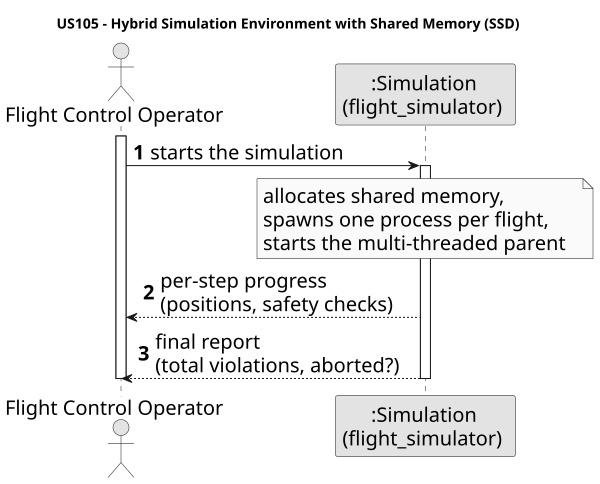
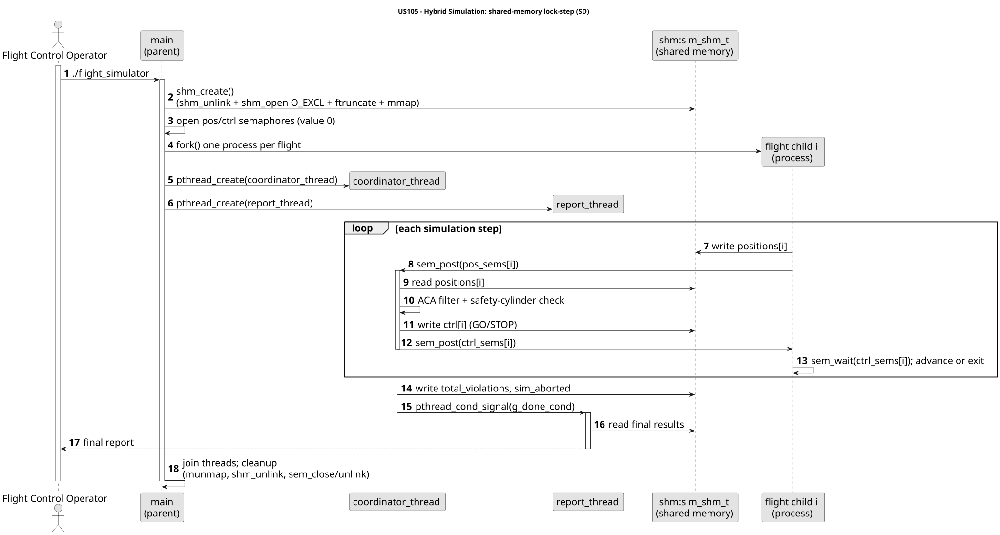

# US105 — Initialize Hybrid Simulation Environment with Shared Memory

## 1. Context

US105 upgrades the simulation architecture introduced in US100–US103, replacing the
pipe-based IPC with **POSIX shared memory** as the primary communication channel and
making the parent process **multi-threaded**. The term *hybrid* refers to the combination
of **multiple child processes** (one per flight, as in US100) with **multiple threads**
inside the parent — not to a mix of pipes and shared memory; shared memory completely
replaces all position and control pipes.

The implementation is written in C and lives entirely under `aisafe.base/simulation/`.
The architecture is deliberately aligned with the professor's canonical examples
(Luís Nogueira, ISEP SCOMP 2526), specifically **ex1-7.c** (shm_open + ftruncate +
mmap), **ex2-5.c** (named semaphores, producer-consumer), **ex1-9.c** (pthread_create +
write() in threads), and **ex1-3.c / ex1-4.c** (SIGUSR1 + SA_RESTART).

---

## 2. Requirements

**US105:** As a Flight Control Operator, I want to start the simulation with a
multi-threaded parent process and multiple child flight processes communicating through a
shared memory area, so that the system efficiently coordinates simulation data across
processes.

### Acceptance Criteria

| ID | Criterion | Status |
|----|-----------|--------|
| AC1 | The parent process spawns dedicated threads for its functionalities | Done |
| AC2 | Each flight is launched as an independent process | Done |
| AC3 | A shared memory segment is allocated and properly initialized for inter-process communication | Done |
| AC4 | Flight processes are configured to use semaphores for synchronization | Done |
| AC5 | Implemented in C using threads, mutexes, condition variables, and signals | Done |

---

## 3. Analysis

### 3.1 Problem decomposition

US100–US103 used one unnamed pipe pair per flight (position pipe child→parent,
control pipe parent→child). The key limitations of that approach at scale are:

| Limitation | Description |
|-----------|-------------|
| File-descriptor growth | Each flight requires two pipe fds in the parent; the fd table grows linearly |
| No shared state | The parent cannot inspect all aircraft positions simultaneously — it must read them one by one from separate pipes |
| No intra-parent concurrency | The main loop is single-threaded; safety checks and reporting block the same thread |

US105 addresses these limitations with two architectural changes:

| Change | Mechanism | Benefit |
|--------|-----------|---------|
| Shared address space | POSIX shared memory (`sim_shm_t`) | All positions visible to the parent at once; no per-flight fd overhead |
| Multi-threaded parent | `coordinator_thread` + `report_thread` | Safety checks and report generation run concurrently and independently |

### 3.2 Thread roles

Two approaches for the parent's internal structure were considered:

| Approach | Description | Decision |
|----------|-------------|----------|
| Single-threaded parent with shm | Parent reads shm sequentially, no threads | Rejected — does not satisfy AC1 (dedicated threads) or AC5 (threads + condition variables) |
| **Multi-threaded parent** | `coordinator_thread` drives the step loop; `report_thread` waits on a condition variable | **Chosen** — satisfies all acceptance criteria; separates concerns cleanly |

| Thread | Responsibility | Synchronization |
|--------|---------------|-----------------|
| `coordinator_thread` | Collect positions via `pos_sems`, run safety checks (US102), send GO/STOP via `ctrl_sems`, signal report thread at end | Named semaphores (inter-process), mutex + condition variable (intra-process) |
| `safety_thread` | Dedicated real-time safety-violation detection/notification channel (US106/US107), kept off the coordinator's critical path | `pthread_cond_wait` on the notification mutex/condition |
| `report_thread` | Wait for end-of-simulation signal, then generate final report (US109) | `pthread_cond_wait` on `g_done_cond` |

> **Note:** US105 establishes the multi-threaded parent with the `coordinator_thread`
> and `report_thread`. The `safety_thread` is **integrated from US106** (real-time
> safety detection), and an `environment_thread` is **added by US110** (wind). The
> current `main.c` therefore spawns **four** parent threads — created in the order
> `environment_tid`, `safety_tid`, `coordinator_tid`, `report_tid`, and **joined** in
> the order `coordinator_tid`, `environment_tid`, `safety_tid`, `report_tid` (the
> coordinator is joined first because it signals the others to finish) before the
> children are reaped.

### 3.3 Semaphore design

Writing a position to shared memory and reading it are **not** mutually exclusive
operations on their own — the parent could read a partially-written struct. Named POSIX
semaphores enforce ordering without busy-waiting:

| Semaphore | Direction | Initial value | Semantic |
|-----------|-----------|---------------|----------|
| `/aisafe_pos_N` | child posts → coordinator waits | 0 | "I have written my position; you may read" |
| `/aisafe_ctrl_N` | coordinator posts → child waits | 0 | "I have checked safety; you may advance" |

Initial value 0 is the **event-signalling** pattern from `ex2-5.c` and T6 slides: the
consumer blocks until the producer explicitly signals. This is distinct from the
mutual-exclusion pattern (initial value 1) used in `ex2-6.c`.

---

## 4. Design

### 4.0 Diagrams

System sequence diagram (operator ↔ simulation):


> Source: [puml/US105-SSD.puml](puml/US105-SSD.puml)

Internal sequence — the multi-process / multi-threaded shared-memory lock-step:


> Source: [puml/US105-SD.puml](puml/US105-SD.puml)

### 4.1 Shared memory structure (`shared_memory.h`)

```c
typedef struct {
    aircraft_position_t positions[MAX_FLIGHTS]; /* written by each child     */
    int ctrl[MAX_FLIGHTS];      /* 1=GO, 0=STOP — written by coordinator    */
    int active[MAX_FLIGHTS];    /* 1 while flight is running                */
    int n_flights;
    int total_violations;       /* written by coordinator at end            */
    int sim_aborted;            /* written by coordinator at end            */
    /* added by US106 — real-time violation event queue */
    violation_event_t violation_events[MAX_VIOLATION_EVENTS];
    int violation_event_count;
    int dropped_violation_events;
    /* added by US110 — environment (wind) block; guarded by the named
     * semaphore /aisafe_env (value 1) as a cross-process mutex */
    environment_t   environment;
    int             env_step;
} sim_shm_t;
```

Created by the parent with `shm_open(O_CREAT|O_EXCL) + ftruncate + mmap` (pattern from
`ex1-7.c`). Each child attaches with `shm_open(O_RDWR) + mmap`. The file descriptor is
closed immediately after `mmap` in both parent and child — the mapping persists until
`munmap` or process exit.

Before creating, `shm_unlink` is called unconditionally to remove any stale object left
by a crashed previous run. `ftruncate` on a pre-existing shared memory object fails on
macOS, so this cleanup step is essential.

### 4.2 Step-by-step protocol

The lockstep protocol from US103 is preserved. Only the IPC mechanism changes:

```
Flight child i                          coordinator_thread (parent)
────────────────────────────────────────────────────────────────────
shm->positions[i] = pos
sem_post(pos_sems[i])       ──────────►
                                        sem_wait(pos_sems[i])
                                        pos = shm->positions[i]
                                        US101: ACA filter + history
                                        US102: safety cylinder check
                                        shm->ctrl[i] = 1 (GO) or 0 (STOP)
                                        sem_post(ctrl_sems[i])
sem_wait(ctrl_sems[i])      ◄──────────
if ctrl[i] == 0 → flight_done(), exit(1)
/* ctrl[i] == 1 → advance to next step */
```

When a flight finishes all its segments it calls `flight_done()`:

```c
static void flight_done(int idx, sim_shm_t *shm, sem_t *pos_sem, sem_t *ctrl_sem) {
    shm->active[idx] = 0;
    sem_post(pos_sem);          /* wake coordinator to see active[idx]=0 */
    sem_close(pos_sem);
    sem_close(ctrl_sem);
    munmap(shm, sizeof(sim_shm_t));   /* pattern ex1-7.c: child releases mapping */
}
```

The coordinator detects completion by checking `shm->active[i] == 0` after each
`sem_wait(pos_sems[i])`. No extra "done" semaphore is needed.

### 4.3 End-of-simulation handoff (condition variable)

When the step loop ends the coordinator must transfer `total_violations` and
`sim_aborted` to the report thread and wake it. A **condition variable** (T6/T7 pattern)
is used so the report thread does not busy-wait:

```c
/* coordinator_thread — after the loop */
pthread_mutex_lock(ctx->g_mutex);
shm->total_violations = total_violations;
shm->sim_aborted      = sim_aborted;
*ctx->g_sim_done      = 1;
pthread_cond_signal(ctx->g_done_cond);
pthread_mutex_unlock(ctx->g_mutex);

/* report_thread */
pthread_mutex_lock(ctx->g_mutex);
while (!*ctx->g_sim_done)
    pthread_cond_wait(ctx->g_done_cond, ctx->g_mutex);
int total_violations = ctx->shm->total_violations;
int sim_aborted      = ctx->shm->sim_aborted;
pthread_mutex_unlock(ctx->g_mutex);
generate_final_report(...);
```

The `while` loop is mandatory: POSIX allows `pthread_cond_wait` to return spuriously
without a signal. The mutex ensures that the flag check and the wait are atomic with
respect to the coordinator's signal.

### 4.4 SIGUSR1 and SA_RESTART

US102 sends `SIGUSR1` to violating flight child processes. The child installs the handler
with `SA_RESTART` so that `sem_wait(ctrl_sem)`, if interrupted by the signal, is
automatically restarted by the kernel rather than returning `EINTR`. The child exits at
the **next step boundary** — not mid-step — which keeps the semaphore protocol clean:

```c
struct sigaction act;
memset(&act, 0, sizeof(act));
act.sa_handler = handle_sigusr1;
act.sa_flags   = SA_RESTART;
sigfillset(&act.sa_mask);    /* block all signals during handler */
sigaction(SIGUSR1, &act, NULL);
```

Pattern from `ex1-3.c` / `ex1-4.c`. The handler sets only a `volatile sig_atomic_t`
flag and calls only `write()` (async-signal-safe).

### 4.5 Alignment with Professor's Examples

| Pattern | Professor example | Use in US105 |
|---------|------------------|--------------|
| `shm_open + ftruncate + mmap` | `ex1-7.c`, `ex2-6.c` | `shm_create()` / `shm_attach()` |
| Child calls `munmap` before `exit` | `ex1-7.c` | `flight_done()` |
| Named semaphore initial value 0 (event) | `ex2-5.c` | `pos_sem` / `ctrl_sem` per flight |
| `sem_unlink` before `sem_open O_EXCL` | — | Crash recovery for stale objects |
| `pthread_create` / `pthread_join` | `ex1-9.c` | `coordinator_thread` + `report_thread` |
| `write() + snprintf()` in threads | `ex1-9.c` (*"printf is not inherently thread-safe"*) | All output in both threads |
| `pthread_mutex_init` on stack variable | POSIX standard | `g_mutex` (not `PTHREAD_MUTEX_INITIALIZER`, which is for static storage) |
| `while (!flag) pthread_cond_wait` | T6/T7 slides | report_thread spurious-wakeup guard |
| SIGUSR1 + `SA_RESTART` | `ex1-3.c`, `ex1-4.c` | flight child collision alert |

---

## 5. Implementation

### 5.1 Files Created/Modified

| File | Change summary |
|------|---------------|
| `simulation/shared_memory.h` | **New** — defines `sim_shm_t`, semaphore name constants (`/aisafe_sim`, `/aisafe_pos_N`, `/aisafe_ctrl_N`), and lifecycle API (`shm_create`, `shm_attach`, `shm_destroy`, `open_pos_sem`, `open_ctrl_sem`, `cleanup_sems`) |
| `simulation/shared_memory.c` | **New** — implements shared memory and named semaphore lifecycle following `ex1-7.c` and `ex2-5.c` patterns; `shm_unlink` + `sem_unlink` before creation for crash recovery |
| `simulation/flight_process.h` | Signature updated from pipe fds to `(int idx, plan, sim_shm_t*, pos_sem, ctrl_sem, params)` |
| `simulation/flight_process.c` | Position write changed to `shm->positions[i]=pos; sem_post(pos_sem)`; control wait changed to `sem_wait(ctrl_sem); if(ctrl[i]==0)`; `flight_done()` helper added; `munmap` called before exit; `#include <sys/mman.h>` added |
| `simulation/flight_parser.c` | Bug fix: segment `mode` field was never parsed from JSON; added parsing with default `"cruise"` — without this, all three `is_climb/is_cruise/is_descend` flags were false and the simulation loop never terminated |
| `simulation/main.c` | Full refactor — pipes removed; `shm_create` + named semaphores; `fork` per flight with `shm_attach`; child closes all inherited semaphore handles immediately after `fork()` before opening its own; `pthread_mutex_init` + `pthread_cond_init`; `pthread_create` for both threads; `pthread_join`; `waitpid`; full cleanup; `write()+snprintf()` in threads |
| `simulation/Makefile` | Added `shared_memory.c` to `SRCS`; added `-lpthread`; conditional `-lrt` for Linux |
| `.gitignore` | Added `flight_simulator`, `test_validation`, `*.o`, `simulation_report.txt` — compiled artefacts must not be committed |

### 5.2 Key Implementation Details

**Crash recovery** — Both `shm_unlink` and `sem_unlink` are called unconditionally before
creation:

```c
shm_unlink(SHM_NAME);   /* ignore error — may not exist */
int fd = shm_open(SHM_NAME, O_CREAT | O_EXCL | O_RDWR, S_IRUSR | S_IWUSR);
```

If a previous run was killed (e.g., `Ctrl+C`), the shared memory and semaphore objects
persist in the OS namespace. `O_EXCL` ensures we always get a fresh object; without the
preceding `shm_unlink`, `shm_open(O_EXCL)` would fail. On macOS, `ftruncate` on a
pre-existing object also fails, making this cleanup mandatory.

**Position update formula fix** — The original US100 implementation contained a
double-conversion bug:

```c
/* WRONG — divides by 110574 twice (once implicitly via dlat/dist_total_m) */
lat += (dlat / dist_total_m) * (horiz_step_m / 110574.0);

/* CORRECT — dlat/dist_total_m already has units degrees/metre */
lat += (dlat / dist_total_m) * horiz_step_m;
```

Without the fix, position updates were ~110 000× too small (sub-millimetre per step),
making all positions appear static in the output despite `dist_covered_m` accumulating
correctly.

**`pthread_mutex_init` vs `PTHREAD_MUTEX_INITIALIZER`** — POSIX only guarantees
`PTHREAD_MUTEX_INITIALIZER` for **statically-allocated** variables. The mutex and
condition variable in `main()` are stack-allocated, so `pthread_mutex_init(&g_mutex, NULL)`
and `pthread_cond_init(&g_done_cond, NULL)` are used.

**`-lrt` conditional** — On Linux, `shm_open` and `sem_open` are in `librt` and require
`-lrt`. On macOS they are part of libc. The Makefile detects the OS with `uname -s`:

```makefile
UNAME_S := $(shell uname -s)
ifeq ($(UNAME_S),Linux)
    LDFLAGS += -lrt
endif
```

**Abort flow — no deadlock** — When the abort condition is triggered, the coordinator
sends STOP (`ctrl[i]=0`) and `sem_post(ctrl_sems[i])` to all active flights, then
breaks out of the loop. Each child's `sem_wait(ctrl_sems[i])` returns, sees `ctrl==0`,
and calls `flight_done()` which posts `pos_sems[i]`. Since the coordinator has already
exited its loop, no one waits on those `pos_sems` — the semaphores are left with value 1
and are released when `cleanup_sems()` calls `sem_unlink`. No deadlock occurs.

**Semaphore fd leak prevention** — The parent opens `pos_sems[i]` and
`ctrl_sems[i]` for all `n_flights` before any `fork()`. Each child therefore
inherits all `2 × n_flights` semaphore handles in its file-descriptor table.
Because the child immediately opens its own fresh handles (`open_pos_sem(i, 0)` +
`open_ctrl_sem(i, 0)`), all inherited handles are redundant and must be closed:

```c
if (pids[i] == 0) {
    /* Close all parent semaphore handles inherited by this child */
    for (int j = 0; j < n_flights; j++) {
        sem_close(pos_sems[j]);
        sem_close(ctrl_sems[j]);
    }
    sim_shm_t *child_shm  = shm_attach();
    sem_t     *my_pos_sem  = open_pos_sem(i, 0);
    sem_t     *my_ctrl_sem = open_ctrl_sem(i, 0);
    flight_process_main(i, &plans[i], child_shm, my_pos_sem, my_ctrl_sem, &params);
}
```

Without this loop, every child process holds `2 × n_flights` open semaphore
references it never uses. Although not a hard correctness bug on most systems,
it wastes kernel resources and may cause unexpected behaviour when
`sem_unlink` is called while handles are still open.

---

## 6. Integration / Demonstration

### Build

```bash
cd aisafe.base/simulation
make clean && make
```

Zero compiler warnings (enforced by `-Wall -Wextra`).

### Run

```bash
# Normal simulation
./flight_simulator

# Collision test (forces safety violation)
./flight_simulator --collision
```

### Expected output — normal mode

```
=== Air Traffic Control Live Feed ===
[FLIGHT_01] >>> ENTERING ACA
[FLIGHT_01] lat=39.1904 lon=-7.7525 alt=11000m spd=250kt hdg=73.0 vz=0.0m/s
[FLIGHT_02] >>> ENTERING ACA
...
[FLIGHT_01] flight completed.
[FLIGHT_02] flight completed.

[SYSTEM] Simulation concluded. Spawning report generation process...
[FLIGHT_01] ended with code 0
[FLIGHT_02] ended with code 0
```

Each flight advances one second at a time. No flight's position at step T+1 is ever
written to shared memory before the coordinator has verified safety at step T and posted
`ctrl_sem` with value 1.

### Expected output — collision mode (`--collision`)

```
[CYLINDER ALERT] Intersection risk: FLIGHT_01 and FLIGHT_02 ...
[FLIGHT] SIGUSR1 received: collision alert, stopping.
...
[FLIGHT_01] ended with code 1
[FLIGHT_02] ended with code 1
```

Flights receive `SIGUSR1`, set `collision_alert=1`, and exit at the next step boundary
after `sem_wait(ctrl_sem)` returns.

---

## 7. Observations

**Semaphore as happens-before guarantee** — The semaphore sequence `write shm → sem_post
→ sem_wait → read shm` establishes a POSIX happens-before relationship between the child's
write and the coordinator's read. No additional mutex is required to protect
`shm->positions[i]` because the semaphore already enforces exclusive temporal access:
only one side is active on that slot at any given time.

**`write()` in threads** — The professor's `ex1-9.c` explicitly notes: *"Avoiding the
use of printf in Linux POSIX threads is recommended because printf is not inherently
thread-safe"*. All output in `coordinator_thread` and `report_thread` uses
`snprintf(buf, sizeof(buf), ...) + write(STDOUT_FILENO, buf, n)`. This avoids stdio
buffering races and is also async-signal-safe.

**Child memory isolation** — After `fork()`, each child calls `shm_attach()` independently
to obtain its own mapping pointer. All children map the same underlying object but use
their own virtual address. The parent's `shm` pointer (from `shm_create`) and the
children's `shm` pointers (from `shm_attach`) point to the same physical pages through
different virtual addresses.

**Condition variable spurious wakeup** — POSIX permits `pthread_cond_wait` to return
without a matching `pthread_cond_signal`. The `while (!g_sim_done)` loop in
`report_thread` re-checks the flag after each wakeup, making the implementation correct
regardless of spurious wakeups. A plain `if` would be a latent bug.

**Lockstep preserved from US103** — The step-by-step protocol is identical to US103:
the coordinator collects all positions for step T before sending any GO/STOP for step T.
The only change is the IPC mechanism — semaphores replace the blocking `read`/`write` on
pipes, but the ordering guarantee is the same.
