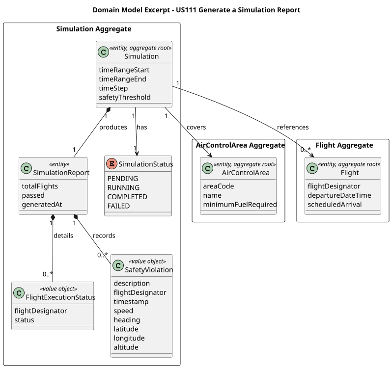
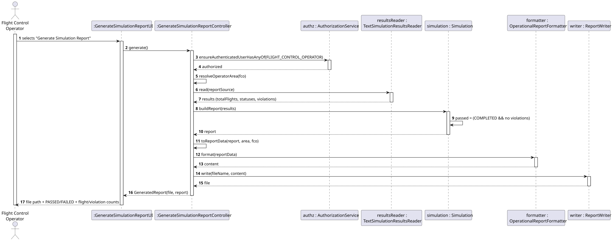
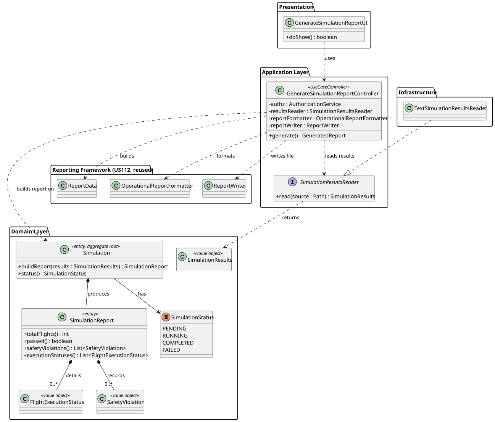

# US111 — Generate a Simulation Report

## 1. Context

This US is implemented in Sprint 3. It allows a **Flight Control Operator (FCO)** to obtain a summary report of a flight simulation's results, in order to decide whether the programmed flights are safe to run.

The flight simulation itself is a SCOMP/C component (US100–US109): it forks one process per flight, tracks aircraft positions, detects safety violations and, at the end, produces its own raw output (`simulation_report.txt`). US111 is the **EAPLI/Java** use case that turns that simulation outcome into a domain `SimulationReport` and exports a human-readable report file for the FCO, **reusing the US112 reporting framework** for consistent branding.

The `Simulation` aggregate (`Simulation`, `SimulationReport`, `FlightExecutionStatus`, `SafetyViolation`, `SimulationStatus`) is already defined in **Domain Model V10**. US111 populates and reports on it — it adds no new domain concept, only the application logic that builds and exports the report.

---

## 2. Requirements

**US111** As a Flight Control Operator, I want to receive a summary of the simulation results so that I can determine if the programmed flights are safe to run.

**Acceptance Criteria:**

- **AC111.1** The system must generate a report and store it in a file.
- **AC111.2** The report should include the total number of flights and their execution status.
- **AC111.3** If safety violations occur, the report must list their timestamps and positions.
- **AC111.4** The report should indicate whether the scheduled flights plan passed or failed validation.

**Dependencies/References:**

- US030 — Authentication and Authorization (only an authenticated Flight Control Operator may generate the report).
- US100–US109 — Flight simulation (SCOMP/C). The simulation produces the `simulation_report.txt` that US111 reads.
- US050 — Register an Air Control Area (the FCO's area is shown in the report header).
- US112 — Monthly Report Generation, whose reporting framework (`ReportData` / `OperationalReportFormatter` / `ReportWriter`) is reused to write the file.

---

## 3. Analysis

The report content required by the acceptance criteria maps directly onto the `Simulation` aggregate already defined in Domain Model V10:

| AC | Domain element |
|----|----------------|
| AC111.1 (file) | The report is written by the reused US112 `ReportWriter` (to `target/reports/`) |
| AC111.2 (total flights + execution status) | `SimulationReport.totalFlights` and a `FlightExecutionStatus` per flight |
| AC111.3 (violations with timestamp/position) | a `SafetyViolation` per detected conflict (`timestamp`, `latitude`, `longitude`, `altitude`, …) |
| AC111.4 (pass/fail) | `SimulationReport.passed` |

### Data source — integration with the SCOMP simulation

The simulation runs as a separate C program. US111 does **not** re-run the physics; it **consumes the simulation's results**. The integration point is the `simulation_report.txt` produced by the simulation. A `SimulationResultsReader` (adapter) parses that output and yields a `SimulationResults` to the application layer. The current implementation is `TextSimulationResultsReader`, which parses the C report's text format. This keeps the Java domain decoupled from the C implementation — only the adapter knows the file format.

> **Design note.** The application layer depends on the interface (`SimulationResultsReader`), not on the C program. If the simulation output format changes, only the adapter changes — the controller and the domain are unaffected (Protected Variations / DIP). The input file path is configurable via `simulation.report.file` in `application.properties`.

### Reuse of the US112 reporting framework

US111 does **not** implement its own file exporter. It maps the `SimulationReport` to a US112 `ReportData` (with sections) and writes the file through the reused `OperationalReportFormatter` (consistent AISAFE branding) and `ReportWriter`. This realises the "foundational, consistent report structure" intent of US112.

### Main classes involved

| Class | Type | Responsibility |
|-------|------|----------------|
| `Simulation` | Entity / Aggregate Root | Holds the `SimulationStatus`; builds and owns its `SimulationReport` (`buildReport`) |
| `SimulationReport` | Entity | Holds `totalFlights`, `passed`, `generatedAt`; the `SafetyViolation`s and `FlightExecutionStatus`es |
| `FlightExecutionStatus` | Value Object | Execution status of one flight (`flightDesignator`, `status`) |
| `SafetyViolation` | Value Object | One safety violation (`timestamp`, position, velocity vector, involved flight) |
| `SimulationStatus` | Enum | `PENDING` / `RUNNING` / `COMPLETED` / `FAILED` |
| `SimulationResults` | Value Object | Immutable carrier of the parsed simulation outcome (input to `buildReport`) |
| `SimulationResultsReader` | Adapter Interface | `read(Path)` → `SimulationResults` |
| `TextSimulationResultsReader` | Adapter | Parses the C `simulation_report.txt` (the only implementation) |
| `GenerateSimulationReportController` | Application Controller | Orchestrates the use case; enforces the FCO role; reuses the US112 framework |
| `GenerateSimulationReportUI` | UI | Lets the FCO trigger report generation and shows the result |
| `ReportData`, `OperationalReportFormatter`, `ReportWriter` *(US112)* | Reporting framework | Reused to format and write the report file (AC111.1) |

The following domain model excerpt shows the aggregate structure:



---

## 4. Design

### 4.1. Realization

1. The FCO selects "Generate Simulation Report" in the **Reports** menu (`GenerateSimulationReportUI`).
2. The UI calls `GenerateSimulationReportController.generate()`.
3. The controller calls `authz.ensureAuthenticatedUserHasAnyOf(FLIGHT_CONTROL_OPERATOR)` and resolves the FCO's `AirControlArea` (used in the report header).
4. The controller reads the simulation results from the configured file via `SimulationResultsReader` (`TextSimulationResultsReader` parses `simulation_report.txt`).
5. The `Simulation` aggregate builds the `SimulationReport` (`buildReport(results)`), deriving `passed` (COMPLETED **and** no violations) and setting its `SimulationStatus` — AC111.2/3/4.
6. The controller maps the `SimulationReport` to a US112 `ReportData` with three sections: Executive Summary, Flight Execution Statuses and Safety Violations.
7. The reused `OperationalReportFormatter` formats it (consistent branding) and `ReportWriter` writes it to `target/reports/` — AC111.1.
8. The UI shows the file path, the PASSED/FAILED result and the flight / violation counts.

The following sequence diagram illustrates the flow:



The following class diagram shows the classes involved:



### 4.2. Acceptance Tests

All automated tests and manual acceptance scripts are documented in [tests.md](tests.md).

---

## 5. Implementation

The implementation is distributed across the following packages in `aisafe.base`:

| Package | Class | Role |
|---------|-------|------|
| `aisafe.simulation.domain` | `Simulation` | Aggregate root; `buildReport(results)` (Information Expert) |
| `aisafe.simulation.domain` | `SimulationReport`, `FlightExecutionStatus`, `SafetyViolation`, `SimulationStatus`, `SimulationResults`, `SimulationId` | Report entity, value objects and the results carrier |
| `aisafe.simulation.application` | `SimulationResultsReader` | Adapter interface: `read(Path)` → `SimulationResults` |
| `aisafe.simulation.application` | `GenerateSimulationReportController` | Use case orchestrator; enforces the FCO role; reuses the US112 framework |
| `aisafe.infrastructure.simulation` | `TextSimulationResultsReader` | Parses the C `simulation_report.txt` |
| `aisafe.reporting.application` *(US112)* | `ReportData`, `OperationalReportFormatter`, `ReportWriter` | Reused to format and write the report file (AC111.1) |
| `aisafe.app.console.presentation.simulation` | `GenerateSimulationReportUI` | Console UI (FCO), Reports menu |
| `aisafe.infrastructure.application` | `AppSettings` | Provides `simulation.report.file` (the configured input path) |

The controller orchestrates the use case without any parsing or formatting logic — it delegates to the reader, to the aggregate, and to the reused US112 framework:

```java
public GeneratedReport generate() throws IOException {
    authz.ensureAuthenticatedUserHasAnyOf(AiSafeRoles.FLIGHT_CONTROL_OPERATOR);
    final AirControlArea area = resolveOperatorArea(currentFco());

    final SimulationResults results = resultsReader.read(reportSource);            // parse simulation_report.txt
    final SimulationReport report =
            new Simulation(SimulationId.valueOf("SIM-" + System.currentTimeMillis()))
                    .buildReport(results);                                          // Information Expert

    final ReportData data = toReportData(report, area, fco);                        // reuse US112 framework
    final String content = reportFormatter.format(data);                           // OperationalReportFormatter
    final Path file = reportWriter.write(fileName, content);                        // ReportWriter -> AC111.1
    return new GeneratedReport(file, report);
}
```

> **Persistence note.** The acceptance criteria require only a *file*, so US111 does **not** persist the `Simulation` aggregate in the database. A `SimulationRepository` (JPA / in-memory) is a possible future extension; it is not part of the current implementation.

---

## 6. Integration/Demonstration

**Prerequisites:** Run from the `aisafe.base` directory with Maven 3.9+ and Java 21. A `simulation_report.txt` must exist at the configured path (run the SCOMP/C simulation, or copy a sample from `src/test/resources/simulation/`).

**To generate a simulation report:**

1. Login with Flight Control Operator (FCO) credentials (e.g., username: `fco1`, password: `Password1`).
2. Select **Reports > Generate Simulation Report** from the main menu.
3. The controller reads the simulation results, builds the report, writes it, and the UI shows:
   ```
   Simulation report generated.
   File    : .../target/reports/simulation_report_PT-N_<ts>.txt
   Result  : FAILED
   Flights : 3  |  Safety violations: 2
   ```
4. The written file (in `target/reports/`) carries the AISAFE branding plus the Executive Summary, Flight Execution Statuses and Safety Violations (each with its timestamp and position) sections.

---

## 7. Observations

- US111 introduces **no new domain concept** — the `Simulation` aggregate and its `SimulationReport`, `FlightExecutionStatus`, `SafetyViolation` and `SimulationStatus` are already defined in Domain Model V10. US111 only adds the application logic to build and export the report.
- The report's data comes from the **SCOMP/C simulation** (US100–US109), not from a Java re-simulation. US111 consumes the simulation output through the `SimulationResultsReader` adapter (`TextSimulationResultsReader`), keeping the Java domain decoupled from the C implementation.
- Each C violation event involves a **pair** of aircraft; the parser emits **one `SafetyViolation` per aircraft** (two per event), matching the single-aircraft Domain Model V10 value object.
- The pass/fail result (AC111.4) is derived in the aggregate exactly as the simulation does: PASS iff the run `COMPLETED` and had zero safety violations.
- US111 reuses the **US112 reporting framework** (`ReportData` / `OperationalReportFormatter` / `ReportWriter`) to write the file with consistent branding, instead of an ad-hoc exporter.
- US109 (SCOMP) and US111 (EAPLI) are **complementary**: US109 is the C program's own end-of-run report; US111 is the FCO-facing report produced by the main application from the same results.
