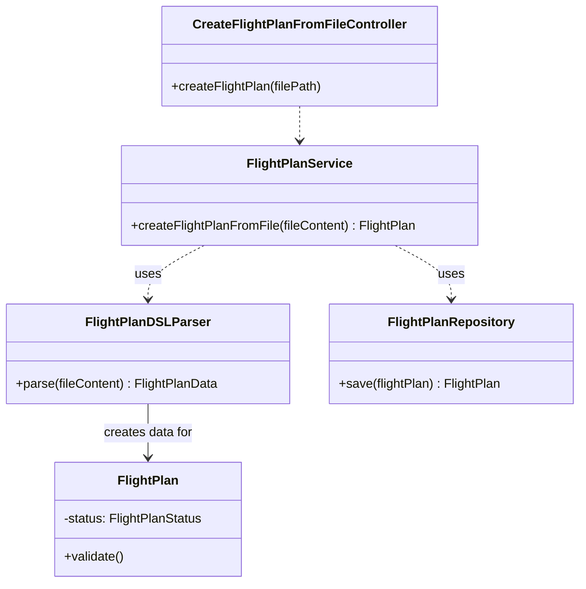
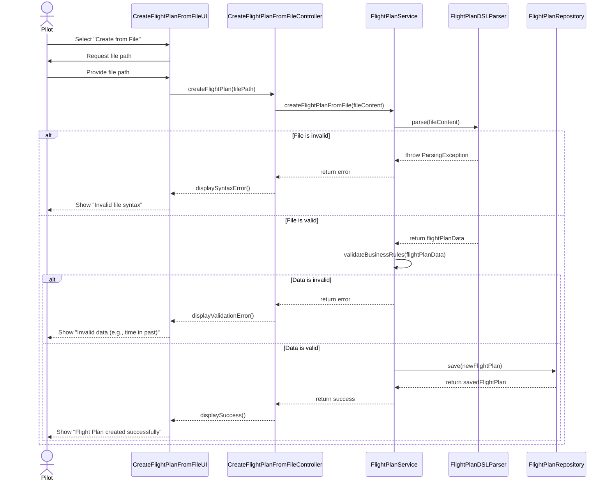

# US121 — Create a valid flight plan from a file

## 1. Context

This user story allows a Pilot to create a flight plan by uploading a file written in a specific Flight DSL (Domain-Specific Language). This provides an efficient alternative to manual data entry, especially for complex or standardized routes. The system must parse the file, validate its contents against business rules, and create a new `FlightPlan` entity.

---

## 2. Requirements

**US121** As a Pilot, I want to create a valid flight plan from a file so that I can formally submit a flight plan defined using the Flight DSL.

**Acceptance Criteria:**

- **AC121.1** The system must accept a text file with a specific extension (e.g., `.fpdsl`).
- **AC121.2** The file's content must be parsed according to the defined Flight DSL grammar.
- **AC121.3** If the file has syntax errors, the system must reject it and inform the user of the error.
- **AC121.4** The data extracted from the file must be validated against all business rules applicable to a flight plan (e.g., valid aircraft, future departure time).
- **AC121.5** If the data fails validation, the system must reject it and inform the user of the specific validation failure.
- **AC121.6** Upon successful parsing and validation, a new `FlightPlan` must be created with the status "draft".

**Dependencies/References:**

- This US depends on **US030** for user authentication, as only a `PILOT` can perform this action.
- It relies on the same `FlightPlan` entity and business rules defined in **US080**.
- A formal grammar for the Flight DSL must be defined and available.

---

## 3. Analysis

This story introduces a new mechanism for creating `FlightPlan` entities but reuses the core domain model. The main addition is a parser responsible for interpreting the DSL.

**Domain Model Impact:**

*   **`FlightPlanDSLParser`**: A new service or component responsible for reading the content of a `.fpdsl` file and transforming it into a `FlightPlan` data structure (or DTO). This parser will be the entry point for this US's logic.
*   **`FlightPlanFactory`**: Can be reused or extended to create a `FlightPlan` from the data structure provided by the parser.
*   The core **`FlightPlan`** aggregate and its business rules remain the same as defined in US080.

**Business Rules:**

*   **BR01**: The user must be an authenticated `PILOT`.
*   **BR02**: The input file must conform to the specified Flight DSL grammar.
*   **BR03**: All data extracted from the file must pass the `FlightPlan`'s domain validations.
*   **BR04**: Error messages for parsing and validation failures must be clear and guide the user to fix the file.
*   **BR05**: A successfully created flight plan is persisted with the `DRAFT` status.

---

## 4. Design

### 4.1. Realization

The implementation will extend the existing flight plan creation mechanism.

1.  **UI Layer**: A new `CreateFlightPlanFromFileUI` will be added to the `exemplo.app.backoffice.console` module. It will prompt the user to provide a file path.
2.  **Controller Layer**: A `CreateFlightPlanFromFileController` will handle the request. It will read the file content and pass it to the application service.
3.  **Application Service**: The `FlightPlanService` will be extended with a new method, `createFlightPlanFromFile(fileContent)`. This method will:
    a. Invoke the `FlightPlanDSLParser` to parse the text.
    b. Validate the resulting data against business rules.
    c. Use the `FlightPlanFactory` and `FlightPlanRepository` to create and save the new `FlightPlan`.
4.  **Parser**: A new `FlightPlanDSLParser` component will be created. Given the need for a formal grammar, using a parser generator tool like ANTLR is highly recommended to create the lexer and parser based on a `.g4` grammar file.

**Class Diagram:**

### 4.2. Sequence Diagram

This diagram shows the flow of creating a flight plan from a file.

---

_This design is a preliminary step. The implementation will follow._

