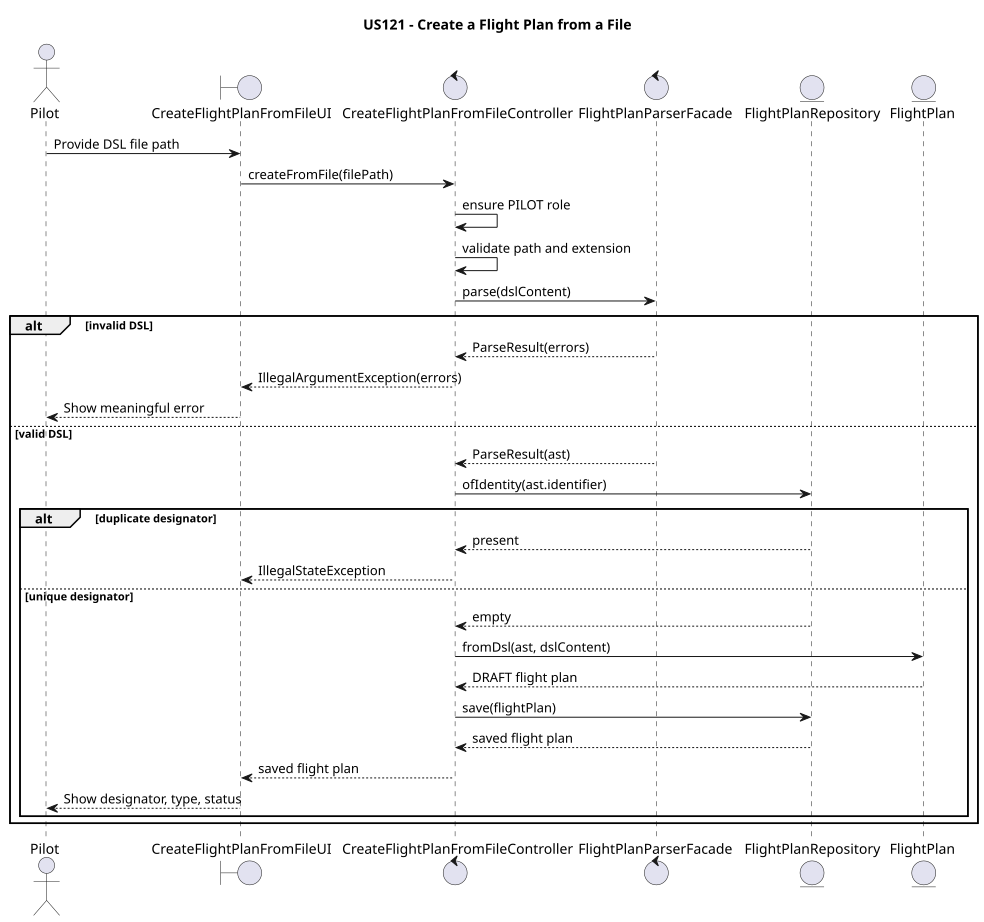
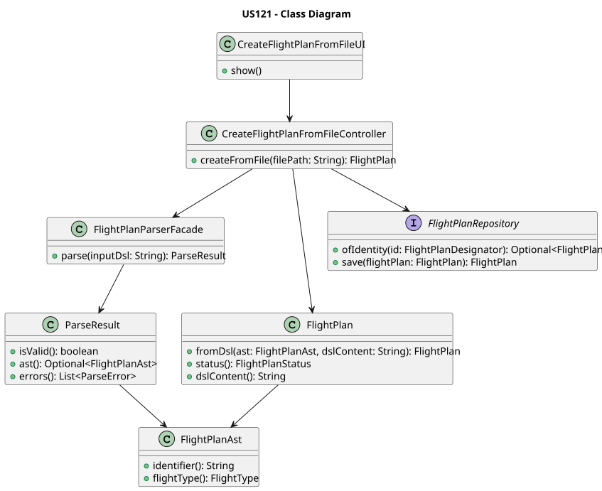
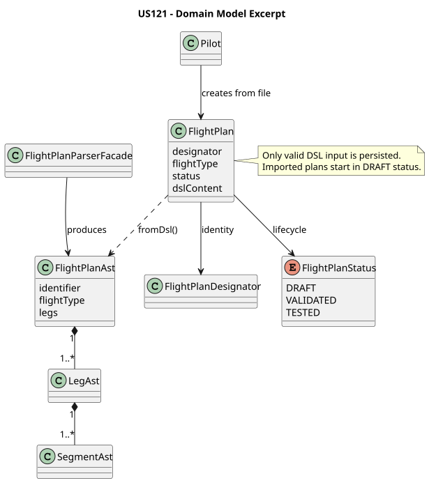

# US121 - Create a Flight Plan from a File

## 1. Requirements

**US121:** As a Pilot, I want to create a valid flight plan from a file so that I can
formally submit a flight plan defined using the Flight DSL.

**Acceptance Criteria:**

| AC | Description |
|----|-------------|
| AC121.1 | The file must conform to the Flight DSL defined in US120. |
| AC121.2 | The file is validated through lexical, syntactic, range and semantic analysis. |
| AC121.3 | Invalid files produce meaningful error messages. |
| AC121.4 | Only valid flight plans may be imported and used by the system. |
| AC121.5 | Only authenticated Pilots can create flight plans from files. |

---

## 2. Analysis

US121 reuses the Flight DSL pipeline delivered by US120. The application does not create a
second flight-plan model for file imports; a valid DSL file is mapped to the existing
`FlightPlan` aggregate through `FlightPlan.fromDsl(ast, dslContent)`.

The use case has four relevant checks before persistence:

1. **Authorization** - the current user must have the `PILOT` role.
2. **File input validation** - the path must refer to a regular `.dsl` or `.fpdsl` file.
3. **DSL validation** - `FlightPlanParserFacade` runs lexical, syntactic, range and semantic
   analysis according to US120.
4. **Uniqueness validation** - a flight plan with the parsed designator must not already
   exist.

Only after all checks pass is the aggregate saved. Invalid files therefore never reach the
repository.

---

## 3. Design

### Sequence

```
Pilot
  |
  v
CreateFlightPlanFromFileUI
  |
  v
CreateFlightPlanFromFileController
  |-- ensure PILOT role
  |-- read .dsl/.fpdsl file
  |-- FlightPlanParserFacade.parse(dsl)
  |     |-- ANTLR lexer/parser
  |     |-- FlightPlanValidationListener
  |     |-- FlightPlanAstBuilderVisitor
  |     `-- FlightPlanSemanticValidator
  |-- reject parse errors with line/column/message
  |-- reject duplicate designator
  |-- FlightPlan.fromDsl(ast, dslContent)
  `-- FlightPlanRepository.save(plan)
```







### Key Classes

| Class | Role |
|-------|------|
| `CreateFlightPlanFromFileUI` | Console UI that collects the DSL file path. |
| `CreateFlightPlanFromFileController` | Use-case controller that authorizes, reads, validates and persists the imported plan. |
| `FlightPlanParserFacade` | US120 facade for lexical, syntactic, range and semantic analysis. |
| `FlightPlanAst` | Parsed internal representation produced from valid DSL. |
| `FlightPlan` | Aggregate root persisted in `DRAFT` status. |
| `FlightPlanRepository` | Repository used to check uniqueness and save valid plans. |

---

## 4. Implementation

| File | Responsibility |
|------|----------------|
| `src/main/java/aisafe/app/console/presentation/flightplan/CreateFlightPlanFromFileUI.java` | Presents the console flow to the Pilot. |
| `src/main/java/aisafe/flightplan/application/CreateFlightPlanFromFileController.java` | Implements US121 authorization, file validation, parser delegation, duplicate check and persistence. |
| `src/main/java/aisafe/dsl/parser/FlightPlanParserFacade.java` | Reused US120 parser/validator pipeline. |
| `src/main/java/aisafe/flightplan/domain/FlightPlan.java` | Creates the `DRAFT` aggregate through `fromDsl(ast, dslContent)`. |

Invalid parser results are converted into a user-facing message:

```java
Flight plan file is invalid:
  [line 6, col 4] missing ';' at 'ARRIVAL' (near 'ARRIVAL')
```

---

## 5. How to Run

```bash
cd aisafe.base
mvn exec:java
```

1. Login as a Pilot.
2. Open **Flight Plans > Create Flight Plan from DSL File**.
3. Enter the path to a `.dsl` or `.fpdsl` file.

Successful import:

```text
Flight plan successfully created!
  Designator : TP123
  Type       : REGULAR
  Status     : DRAFT
```

---

## 6. Tests

Automated tests are documented in [tests.md](tests.md).

Run the US121 controller tests:

```bash
mvn test -Dtest=CreateFlightPlanFromFileControllerTest
```

Run the full DSL validation suite inherited from US120:

```bash
mvn test -Dtest=FlightPlanDslFileTest,FlightPlanSemanticValidatorTest,FlightPlanAstBuilderVisitorTest
```

---

## 7. Observations

- US121 is intentionally thin in the domain layer: it reuses US120 for validation and the
  existing `FlightPlan` aggregate for persistence.
- The controller rejects invalid files before saving, satisfying the "only valid flight plans"
  acceptance criterion.
- `.dsl` is the canonical extension used by the project resources; `.fpdsl` is also accepted
  to support the extension mentioned in earlier story drafts.
