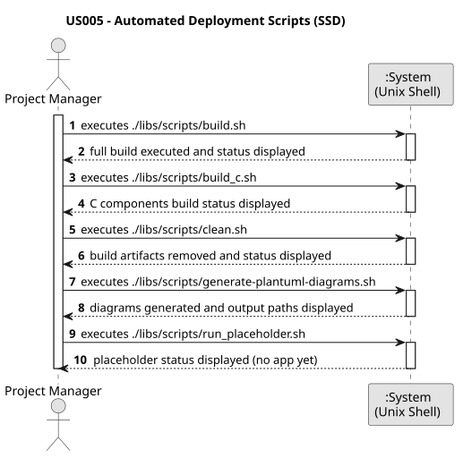

# US005 - Automated Deployment Scripts

## 1. Requirements Engineering

### 1.1 User Story Description

> As Project Manager, I want the team to add to the project the necessary scripts, so that build/executions/deployments can be executed effortlessly in a Unix compatible machine. Include scripts for all the major tasks and execution of applications.

### 1.2 Customer Specifications and Clarifications

**From the project specifications:**

>

### 1.3 Acceptance Criteria

> No acceptance criteria specified.

### 1.4 Found out Dependencies

* There are no dependencies for this user story as it is a project infrastructure task.

### 1.5 Input and Output Data

**Input Data:**
* Optional parameters per script (e.g. host, port, profile)

**Output Data:**
* Build/execution success or failure messages
* (In)success of the operation

### 1.6 System Sequence Diagram (SSD)

### 1.7 Other Relevant Remarks

* All scripts must be placed in the `scripts/` folder at the project root
* All scripts must have execute permissions (`chmod +x`)
* Scripts must use relative paths based on their location so they work from any directory
* The `build.sh` script must trigger both Java (Maven) and C builds
* Each `run_*.sh` script must automatically trigger a build if the binary/JAR is not found
* Scripts must be compatible with `bash`
